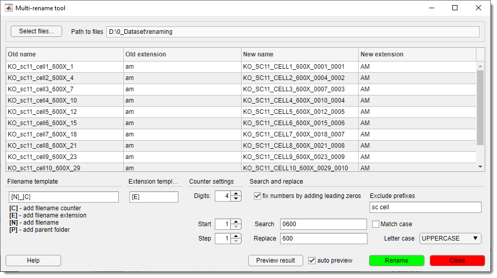
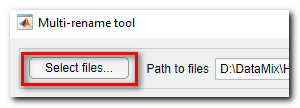
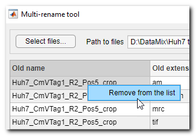
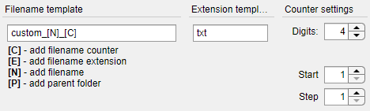
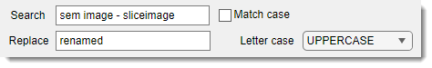
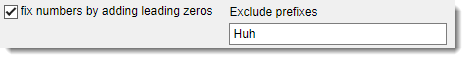

# Multi-Rename Tool

---

The **Multi-Rename Tool** plugin in **Microscopy Image Browser (MIB)** is a utility for batch renaming files, such as images or datasets, using customizable templates. It simplifies organizing large file sets by applying consistent naming rules.

## Overview

{.on-glb align=left width="300"}

The plugin enables efficient renaming of multiple files with options for templates, 
counters, and text replacement. It’s ideal for preparing datasets for MIB analysis or 
ensuring standardized naming conventions.

[:fontawesome-brands-youtube:{.red-color} Multi Rename Tool demo](https://youtu.be/pl9Vdv-qjkE)

## Key Features

- Apply customizable templates to define filename structures.
- Add counters with specified digits, start values, and increments.
- Search and replace text within filenames.
- Adjust filename case (uppercase, lowercase, or unchanged).
- Standardize numbers by adding leading zeros to match a digit count.

<!-- Note: Main snapshot (main_snapshot.png) omitted as placeholder -->

## Usage

Access the plugin via:
`Ribbon → Plugins → File Processing → Multi Rename Tool`.

Follow these steps to rename files:

Select Files

{align=left} 
Click Select files… to choose files for renaming.
Selected filenames appear in the file list table, showing original and proposed names.

Context Menu for File List

{align=left} 
Right-click the file list table to open a context menu:

- `Remove from the list`: remove selected files.

Define Filename Template

Use the Filename template edit box to set a naming pattern with placeholders:

- `[C]`: adds a counter (configured in Counter Settings).
- `[E]`: keeps the original file extension (e.g., `tif`, `jpg`).
- `[N]`: includes the original filename (without extension).
- `[P]`: adds the parent folder name.

??? abstract "Example"

    A template like `custom_[N]_[C]` with extension `txt` might rename `image.doc` to `custom_image_001.txt`.
    
    

!!! info
       Configure counter settings (digits, start, step) to control `[C]` behavior.

Set Extension Template

Use the Extension template edit box to change 
file extensions (e.g., to `jpg`) or use `[E]` to retain originals.

Configure Counter Settings

Adjust in the Counter Settings panel:

- Digits: number of digits (e.g., 3 for `001`).
- Start: starting value (e.g., 1).
- Step: increment (e.g., 1 for `001`, `002`; 2 for `001`, `003`).

Search and Replace

Fine-tune filenames:

- Search: text pattern to find.
- Replace: replacement the found pattern with a new text.
- Match Case: enable for case-sensitive search.
- Letter Case: select `unchanged`, `UPPERCASE`, or `lowercase` to change letter case.

Fix Numbers

   - Enable Fix numbers by adding leading zeros to standardize numbers (e.g., `1` to `001` for 3 digits).
   - Use Exclude prefixes to skip numbers following specific prefixes.
   <!-- Note: Snapshot (snap05.png) omitted as placeholder -->

Preview Results

Click Preview to update the table with proposed filenames.
!!! note
       Review the preview to avoid errors. Adjust settings and re-preview if needed.

!!! tip
       Use the auto preview checkbox to interactively follow the changes.

Rename Files

Press Rename to apply changes to the files.

---

*Back to [MIB](../../../index.md) | [User Interface](../../index.md) | [Plugins](../index.md) | [File processing](index.md)*