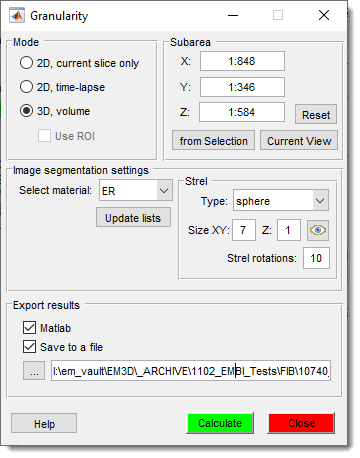
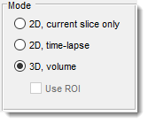
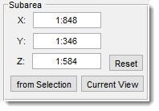
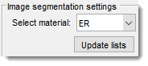
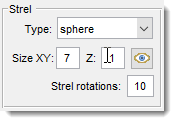
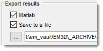
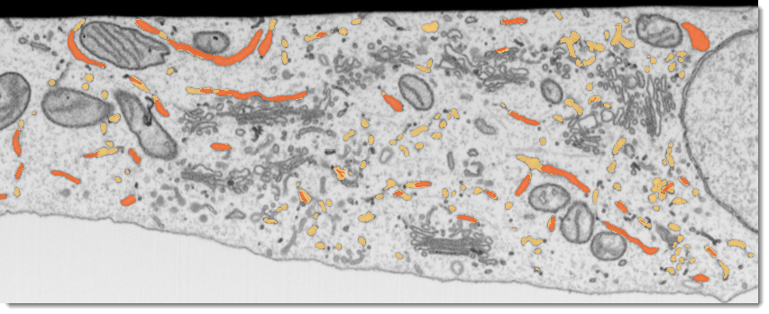
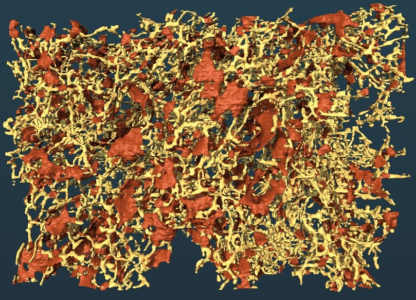

# Granularity

---

## Overview

{.on-glb align=left width="300"}

The **Granularity** plugin in **Microscopy Image Browser (MIB)** performs 
analysis of endoplasmic reticulum (ER) models to quantify the granularity of structures, 
*i.e.* ratio between sheets and tubules.  
It supports customizable subarea selection, structuring element configuration, 
and export of results for further analysis.

## Usage

Access the plugin via: 
`Ribbon → Plugins → Organelle Analysis → Granularity`.

Follow these steps to analyze granularity:

**Load Images and models of ER**
{.on-glb align=right width="300"}

**Start the plugin**: `Ribbon → Plugins → Organelle Analysis → Granularity`.

**Select Analysis Mode**:
{align=right}

   - `2D, current slice only` - use to preview 2D mode on the current slice
   - `2D, time-lapse` - apply 2D analysis for the whole dataset
   - `3D, volume` - apply 3D strel elements to do calculations in 3D space
   
**Define Subarea**:
{align=right}

- Use Current View to update the X and Y 
   fields using the currently shown area.
- Click Subarea from Selection to restrict analysis to a selected area 
  (drawn via MIB’s `Selection` tools).
- Adjust coordinates manually in the subarea edit boxes or click Reset Dimensions to revert 
  to the full image.

**Select Materials**:
{align=right}

- Click Update Materials to 
   get the list of materials from the current model and update the 
   Select material dropdown.
- Use Select material to select material

**Configure Structuring Element (Strel)**
{align=right}

- Use Strel Type to select type of the structural element to use
- Set Size XY (XY plane) and Z
 (for 3D) to define the shape of the structural element.
- Specify Strel Rotations for number of strel rotations to use.
!!! info

     Higher values ensure better results, but with increase of computation time.

- Click `Preview Strel` to visualize the structuring element before analysis.

**Export Results**:
{align=right}

   - Check MATLAB to export results to the main MATLAB workspace as a structure.
   - Check Save to a file to save results in MATLAB of EXCEL formats
   - Click ... to choose an output file (`.xlsx` for Excel or `.mat` for MATLAB).
   
**Run Analysis**:

{.on-glb align=right width="300"}

- Click Calculate to
    compute granularity metrics.
- Results are displayed in the [Image View](../../panels/selection_imview/imview.md) panel.

{.on-glb align=left }

## Credits

- **Author**: Ilya Belevich, University of Helsinki ([ilya.belevich@helsinki.fi](mailto:ilya.belevich@helsinki.fi))
- **Part of**: Microscopy Image Browser ([https://mib.helsinki.fi](https://mib.helsinki.fi))

---

*Back to [MIB](../../../index.md) | [User Interface](../../index.md) | [Plugins](../index.md) | [Organelle Analysis](index.md)*