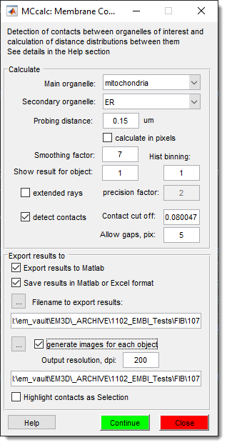

# MCcalc 

*Back to [MIB](../../../index.md) | [User Interface](../../index.md) | [Plugins](../index.md) | [Organelle Analysis](index.md)*

---
## Overview

{align=left}

This is the first version of MCcalc plugin for calculation of contacts between two objects such as 
mitochondria and endoplasmic reticulum using ray-tracing technique.

Documentation is available on the main MIB website: 

- [technical description](https://mib.helsinki.fi/tutorials/mccalc/MCCalc_info.pdf)
- [:fontawesome-brands-youtube:{.red-color} demo part1](https://youtu.be/E0Rf13flxIY)
- [:fontawesome-brands-youtube:{.red-color} demo part2](https://youtu.be/mqKGxq8ilYc)
- [:fontawesome-brands-youtube:{.red-color} demo part3](https://youtu.be/N1EtxMcilQY)
- [:fontawesome-brands-youtube:{.red-color} demo part4](https://youtu.be/Iqpk-gVemlk)
- [:fontawesome-brands-youtube:{.red-color} demo part5](https://youtu.be/Vf6_DgshGGk)

---
*Back to [MIB](../../../index.md) | [User Interface](../../index.md) | [Plugins](../index.md) | [Organelle Analysis](index.md)*
