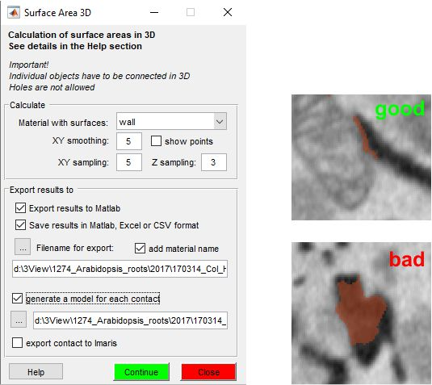

# Surface Area 3D

*Back to [MIB](../../../index.md) | [User Interface](../../index.md) | [Plugins](../index.md) | [Organelle Analysis](index.md)*

---
{.on-glb align=left width="300"}

The **Surface Area 3D** plugin in **Microscopy Image Browser (MIB)** calculates planar surface 
areas of 3D objects in microscopy datasets, such as organelle contacts (e.g., mitochondria and ER). 
It detects objects using 26-point connectivity, computes surface areas from centerlines,
and supports visualization and export to various formats.

## Overview

The plugin analyzes 3D objects by generating triangulated surfaces from cross-sectional centerlines. 
Key features include:

- Detection of 3D objects with 26-edge connectivity.
- Calculation of surface areas per object.
- Export to MATLAB, Imaris, Amira, CSV, Excel, or MATLAB binary formats.
- Visualization of surfaces in MATLAB or MIB’s `Selection` layer.

## Parameters

Configure the analysis with these settings:

- Material with Surfaces select the model material to analyze. 
Objects are detected in 3D with 26-edge connectivity, and surfaces are generated per object.
- XY Smoothing smooth centerline points’ coordinates 
(XY plane) to refine profiles.
- XY Sampling increase triangle size by skipping
points (e.g., 3 uses every third point for triangulation).
- Z Sampling similar to XY sampling, 
applied to Z-dimension.
- Show Points display detected points in 
the [Selection](../../panels/selection/index.md) layer. Clear afterward with ++shift+c++ to avoid model conflicts.
- Export Results to MATLAB generate a 
structure in the main MATLAB workspace.
??? abstract "Configiration of the export structure"

    - `.pixSize`: dataset pixel size (`SurfaceArea(1).pixSize`).
    - `.MaterialName`: analyzed material name (`SurfaceArea(1).MaterialName`).
    - `.xySmoothValue`: XY smoothing factor.
    - `.xySamplingStep`: XY sampling value.
    - `.zSamplingStep`: Z sampling value.
    - `.SumAreaTotal`: total area per surface (`SurfaceArea(N).SumAreaTotal`).
    - `.PointsVector`: point indices per profile (`[x,y,z]`).
    - `.PointCloud`: all points as `[index](x,y,z)`.
    - `.Centroid`: object centroids.
    - `.Area`: area between consecutive slices (cell array).
  
- Save Results save to MATLAB, Excel, 
or CSV.
- Add Material Name append material name to  
output filenames.
- Generate a Model for Each Contact save surfaces 
in AmiraMesh format to a folder.
- Export Contacts to Imaris export surfaces 
to Imaris (requires Imaris 8 and ImarisXT).

!!! warning
    Clear the `Selection` layer after checking points (++shift+c++) to prevent unintended 
    changes to the model.

## Usage

Access the plugin via: 
`Ribbon → Plugins → Organelle Analysis → Surface Area 3D`.

The following steps outline analysis, using an example of mitochondria-ER contacts:

**Load Dataset and Model**:

   - Open a 3D dataset (e.g., [Huh7.tif](https://mib.helsinki.fi/tutorials/3D_Modeling_files/Huh7.tif)).
   - Load a model with materials (e.g., [Labels_Huh.model](https://mib.helsinki.fi/tutorials/3D_Modeling_files/Labels_Huh.model)) via `Ribbon → Home → Load model`.

!!! info "Open from Menu"
     
    It is possible to load both the dataset and the model using 
    `Ribbon → Home->Example datasets->SBEM->Huh7 and model (29 Mb)` ([see more](../../ribbon/home/index.md#example-datasets))

**Help Resources**

- **Tutorial Video**: [Surface Area 3D Demo](https://youtu.be/z0jxNHIOipA) (Note: Video refers to plugin as ContactArea3D).
- **External Tutorial**: [Plasmodesmata Analysis](https://andreapaterlini.github.io/Plasmodesmata_dist_wall/surfaces.html#run_the_surfacearea3d_plugin).

## Credits and Acknowledgements

**Author**: Ilya Belevich, University of Helsinki  
  - Version: 1.00, 13.02.2020  
  - Email: [ilya.belevich@helsinki.fi](mailto:ilya.belevich@helsinki.fi)  

Big thanks to David Legland (Institut National de la Recherche Agronomique, France) 
for discussion about triangulation of points: 
function `mibTriangulateCurvePair.m` is based on `triangulateCurvePair.m` from [MatGeom tools](https://github.com/mattools/matGeom/releases) 
by David Legland

## How to Cite

If you use this plugin, please check for citation: 
[Data analysis pipeline in Paterlini, Belevich et al., 2020](https://andreapaterlini.github.io/Plasmodesmata_dist_wall/index.html)

---

*Back to [MIB](../../../index.md) | [User Interface](../../index.md) | [Plugins](../index.md) | [Organelle Analysis](index.md)*

