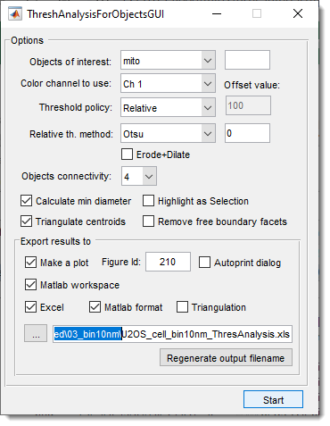
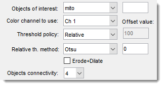
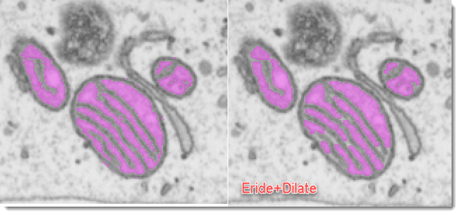
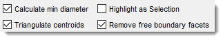
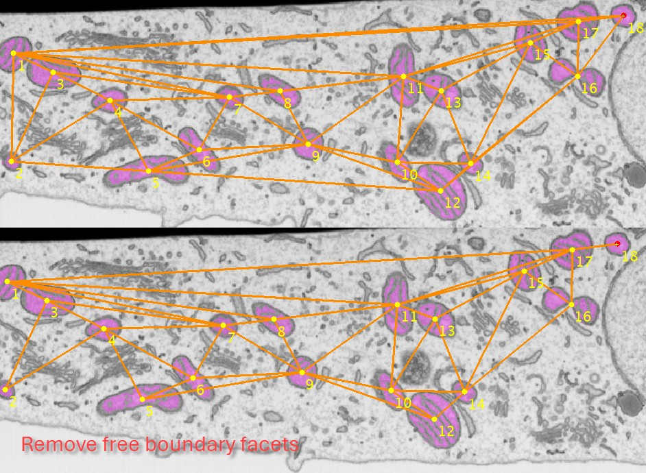
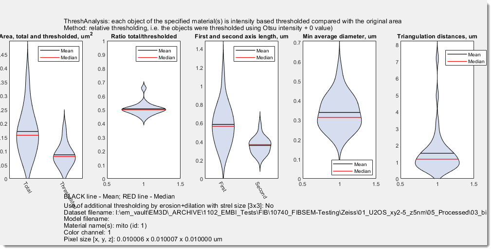
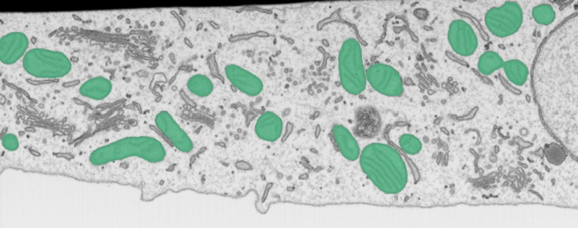
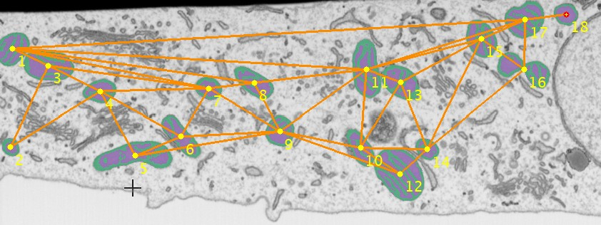
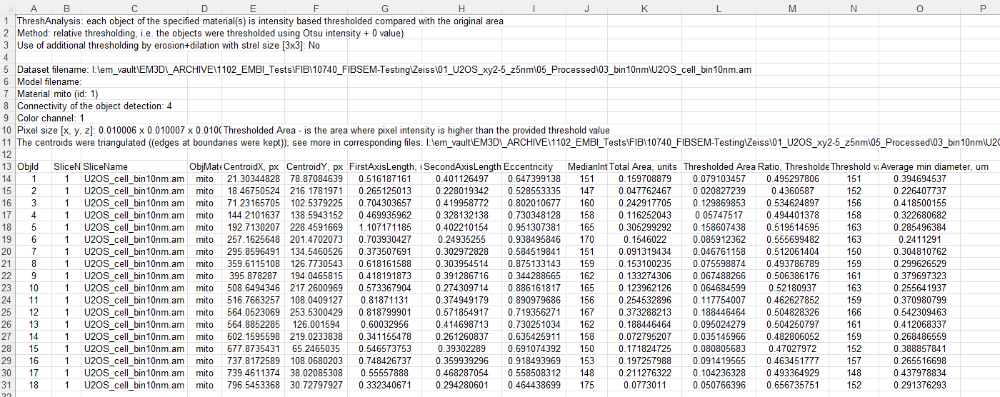

# Threshold Analysis for Objects

---

## Overview

{.on-glb align=left width="300"}

The **Threshold Analysis for Objects** plugin in **Microscopy Image Browser (MIB)** performs shape and 
intensity threshold-based analysis of objects in microscopy images, calculating metrics such as 
size, intensity, or shape.It supports triangulation of object centroids, visualization of results, 
and export to Excel or MATLAB formats, making it useful for quantitative studies of cellular structures.

<div class="clear-float"></div>

## GUI Components

### Selection of materials and threshold settings

{.on-glb align=left width="300"}

<span class="widget widget-dropdown">Object of interest</span> use this dropdown to select material of the model for analysis.<br>
Alternatively, it is possible to provide indices of materials using an editbox 
on the right-hand side of the dropdown.

<div class="clear-float"></div>

<span class="widget widget-dropdown">Color channel to use</span> specify index of the color channel to be used for 
intensity calculations and thresholding

<span class="widget widget-dropdown">Threshold policy</span> specify method to threshold the objects:

- **Absolute** provide thresholding value in the <span class="widget widget-edit">Threshold value</span> field. 
    All values that are above this value will be assigned to the Mask layer after press of 
    the <span class="widget widget-button">Start</span>
- **Relative** allows to choose between *Otsu* and *Median* automatic thresholding options. Values above detected 
   threshold will be assigned to the Mask layer. **Note!** it is possible to modify the threshold value by 
   offsetting it using the <span class="widget widget-edit">Offset value</span>  editbox on the right-hand side.

<span class="widget widget-checkbox">Erode+Dilate</span> additionally applies erosion and dilation operation to 
minimize thresholding noise and keeping only large thresholded structures.

??? info "Application of Erode+Dilate"
      {.on-glb}

<span class="widget widget-dropdown">Object connectivity</span> select connectivity of the object detection, when `4`
objects that are touching each other in the diagonal orientation will be split, otherwise (when `8`) fused together.

### Additional options
{align=left}

<span class="widget widget-checkbox">Calculate min diameter</span> use this option to measure average thickness of
objects. When <span class="widget widget-checkbox">Highlight as Selection</span> is checked, the point used to
measure mean thickness for each object are shown as the Selection layer. Use ++shift+c++ to clear it after evaluation.

<span class="widget widget-checkbox">Triangulate centroids</span> for multiple objects calculate the triangulated mesh
where each edge in this mesh contains distance to the closest other object. This can be useful for analysis of
distances between the objects. <span class="widget widget-checkbox">Remove free boundary facets</span> can be used to remove edges that are
connecting objects at the edges of the image producing too large connecting lines.

??? tip "Remove free boundary facets example"
    
    {.on-glb}
    
### Export results

<span class="widget widget-checkbox">Make Plot</span> generate a plot with results. It is possible to 
specify <span class="widget widget-edit">Figure Id</span> to show the plot in a specific MATLAB window and
start <span class="widget widget-checkbox">Autoprint dialog</span> for automatic printing of the figure.
??? info "Example of the figure with results"
    {.on-glb}

<span class="widget widget-checkbox">MATLAB Workspace</span> export results to the main MATLAB workspace as 
`ThreshAnalysis` and `ThreshAnalysisGraph` structures.

??? abstract "Fields"
    `ThreshAnalysis` has following fields:
    ```
        colCh
        materialId
        materialNames
        absoluteThresholdValue
        relativeThresholdMethod
        thresholdOffsetValue
        thresholdPolicy
        ErodeDilate
        pixSize
        datasetName
        modelName
        triangulatePoints
        triangulateRemoveFreeBoundary
        objConnectivity
        objId
        sliceNo
        objMaterialName
        CentroidX
        CentroidY
        FirstAxisLength
        SecondAxisLength
        Eccentricity
        Median
        TotalArea
        SliceName
        ThresholdedArea
        objThresholdValues
        RatioOfAreas
        minDiameter
        minDiameterAverage
    ```
      graph with properties:
    `ThreshAnalysisGraph` is a graph object with the fillowing fields:
    ```
        Edges: \[39×1 table\]
        Nodes: \[18×2 table\]
    ```

<span class="widget widget-checkbox">Excel</span> save results in Microsoft Excel format `.xls`

<span class="widget widget-checkbox">MATLAB format</span> save results in MATLAB format `.mat`

<span class="widget widget-checkbox">Triangulation</span> save results of object triangulation 
in MATLAB format `.mat`, Amira, or as Excel sheet.

<span class="widget widget-button">...</span> specify output filename for results. 
  
<span class="widget widget-button">Regenerate Output Path</span> use this button to regenerate output filename 
relative to the open dataset.  It is useful when processing multiple datasets one after another.

### Start calculations

Press the <span class="widget widget-button">Start</span> button to perform calculations.

## Usage

Access the plugin via:<br>
`Ribbon → Plugins → Organelle Analysis → Thres Analysis for Objects`.

Follow these steps to analyze objects:

**Load Image**:

**Prepare Model**

- Create or load a model with segmented objects via `Segmentation table -> Load`.
- Use MIB’s `Segmentation` tools (e.g., `Brush`, `Threshold`, `Segment-anything model`) to segment objects.

??? abstract "Segmentation model"
    {.on-glb}

**Start the plugin**:

   - `Ribbon → Plugins → Organelle Analysis → Thres Analysis for Objects`.
   - Define suitable settings and export parameters

??? abstract "Plugin settings"
    {.on-glb}

**Run Analysis**:

- Click <span class="widget widget-button">Start</span> to segment objects and compute metrics.
- Results appear in MIB’s [Image View](../../panels/selection_imview/imview.md) panel or exported files.
   
**Review Results**:
??? info "Snapshot with results"
    {.on-glb}

??? info "Snapshot with Excel output table"
    {.on-glb}

## Credits

- **Author**: Ilya Belevich, University of Helsinki ([ilya.belevich@helsinki.fi](mailto:ilya.belevich@helsinki.fi))
- **Part of**: Microscopy Image Browser ([https://mib.helsinki.fi](https://mib.helsinki.fi))

---

*Back to [MIB](../../../index.md) | [User Interface](../../index.md) | [Plugins](../index.md) | [Organelle Analysis](index.md)*