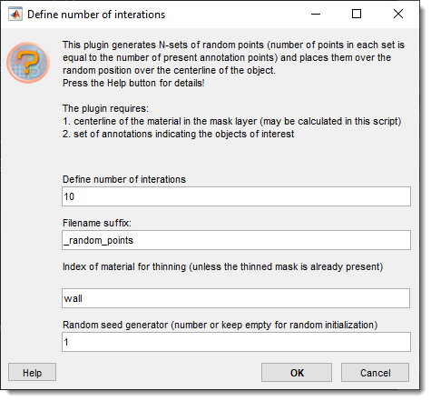
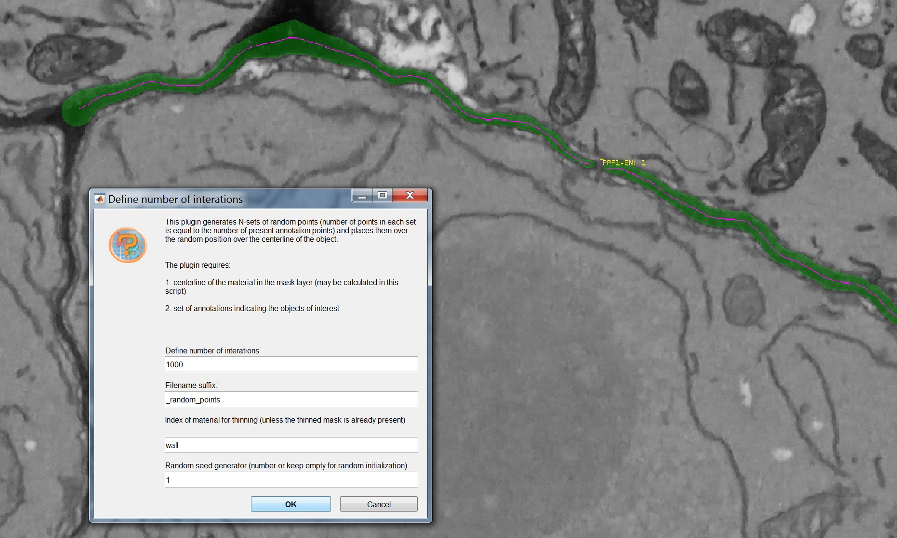

# Spatial Control Points

---

## Overview
{.on-glb align=left width="300"}

The biological question we will try to address with this tool relates to the distribution of 
Plasmodesmata (or similar types of annotations along a given model).

For details follow to the [documentation](https://andreapaterlini.github.io/Plasmodesmata_dist_wall/distributions.html)

## Reference

Andrea Paterlini and Ilya Belevich Serial Block Electron Microscopy to Study Plasmodesmata in the Vasculature of Arabidopsis thaliana Roots. 
Methods Mol Biol, 2022:2457:95-107. [doi: 10.1007/978-1-0716-2132-5_5.](https://link.springer.com/protocol/10.1007/978-1-0716-2132-5_5)

???+ abstract "Example snapshot"
    
    {.on-glb align=left}

---

*Back to [MIB](../../../index.md) | [User Interface](../../index.md) | [Plugins](../index.md) | [Plasmodesmata](index.md)*

