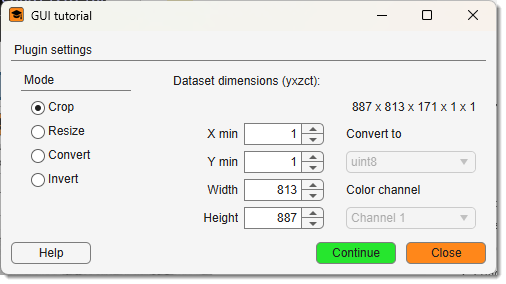

# GUI Tutorial

---

## Overview

This is generic tutorial on how to write a custom [GUIDE](https://se.mathworks.com/help/releases/R2024b/matlab/ref/guide.html)-based plugin for MIB.

Access the plugin via: 
`Ribbon → Plugins → Tutorials → GuiTutorial`. 

The source code is located under 
`MIB\Plugins\Tutorials\GuiTutorial\`

Programming tutorial available on [MIB website -> Tutorials -> Programming](https://mib.helsinki.fi/tutorials/pdf/advancedCustomScript_GUI_MIB2.pdf)

---

*Back to [MIB](../../../index.md) | [User Interface](../../index.md) | [Plugins](../index.md) | [Tutorials](index.md)*