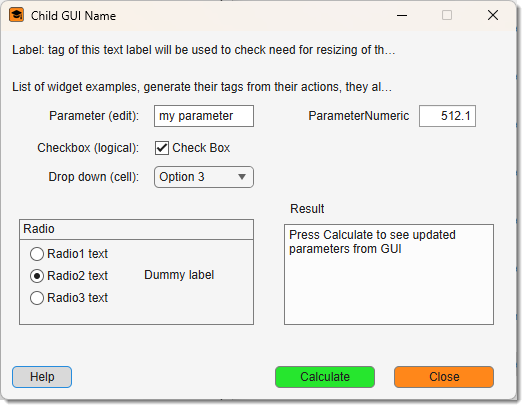

# Demo Plugin (App Designer)

## Overview

{.on-glb align=left width="300"}

**DemoPlugin** is the minimal example of a batch-compatible [AppDesigner](https://se.mathworks.com/help/releases/R2024b/matlab/ref/appdesigner.html) plugin for **Microscopy Image Browser (MIB3)**. It does no real image processing — instead it shows how every common widget type round-trips through a `BatchOpt` structure, and demonstrates the three calling modes that make a plugin usable from the [Batch Processing](../../ribbon/home/home-batchprocessing.md) dialog and from recorded macros.

<div class="clear-float"></div>

Access it via `Ribbon → Plugins → Tutorials → DemoPlugin`. Source: `mib/plugins/Tutorials/DemoPlugin/`.

!!! info "Where this fits"
    - [GuiTutorial](gui-tutorial.md) — basic GUI plugin with four real operations (no batch).
    - **DemoPlugin** (this page) — the smallest possible `BatchOpt` / batch template.
    - [GuiTutorial (Batch)](gui-tutorial-batch.md) — the four operations **plus** full batch support.

---

## Five concepts it demonstrates

1. **`BatchOpt` structure** — one struct holds every parameter; field names match widget `Tags`.
2. **GUI ↔ BatchOpt sync** — `utils.updateGUIFromBatchOpt_Shared` and `utils.updateBatchOptFromGUI_Shared`.
3. **Three calling modes** — interactive, headless/batch, and query.
4. **Progress reporting** — `core.PoolWaitbar` (safe inside `parfor`).
5. **Macro registration** — `returnBatchOpt()` fires `SyncBatch` so the run can be replayed.

---

## Files

```
mib/plugins/Tutorials/DemoPlugin/
    DemoPlugin.m         ← controller
    DemoPluginGUI.mlapp  ← AppDesigner view
    icon_24px.png / icon_16px.png
```

The class name equals the folder name. For the view-side requirements (`winController` property, `startupFcn`, callbacks delegating to `app.winController.<method>()`) see [GuiTutorial → The View](gui-tutorial.md#the-view-guitutorialguimlapp).

---

## The `BatchOpt` structure

Every tunable parameter is a field of `obj.BatchOpt`, and **each field name must match the `Tag` of its AppDesigner widget exactly** (case-sensitive). The shared utilities find widgets by `Tag`, so a mismatch silently skips the widget.

| Widget type | `BatchOpt` encoding |
|-------------|---------------------|
| `uieditfield` | scalar string / char |
| `uicheckbox` | `logical` |
| `uidropdown` | `{selectedString, {'opt1','opt2',…}}` (element 2 optional) |
| `uibuttongroup` | `{selectedRadioTag, {'Tag1','Tag2',…}}` (element 2 metadata only) |
| `uispinner` | `{value, [min max], 'on'/'off'}` (`'on'` = round to integer) |

??? abstract "Defaults (constructor Step 1)"
    ```matlab
    obj.BatchOpt.Parameter           = 'my parameter';                          % uieditfield
    obj.BatchOpt.Checkbox            = true;                                     % uicheckbox
    obj.BatchOpt.Dropdown{1}         = 'Option 3';                              % uidropdown
    obj.BatchOpt.Dropdown{2}         = {'Option 1','Option 2','Option 3'};
    obj.BatchOpt.RadioButtonGroup{1} = 'Radio2';                               % uibuttongroup
    obj.BatchOpt.RadioButtonGroup{2} = {'Radio1','Radio2','Radio3'};
    obj.BatchOpt.ParameterNumeric    = {512.125, [0 1024], 'off'};             % uispinner
    obj.BatchOpt.showWaitbar         = true;
    obj.BatchOpt.id = obj.mibModel.getActiveId();   % NOT a widget; stripped before recording
    ```

??? abstract "Batch metadata (constructor Step 2)"
    ```matlab
    obj.BatchOpt.mibBatchSectionName = 'Ribbon -> Plugins';
    obj.BatchOpt.mibBatchActionName  = 'Demo Plugin';
    obj.BatchOpt.mibBatchTooltip.Parameter        = 'Text or numeric string';
    obj.BatchOpt.mibBatchTooltip.Checkbox         = 'Logical flag (true / false)';
    obj.BatchOpt.mibBatchTooltip.Dropdown         = 'Dropdown — pass a cell with the selected item string';
    obj.BatchOpt.mibBatchTooltip.RadioButtonGroup = 'Radio group — pass a cell with the selected radio Tag';
    obj.BatchOpt.mibBatchTooltip.ParameterNumeric = 'Numeric — pass a cell {value, [min max], roundFlag}';
    obj.BatchOpt.mibBatchTooltip.showWaitbar      = 'Show or suppress the progress dialog';
    ```

---

## Three calling modes

```matlab
% Interactive (from the Plugins ribbon):
utils.startController(parentObj, 'DemoPlugin');

% Headless / batch (BatchOpt provided — e.g. macro replay):
BatchOpt.Parameter = 'hello';
BatchOpt.Checkbox  = false;
DemoPlugin(mibModel, parentObj, BatchOpt);

% Query mode — return default BatchOpt without executing:
DemoPlugin(mibModel, parentObj, NaN);
```

The constructor branches on a 3rd argument exactly like [GuiTutorialBatch](gui-tutorial-batch.md#constructor-flow): a struct runs headless, `NaN` advertises parameters via `returnBatchOpt`, anything else is an error. With no 3rd argument it builds the GUI (`core.ChildView`, icon, `utils.moveWindowOutside`, `utils.fontSizeUpdate`, `CloseRequestFcn`, `updateWidgets`, listeners). In headless mode `obj.view` stays `[]`.

---

## The standard batch methods

??? abstract "updateWidgets — push BatchOpt into the GUI"
    ```matlab
    function updateWidgets(obj)
        if isempty(obj.view); return; end                    % no-op in batch mode
        if isfield(obj.BatchOpt, 'id')
            obj.BatchOpt.id = obj.mibModel.getActiveId();     % keep id current (split-panel)
        end
        obj.view = utils.updateGUIFromBatchOpt_Shared(obj.view, obj.BatchOpt);
    end
    ```

??? abstract "updateBatchOptFromGUI — pull a changed widget into BatchOpt"
    ```matlab
    function updateBatchOptFromGUI(obj, event)
        obj.BatchOpt = utils.updateBatchOptFromGUI_Shared(obj.BatchOpt, event.Source);
    end
    ```
    Wire it as the `ValueChangedFcn` of every interactive widget:
    ```matlab
    function Parameter_ValueChanged(app, event)
        app.winController.updateBatchOptFromGUI(event);
    end
    ```

??? abstract "returnBatchOpt — register the run in the macro"
    ```matlab
    function returnBatchOpt(obj, BatchOptOut)
        if nargin < 2; BatchOptOut = obj.BatchOpt; end
        if isfield(BatchOptOut, 'id'); BatchOptOut = rmfield(BatchOptOut, 'id'); end
        notify(obj.mibModel, 'SyncBatch', core.ToggleEventData(BatchOptOut));
    end
    ```

### Calculate

`Calculate` is where the real work would go. Here it reads every `BatchOpt` value, shows them in the GUI text area (interactive) or prints them to the command window (headless), and demonstrates a cancellable `core.PoolWaitbar`. It **must** end with `returnBatchOpt()` so the operation is recorded.

??? abstract "Calculate (essentials)"
    ```matlab
    function Calculate(obj)
        obj.BatchOpt.id = obj.mibModel.getActiveId();
        id = obj.BatchOpt.id;

        if ~isempty(obj.view) && isvalid(obj.view.gui)
            progressParent = obj.view.gui;            % UIFigure for PoolWaitbar
        else
            progressParent = obj.mibModel.mibGUI;     % batch mode fallback
        end
        if obj.BatchOpt.showWaitbar
            progressBar = core.PoolWaitbar(3, 'Starting…', progressParent, 'Demo Plugin', true);
        end

        % Virtual-stack guard (remove if your plugin supports virtual stacks):
        if strcmp(obj.mibModel.I{id}.datasetType, 'Virtual')
            % warn, then:
            notify(obj.mibModel, 'StopProtocol');
            if obj.BatchOpt.showWaitbar; progressBar.deletePoolWaitbar(); end
            obj.closeWindow(); return;
        end

        % ... do the work; poll progressBar.getCancelState() between units ...

        if obj.BatchOpt.showWaitbar; progressBar.deletePoolWaitbar(); end
        % notify(obj.mibModel, 'ShowImage');   % if you changed image/labels/mask
        obj.returnBatchOpt();                  % MUST be last
    end
    ```

!!! warning "PoolWaitbar needs a real figure"
    `core.PoolWaitbar` requires a `matlab.ui.Figure`. The main MIB window (`mibModel.mibGUI`) is an AppContainer, so a plugin-level progress bar is only shown when the plugin's own `UIFigure` exists. In headless mode progress is reported by the Batch Processing GUI instead.

---

## Registering in the Batch Processing dialog

To make the plugin selectable in **Batch Processing**, add it to `controllers.BatchProcessing.initialize`:

```matlab
obj.Sections(secIndex).Actions(actionId).Name    = 'Demo Plugin';
obj.Sections(secIndex).Actions(actionId).Command = 'obj.mibController.startController(''DemoPlugin'', [], Batch);';
actionId = actionId + 1;
```

---

## Adapting it to your own plugin

1. Copy `DemoPlugin/` under `mib/plugins/<YourSection>/`, rename the folder, `.m`, and `.mlapp` to `<YourName>` (class name = folder name).
2. In AppDesigner, lay out your widgets and set each one's **Tag** to match a `BatchOpt` field name.
3. Redefine the `BatchOpt` defaults and `mibBatchTooltip` entries for your widgets.
4. Wire each widget's `ValueChangedFcn` to `updateBatchOptFromGUI`.
5. Put your processing code in `Calculate`, ending with `returnBatchOpt()`.
6. Restart MIB — the plugin appears under `Ribbon → Plugins → <YourSection> → <YourName>`.

---

*Back to [MIB](../../../index.md) | [User Interface](../../index.md) | [Plugins](../index.md) | [Tutorials](index.md)*
