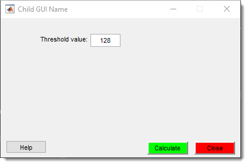

# MIB Plugin with GUI

---

## Overview

{.on-glb align=left width="300"}

The **MIB Plugin** is a tutorial example for creating plugins for **Microscopy Image Browser (MIB)** 
**with** a graphical interface. 
<br>It demonstrates how to build a simple plugin that takes a threshold value from an input in the main plugin 
window to generate a mask layer by thresholding the current image slice.

<div class="clear-float"></div>

This plugin serves as a starting point for developers to understand MIB plugin architecture with GUI 
and customize functionality for their needs.

## Understanding of sections

### Filenames

The plugin with GUI has the following files:

* `[PLUGIN-NAME]Controller.m`, controller of the plugin with the main logic and functions
* `[PLUGIN-NAME]GUI.fig`, figure file generated using MATLAB [guide](https://se.mathworks.com/help/releases/R2024b/matlab/ref/guide.html)
   tool for framework development.
* `[PLUGIN-NAME]GUI.m`, m-file automatically created by guide. This file serves as a View to handle basic logic of widgets 
 
!!! info 
    where `[PLUGIN-NAME]` is the name of the plugin. 

!!! warning
    This plugin name (`[PLUGIN-NAME]`) should match with the name of the directory where the plugin is located.

??? info "Example" 
    For example `mibPluginController.m`:
    
    - `[PLUGIN-NAME]` -> `mibPlugin`, located under `Plugins/Tutorials/mibPlugin` directory
    - Full path: `MIB/Plugins/Tutorials/mibPlugin/mibPluginController.m`
    The same applies to `mibPluginGUI.m` and `mibPluginGUI.fig` 

??? info "Plugins with GUI made using appdesigner"

    [AppDesigner](https://se.mathworks.com/help/releases/R2024b/matlab/ref/appdesigner.html) is a newer MATLAB framework for development of GUI applications.
    Plugins that are created using appdesigner are also compatible with MIB<br>
    
    - **AppDesigner** based plugins have `[PLUGIN-NAME]GUI.mlapp` created by 
    MATLAB [appdesigner](https://se.mathworks.com/help/releases/R2024b/matlab/ref/appdesigner.html) editor.
    (*e.g.* `MyPluginGUI.mlapp`. This file, together with `MyPluginController.m` should be placed under `MyPlugin`
    directory). See more [here](mib-app-design-plugin.md).

??? info "Plugins without GUI"
    The plugin without GUI has only a single file that is called as `[PLUGIN-NAME]Controller.m`, 
    where `[PLUGIN-NAME]` is the name of the plugin.  See more [here](mib-plugin-without-gui.md).

### properties

This section can be used to define properties of the plugin class. 
These properties will be available to all functions withing the plugin class.<br>
??? abstract "Code for properties"
    ```matlab
    properties
        mibModel
        % handles to the model
        View
        % handle to the view
        listener
        % a cell array with handles to listeners
    end
    ``` 

### events

This plugin has a single event that is triggered when the plugin is closed.
??? abstract "Code for events"
    ```matlab
    events
        %> Description of events
        closeEvent
        % event firing when plugin is closed
    end
    ```
    
### Methods (static)

This section contains a function that listens for `updateGuiWidgets` event from mibModel. When it comes, 
the plugin refreshes itself using `obj.updateGuiWidgets()` function. 
??? abstract "Code for static methods"
    ```matlab
    function ViewListner_Callback2(obj, src, evnt)
        switch evnt.EventName
            case {'updateGuiWidgets'}
                obj.updateWidgets();
        end
    end
    ```


### constructor
Constructor is the first function (`function obj = mibPluginController(mibModel)`) that is initialized when the 
plugin starts.

`mibModel` that holds data classes of MIB is passed as a parameter and assigned into `obj.mibModel` variable available to
all functions of the plugin.

`obj.View = mibChildView(obj, guiName);` initialize the view provided by mibPluginGUI.m and the widgets of the GUI
can be accessed using `obj.View.handles.[widgetTag]`. For example, the threshold value can be acquired by<br>
`value = obj.View.handles.thresholdValue.String;`

The following section checks whether MIB is in the virtual stack mode and closes the plugin in this case without any
output.

`mibRescaleWidgets(obj.View.gui);` resized the widgets based on settings in [Ribbon → Home->Preferences](../../ribbon/home/home-preferences.md#user-interface)

`obj.updateWidgets();` can be used to update the GUI with some default settings

It is possible to specify various listeners that are triggered depending on events in the main MIB window:<br>
`obj.listener{1} = addlistener(obj.mibModel, 'updateGuiWidgets', @(src,evnt) obj.ViewListner_Callback2(obj, src, evnt));`

??? abstract "Code of the constructor"

    ```matlab
    function obj = mibPluginController(mibModel)
        obj.mibModel = mibModel;    % assign model
        guiName = 'mibPluginGUI';
        obj.View = mibChildView(obj, guiName); % initialize the view
                
        % check for the virtual stacking mode and close the controller
        if isprop(obj.mibModel.I{obj.mibModel.Id}, 'Virtual') && obj.mibModel.I{obj.mibModel.Id}.Virtual.virtual == 1
            warndlg(sprintf('!!! Warning !!!\n\nThis plugin is not compatible with the virtual stacking mode!\nPlease switch to the memory-resident mode and try again'), ...
                'Not implemented');
            obj.closeWindow();
            return;
           end
                
        % resize all elements of the GUI
        mibRescaleWidgets(obj.View.gui);
                
        obj.updateWidgets();
                
        % obj.View.gui.WindowStyle = 'modal';     % make window modal
                
        % add listner to obj.mibModel and call controller function as a callback
        % option 1: recommended, detects event triggered by mibController.updateGuiWidgets
        obj.listener{1} = addlistener(obj.mibModel, 'updateGuiWidgets', @(src,evnt) obj.ViewListner_Callback2(obj, src, evnt));    % listen changes in MIB
                 
        % option 2: in some situations
        % obj.listener{1} = addlistener(obj.mibModel, 'Id', 'PostSet', @(src,evnt) obj.ViewListner_Callback(obj, src, evnt));     % for static
        % obj.listener{2} = addlistener(obj.mibModel, 'newDatasetSwitch', 'PostSet', @(src,evnt) obj.ViewListner_Callback(obj, src, evnt));     % for static
    end
    ```

### close window function
It is possible to specify some custom steps that are done when user is closing the plugin.<br>
By default, the plugin notifies the main MIB controller that it gets closed: `notify(obj, 'closeEvent');`

??? abstract "Code of closeWindow function"

    ```matlab
    function closeWindow(obj)
        % closing mibPluginController window
        if isvalid(obj.View.gui)
            delete(obj.View.gui);   % delete childController window
        end
                
        % delete listeners, otherwise they stay after deleting of the
        % controller
        for i=1:numel(obj.listener)
            delete(obj.listener{i});
        end
                
        notify(obj, 'closeEvent');      % notify mibController that this child window is closed
    end
    ```

### updateWidgets function
This function is triggered when `updateGuiWidgets` event comes from mibModel. Typically, it is used to update the
dataset specific settings within the plugin.
??? abstract "Code of updateWidgets function"

    ```matlab
    function updateWidgets(obj)
        % function updateWidgets(obj)
        % update widgets of this window
                
        fprintf('childController:updateWidgets: %g\n', toc);
    end
    ```

### calculateBtn_Callback
`calculateBtn_Callback` is the main calculation function of the plugin. It is linked to the `obj.View.handles.calculateBtn`, 
which is the <span class="widget widget-button">Calculate</span> button that starts computation. 

??? abstract "Code of calculateBtn_Callback function"

    ```matlab
    function calculateBtn_Callback(obj)
        % start main calculation of the plugin
                
        % get the user provided threshold value from the GUI
        value = obj.View.handles.thresholdValue.String;
        % convert it from string to double
        threhsoldValue = str2double(value); 
        wb = waitbar(0, 'Please wait'); % add a waitbar to follow the progress
                
        \[height, width, ~, depth\] = obj.mibModel.I{obj.mibModel.Id}.getDatasetDimensions('image');  % get dataset dimensions
        img = cell2mat(obj.mibModel.getData2D('image'));    % get the currently displayed image
        waitbar(0.5, wb);   % update the waitbar
    
        mask = zeros(\[height, width, depth\], 'uint8'); % allocate space for the mask layer
        mask(img<threhsoldValue) = 1; % threshold image
        waitbar(0.95, wb);     % update the waitbar
                
        obj.mibModel.setData2D('mask', mask); % send the mask layer back to MIB
        delete(wb);         % delete the waitbar
    
        % notify mibModel to switch on the Show mask checkbox, 
        % which also redraws the image
        % alternatively, 
        % notify(obj.mibModel, 'plotImage');
        % can be used to force image redraw
        notify(obj.mibModel, 'showMask'); 
    end
    ```

### mibPluginGUI

`mibPluginGUI.m` contains callbacks for widgets in `mibPluginGUI.fig` those can be modified 
by opening the file using guide. 

Type `guide mibPluginGUI.fig` in the main MATLAB workspace to start guide and modify the plugin 
layout and callbacks. 


## Adapting the function to a new plugin
Perform the following operations to use this plugin as a template for a new plugin.

* Create a folder for your plugins under `MIB/Plugins/` for example `MyPlugins` so that the full path is<br>
`MIB/Plugins/MyPlugins`
* Create a subfolder under `MIB/Plugins/MyPlugins` and name it with the name of your new plugin
(e.g.`MIB/Plugins/MyPlugins/mySecondPlugin`) 
* Copy `mibPluginController.m`, `mibPluginGUI.m` and `mibPluginGUI.fig` to 
`MIB/Plugins/MyPlugins/mySecondPlugin`
* Rename `mibPluginController.m` to `mySecondPluginController.m`
* Open `mySecondPluginController.m` in MATLAB 
* Do Find and Replace to search for `mibPlugin` and replace with `mySecondPlugin`, 
++ctrl+f++ key shortcut.
* Edit `calculateBtn_Callback `to implement your desired functionality  
* Save the plugin
* Type `guide mibPluginGUI.fig` to open it in MATLAB guide.
!!! warning
    You may need to change the current MATLAB folder to the plugin directory otherwise
    it may open the previous version of the plugin in `Tutorials\mibPlugin\mySecondPlugin`
* Resave the fig-file under the new name: `mySecondPluginGUI.fig`    
* Restart MIB to refresh the list of plugins.
* Run your plugin from `Ribbon → Plugins → MyPlugins → mySecondPlugin`.
!!! note
    You can remove the copied files `mibPluginGUI.m` and `mibPluginGUI.fig` from the plugin
    directory

## Credits

**Author**: Ilya Belevich, University of Helsinki (ilya.belevich@helsinki.fi)

**Part of**: [Microscopy Image Browser](https://mib.helsinki.fi)

---

*Back to [MIB](../../../index.md) | [User Interface](../../index.md) | [Plugins](../index.md) | [Tutorials](index.md)*
