# Quick Access Bar

The **Quick Access Bar (QAB)** runs along the top of the MIB window and gives one-click access to the most frequently used actions, without switching ribbon tabs.

---

## Overview

Buttons are grouped from left to right by function. Hover over any button to read its tooltip.

---

## Undo / Redo

| Button | Action |
|--------|--------|
| 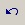{.inline-image} **Undo** | Restores the previous dataset state. Also ++ctrl+z++. |
| 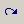{.inline-image} **Redo** | Reapplies the last undone action. |

Set undo history length in [Ribbon → Home → Preferences → Backup and Undo](../ribbon/home/home-preferences.md#backup-and-undo).

---

## Zoom controls

| Button | Action |
|--------|--------|
| 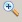{.inline-image} **Zoom in** | Increases magnification by 1.5×. |
| 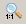{.inline-image} **1:1** | Sets magnification to 100%. |
| 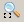{.inline-image} **Fit** | Fits the image to the [Image View panel](../panels/selection_imview/imview.md). |
| 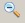{.inline-image} **Zoom out** | Decreases magnification by 1.5×. |

---

## Fast pan mode

{align=left}

Enables fast panning (moving the image in the [Image View panel](../panels/selection_imview/imview.md)) with <mouse class="right"></mouse>.

!!! info
    Normally, panning fetches the full-sized image, causing lag for large images.
    The **Fast pan** mode reduces lag but hides the full image during panning.

---

## Orientation buttons

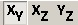{align=left}

Switch the viewing plane:

- **YX** — XY plane (default, ++alt+1++)
- **XZ** — ZX plane (++alt+2++)
- **YZ** — ZY plane (++alt+3++)

[:fontawesome-brands-youtube:{.red-color} Demo](https://youtu.be/4NXSEkrhnts)

Use shortcuts with the mouse over the intersection of colored lines:

- ++alt+1++: XY plane
- ++alt+2++: ZX plane
- ++alt+3++: ZY plane

!!! warning
    Some segmentation tools may only be applied to the dataset in the XY orientation.

??? abstract "Example of a dataset in different orientations"
    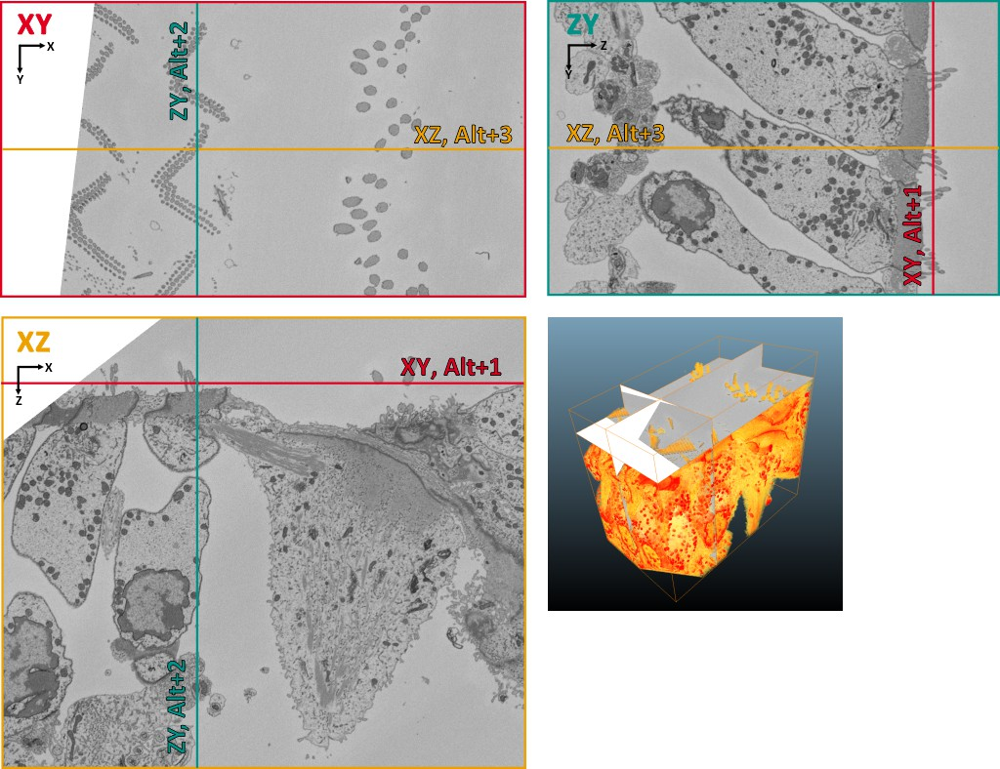{.on-glb}

---

## Line measure tool

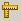{align=left}

Measures linear distances. 
See more [Ribbon → Tools → Measure tool](../ribbon/tools/index.md#measure-tool).

---

## Center marker toggle

{align=left}

Toggles the center marker on the image axes, useful for graphcut segmentation in grid mode.

---

## ROI mode switch

{align=left}

Toggles ROI visibility.

---

## Block-mode switch

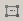{align=left}

When enabled, filters and operations act only on the visible portion of the dataset, speeding up testing.

!!! warning
    Incompatible with ROIs (full dataset is used when ROIs are active).

---

## Save model

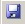{align=left}

Saves the model without prompting for a name, using:

- Default template: `Labels_NAME_OF_THE_DATASET.model`, or
- Name from the last *Save model as…*, or
- Name from a prior *Load model* action

Also accessible via [Ribbon → Model → Save model](../ribbon/model/index.md#save-model).

---

## Make snapshot

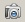{align=left}

Opens a dialog to capture the current slice. 
See [more details](../ribbon/home/home-makesnapshot.md).

??? info "Make snapshot dialog"
    {.on-glb}

---

## Help

Opens the MIB documentation.

---

*Back to [MIB](../../index.md) | [User interface](../index.md)*