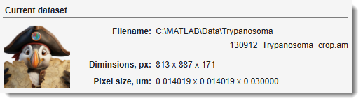
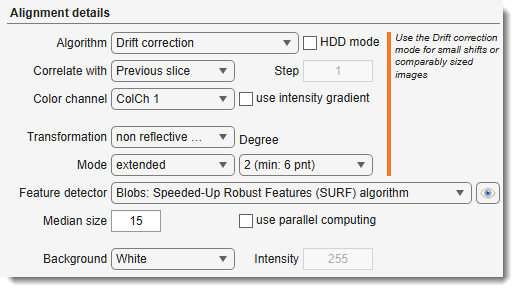
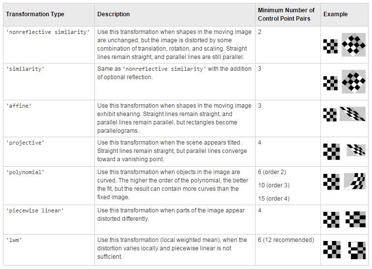
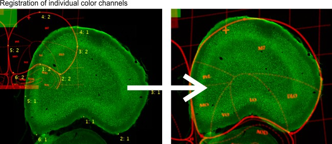
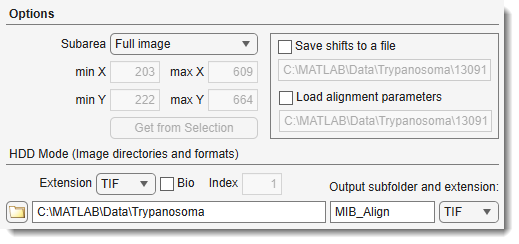

# Alignment and Drift Correction

*Back to [MIB](../../../index.md) | [User interface](../../index.md) | [Ribbon](../index.md) | [Dataset](index.md)*

---

## Overview

The Alignment and Drift Correction tool aligns the slices of the currently opened dataset.

Demos and tutorials

- [:fontawesome-brands-youtube:{.red-color} How to do image alignment](https://youtu.be/-qwoO5z02aA)
- [:fontawesome-brands-youtube:{.red-color} Multi-point landmarks](https://youtu.be/rlXoyZcTpJs)
- [:fontawesome-brands-youtube:{.red-color} Automatic feature-based](https://youtu.be/-en5zD5Ou9s)
- [:fontawesome-brands-youtube:{.red-color} Automatic feature-based using HDD mode](https://youtu.be/tpe9GhpS2o8)
- [:fontawesome-brands-youtube:{.red-color} HDD mode](https://youtu.be/FtvWjDUMZ1I) (Drift correction and Automatic feature-based only)

---

## Current dataset panel

{align=left}

The *Current dataset panel* displays details of the currently opened dataset, such as its filename, dimensions, and pixel size.

---

## Alignment algorithms

{align=left}

Select the alignment algorithm from the Algorithm dropdown.

### Drift correction

Translation correction; recommended for small shifts or comparably sized images.
Also implemented for image files without loading into MIB (see *HDD mode*).

### Template matching

Translation correction; best for aligning two stacks when the second stack is smaller than the main stack.
Not recommended for the currently opened stack.

### Automatic feature-based version 1 and 2

Automatic alignment based on features (blobs, regions, or corners) detected on
consecutive slices. The features are registered to find a suitable transformation and the images are aligned accordingly. 
Version 2 (based on [estgeotform2d](https://se.mathworks.com/help/releases/R2024b/vision/ref/estgeotform2d.html))
is recommended.

Demonstration

* [:fontawesome-brands-youtube:{.red-color} Standard mode](https://youtu.be/-en5zD5Ou9s)
* [:fontawesome-brands-youtube:{.red-color} HDD mode](https://youtu.be/tpe9GhpS2o8)

**Transformations**:

- **Version 1**: based on [estimateGeometricTransform](https://www.mathworks.com/help/vision/ref/estimategeometrictransform.html)
  supports: `similarity`, `affine`, `projective`

- **Version 2**: based on [estgeotform2d](https://se.mathworks.com/help/releases/R2024b/vision/ref/estgeotform2d.html):
    - *translation*: 2-D translation
    - *rigid*: nonreflective rigid (translation + rotation)
    - *similarity*: nonreflective similarity (translation + rotation + scaling)
    - *affine*: general affine 
  ([see more about various transformation types](https://se.mathworks.com/help/releases/R2024b/images/matrix-representation-of-geometric-transformations.html))

Results can be cropped (Mode: cropped) to the first image's size/position or extended (Mode: extended).

Use Preview to check and modify detection of points. 
See [matchFeatures](https://se.mathworks.com/help/vision/ref/matchfeatures.html) for details.
Also implemented for HDD mode. 

**Feature detectors ([see more on different point feature types](https://se.mathworks.com/help/vision/ug/point-feature-types.html))**:

* **Blobs: Speeded-Up Robust Features ([SURF](https://se.mathworks.com/help/vision/ref/detectsurffeatures.html))**: robust, fast, less effective for highly detailed targets (e.g., electrical boards)
* **Blobs: Detect scale invariant feature transform ([SIFT](https://se.mathworks.com/help/vision/ref/detectsiftfeatures.html))**: scale-invariant feature transform
* **Regions: Maximally Stable Extremal Regions ([MSER](https://se.mathworks.com/help/vision/ref/detectmserfeatures.html))**: Maximally stable extremal regions algorithm
* **Corners: [Harris-Stephens](https://se.mathworks.com/help/vision/ref/detectharrisfeatures.html)**: more efficient than the minimum eigenvalue algorithm
* **Corners: Binary Robust Invariant Scalable Keypoints ([BRISK](https://se.mathworks.com/help/vision/ref/detectbriskfeatures.html))**: similar to ORB, slightly more CPU-intensive
* **Corners: Features from Accelerated Segment Test ([FAST](https://se.mathworks.com/help/vision/ref/detectfastfeatures.html))**: fast, extracts many keypoints, not rotation-invariant
* **Corners: [Minimum Eigenvalue](https://se.mathworks.com/help/vision/ref/detectmineigenfeatures.html)**: uses minimum eigenvalue metric to determine corner locations
* **Oriented FAST and rotated BRIEF ([ORB](https://se.mathworks.com/help/vision/ref/detectorbfeatures.html))**: rotation-invariant, best for general use, comparable to SURF

### AMST: Alignment to Median Smoothed Template

Compensates for slight local deformations in 3D electron microscopy datasets. 
Pre-align with Drift correction, then register against a median-smoothed Z copy. 
Based on [Hennies et al., 2020](https://www.nature.com/articles/s41598-020-58736-7).

[:fontawesome-brands-youtube:{.red-color} Demo](https://youtu.be/MNt_Yzt4pw0)

- Median size: number of Z-sections for smoothing.
- Settings: configure parameters (see [imregtform](https://se.mathworks.com/help/images/ref/imregtform.html)).

### Single landmark point

Manual mode; mark corresponding areas on consecutive slices using the Brush tool (spot) or Annotations tool.
Images are translated to align marked areas.

### Landmarks, multi points

Align based on multiple marked points using the Selection layer or Annotations (*recommended*).
Corresponding points must have the same name. 
[Transformation types](https://se.mathworks.com/help/images/matrix-representation-of-geometric-transformations.html): 
{.on-glb align=left}

### Three landmark points

Manual mode; mark three corresponding areas on consecutive slices with the Brush tool. 
Images are translated/scaled/rotated to align.

!!! info "Recommendation"
    Use [Landmarks, multi points](#landmarks-multi-points) instead.

### Color channels, multi points

Register individual color channels using Annotations (*Segmentation panel → Annotations*):

* annotation text identifies corresponding points
* annotation value identifies fixed (1) and transformed (2) channels

??? example "Color Channel alignment example"
    {.on-glb align=left}

---

## Alignment details

{align=left}

- <label class="widget widget-checkbox">HDD mode</label>: align files specified in
  `Options → HDD Mode (Image directories and formats)`
  without loading into MIB. Suitable for large image collections. 
  Only for "Drift correction" (*same size required*) and "Automatic feature-based" algorithms.

Demonstrations:

- [:fontawesome-brands-youtube:{.red-color} Drift correction](https://youtu.be/FtvWjDUMZ1I)
- [:fontawesome-brands-youtube:{.red-color} Feature-based](https://youtu.be/tpe9GhpS2o8)

Correlate with: reference slice options

  - **Previous slice**: align each slice to the previous one.
  - **First slice**: align all to the first Z-slice; good for drift correction with minimal dataset changes.
  - **Relative to**: align each slice to an earlier slice, defined by Step.

Color channel: select the color channel for alignment.

<label class="widget widget-checkbox">Use intensity gradient</label>: use intensity gradients instead of raw images for better alignment.

Background: define background after alignment:

  - **White**: all background pixels white.
  - **Black**: all background pixels black.
  - **Mean**: average value of original dataset pixels.
  - **Custom**: specify a custom intensity.

---

## Options panel

{align=left}

Subarea: defines the image area used to calculate alignment shifts:

- **Full image**: use the entire image (default).
- **Manually specified**: restrict to a sub-region defined by minX, minY, maxX, maxY, or Get from Selection.
- **Selection**: calculate from selected areas only. Use the Brush tool to mark distinct areas on the first and last slices, then interpolate with ++i++ or `Ribbon → Selection → Interpolate as Shape`.
- **Mask**: calculate from masked areas only.

<label class="widget widget-checkbox">Save/Load shifts to file</label>: save/load translation shifts to disk.

**HDD Mode (image directories and formats) panel**: used when *HDD Mode* is enabled

  - Extension: file extension to align.
  - <label class="widget widget-checkbox">Bio</label>: enable Bio-Formats reader for microscope formats.
  - Index: series index to load from a container \[Bio-Formats only\].
  - ...: select directory with images.
  - **Output subfolder and extension**: specify output subfolder (relative to input) and file format.

---

## References and Acknowledgements

The alignment algorithm is based on:

- JC Russ, *The image processing handbook*, CRC Press, Boca Raton, FL, 1994.
- JD Sugar, AW Cummings, BW Jacobs, DB Robinson, *A Free MATLAB Script For Spatial Drift Correction*, Microscopy Today, Volume 22, Number 5, 2014. [Link](https://se.mathworks.com/matlabcentral/fileexchange/45453-drifty-shifty-deluxe-m)

---

*Back to [MIB](../../../index.md) | [User interface](../../index.md) | [Ribbon](../index.md) | [Dataset](index.md)*
