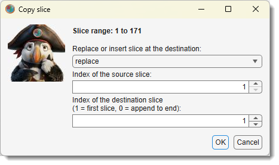
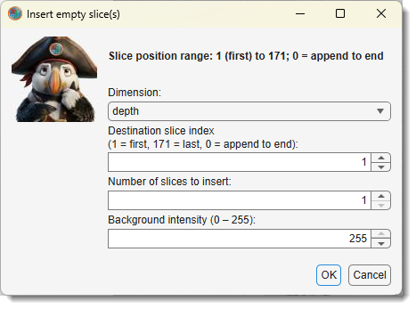
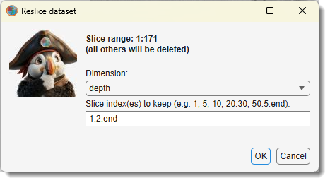
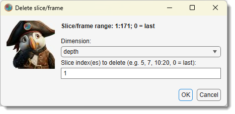

# Slice menu

---

{align=left}

Manipulate individual slices or frames of the dataset, including the image and corresponding 
Selection, Mask, and Model layers.

Demonstration:

- [:fontawesome-brands-youtube:{.red-color} Copy and insert slice demonstration](https://youtu.be/iGA4US2PHXw)

Select an action from [Ribbon → Dataset →Slice](index.md#slices)
to perform operations such as copying, inserting, swapping, or deleting slices or frames. 

## Copy Slice

{.on-glb align=left width="260"}

This action copies a slice from one position to another within the same dataset:

- Replace or insert slice at the destination 
choose the operation mode from the dropdown:
  - `Replace` overwrite the destination slice with the source slice.
  - `Insert` insert the source slice at the destination position, shifting subsequent
  slices forward.
  - `Swap` swap positions of the two specified slices

- Source Slice enter the slice number 
to copy (e.g., 5 for the fifth slice).
- Destination Slice enter the target slice number, use `0`
to insert the slice at the end of the dataset

This is useful for duplicating a slice to correct errors (e.g., replacing a corrupted slice)
or rearranging data (e.g., inserting a reference slice). 
The image and all layers are copied, maintaining alignment across the dataset.

## Insert Empty Slice(s)

{.on-glb align=left width="260"}

This action inserts one or more uniformly colored slices at a specified position:

- Dimension dimension where an empty slice needs to be inserted 
- Destination slice index enter the slice number where
the new slice(s) will be inserted (e.g., `10` to insert at position 10, `0` to insert at the end of the dataset).
- Number of Slices to Insert specify how many 
slices to insert in the field (e.g., `1` for a single slice).
- Intensity of background define the 
intensity or color of the new slice(s) (e.g., 0 for black, 255 for white in grayscale).

Inserting empty slices is ideal for adding placeholders, creating gaps for manual 
annotations, or preparing datasets for further processing. The inserted slices are 
applied to the image and all layers, shifting existing slices as needed to 
accommodate the new ones.

## Interval Slicing

{.on-glb align=left width="260"}

This action extracts every N-th slice to create a new dataset:

- Dimensions select re-slicing dimension: ***depth*, **height**, **width**
- Slice index(es) to keep provide the step size 
(e.g., `1:2:end` to keep every second slice, `1:5:end` to keep every fifth slice).

The current dataset is replaced with the selected slices, reducing the selected dimension.
This is useful for downsampling a stack to reduce data size, focusing on key slices, 
or preparing data for preparation of dataset for training of CNNs. 
The image and layers are updated to include only the extracted slices, 
preserving their content.

## Swap Slices

{.on-glb align=left width="260"}

This action swaps the positions of two or more slices within the dataset: 
see [Copy Slice for details](dataset-slice.md#copy-slice)

## Delete Slice(s)

{.on-glb align=left width="260"}

This action removes one or more slices from the dataset:

- Dimensions select dataset dimension: ***depth*, **height**, **width**, **time**
- Slice index(es) to delete specify indices of slices to delete.

Deleting slices reduces the dataset’s Z-dimension, which is helpful for removing defective 
slices (e.g., blurry or empty ones) or trimming irrelevant data. The image and 
layers are updated, with remaining slices renumbered to close the gaps created 
by deletion.

## Delete Frame(s)

This action removes one or more frames from a time series. See [Delete Slice(s)](dataset-slice.md#delete-slices) for details.

---

*Back to [MIB](../../../index.md) | [User interface](../../index.md) | [Ribbon](../index.md) | [Dataset](index.md)*
