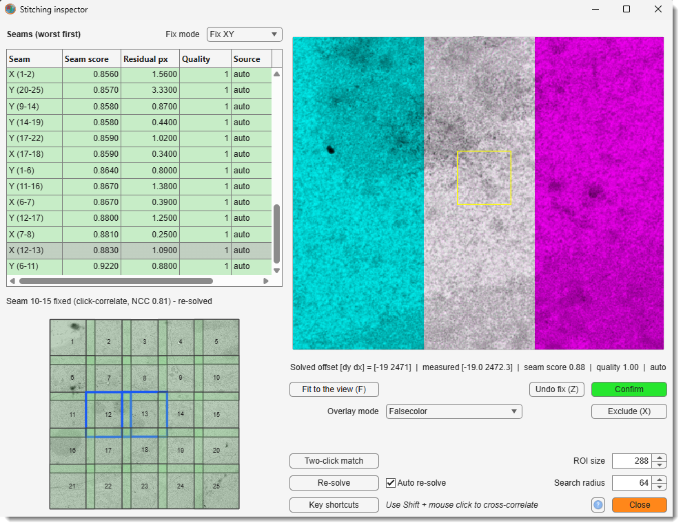
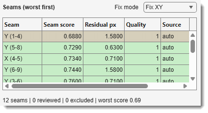
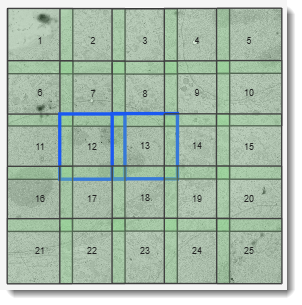
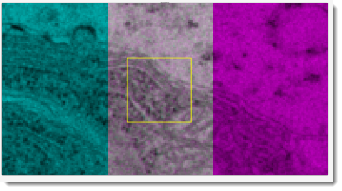

# Stitching Inspector

*Back to [MIB](../../../index.md) | [User interface](../../index.md) | [Ribbon](../index.md) | [Dataset](index.md) | [Stitching](dataset-stitch.md)*

---

## Overview

{.on-glb align=right width="340"}

Automatic stitching can fail **silently**: a measurement that locked onto repetitive content one
period off satisfies the solver perfectly, so the quality rating stays green while a tile sits a
full period out of place.

The Stitching Inspector re-reads the **actual pixels** at every solved seam, ranks the seams
worst-first, and gives you the tools to correct the ones the automatic pass got wrong - by clicking
a landmark, dragging the overlay, or matching two points.

Open it with <span class="widget widget-button">Inspect and fix...</span> in the
[Stitching](dataset-stitch.md) window - enabled once *Measure overlaps* and *Optimize positions*
have run. Both windows stay open and usable side by side. The overlay mode, Fix mode, ROI size,
search radius and Auto re-solve are remembered until MIB is closed.

<div class="clear-float"></div>

---

## The review loop

The inspector is built around one repeated cycle: **look at the worst seam, decide, move on**.

1. **Read the top of the table.** It is the seam whose pixels agree least at the solved placement.
   → [The seam table](#the-seam-table)

2. **Judge it in the pair view.** In the default *Falsecolor (cyan/magenta)* overlay, aligned structures come out
   **white**; a misalignment splits into cyan and magenta ghosts. ++space++ (in *Flicker* mode) is
   the fastest way to see a small shift.
   → [The pair view](#the-pair-view)

3. **Decide.** If the seam is fine, <span class="widget widget-button">Confirm</span> marks
   it reviewed and jumps to the next worst. If it is wrong, fix it.
   → [Reviewing the ranking](#reviewing-the-ranking), [Fixing a bad seam](#fixing-a-bad-seam)

4. **Let it re-solve.** With <label class="widget widget-checkbox">Auto re-solve</label> on
   (default) every fix immediately re-solves all positions, re-scores and re-ranks, so the table
   always shows what is worst *now*.
   → [Re-solving](#re-solving)

5. **Stitch.** When the top of the list is green, press
   <span class="widget widget-button">Stitch</span> in the [Stitching window](dataset-stitch.md).
   → [Fusing and saving](#fusing-and-saving)

!!! tip "Work top-down and stop early"
    The ranking is a work queue, not a checklist. Fixing the worst seam usually moves several tiles,
    so the seams below it are re-scored and often sort themselves out. Re-read the top of the table
    after each fix rather than working down the rows in their original order.

---

## The seam score

Every tile pair is scored by **how well the actual pixels agree at the solved placement**: the two
overlap strips are re-read from disk and cross-correlated, giving a number from 0 to 1. The ranking,
the row colours, the mini-map tint and the [alignment chip](dataset-stitch.md#alignment-quality) in
the main window all come from this one measurement.

??? info "Why the pixels and not the solver residual"
    The residual asks *"do the measurements contradict each other?"*. That question can only be
    answered where the seams form a **loop** - in a 2x2 mosaic you can walk 1 → 2 → 4 → 3 → 1, so
    the four measurements have to add up.

    A **single row or column** of tiles has no loop: each tile is held by one seam only, so every
    measurement is honoured exactly and the residual reads ~0 **no matter how wrong they are**. The
    same is true locally in any sparse layout.

    The pixel score has no such blind spot. It does not care where the number came from - it looks
    at the two tiles where they are now and asks whether the structures line up. A measurement that
    locked one texture period off scores badly here even when the solver is perfectly happy, which
    is exactly the failure this tool exists to catch.

---

## The seam table

{.on-glb align=right width="300"}

Each row of the **Seams (worst first)** table is one measured seam (tile pair), in six columns.

<div class="clear-float"></div>

| Column | Meaning |
|--------|---------|
| **Seam** | axis + tile pair, *e.g.* `X (2-3)` for an in-plane seam or `Z (8-9)` for a cross-layer one. |
| **Seam score** | pixel agreement of the two tiles re-read at their **solved** placement, 0-1, higher is better. Drives the ranking and the row colour: green >= 0.7, amber >= 0.4, red below, grey when excluded. |
| **Residual px** | how far the global solve's placement differs from what this edge's own measurement asked for. Small means the solve matched this measurement; large means other seams and springs pulled the tile away from it. |
| **Quality** | the registration confidence recorded when the seam was **measured**, before any solve ran - also the weight the solver gave it. It answers *"how sure was the automatic pass"*, not *"is this seam aligned now"*. |
| **Source** | `auto` (untouched automatic measurement), `confirmed` (reviewed and accepted as-is), or `user` (repositioned by a manual fix). |
| **Used** | `yes`, or `EXCLUDED` when the seam has been toggled out of the solve. |

!!! danger "High Quality with a low Seam score is the dangerous case"
    That combination means the automatic pass was *confident* and *wrong*. It is precisely what the
    residual cannot see and what this inspector was built to find. Treat such a row as a fix, not as
    a borderline call.

??? note "The table shows one kind of seam at a time"
    In-plane seams (`X`, `Y` - tiles side by side within one Z-layer) and cross-layer seams (`Z` -
    tiles in adjacent Z-layers) read on different axes, so mixing them in one ranked list was
    confusing. The table therefore follows the
    <span class="widget widget-dropdown">Fix mode</span> dropdown: 

    - **Fix XY** lists the in-plane seams, 
    - **Fix Z** the cross-layer ones. 

    Every navigation - ++down++ / ++up++, *Confirm and advance*, a mini-map click, a re-solve - stays 
    inside the shown subset.

    A 2D mosaic has only in-plane seams, so its *Fix Z* table is empty. So is that of a mosaic of
    Z-stacks that all sit on **one** layer: there are no cross-layer seams to list, but the
    [Fix Z boundary view](#3d-browsing-slices-and-the-fix-mode) still works, because it aligns mosaic *slices* rather
    than seams.

??? note "What the status line reports"
    Between the table and the mini-map: `12 seams | 0 reviewed | 0 excluded | worst score 0.69`.
    Note that it counts **all** seams, not just the ones the current *Fix mode* lists. *Reviewed* counts
    seams marked `confirmed` or `user`; *worst score* is taken over the seams still in use, so
    excluding a bad one changes it.

    It reads **worst score not checked** when no seam carries a score - the scoring pass never ran,
    or it was [cancelled](dataset-stitch.md#alignment-quality), which discards the partial result
    rather than rating the mosaic on its better half. Press
    <span class="widget widget-button">Re-solve</span> to get the scores back.

    The same line doubles as the feedback area: after each action it says what happened (*"snapped
    by 3.4 px"*, *"match too weak - nothing moved"*, *"nothing to undo on this seam"*).

---

## The mini-map

{.on-glb align=right width="200"}

The layout drawn at the **solved** positions, each tile tinted by its worst seam (green → red, grey
when all its seams are excluded), with the current pair outlined in blue.

<div class="clear-float"></div>

<mouse class="left"></mouse> click jumps to the review - and it selects the seam **nearest the click
point**, not simply the clicked tile's worst one. Clicking near a tile's right edge opens its seam
with the tile on that side; clicking near its bottom edge opens the seam below. This matters because
a grid tile usually touches three or four seams.

??? tip "The fused preview is the cheapest sanity check there is"
    Unless the tiles are very large, a low-res **fused preview** is composited behind the colouring
    at the current solved positions, and it is redrawn after every re-solve. A tile placed a whole
    field of view out of position is obvious there in a way that no number in the table can convey -
    look at the mini-map first whenever a rating disagrees with your expectation.

??? note "One Z-layer at a time"
    A multi-layer mosaic stacks every layer at the same XY, so drawing them all would overlap the
    boxes and merge the labels. The mini-map therefore shows only the layer of the **current seam**
    (the lower tile of a cross-layer pair), and names it in the title when there is more than one.
    Selecting a seam in another layer moves the map with it.

---

## The pair view

{.on-glb align=right width="200"}

The **complete tile pair** composited at the solved offset - not just the overlap strip, so a tile
that is badly out of place is still visible and still fixable. Large tiles are downsampled for
display only; every fix is computed at full resolution.

Which tile is which colour is stated in the axes title (*e.g. Cyan: tile 2; Magenta: tile 4 (on
top)*), along with the browsed slices on 3D pairs. The tile on top - the one
**Overwrite** blend mode keeps in the mosaic, see
[Tile order](#tile-order) - is always the magenta (or red) one.

### Overlay modes

| <span class="widget widget-dropdown">Overlay mode</span> | Shows | Best for |
|---|---|---|
| **Preview final** | the pair as <span class="widget widget-button">Stitch</span> will produce it, with the current [blend mode](dataset-stitch.md#blend-modes), [tile order](#tile-order) and intensity correction | deciding which tile should be on top |
| **Falsecolor (cyan/magenta)** *(default)* | the tile on top in **magenta**, the other in **cyan** - aligned structure adds up to **white**, misaligned structure splits into coloured ghosts | judging alignment at a glance; the mode to work in |
| **Falsecolor (green/red)** | the tile on top in **red**, the other in **green** - aligned structure comes out **yellow** | the same, in the colour pair some eyes separate better |
| **Flicker** | one tile at a time, ++space++ toggles | small shifts - the eye catches a 2 px jump between two flickering images far better than a colour fringe |
| **Checkerboard** | alternating squares from each tile | whether structures **continue** across the changeover |
| **Difference** | the intensity difference of the two | a quick look at brightness disagreement as well as misalignment |

### Tile order

Where tiles overlap, the [Overwrite](dataset-stitch.md#blend-modes) blend mode keeps only one of them.
<mouse class="right"></mouse> click the pair view (without dragging) to choose which: the menu has
one entry for each tile of the seam on screen, each with **Move to top**, **Move up**, **Move down**
and **Move to bottom**. The colours swap as soon as the tile on top changes; switch
<span class="widget widget-dropdown">Overlay mode</span> to **Preview final** to see the result as
it will be stitched.

**Move up** and **move down** step past the nearest tile the moved tile actually overlaps, so every
choice changes something visible; moves that would change nothing are greyed out. The order is used by
<span class="widget widget-button">Stitch</span> and saved with the project; it moves no tile and
changes no seam score. It has no effect with the other blend modes, which mix the tiles.

Until you change it, the tile imaged **first** is on top when
[Re-exposure damage](dataset-stitch.md#intensity-correction) correction is selected, so overlaps
show the undamaged copy; otherwise the tile with the higher number is.

???+ tip "Zooming and panning"
    - **Mouse wheel** zooms at the cursor. The zoom is **kept** through nudges, drags and fixes of
      the same seam, so you can work zoomed in; it resets when you move to another seam or press
      <span class="widget widget-button">Fit to the view (F)</span>.
    - **Hold <mouse class="right"></mouse> and drag** to pan. Panning is deliberately on the right
      button so it works identically in every mode - Fix XY, Fix Z, two-click - and can never be
      mistaken for a tile-moving drag.

### The readout

Directly under the pair view, one line describing the seam on screen:

```text
Solved offset [dy dx] = [2760 -4]  |  measured [2761.5 -3.5]  |  seam score 0.69  |  quality 1.00  |  auto
```

- **Solved offset** - where the pair actually sits after the global solve.
- **measured** - what this seam's own measurement asked for. A large gap between the two is the same
  information as the *Residual px* column: other seams outvoted this one.
- **seam score**, **quality**, **source** - as in the table, for the seam on screen.
- On 3D pairs, **dz** is appended - and if the pixels prefer a different one, so is a hint such as
  *pixels prefer dz+2*.

---

## Reviewing the ranking

- <span class="widget widget-button">Confirm</span> marks the current seam reviewed and
  jumps to the next worst unreviewed one.
- <span class="widget widget-button">Exclude (X)</span> removes its measurement from the solve.
- <span class="widget widget-button">Re-solve</span> recomputes all positions and re-ranks.
- ++down++ / ++up++ step through the ranking without changing anything - one row down or up the
  table, as in any list.

Review decisions are saved with the [project file](dataset-stitch.md#project-files) and survive
re-measuring.

??? note "What Confirm does, and what it does not do"
    Confirming is **bookkeeping only**: it records that a human looked at the seam and accepted it,
    which is what lets *Confirm and advance* skip it afterwards, and it is what the
    <span class="widget widget-button">Save project</span> file remembers.

    It deliberately does **not** change the seam's weight in the solve. The automatic measurement
    was already trusted in proportion to its quality, and your agreeing with it adds no new
    information - only an actual **fix** does, and only a fix is promoted to `user`.

??? note "Exclude is a toggle, and it withdraws a fix"
    While a seam is excluded the button stays pressed and turns red, reading *Excluded (X)*; press
    it (or ++x++) again to put the measurement back. The seam's *Used* column reads `EXCLUDED` and
    its row greys out to match.

    Excluding is the **coarse** option: with no measurement, the pair is held near its nominal
    position by the springs, which is better than a wrong measurement but worse than a proper
    [fix](#fixing-a-bad-seam). Note that excluding a seam you had fixed **withdraws** that fix - the
    seam returns to `auto` provenance, because a user seam is never pruned and the two states would
    otherwise contradict each other. Re-including it brings back the *automatic* measurement, not
    your fix.

### Re-solving

With <label class="widget widget-checkbox">Auto re-solve</label> on (default), every fix immediately
re-solves all positions, re-scores and re-ranks - work worst-first until the top of the list is
green.

??? tip "Turn Auto re-solve off on a large mosaic"
    Each re-solve re-reads every overlap to re-score it, which is the slow part. Unticking
    <label class="widget widget-checkbox">Auto re-solve</label> lets you fix several seams and pay
    that cost once, at the end.

    While a fix is waiting, the [alignment chip](dataset-stitch.md#alignment-quality) in the main
    window reads **Seams edited / Rating stale until re-solved / Re-solve now, or just Stitch**. It
    means the tiles have **not moved yet**: your fix is stored, but the positions still come from
    the previous solve, so the rating on display describes the old mosaic.

    Both ways forward are safe - press <span class="widget widget-button">Re-solve</span> to apply
    the fixes now and see the updated rating, or simply press
    <span class="widget widget-button">Stitch</span>, which always applies a pending re-solve before
    fusing. **Closing this window does not cancel the pending fix**: it belongs to the mosaic, not to
    the inspector, and the chip keeps warning until it is applied.

---

## Fixing a bad seam

A fixed seam becomes a high-weight **user** measurement: the solver never prunes it, never demotes
it, and it survives a re-measure. Pick whichever tool fits how wrong the seam is.

### Hold ++shift++ and click a landmark

**The strongest tool, and the one to reach for first.** You point at *where* to look; MIB finds
*exactly* where it lines up.

While ++shift++ is held, the cursor becomes a box showing precisely the region that will be used.
On click, that box is cut from the first tile and cross-correlated against the second, and a
confident peak snaps the pair to sub-pixel alignment.

- <span class="widget widget-edit">ROI size</span> - the edge length of the box in pixels. Resize it
  live with ++shift++ + mouse wheel. On small tiles keep it **smaller than the overlap region**.
- <span class="widget widget-edit">Search radius</span> - how far around the current offset the box
  is searched, per side.

A weak or ambiguous match **only reports why, and never moves the tile**. That is the point: the
tool declines rather than guessing, so a snap that happens is one you can trust. If it keeps
declining, aim at a distinctive feature rather than flat background, or enlarge the ROI.

### Drag the overlay

<mouse class="left"></mouse> drag moves the second tile of the seam live at 50% opacity - the axes
title names it (*drag moves tile 4*), whichever colour it has; release applies the shift. Use it to get within a few pixels when the offset is too far out for the search radius, then
finish with ++shift++ + click.

A click that does not move is deliberately a **no-op** - stray clicks never move a tile.

### Two-click match

<span class="widget widget-button">Two-click match</span> is for offsets beyond any search radius -
a tile locked a whole texture period off, or a tile in the wrong grid cell entirely. Both full tiles
are shown side by side; click the same landmark once in each, and the difference between the two
clicks becomes the offset, sharpened by a local correlation around it.

Press the button again (or navigate away) to cancel.

### Undo

++z++ or <span class="widget widget-button">Undo fix (Z)</span> restores the seam's **original
automatic measurement** - measurement, quality, validity and provenance alike - undoing every fix
applied to it this session, not just the last one.

!!! note
    Undo is in-memory only. A [project file](dataset-stitch.md#project-files) saves whatever state
    was current when you saved it, so a fix that was saved and then undone comes back on load.

---

## 3D: browsing slices and the Fix mode

**3D pairs** are shown one **slice pair** at a time, browsed with ++q++ / ++w++ - previous / next,
the same keys as the main MIB window (++shift++ = 5 slices). Browsing is **always view-only, in both
fix modes**; it never moves a tile.

!!! note "Slices are on Q/W; the arrows walk the seam list"
    Unlike the main MIB window, ++down++ / ++up++ here move through the **seam table**, not through
    the stack. The arrows point at rows because that is what the left half of this window is: a
    ranked list you work down.

The <span class="widget widget-dropdown">Fix mode</span> dropdown decides what a fix edits.

=== "Fix XY"

    *(default)* The ordinary in-plane offset of the current seam. Both tiles browse together,
    aligned by the current Z relation, so you can check the seam on any slice and fix it there with
    the usual tools.

    The seam table lists the **in-plane** seams while this mode is selected.

=== "Fix Z (match slices)"

    For checking that each mosaic slice **continues** the slice below it.

    The view shows **one tile** at two consecutive slices - slice *z-1* in **cyan** and slice *z* in
    **magenta**, fully overlapping, so the image is mostly **white** when the mosaic is aligned in
    Z. ++q++ / ++w++ moves the boundary through the stack.

    Where the two slices jump apart (cyan/magenta ghosting), **drag** the magenta slice onto the
    cyan one, or hold ++shift++ and **click a landmark** for the same sub-pixel correlation as in
    XY.

    **The fix shifts that slice and every slice above it, across the whole mosaic** - the slices
    below stay put. The readout names the boundary, the shift, and which boundaries already carry a
    correction.

??? note "Fix Z is not a seam fix, and does not re-solve"
    Fix XY edits a **seam** between two tiles, so it feeds the global solve and the tiles move. Fix
    Z edits the **mosaic itself**: it records that output slice *z* and everything above it shifts
    by a given amount relative to the slices below.

    Nothing in the tile graph changes - the solved positions are untouched and no re-solve is
    involved. The corrections accumulate per boundary, are applied by
    <span class="widget widget-button">Stitch</span> when the mosaic is fused, and are saved with the
    project. ++z++ removes the correction at the boundary on screen.

!!! note "On a 2D dataset the mode stays at Fix XY"
    There are no Z slices to align, and a dialog says so. For deeper, non-rigid per-slice
    registration use the [Alignment tool](dataset-alignment.md) on the fused dataset.

---

## Mouse reference (pair view)

| Action | Effect |
|--------|--------|
| <mouse class="left"></mouse> drag | Moves tile *j* over tile *i* (Fix Z: the magenta slice over the cyan one); release applies the fix |
| <mouse class="left"></mouse> click, no movement | Nothing - stray clicks never move a tile |
| ++shift++ + hover | Shows the correlation ROI box at the cursor (no click needed) |
| ++shift++ + <mouse class="left"></mouse> click | Click-to-correlate: cuts the ROI box and auto-snaps to a confident sub-pixel match |
| ++shift++ + wheel | Resizes the correlation ROI box |
| Wheel | Zooms the pair view at the cursor |
| <mouse class="right"></mouse> drag | Pans the view (no zoom change); clamped to the rendered tile extent |
| <mouse class="right"></mouse> click, no movement | Opens the [tile order](#tile-order) menu (not in the Fix Z view) |
| <mouse class="left"></mouse> click *(two-click match armed)* | Sets a landmark point on whichever tile was clicked |

Elsewhere in the window:

| Control | Effect |
|---------|--------|
| <mouse class="left"></mouse> click on the mini-map | Jumps to review the seam nearest the click point |
| <mouse class="left"></mouse> click on a seam table row | Selects that seam for review |

---

## Keyboard shortcuts

| Shortcut | Effect |
|----------|--------|
| ++enter++ | Confirm the current seam and jump to the next worst unreviewed |
| ++x++ | Exclude / re-include the current seam from the solve |
| ++down++ / ++up++ | Next / previous seam in the ranking - one row down / up the seam table |
| ++q++ / ++w++ | Browse Z slices (++shift++ = 5); always view-only, in both Fix XY and Fix Z |
| ++z++ | Undo the fix on the current seam, restoring the original automatic measurement (Fix Z: removes the boundary correction on screen) |
| ++f++ | Fit the pair view, resetting the mouse-wheel zoom |
| ++space++ | Flicker A/B (*Flicker* overlay mode) |

??? info "The keyboard never moves a tile"
    Every positional edit is made with the mouse - drag, ++shift++ + click, or two-click match. The
    arrow keys move between seams and ++q++ / ++w++ browse slices, in **both** fix modes, so a
    keystroke can never silently alter an alignment you were only looking at.

    Fine adjustment is what ++shift++ + click is for: it is sub-pixel and works on both axes at once,
    which no arrow key could match.

<span class="widget widget-button">Key shortcuts</span> opens this whole list - mouse, ++shift++ +
mouse and keyboard alike - as a pop-up, so it is available without leaving the dialog.

---

## Fusing and saving

To bake the corrections into a mosaic, press <span class="widget widget-button">Stitch</span> in the
[Stitching window](dataset-stitch.md); to keep them on disk, press
<span class="widget widget-button">Save project</span> there.

The inspector has **neither button of its own**. It edits the stitch in place, so the parent window's
buttons already see every fix - both windows stay open and usable side by side, and a copy here would
only be the same action under a second name.

Nothing has to be handed over first:

- **Save project** always carries the current state, including fixes made a moment ago.
- **Stitch** runs any pending re-solve before fusing, so the mosaic is never built from stale
  positions - even if this window has been closed in the meantime.

---

*Back to [MIB](../../../index.md) | [User interface](../../index.md) | [Ribbon](../index.md) | [Dataset](index.md) | [Stitching](dataset-stitch.md)*
