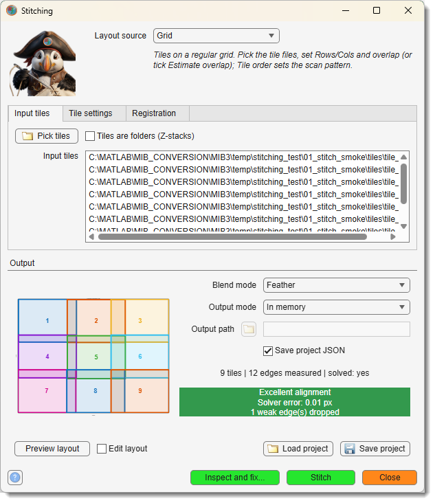
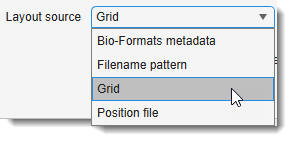
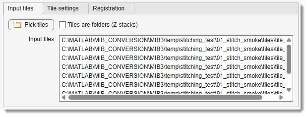
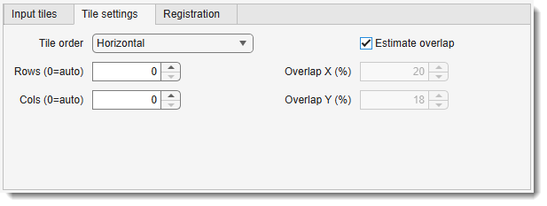
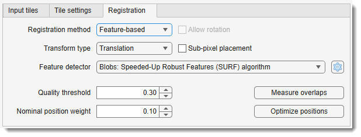
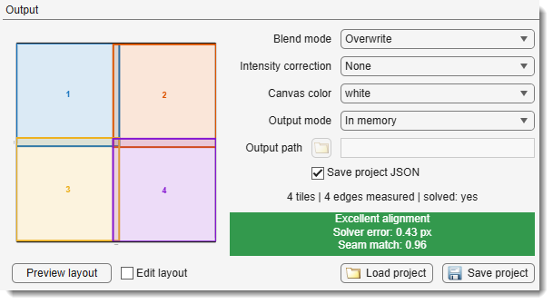

# Stitching

*Back to [MIB](../../../index.md) | [User interface](../../index.md) | [Ribbon](../index.md) | [Dataset](index.md)*

---

## Overview

{.on-glb align=left width="340"}


The Stitching tool assembles a collection of 2D image tiles into a single large mosaic.
Starting from a rough initial placement (a regular grid, a position file, a filename
pattern, stage coordinates, or a Fibics Atlas mosaic), the tool measures the true overlap
between neighboring tiles using phase correlation, finds a globally consistent position for
every tile, and fuses the tiles into a new dataset.

Both 2D tile collections and 3D tiles (Z-stacks) are supported: for 3D data the tool
performs a single global optimization that jointly minimizes the within-layer (XY) and
between-layer (Z) constraints, rather than stitching each layer in 2D and aligning the
layers afterwards.

Small mosaics are assembled directly in memory; mosaics that exceed available memory can
be streamed to an OME-Zarr file and opened in MIB as a BigData dataset.

---

## The window at a glance

The dialog is arranged top to bottom in four areas, following the order you work through them:

| Area | Contains |
|------|----------|
| **Header** | <span class="widget widget-dropdown">Layout source</span> - *how the tiles are arranged*. It governs the whole dialog (which settings below are enabled), so it sits above everything else. The italic text under it gives a short explanation about the selected mode. |
| **Settings tabs** | Three tabs, one per question: <span class="widget widget-button">Input tiles</span> (*which files*), <span class="widget widget-button">Tile settings</span> (*how they are arranged*), <span class="widget widget-button">Registration</span> (*how they are matched*). |
| **Output panel** | The layout preview on the left, the output/blend settings and project buttons on the right, and the two readouts underneath: the status line (tiles / measured seams / solved) and the colour-coded alignment-quality chip. |
| **Action strip** | Always reachable, whichever tab is open: help, <span class="widget widget-button">Inspect and fix...</span>, <span class="widget widget-button">Stitch</span>, <span class="widget widget-button">Close</span>. |

---

## The stitching pipeline

Stitching runs in four stages. The stages can be triggered one by one - recommended for
the first time, to check intermediate results - or the
<span class="widget widget-button">Stitch</span> button can be used at any stage.

1. <span class="widget widget-button">Preview layout</span> *(Output panel)* - draws the
   nominal tile arrangement as numbered rectangles on the preview axes. Use it to verify
   that the grid dimensions, tile order, and overlap settings are correct **before** any
   heavy computation.

    Tick <label class="widget widget-checkbox">Edit layout</label> to switch the
    preview into **interactive placement** mode: each tile becomes a draggable rectangle (its size
    is fixed - only the position moves). Drag tiles to a better rough arrangement;each move updates that tile's
    nominal position and clears any previous measurement, so the next
    <span class="widget widget-button">Measure overlaps</span> / <span class="widget widget-button">Optimize positions</span>
    in the *Registration* tab start computation from the corrected layout. Untick to return to the static view.

2. <span class="widget widget-button">Measure overlaps</span> *(Registration tab)* - for every pair of
   neighboring tiles, the expected overlap region is cut from both tiles and their
   *actual* relative displacement is measured with FFT phase correlation. Each
   measurement gets a quality score from 0 to 1: a crisp, well-textured overlap scores
   close to 1, while a featureless or non-matching overlap scores close to 0.
   Measurements below the quality threshold are marked invalid.

3. <span class="widget widget-button">Optimize positions</span> *(Registration tab)* - computes the final
   position of every tile. Pairwise measurements are only *relative* statements
   ("tile 5 sits 342.7 px right of tile 4"), and with more measurements than tiles they
   slightly contradict each other. Instead of chaining tiles one after another (which
   accumulates drift), the tool solves one global least-squares problem over the whole
   tile graph: every valid measurement is an equation weighted by its quality, and all
   positions are found at once. Tiles whose measurements were rejected are held near
   their nominal grid positions. The result is summarised by a colour-coded quality
   rating - **Excellent** (green) / **Good** / **Fair** / **Poor** (red) - built from two
   independent checks (both in the chip's tooltip):

    - the **solver residual** - how much the pairwise measurements still disagree at the
      solved positions (RMSE in pixels). Note this is blind on chain-like layouts: with
      no loops in the tile graph the residual is ~0 whatever the measurements claim;
    - the **pixel seam check** - the overlap pixels are re-read at every solved seam and
      cross-correlated (the same score the
      [seam inspector](dataset-stitch-inspector.md) ranks by). If the worst seam
      matches poorly the chip turns orange **Check seams** or red **Seams disagree** even
      when the residual looks perfect - the signature of a wrong layout
      orientation/order or a confidently-wrong measurement. Z-stack tiles are scored
      **slice by slice at the solved Z offset**, and seams between Z-layers are
      additionally re-scored at nearby Z offsets: if the pixels prefer a different Z
      the chip turns orange **Check Z alignment** and the inspector's offset readout
      states the preferred shift (e.g. *pixels prefer dz+2*).

    If any tile has **no valid measurement at all** the chip turns orange -
    **Alignment incomplete** - because such a tile is simply parked at its nominal
    position and neither check covers it; check the grid rows/cols or fix its seams in
    the [seam inspector](dataset-stitch-inspector.md). The layout preview refreshes
    automatically after every solve and shows the **solved** positions (the title states
    solved vs nominal).

    The chip keeps up with the [seam inspector](dataset-stitch-inspector.md) while it is
    open: excluding a seam changes which seams the worst-match is taken over, so the
    verdict is re-derived immediately. Until you press *Re-solve* it reads
    **Seams edited - press Re-solve to update the alignment**, because the residual still
    belongs to the previous edge set.

4. <span class="widget widget-button">Stitch</span> *(bottom strip)* - fuses the tile pixels into the
   output mosaic at the optimized positions, blending the overlap regions according to
   the selected blend mode, and opens the result as a new dataset in MIB.

---

## When automatic stitching fails: Inspect & fix

Automatic stitching can fail silently: a measurement that locked onto repetitive content
one period off satisfies the solver perfectly on sparse tile arrangements - the quality
rating stays green while a tile sits a full period out of place.

The <span class="widget widget-button">Inspect and fix...</span> button in the bottom strip
(enabled after *Measure overlaps* + *Optimize positions*) opens the **seam inspector**, which re-reads the
actual pixels at every solved seam, ranks the seams worst-first, and lets you correct the
bad ones by clicking a landmark, dragging the overlay, or matching two points. Both windows
stay usable side by side: re-solve in the inspector, then press *Stitch* here to fuse the
corrected mosaic.

[**→ Seam inspector: reviewing and fixing seams**](dataset-stitch-inspector.md)

---

## Layout source

{.off-glb align=right}

The <span class="widget widget-dropdown">Layout source</span> dropdown at the top of the window
states **how the tiles are arranged**. Switching it re-enables the relevant settings on the
*Tile settings* tab and rebuilds the layout.
The italic line underneath summarises the selected layout mode.

=== "Bio-Formats metadata"

    Tile positions are read from the **stage coordinates embedded in the
    image metadata** (OME `Plane PositionX/Y/Z`) - no manual arrangement needed. 
    
    Point it at one multi-series file (each series is a tile) or at several single-tile files; 
    the microscope's recorded positions become the nominal layout, converted from **micrometres** 
    to pixels via the stored pixel size. 

    Distinct stage-Z values are placed on separate layers and jointly solved.

=== "Filename pattern"

    Grid indices are parsed from `Z##`, `X##` and `Y##` tokens in the file
    (or, for folder tiles, the **folder**) names *e.g.*<br>
    `myStack_Z01-X02-Y03.tif` → Z-layer 1, column 2, row 3. 

    **The order of the three tokens does not matter** (see the note below).

    Tiles overlap can be specified using <span class="widget widget-edit">Overlap X/Y</span> (or tick
    <span class="widget widget-checkbox">Estimate overlap</span>) when the pattern-named tiles come from an overlapping acquisition and the
    tool will register them like the Grid source.

    ??? note "Filename pattern: what the tokens must look like"
        Each of the three tokens (X, Y, Z) is located **independently**, so their **order is irrelevant** and so are
        the separators - `myStack_Z01-X02-Y03`, `myStack_X02-Y03-Z01` and `myStackY03X02Z01` all describe
        the very same tile (Z-layer 1, column 2, row 3). The same rules apply to **folder** names when
        <span class="widget widget-checkbox">Tiles are folders</span> is on. 

        What does matter:
    
        - [x] each token is an **upper-case** `Z`, `X` or `Y` followed by **exactly two digits** - `Z01`, not
          `Z1` and not `z01`;
        - [x] indices are **1-based**: the first tile is `Z01-X01-Y01`;
        - [x] the **last** `Z`, `X` and `Y` in the name are taken as the tokens. Those letters may therefore
          appear *before* them (`XYZstack_Z01-X01-Y01` is fine) but not *after*
          (`..._Z01-X01-Y01_XY` is not);
        - [x] all three tokens must be present. Tiles named in some other scheme - a folder of `tile_r1c1`,
          `tile_r1c2`, … for instance - cannot use this source; arrange them with **Grid** instead.
    
    ??? warning "Tokens longer than two digits are silently truncated"
        **Only two characters after each letter are read!**

        A three-digit token such as `Z001-X002-Y003` is parsed as `Z=00, X=00, Y=00` - **without any error**!

        Thus every tile is assigned the same invalid grid cell and the layout preview shows them all piled 
        on top of each other. 

        Acquisitions with more than 99 tiles along an axis must be renamed to two-digit tokens, or arranged 
        with the **Grid** or **Position file** source instead. 
        A one-digit token (`Z1`) fails outright with an index error.

=== "Grid"

    Tiles form a regular grid; specify rows, columns, acquisition order, and overlap on the
    *Tile settings* tab.

=== "Position file"

    **A file that states where every tile goes.** Two kinds qualify, and MIB tells them
    apart by extension, so one source covers both:

    - a **position text file** you write yourself - one line per tile,
      `filename X Y` or `filename X Y Z`, space-, tab-, or comma-separated;
    - a **Fibics Atlas mosaic** (`MosaicInfo_<name>.ve-mif`), whose own stitch can be
      imported along with it - see *Fibics Atlas mosaics* below.

    For the text form, positions are in **pixels** (see the examples below).
    The optional Z column places tiles on distinct layers; layers that
    overlap in Z are refined by the same global solve as the XY overlaps.

    ??? example "Position file: format, units and examples"
        **Units - this is the part that trips people up.** The position file is written in **image
        units, not stage units**:
    
        | Column | Unit | Meaning |
        |--------|------|---------|
        | `X` | **pixels** | horizontal offset of the tile's **top-left corner** in the mosaic; increases to the **right** |
        | `Y` | **pixels** | vertical offset of the tile's top-left corner; increases **downward** (image convention, not a plot axis) |
        | `Z` *(optional)* | **slices** | index of the slice the tile starts at - a whole-number slice count, **not** a µm depth |
    
        Coordinates are **0-based**: the top-left tile of a mosaic is at `0 0` (or `0 0 0`). They may be
        **fractional** (`130.5`) - sub-pixel nominal positions are kept as given.
    
        If your stage coordinates are in **micrometres**, divide by the pixel size before writing the
        file - `X_px = X_µm / pixelSizeX_µm` - or skip the file entirely and use the
        **Bio-Formats metadata** source, which reads the µm stage coordinates from the images and does
        that conversion for you.
    
        The positions only need to be **roughly** right: they are the starting guess that
        <span class="widget widget-button">Measure overlaps</span> and 
        <span class="widget widget-button">Optimize positions</span> refine. 
        Errors of a few tens of pixels are normal and expected; a systematically wrong overlap is not.
    
        ---
    
        **A 2×2 mosaic of 512×512 tiles with ~20 % overlap** (step = 512 × 0.8 ≈ 410 px):
    
        ```text
        # tile               X     Y
        tiles/tile_01.tif      0     0
        tiles/tile_02.tif    410     0
        tiles/tile_03.tif      0   410
        tiles/tile_04.tif    410   410
        ```
    
        **The same mosaic on two Z-layers**, each layer 40 slices thick with an 8-slice overlap
        (layer 1 starts at slice 0, layer 2 at slice 32) - the tiles here are **folders**, one
        Z-stack each:
    
        ```text
        # tile folder          X     Y     Z
        stacks/tile_01_L1      0     0     0
        stacks/tile_02_L1    410     0     0
        stacks/tile_01_L2      0     0    32
        stacks/tile_02_L2    410     0    32
        ```
    
        **Comma-separated, with absolute paths and a filename containing spaces:**
    
        ```text
        D:\data\scan 1\tile A.tif, 0, 0
        D:\data\scan 1\tile B.tif, 410, 0
        ```
    
        ---
    
        **Rules the parser applies:**
    
        - [x] **One tile per line**, at least 3 columns; a line with fewer is skipped with a warning.
        - [x] The **delimiter is auto-detected from the first data line**: a comma if the line contains one,
          otherwise a tab, otherwise runs of whitespace. Filenames containing spaces therefore require
          the comma or tab form.
        - [x] Lines that are **empty** or start with `#` or `%` are **comments** and are ignored - so the
          header lines in the examples above are optional documentation, not parsed column names.
        - [x] `filename` may be **relative** to the folder holding the position file (as above), or absolute
          (`C:\…`, `\\server\share\…`, `/…`).
        - [x] `filename` may name a **single image file or a folder** holding that tile's Z-stack - detected
          per entry, so the two can even be mixed in one file. The
          <label class="widget widget-checkbox">Tiles are folders (Z-stacks)</label> checkbox is
          therefore not needed (and is disabled) for this source.
        - [x] Each **distinct `Z` value becomes one layer**, numbered in ascending order. Tiles sharing a `Z`
          value are on the same layer and are matched to each other in XY; tiles on adjacent layers are
          matched across the layer boundary. Omitting the `Z` column puts every tile on one layer.
        - [x] Tiles may be listed in **any order** - the file states the positions explicitly, so nothing
          depends on sorting.

    ### Fibics Atlas mosaics

    Mosaics acquired with **Fibics Atlas** (Zeiss SEM / FIB-SEM) need no position file of
    their own: point <span class="widget widget-button">Pick tiles</span> at the mosaic's
    `MosaicInfo_<name>.ve-mif` and the tile list, grid indices and stage positions are all
    read from it.

    The `.ve-mif` is the **only** Atlas file the picker offers, because it is the only one
    you have to choose: if Atlas has **already stitched** the mosaic, its result sits in two
    more files next to that one, and MIB finds them by itself and offers to reuse them
    instead of registering everything again.

    ??? note "The three Atlas files, and what MIB does with each"
        Atlas writes up to three XML files that share one base name and describe three
        successive stages of the same stitch. Only the first always exists; the other two
        appear once the mosaic has been stitched in Atlas.

        | File | Atlas writes | MIB reads it as |
        |------|--------------|-----------------|
        | `MosaicInfo_<name>.ve-mif` | The **acquisition record**: every tile's `row`/`col`, its target and achieved **stage position in µm**, the tile size, field of view, pixel size and nominal overlap. | The **rough placement** - the same role the position text file plays. |
        | `MosaicInfo_<name>.ve-tie` | The **pairwise seam measurements**: for each overlapping pair, where the shared strip sits in both tiles, the shift Atlas measured for it, a confidence, and whether a person placed it by hand. | The **measured seams** - exactly MIB's own *Measure overlaps* result, so that step can be skipped. |
        | `MosaicInfo_<name>.ve-updates` | The **final solved placement**: one transform per tile giving its position in the finished mosaic. | The **solved positions** - MIB's own *Optimize positions* result, so that step can be skipped too. |

        Two more files usually sit alongside them and are **not** used:
        `StageStitchedOverview_<name>.jpg` (a low-resolution preview of the *unrefined*,
        stage-coordinate mosaic) and `ServerNotifications.log` (the microscope's serial traffic).

        The tile paths recorded inside the XML are the **acquisition machine's** paths
        (`E:\...`), which normally do not exist where the data is analysed. MIB therefore
        looks each tile up **by file name in the folder holding the `.ve-mif`**, so a mosaic
        folder works wherever it was copied to.

        One `.ve-mif` describes **one mosaic** (one section) and is stitched as a single layer.

    **Reusing Atlas's own stitch.** When a `.ve-tie` or `.ve-updates` is found, MIB lists
    what it found and asks how much of it to take:

    - <span class="widget widget-button">Nominal grid only</span> - ignore both files and
      start from the stage grid. MIB measures every overlap and solves the mosaic itself.
    - <span class="widget widget-button">Atlas seam measurements</span> - take the `.ve-tie`
      shifts and let MIB run its global solve on them. **No image registration is repeated.**
    - <span class="widget widget-button">Atlas seams + solved positions</span> - also take
      the `.ve-updates` placement. The mosaic is then ready as it stands: press
      <span class="widget widget-button">Stitch</span> and it is fused with **nothing
      recomputed**.

    Only the modes the present files can honour are offered, and the layout preview refreshes
    straight after the import so the arrangement is visible before anything is fused.

    !!! tip "When to pick *Nominal grid only*"
        Under some imaging conditions the stage positions Atlas works from do not describe
        where the tiles actually overlap, and its stitch comes out wrong even though the tiles
        themselves are perfectly stitchable. That is what this mode is for: it throws away
        both sidecars and lets MIB find the overlaps from the images.

        The nominal grid is treated as a **rough guess in every mode** for the same reason -
        in the sample data this was developed against, the recorded stage step is ~30 px out
        in Y, which Atlas's own ties confirm. Let
        <span class="widget widget-button">Measure overlaps</span> correct it.

    !!! info "How an imported stitch is checked"
        An imported placement is not taken on trust. MIB re-reads the overlap pixels at
        Atlas's positions and scores every seam, so the
        [alignment-quality chip](#the-stitching-pipeline) rates the imported mosaic exactly
        as it rates one MIB solved itself - and turns orange or red if the seams disagree.
        Seams Atlas records as hand-placed (`<User>true</User>`) are imported as **user**
        seams, so they carry the same weight as your own fixes in the
        [seam inspector](dataset-stitch-inspector.md) and survive a re-measure.


---

## Input tiles tab

{.off-glb }

Select image files or folders with tiles to stitch.

<div class="clear-float"></div>

- <span class="widget widget-button">Pick tiles</span>: opens the file or folder selection dialog.<br>
   Use ++ctrl++ + <mouse class="left"></mouse> or ++shift++ + <mouse class="left"></mouse> to pick image 
   files or folders (when <span class="widget widget-checkbox">Tiles are folders (Z-stacks)</span> is ticked).

- <label class="widget widget-checkbox">Tiles are folders (Z-stacks)</label>: each tile is a **folder of
  slice images** (a Z-stack) rather than a single image file. <br>
  This is orthogonal to the layout source - it changes only how each tile is *provided*, not how tiles are *arranged*:
    - With **Grid** or **Filename pattern**, <span class="widget widget-button">Pick tiles</span>
      multi-selects the tile folders (each a Z-stack). Ideal for 3D acquisitions where every XY tile was
      captured as a folder of slice images.
    - With a **Position file**, simply list folder paths in the `filename` column - folders are detected
      automatically, so this checkbox is not needed (and is disabled) for that source (an Atlas
      `.ve-mif` names its tile files itself). It is likewise
      disabled for **Bio-Formats metadata**, where each series/file already carries its own stack.
- <span class="widget widget-edit">Input tiles</span>: the list of selected inputs, **one path per row** 
        - the tile image files (*Grid*, *Filename pattern*), the tile folders
        (when <span class="widget widget-checkbox">Tiles are folders (Z-stacks)</span> is ticked), 
        the position file or Atlas `.ve-mif` mosaic, or the Bio-Formats file(s). It is a display of what
        *Pick tiles* selected; selection order does not matter, since the tiles are natural-sorted by
        name. For *Grid* and *Filename pattern* a single folder path also works - every image file in it
        becomes a tile - which is the form batch protocols normally use.


---

## Tile settings tab

{.off-glb }

<div class="clear-float"></div>

How the selected tiles are laid out. Rows / Cols / Tile order apply to the **Grid** source;
Overlap X/Y and *Estimate overlap* apply to both the **Grid** and **Filename pattern** sources
(both derive tile grid indices). The **Position file** and **Bio-Formats metadata** sources
state every tile's position explicitly, so none of these settings
applies to them. Settings that do not apply to the current layout source are
disabled rather than hidden, so the tab always shows the full picture. Any change here immediately
rebuilds the layout and refreshes the preview.

- <span class="widget widget-edit">Rows</span> / <span class="widget widget-edit">Cols</span>: grid dimensions; `0` derives the value automatically from the number of tiles - the closest-to-square arrangement that tiles the count *exactly*, so no phantom grid holes, oriented by the *Tile order*: a Horizontal order gives the wide arrangement (3 tiles → 1×3, 12 → 3×4), a Vertical order the tall one (3 → 3×1, 12 → 4×3). For an intentionally incomplete grid (e.g. 11 tiles of a 3×4 acquisition) enter the rows/cols explicitly.
- <span class="widget widget-dropdown">Tile order</span>: the order in which the tiles were acquired, which defines how the natural-sorted filenames map onto grid cells
    - **Horizontal**: left→right, row by row.
    - **Horizontal snake**: left→right, then right→left on the next row.
    - **Vertical**: top→bottom, column by column.
    - **Vertical snake**: top→bottom, then bottom→top on the next column.
- <span class="widget widget-edit">Overlap X</span> / <span class="widget widget-edit">Overlap Y</span>: nominal overlap between adjacent tiles, in percent of the tile size (0–90). While
  <label class="widget widget-checkbox">Estimate overlap</label> is enabled the spinners are disabled and
  act as a read-only display of the estimated values.
- <label class="widget widget-checkbox">Estimate overlap</label>: determine the actual overlap from the
  images themselves before measuring (*recommended, on by default*). Each sampled neighbor pair is
  registered by unrestricted whole-tile phase correlation with cross-correlation verification of the
  candidate peaks, and the median over all pairs gives a robust estimate of the real grid step - even
  when a fraction of the pairs fails. The *Overlap X/Y* fields are updated with the estimate and only
  serve as a rough starting guess.

!!! tip
    With <label class="widget widget-checkbox">Estimate overlap</label> enabled the entered overlap
    values barely matter - enter any rough guess. Without it, the overlap must be accurate to within
    a few percent: the measurement stage tolerates tile-position jitter of tens of pixels around the
    nominal placement, but not a systematically wrong overlap.

---

## Registration tab

{.off-glb }

<div class="clear-float"></div>

How overlapping tiles are matched to each other - and, at the bottom of the tab, the two buttons
that use these settings: <span class="widget widget-button">Measure overlaps</span> (step 1) and
<span class="widget widget-button">Optimize positions</span> (step 2). Changing a setting here
invalidates the existing measurements, so re-run both after any change.

- <span class="widget widget-dropdown">Transform type</span>: the geometric model solved per tile
    - **Translation** (*default*): tiles only shift - the right model for stage-tiled acquisitions,
      where the stage moves but does not rotate. Tiles are placed without resampling, preserving
      the original pixel values exactly.
    - **Rigid**: shift + rotation (no scale change) - tiles that are rotated against each other
      but keep their pixel size.
    - **Similarity**: shift + rotation + one uniform scale factor per tile.
    - **Affine**: the full linear model - rotation, scale, and shear per tile.

!!! note "What the non-translation models imply"
    - **Measurement**: they all need image features, so they always use the feature-based
      estimator - the <span class="widget widget-dropdown">Registration method</span> dropdown is
      disabled and displays *Feature-based*.
    - **Fusion**: the tiles are **resampled** (bilinear) into their transformed positions, unlike
      *Translation*, which copies the original pixel values unchanged.
    - **3D / multi-layer layouts**: the transform acts **in-plane** - every slice of a Z-stack tile
      is warped by that tile's single 2D transform, while Z itself stays translational. Overlaps
      between Z-layers are always measured and solved as plain Z/XY shifts.
    - **Cost**: the richer models are not slower. The global solve is always the (linear) affine
      one; *Rigid* and *Similarity* are obtained by projecting each tile's result onto the smaller
      model.

- <label class="widget widget-checkbox">Allow rotation</label> *(non-translation models only)*:
  **the single "are the tiles rotated?" switch** - it both permits per-tile rotation in the solve and
  switches feature matching to rotation-invariant descriptors, so the two halves can never disagree
  (see *How Allow rotation works* below). **Off by default** - microscope stages translate but do not
  rotate, and with rotation locked a few noisy overlap measurements cannot inject small spurious
  rotations that compound across a large mosaic. Leave it off for stage-tiled data even with
  Similarity/Affine (you still get scale/shear); tick it only when the tiles are genuinely rotated
  against each other. With rotation off, *Rigid* becomes equivalent to *Translation*.
- <span class="widget widget-dropdown">Registration method</span>: how each pairwise overlap is measured
    - **Phase correlation** (*default*): FFT phase correlation on the overlap strip. Best for the
      normal case - small-to-moderate overlaps with modest positioning jitter - and robust on
      low-contrast, feature-poor content where feature detectors find nothing.
    - **Feature-based**: detects and matches keypoints over the **whole tiles** and RANSAC-fits
      a translation. Use it when the initial positions are badly wrong or unknown (large jitter,
      arbitrary layouts) - cases where the phase-correlation search, which only looks near the
      nominal position, misses the true offset. Its weakness is feature-poor or strongly repetitive
      content, where too few reliable matches survive; there phase correlation still wins.
- <span class="widget widget-dropdown">Feature detector</span> *(Feature-based only)*: the keypoint
  detector - the same eight choices as the [Alignment](dataset-alignment.md) tool
  (SURF, SIFT, MSER, Harris, BRISK, FAST, Minimum Eigenvalue, ORB). SURF is a good default for
  microscopy blobs.
- :octicons-gear-16: *(the gear button right of the detector dropdown; Feature-based only)*: opens a
  dialog to tune
  the selected detector's parameters, the detection **downsampling factor** (1 = full resolution;
  higher is faster but less precise on big tiles), and the RANSAC (`estgeotform2d`) trials /
  confidence / max-distance. It is the Alignment tool's feature-settings dialog minus its
  rotation row - here that decision belongs to <label class="widget widget-checkbox">Allow rotation</label>.

!!! note "How *Allow rotation* works"
    Matching a rotated tile takes two things, and the one checkbox sets both:

    1. **Finding the match** - keypoints are described either *upright* (at the orientation they sit
       on screen: faster and more distinctive) or *rotation-invariant* (each keypoint's own
       orientation measured first, so the patch still matches after being turned).
    2. **Fitting the result** - whether the solved transform is allowed to contain a rotation.

    Step 1 comes first, and that is why they are one switch: permitting a rotation you cannot match
    would achieve nothing. Ticking <label class="widget widget-checkbox">Allow rotation</label>
    therefore switches the descriptors to rotation-invariant at the same time.

    Where it matters, measured on a synthetic rotated pair (SURF, RANSAC inliers):

    | Rotation between tiles | 5° | 10° | 15° | 20° | 25° | 45° |
    |---|---:|---:|---:|---:|---:|---:|
    | Allow rotation **off** (upright) | 470 | 294 | 62 | 9 | **0** | **0** |
    | Allow rotation **on** (invariant) | 350 | 305 | 267 | 258 | 249 | 200 |

    Upright descriptors cope with a few degrees of accidental tilt on their own, so leaving the box
    unticked is safe for ordinary stage-tiled data - but past roughly 20° they stop matching
    altogether. Rotation-invariant matching costs some inliers at small angles (470 → 350 at 5°)
    without hurting the fit, which is what makes coupling the two settings free.

    *ORB* describes keypoints with their orientation regardless, so for it the checkbox only affects
    the solved model.

!!! tip
    Keep **Phase correlation** for tidy grid/position-file acquisitions. Switch to **Feature-based**
    when the alignment quality comes out *Poor* with large residuals and you suspect the tiles are
    far from their nominal positions.

- <span class="widget widget-edit">Quality threshold</span>: minimum quality score (0–1, default 0.30) to accept a pairwise measurement.
  Increase it when wrong matches slip through (e.g. repetitive patterns); decrease it for low-contrast data where valid overlaps score low.
- <span class="widget widget-edit">Nominal position weight</span>: how strongly tiles with weak or rejected
  measurements are pulled back toward their nominal grid positions (0–1, default 0.10). With `0` such
  tiles are positioned only through their other, valid measurements.
- <label class="widget widget-checkbox">Sub-pixel placement</label>: refine each pairwise-shift **measurement** to
  sub-pixel precision with a parabolic fit to the correlation peak. Off by default, so the measured shifts are
  whole-pixel unless you tick it.

    !!! note "What it does and does not affect"
        Despite the label, this option controls the **measurement** step, not where the tiles finally land.
        Tile *placement* is always rounded to whole pixels: `planCanvas` places every tile at an integer origin
        and keeps the discarded fraction as a per-tile *sub-pixel residual* in the project file (the fuse step
        does not resample by it yet). Enabling this therefore sharpens the shifts that feed the global solve -
        useful when many small overlaps each carry a fraction of a pixel that accumulates across a large grid -
        but any single tile still snaps to the nearest whole pixel in the output mosaic.

---

## Output panel

{.off-glb }

<div class="clear-float"></div>

Below the tabs, and visible whichever tab is open. On the left is the **layout preview** with
<span class="widget widget-button">Preview layout</span> and
<label class="widget widget-checkbox">Edit layout</label> under it; on the right the output
settings, <span class="widget widget-button">Save project</span> /
<span class="widget widget-button">Load project</span>, and the two readouts:

- the **status line** - `N tiles | N edges measured | solved: yes/no`, i.e. how far through the
  pipeline you are, plus any message from the last action;
- the **alignment-quality chip** - the colour-coded verdict described under
  [*Optimize positions*](#the-stitching-pipeline) above.

- <span class="widget widget-dropdown">Output mode</span>:
    - **In memory**: the mosaic is assembled in RAM and replaces the current dataset. Use for mosaics that comfortably fit into memory.
    - **OME-Zarr3 (BigData)**: the mosaic is streamed chunk-by-chunk to an OME-Zarr v3 file on disk and opened as a BigData dataset. Use for mosaics of any size.
- <span class="widget widget-edit">Output path</span>: destination of the OME-Zarr3 file (OME-Zarr3 mode only).

    !!! info "Pyramid settings dialog"
        When you press <span class="widget widget-button">Stitch</span> in **OME-Zarr3 (BigData)** mode, MIB shows the same
        **Export to Zarr3** settings dialog used by the standard dataset→OME-Zarr export, so the streamed mosaic is written
        as a proper multi-resolution pyramid. You choose:

        - **Pyramid levels** (`0` = auto: add levels while `min(Y,X)/2 ≥ 256 px`, up to 8; or a fixed `1–12`),
        - **Chunk size** `[Y, X, Z]` and **Shard factors** `[Y, X, Z]` (how many chunks to bundle per shard file; `0` = off),
        - **Compression** (`zstd` / `gzip` / `none`),
        - **Downsampling method** and **strategy** (`XY only`, or `Anisotropy-preserving` for anisotropic 3-D stacks).

        Smart defaults are seeded from the mosaic's dimensions and voxel size. The choice is remembered for the current
        output path, so re-fusing after a [seam inspector](dataset-stitch-inspector.md) fix reuses it without re-asking; picking a new output path or switching output
        mode asks again. Batch/headless runs skip the dialog and use the defaults (or values supplied in `BatchOpt`).
- <span class="widget widget-dropdown">Blend mode</span>: how pixel values are combined where tiles overlap
    - **Feather**: weighted blend, weights ramp down toward each tile border - smooth, seam-free transitions (*recommended*).
    - **Average**: plain average of all overlapping tiles.
    - **Max**: maximum intensity of the overlapping tiles - the brightest tile wins at each pixel.
    - **Min**: minimum intensity of the overlapping tiles - the darkest tile wins at each pixel.
    - **Overwrite**: the later tile wins; hard seams, but no intensity mixing.
- <label class="widget widget-checkbox">Save project JSON</label>: after stitching, save a project sidecar file next to the input tiles - the tile layout, the measurements, the solved positions and all settings used (see [Project files](#project-files)).

---

## Project files

The complete stitching state - tile list, nominal and optimized positions, all pairwise
measurements with quality scores - together with **every setting of the dialog** can be
saved to a `*.mibstitch.json` sidecar file with
<span class="widget widget-button">Save project</span> and restored later with
<span class="widget widget-button">Load project</span>. This makes a stitch reproducible and
allows re-fusing the same layout with different blend or output settings without
re-measuring. The same sidecar is written automatically after every
<span class="widget widget-button">Stitch</span> while
<label class="widget widget-checkbox">Save project JSON</label> is ticked, so a finished mosaic
always records the parameters it was produced with.

Because the file holds two independent things - the **state** of one particular stitch and the
**settings** it was produced with - <span class="widget widget-button">Load project</span> asks
which of them you want:

- **Restore everything**: the tiles, seam measurements and solved positions come back from the
  file *and* every widget is reset to the saved values, reproducing the dialog exactly as it
  was. Use it to re-open, inspect or re-fuse a mosaic.
- **Settings only**: the saved parameters (layout source, grid and overlap, transform model,
  registration method with its feature-detector settings, blend and output mode) are applied to
  the tiles selected **here** - the current <span class="widget widget-edit">Input tiles</span>
  and <span class="widget widget-edit">Output path</span> are kept - and the layout is rebuilt
  from them. The tiles, measurements and positions stored in the file are ignored. Use it to
  stitch a new acquisition exactly like a previous one.

!!! note
    Project files written before this option existed carry no settings block; they load their
    state directly, without asking. In *Settings only* mode, if the saved layout source does not
    fit the currently selected input (for example a *Position file* project applied to a folder
    of tiles), the status line asks you to re-select the input instead of reporting an error.

---

## Action strip

{.off-glb }

<div class="clear-float"></div>

- <span class="widget widget-button">Help</span>
- <span class="widget widget-button">Inspect & fix</span>
- <span class="widget widget-button">Stitch</span>
- <span class="widget widget-button">Close</span>

??? note "What Stitch does when pressed directly, without running the earlier steps by hand"
    <span class="widget widget-button">Stitch</span> does not require *Preview layout*, *Measure
    overlaps* or *Optimize positions* to have been pressed first - it runs any stage of the
    [pipeline](#the-stitching-pipeline) not already done, in order:

    1. If the [seam inspector](dataset-stitch-inspector.md) is open with a fix still awaiting its
       global re-solve, that re-solve runs first, so the mosaic is never fused from stale positions.
    2. **Build layout** - arranges the selected tiles per the current
       <span class="widget widget-dropdown">Layout source</span> and, for **Grid**/**Filename
       pattern**, the <span class="widget widget-dropdown">Tile order</span> and grid size.
    3. If <label class="widget widget-checkbox">Estimate overlap</label> is ticked (on by default),
       the true grid overlap is measured from the tiles and the layout is rebuilt from the
       corrected values.
    4. **Measure overlaps** for every neighboring tile pair (phase correlation or feature-based,
       per <span class="widget widget-dropdown">Registration method</span>). Skipped when the
       seams are already known - measured earlier, restored from a project, or imported from an
       [Atlas mosaic](#layout-source).
    5. **Optimize positions** - the global least-squares solve. Skipped when the positions are
       already known, so an imported Atlas placement is fused exactly as it stands.
    6. **Plan canvas** - computes the output mosaic size and origin from the solved positions.
    7. Refreshes the layout preview at the solved positions - exactly what pressing
       <span class="widget widget-button">Preview layout</span> would draw - so the final tile
       arrangement is always visible once *Stitch* is done, even if every earlier step was
       skipped.
    8. **Fuse** the tiles onto the canvas with the selected <span class="widget widget-dropdown">Blend
       mode</span>, and open the result as a new dataset (or as a BigData dataset for
       **OME-Zarr3 (BigData)** output).
    9. Save the `*.mibstitch.json` project sidecar, if <label class="widget widget-checkbox">Save
       project JSON</label> is ticked (on by default).

    The preview refresh (step 7) comes **after** the measure-and-solve work, not before it - it
    confirms what was fused, it does not let you catch a problem cheaply beforehand. For an
    unfamiliar acquisition, press <span class="widget widget-button">Preview layout</span>
    yourself first: it only draws rectangles from the nominal layout, so a wrong grid size,
    <span class="widget widget-dropdown">Tile order</span>, or overlap is visible before the
    heavier measure/solve/fuse work ever runs.

## Batch mode

The tool is compatible with the [Batch processing](../home/home-batchprocessing.md) tool
(*Ribbon → Dataset → Stitching*). In batch mode the whole pipeline runs headlessly from the
specified parameters; the `showWaitbar` option (batch-only) controls whether a progress
bar is displayed.

---

*Back to [MIB](../../../index.md) | [User interface](../../index.md) | [Ribbon](../index.md) | [Dataset](index.md)*
