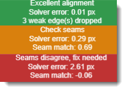
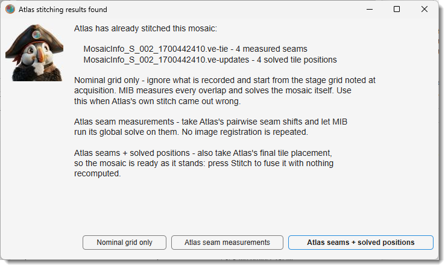

# Stitching

*Back to [MIB](../../../index.md) | [User interface](../../index.md) | [Ribbon](../index.md) | [Dataset](index.md)*

---

## Overview

{.on-glb align=right width="340"}

The Stitching tool assembles a collection of 2D/3D image tiles into a single large 
mosaic.

It starts from a **rough placement**:

- regular grid (including custom positioning)
- position file (TrakEM2, Fibics Atlas, SerialEM)
- filename pattern
- stage coordinates stored in the image metadata

then measures the **true overlap** between neighbouring tiles, finds a **globally consistent** position for every
tile, and **fuses** them into a new dataset.

3D tiles (Z-stacks) are supported: the within-layer (XY) and between-layer (Z) constraints are
solved together in one pass, not stitched in 2D and aligned afterwards.

Small mosaics are assembled in memory; larger ones can be streamed to an OME-Zarr file and opened
as a BigData dataset, or written straight out as ordinary TIF / PNG / Amira files.

<div class="clear-float"></div>

---

## The window at a glance

The dialog is arranged top to bottom in the order you work through it:

| Area | Contains |
|------|----------|
| **Header** | <span class="widget widget-dropdown">Layout source</span> - *how the tiles are arranged*. It governs the whole dialog, so it sits above everything else; the italic line under it explains the selected mode. |
| **Settings tabs** | One tab per question: <span class="widget widget-tab">Input tiles</span> (*which files*), <span class="widget widget-tab">Tile settings</span> (*how they are arranged*), <span class="widget widget-tab">Registration</span> (*how they are matched*). |
| **Output panel** | Layout preview on the left; output, blend and project settings on the right; underneath, the status line and the colour-coded alignment-quality chip. |
| **Action strip** | Always reachable: help, <span class="widget widget-button">Inspect and fix...</span>, <label class="widget widget-checkbox">Autocrop</label>, <span class="widget widget-button">Stitch</span>, <span class="widget widget-button">Close</span>. |

---

## The stitching pipeline

Stitching takes five steps, worked through top to bottom. On a familiar acquisition, set up the
first two and press <span class="widget widget-button">Stitch</span>. It performs every remaining
step by itself. On an unfamiliar one, run the steps individually so you can check each intermediate
result before committing to the next.

1. **Choose the layout source** *(header)* - state how the tiles are arranged: a regular
   <span class="widget widget-dropdown">Grid</span>, a
   <span class="widget widget-dropdown">Position file</span>, a
   <span class="widget widget-dropdown">Filename pattern</span>, or
   <span class="widget widget-dropdown">Bio-Formats metadata</span>. This decides which settings
   below are enabled, so it comes first.
   → [Layout source](#layout-source)

2. **Pick the tiles and preview** (use the <span class="widget widget-tab">Input tiles</span> tab, then <span class="widget widget-button">Preview layout</span>; 
   use the <span class="widget widget-tab">Tile settings</span> tab to tune the tile placement) -
   select the files, folders or position file, then draw the nominal arrangement as numbered
   rectangles. Check the grid size, tile order and overlap here, **before** any heavy computation.
   Tick <label class="widget widget-checkbox">Edit layout</label> to drag tiles into a better rough
   position by hand.
   → [Input tiles tab](#input-tiles-tab), [Tile settings tab](#tile-settings-tab)

3. **Measure overlaps** (<span class="widget widget-tab">Registration</span> tab) - for every neighbouring pair, the expected overlap is
   cut from both tiles and their *actual* displacement is measured. Each measurement gets a quality
   score from 0 to 1; anything below the threshold is marked invalid.
   → [Registration tab](#registration-tab)

4. **Optimize positions** (<span class="widget widget-tab">Registration</span> tab) - turns those *relative* measurements ("tile 5 sits
   342.7 px right of tile 4") into final positions. Rather than chaining tiles one after another,
   which accumulates drift, one global least-squares problem is solved over the whole tile graph:
   every valid measurement is an equation weighted by its quality. Tiles with no usable measurement
   stay near their nominal position. The preview then redraws at the **solved** positions and the
   result is rated by the alignment chip.
   → [Alignment quality](#alignment-quality)

5. **Stitch** *(action strip)* - fuses the tile pixels at the optimized positions, blending the
   overlaps, and opens the result as a new dataset (or writes it to disk).
   → [Output panel](#output-panel)

!!! tip "Steps can be skipped"
    A [Fibics Atlas mosaic](#fibics-atlas-mosaics) or a [SerialEM montage](#serialem-montages) can
    bring its own seam measurements and even its own solved placement, in which case steps 3 and 4
    are simply not needed. A [project file](#project-files) restores all of it.

---

## Alignment quality

{.off-glb align=right}

After a solve, the colour-coded chip under the preview rates the mosaic - **Excellent** (green) /
**Good** / **Fair** / **Poor** (red). It combines two independent checks, both spelled out in its
tooltip:

- the **solver residual** - how much the pairwise measurements still disagree at the solved
  positions (RMSE in pixels :material-information-outline:{.orange-color title="Root Mean Square Error: each measured seam offset is compared with the offset the solved positions imply, and the differences are averaged in quadrature. 0 px means every measurement is satisfied exactly" }).
  
??? info "Details"
    A residual can only appear where the seams form a **loop**:

    in a 2×2 mosaic you can walk 1 → 2 → 4 → 3 → 1, so those four measurements have to add up, and any one of them being wrong
    shows up as disagreement.

    A **single row or column** of tiles has no loop - each tile is held by
    one seam only, so every measurement can be honoured exactly and the residual reads ~0 no matter
    how wrong they are. On such layouts judge the mosaic by the pixel seam check below

- the **pixel seam check** - the overlap pixels are re-read at every solved seam and
  cross-correlated (the same score the [Stitching Inspector](dataset-stitch-inspector.md) ranks by).
  If the worst seam matches poorly the chip turns orange **Check seams** or red **Seams disagree**
  even when the residual looks perfect - the signature of a wrong layout orientation or a
  confidently-wrong measurement.

Two more verdicts you may meet:

- **Alignment incomplete** (orange) - some tile has *no* valid measurement at all, so neither check
  covers it and it is simply parked at its nominal position. Check the grid rows/cols, or fix its
  seams in the [Stitching Inspector](dataset-stitch-inspector.md).
- **Check Z alignment** (orange) - Z-stack tiles are scored slice by slice at the solved Z offset,
  and seams between Z-layers are re-scored at nearby offsets too. If the pixels prefer a different
  one, the inspector's readout names it (e.g. *pixels prefer dz+2*).

The chip keeps up with the [Stitching Inspector](dataset-stitch-inspector.md) while it is open, since
excluding a seam changes which seams the worst match is taken over.

??? tip "You do not have to press Re-solve"
    Fix a seam in the [Stitching Inspector](dataset-stitch-inspector.md) with *Auto re-solve*
    switched off and the chip turns to **Seams edited / Rating stale until re-solved / Re-solve now,
    or just Stitch**.

    This means the tiles have **not moved yet**. Your fix is stored, but the positions still come
    from the solve you ran before it, so the rating on display describes the *old* mosaic and is no
    longer trustworthy.

    You have two ways forward, and both are safe:

    - press <span class="widget widget-button">Re-solve</span> to apply the fix now and see the
      updated rating - useful while working through several seams, so you can watch each fix land;
    - or simply press <span class="widget widget-button">Stitch</span>.
      <span class="widget widget-button">Stitch</span> always applies a pending fix before fusing,
      so it can never build the mosaic from the old positions.

    Closing the Stitching Inspector does not cancel the pending fix: it belongs to the mosaic, not
    to that window, and the chip keeps warning until it is applied.

??? note "The pixel seam check can be cancelled"
    Scoring re-reads every overlap from disk, the slowest part of a solve on a large mosaic, so the
    **Scoring seams...** dialog has a <span class="widget widget-button">Cancel</span> button. The
    solve itself is finished and is kept; only the verification is skipped.

    Cancelling discards the partial scores rather than keeping them - the rating is the *worst*
    seam, so grading half of them would rate the mosaic on its better half. The chip then reads
    **Seam match: not checked** and rests on the residual alone. Run
    <span class="widget widget-button">Optimize positions</span> again, or open the Stitching Inspector,
    to get the check back.

    Conversely the check runs **once per placement**: opening the inspector right after a solve,
    after importing a vendor stitch, or after loading a project reuses the scores. It re-runs when
    the tiles move, when the edge set changes, or when
    <span class="widget widget-dropdown">Intensity correction</span> changes.

---

## When automatic stitching fails: Inspect & fix

Automatic stitching can fail *silently*: a measurement that locked onto repetitive content one
period off satisfies the solver perfectly, so the rating stays green while a tile sits a full
period out of place.

<span class="widget widget-button">Inspect and fix...</span> (enabled after *Measure overlaps* +
*Optimize positions*) opens the **Stitching Inspector**, which re-reads the actual pixels at every solved
seam, ranks the seams worst-first, and lets you correct the bad ones by clicking a landmark,
dragging the overlay, or matching two points. Both windows stay usable side by side.

[**→ Stitching Inspector: reviewing and fixing seams**](dataset-stitch-inspector.md)

---

## Layout source

{.off-glb align=right}

The <span class="widget widget-dropdown">Layout source</span> dropdown states **how the tiles are
arranged**. Switching it re-enables the relevant settings on the *Tile settings* tab, rebuilds the
layout, and updates the italic summary line underneath.

<div class="clear-float"></div>

=== "Grid"

    Tiles form a regular grid. Set rows, columns, acquisition order and overlap on the
    [*Tile settings* tab](#tile-settings-tab).

    Tiles are matched to grid cells by **natural-sorted filename**, in the acquisition order you
    pick, so the file names only have to sort correctly.

=== "Position file"

    **A file that says where every tile goes.** Three kinds qualify, told apart by extension:

    - a **TrakEM2 position file** - one line per tile, `filename X Y` or `filename X Y Z` - see
      [TrakEM2 position files](#trakem2-position-files);
    - a **Fibics Atlas mosaic** (`MosaicInfo_<name>.ve-mif`) - see
      [Fibics Atlas mosaics](#fibics-atlas-mosaics);
    - a **SerialEM montage** (`<name>.mrc.mdoc`) - see [SerialEM montages](#serialem-montages).

    The latter two can bring their own finished stitch with them.

=== "Filename pattern"

    Grid indices are parsed from `Z##`, `X##` and `Y##` tokens in the file (or, for folder tiles,
    the **folder**) names, *e.g.* `myStack_Z01-X02-Y03.tif` → Z-layer 1, column 2, row 3.
    **The order of the three tokens does not matter.**

    Set the overlap on the [*Tile settings* tab](#tile-settings-tab) - or tick
    <label class="widget widget-checkbox">Estimate overlap</label> - and the tiles are registered
    exactly like the Grid source.

    ??? note "What the tokens must look like"
        Each token is located **independently**, so their order and the separators are irrelevant -
        `myStack_Z01-X02-Y03`, `myStack_X02-Y03-Z01` and `myStackY03X02Z01` all describe the same
        tile. The same rules apply to **folder** names when
        <span class="widget widget-checkbox">Tiles are folders</span> is on.

        What does matter:

        - [x] each token is an **upper-case** `Z`, `X` or `Y` followed by **exactly two digits** -
          `Z01`, not `Z1` and not `z01`;
        - [x] indices are **1-based**: the first tile is `Z01-X01-Y01`;
        - [x] the **last** `Z`, `X` and `Y` in the name are taken as the tokens, so those letters
          may appear *before* them (`XYZstack_Z01-X01-Y01` is fine) but not *after*;
        - [x] all three must be present. Tiles named some other way (`tile_r1c1`, `tile_r1c2`, …)
          must use **Grid** instead.

    ??? warning "Tokens longer than two digits are silently truncated"
        **Only two characters after each letter are read.** A three-digit token such as
        `Z001-X002-Y003` parses as `Z=00, X=00, Y=00` - **without any error** - so every tile
        lands in the same invalid cell and the preview shows them all piled up.

        Acquisitions with more than 99 tiles along an axis must be renamed to two-digit tokens, or
        arranged with **Grid** or **Position file**. A one-digit token (`Z1`) fails outright.

=== "Bio-Formats metadata"

    Tile positions are read from the **stage coordinates embedded in the image metadata** (OME
    `Plane PositionX/Y/Z`) - no manual arrangement needed.

    Point it at one multi-series file (each series is a tile) or at several single-tile files; the
    recorded positions become the nominal layout, converted from **micrometres** to pixels via the
    stored pixel size. Distinct stage-Z values are placed on separate layers and jointly solved.

### TrakEM2 position files

This is the plain-text format used by
[TrakEM2](https://syn.mrc-lmb.cam.ac.uk/acardona/INI-2008-2011/trakem2_manual.html)'s *Import images
as listed in a text file*, so a file written for TrakEM2 can be fed to MIB unchanged, and vice
versa. **One line per tile**, `filename X Y Z`, separated by spaces, tabs or commas:

```text
Image1.tif 0 0 30
Image2.tif 2048 0 30
Image3.tif 4096 0 30
```

`Z` selects the layer the tile belongs to; layers are created as needed. MIB adds two conveniences
on top of the format: the **Z column may be omitted** (`filename X Y`, everything on one layer), and
**comment lines** starting with `#` or `%` are ignored.

**The coordinates are in pixels, not micrometres** - this is the part that trips people up. The file
says where each tile sits **in the mosaic image**: above, `Image2.tif` sits 2048 pixels to the right
of `Image1.tif`, so its X is written `2048` - whatever the stage travelled in µm to get there.

| Column | Unit | Meaning |
|--------|------|---------|
| `X` | **pixels** | horizontal offset of the tile's **top-left corner**; increases to the **right** |
| `Y` | **pixels** | vertical offset of the top-left corner; increases **downward** (image convention, not a plot axis) |
| `Z` *(optional)* | **slices** | index of the slice the tile starts at - a whole-number slice count, **not** a µm depth |

Coordinates are **0-based** (the top-left tile is at `0 0`) and may be fractional (`130.5`).

??? tip "If your coordinates are in micrometres"
    Divide by the pixel size before writing the file (`X_px = X_µm / pixelSizeX_µm`) - or skip the
    file entirely and use the **Bio-Formats metadata** source, which reads the µm stage coordinates
    from the images and does that conversion for you.

    Either way the positions only need to be **roughly** right: they are the starting guess that
    *Measure overlaps* and *Optimize positions* refine. Errors of a few tens of pixels are normal; a
    systematically wrong overlap is not.

??? example "Three example files"
    **A 2×2 mosaic of 512×512 tiles with ~20 % overlap** (step = 512 × 0.8 ≈ 410 px):

    ```text
    # tile               X     Y
    tiles/tile_01.tif      0     0
    tiles/tile_02.tif    410     0
    tiles/tile_03.tif      0   410
    tiles/tile_04.tif    410   410
    ```

    **The same mosaic on two Z-layers**, each 40 slices thick with an 8-slice overlap - the tiles
    here are **folders**, one Z-stack each:

    ```text
    # tile folder          X     Y     Z
    stacks/tile_01_L1      0     0     0
    stacks/tile_02_L1    410     0     0
    stacks/tile_01_L2      0     0    32
    stacks/tile_02_L2    410     0    32
    ```

    **Comma-separated, with absolute paths and a filename containing spaces:**

    ```text
    D:\data\scan 1\tile A.tif, 0, 0
    D:\data\scan 1\tile B.tif, 410, 0
    ```

??? note "Rules the parser applies"
    - [x] **One tile per line**, at least 3 columns; shorter lines are skipped with a warning.
    - [x] The **delimiter is auto-detected from the first data line**: comma if present, otherwise
      tab, otherwise runs of whitespace. Filenames with spaces therefore need the comma or tab form.
    - [x] Lines that are empty or start with `#` or `%` are **comments** - the header lines in the
      examples above are optional documentation, not parsed column names.
    - [x] `filename` may be **relative** to the position file's folder, or absolute.
    - [x] `filename` may name a **single image or a folder** holding that tile's Z-stack, detected
      per entry, so the two can be mixed. The
      <label class="widget widget-checkbox">Tiles are folders (Z-stacks)</label> checkbox is
      therefore not needed (and is disabled) for this source.
    - [x] Each **distinct `Z` value becomes one layer**, numbered in ascending order. Omitting the
      column puts every tile on one layer.
    - [x] Tiles may be listed in **any order** - the file states the positions explicitly.

### Fibics Atlas mosaics

Mosaics acquired with **Fibics Atlas** (Zeiss SEM / FIB-SEM) need no position file of their own:
point <span class="widget widget-button">Pick tiles</span> at the mosaic's
`MosaicInfo_<name>.ve-mif` and the tile list, grid indices and stage positions are read from it.

The `.ve-mif` is the **only** Atlas file the picker offers, because it is the only one you have to
choose. If Atlas has **already stitched** the mosaic, its result sits in two more files beside it,
and MIB finds them itself and offers to reuse them:

{.on-glb align=right width="300"}

- <span class="widget widget-button">Nominal grid only</span> - ignore both and start from the
  stage grid; MIB measures and solves everything itself.
- <span class="widget widget-button">Atlas seam measurements</span> - take the `.ve-tie` shifts and
  let MIB run its global solve on them. **No image registration is repeated.**
- <span class="widget widget-button">Atlas seams + solved positions</span> - also take the
  `.ve-updates` placement, so the mosaic is ready as it stands: press
  <span class="widget widget-button">Stitch</span> and **nothing is recomputed**.

??? note "The three Atlas files, and what MIB does with each"
    Atlas writes up to three XML files sharing one base name. Only the first always exists; the
    other two appear once the mosaic has been stitched in Atlas.

    | File | Atlas writes | MIB reads it as |
    |------|--------------|-----------------|
    | `MosaicInfo_<name>.ve-mif` | The **acquisition record**: every tile's `row`/`col`, its target and achieved **stage position in µm**, tile size, field of view, pixel size and nominal overlap. | The **rough placement** - the position text file's role. |
    | `MosaicInfo_<name>.ve-tie` | The **pairwise seam measurements**: per overlapping pair, where the shared strip sits in both tiles, the measured shift, a confidence, and whether a person placed it by hand. | The **measured seams** - MIB's own *Measure overlaps* result, so that step can be skipped. |
    | `MosaicInfo_<name>.ve-updates` | The **final solved placement**: one transform per tile. | The **solved positions** - MIB's *Optimize positions* result, so that step can be skipped too. |

    Two files usually beside them are **not** used: `StageStitchedOverview_<name>.jpg` (a preview of
    the *unrefined* stage mosaic) and `ServerNotifications.log`.

    The tile paths inside the XML are the **acquisition machine's** (`E:\...`), which rarely exist
    where the data is analysed, so MIB looks each tile up **by file name in the `.ve-mif`'s
    folder** - a mosaic folder works wherever it was copied to.

    One `.ve-mif` describes **one mosaic** (one section) and is stitched as a single layer.

??? tip "When to pick *Nominal grid only*"
    **Use it when the Atlas stitch itself came out wrong.** Atlas builds its stitch on top of the
    stage coordinates, and under some imaging conditions those do not say where the tiles really
    overlap - so the result is misaligned even though the tiles themselves would stitch perfectly.
    Importing that stitch would only inherit the problem.

    This mode ignores both sidecar files and lets MIB find the overlaps in the images instead. The
    tiles are good; only Atlas's placement of them was not.

    Bear in mind that the stage grid is **never** more than a starting guess, whichever mode you
    choose - in the sample data this was developed against it is ~30 px out in Y, which Atlas's own
    seam measurements confirm.

!!! info "How an imported stitch is checked"
    An imported placement is not taken on trust: MIB re-reads the overlap pixels at Atlas's
    positions and scores every seam, so the [alignment chip](#alignment-quality) rates it exactly as
    it rates a MIB solve, and turns orange or red if the seams disagree.

    Seams Atlas records as hand-placed (`<User>true</User>`) are imported as **user** seams, so they
    carry the same weight as your own fixes in the
    [Stitching Inspector](dataset-stitch-inspector.md) and survive a re-measure.

### SerialEM montages

Montages acquired with **SerialEM** (transmission EM) also need no position file. A montage is
**two files**: an MRC stack in which every tile is a **slice**, and a plain-text `.mdoc` beside it
saying where those slices go. Point <span class="widget widget-button">Pick tiles</span> at the
**`.mdoc`** - it names its image, so the stack is found automatically.

The `.mdoc` is the **only** SerialEM file the picker offers, for the same reason only the `.ve-mif`
is offered for Atlas: the stack alone says nothing about where its slices go. Point MIB at a bare
`.mrc` with no `.mdoc` and it says so rather than failing later.

Exactly as for Atlas, when measured seams or solved positions are present MIB lists them and asks
how much to take - <span class="widget widget-button">Nominal grid only</span>,
<span class="widget widget-button">SerialEM seam measurements</span>, or
<span class="widget widget-button">SerialEM seams + solved positions</span> - and verifies the
imported placement against the overlap pixels the same way.

??? note "The tiles are slices, not files"
    Every other layout source expects one file (or folder) per tile. Here the whole montage is a
    single `.mrc` and MIB reads the individual slices out of it directly - including the small
    overlap crops used during measurement, so nothing decodes a full tile it does not need. Nothing
    has to be unpacked beforehand.

    Float and signed-integer stacks are converted to `uint16` using the range recorded in the **file
    header**, so every tile lands on **one intensity scale**.

??? note "What MIB reads from the `.mdoc`"
    A montage `.mdoc` records three successive stages of the same stitch, one block per slice. The
    last two appear only once the montage has been stitched (in SerialEM or by IMOD's *blendmont*).

    | Key | SerialEM writes | MIB reads it as |
    |-----|-----------------|-----------------|
    | `PieceCoordinates` | The **nominal position** of each piece, in pixels. | The **rough placement**. |
    | `XedgeDxy` / `YedgeDxy` | The **measured shift** of each seam, one entry per piece for its neighbours at higher X and Y. | The **measured seams**, so *Measure overlaps* can be skipped. |
    | `AlignedPieceCoords` | The **final solved position** of each piece. | The **solved positions**, so *Optimize positions* can be skipped too. |

    The montage frame's Y axis runs **upward** while image rows run downward, so MIB mirrors it on
    the way in; the tiles come out oriented like SerialEM's own stitched output.

    `AlignedPieceCoords` are whole pixels, so re-solving from the imported seams can differ from the
    recorded placement by up to half a pixel. That is rounding in the file, not a disagreement.

    SerialEM writes the same format for **tilt series**, which have no `PieceCoordinates` and are
    not montages; MIB says so rather than trying to stitch them.

!!! tip "Uneven illumination is a separate problem"
    In TEM the beam shape makes each tile brighter on one side than the other, leaving visible steps
    at the seams **even when the tiles are aligned perfectly**. Aligning the montage does not fix
    that - [Intensity correction](#intensity-correction) does.

---

## Input tiles tab

{.off-glb }

Select the image files or folders to stitch.

<div class="clear-float"></div>

- <span class="widget widget-button">Pick tiles</span>: opens the file or folder selection dialog.
  Use ++ctrl++ + <mouse class="left"></mouse> or ++shift++ + <mouse class="left"></mouse> to select
  several.
- <label class="widget widget-checkbox">Tiles are folders (Z-stacks)</label>: each tile is a
  **folder of slice images** rather than a single image file. This is orthogonal to the layout
  source - it changes only how each tile is *provided*, not how tiles are *arranged*. It applies to
  **Grid** and **Filename pattern**, and is disabled for the other sources, which already know:
  a position file detects folders per entry, an Atlas `.ve-mif` names its tile files, a SerialEM
  `.mdoc` reads slices out of one stack, and Bio-Formats series carry their own stacks.
- <span class="widget widget-edit">Input tiles</span>: the selection, **one path per row** - tile
  files, tile folders, the position file / `.ve-mif` / `.mdoc`, or the Bio-Formats file(s). It is
  only a display of what *Pick tiles* selected; selection order does not matter, since tiles are
  natural-sorted by name. For *Grid* and *Filename pattern* a single folder path also works - every
  image in it becomes a tile - which is the form batch protocols normally use.

---

## Tile settings tab

{.off-glb }

<div class="clear-float"></div>


How the selected tiles are laid out. Rows / Cols / Tile order apply to **Grid**; Overlap X/Y and
**Estimate overlap** apply to **Grid** and **Filename pattern**. The **Position file** and
**Bio-Formats metadata** sources state every position explicitly, so none of these apply to them -
settings that do not apply are disabled rather than hidden, so the tab always shows the full
picture. Any change rebuilds the layout and refreshes the preview immediately.

- <span class="widget widget-dropdown">Tile order</span>: the acquisition order, which defines how
  the natural-sorted filenames map onto grid cells
    - **Horizontal**: left→right, row by row.
    - **Horizontal snake**: left→right, then right→left on the next row.
    - **Vertical**: top→bottom, column by column.
    - **Vertical snake**: top→bottom, then bottom→top on the next column.
- <span class="widget widget-edit">Rows</span> / <span class="widget widget-edit">Cols</span>: grid
  dimensions. `0` derives the value from the number of tiles - the closest-to-square arrangement
  that tiles the count *exactly*, so there are no phantom holes - oriented by the *Tile order*: a
  Horizontal order gives the wide arrangement (3 tiles → 1×3, 12 → 3×4), a Vertical order the tall
  one (3 → 3×1, 12 → 4×3). For an intentionally incomplete grid (11 tiles of a 3×4 acquisition)
  enter the values explicitly.
- <span class="widget widget-edit">Overlap X</span> / <span class="widget widget-edit">Overlap Y</span>:
  nominal overlap between adjacent tiles, in percent of tile size (0-90). While
  <label class="widget widget-checkbox">Estimate overlap</label> is on, these are disabled and act
  as a read-only display of the estimated values.
- <label class="widget widget-checkbox">Estimate overlap</label>: determine the actual overlap from
  the images before measuring (*recommended, on by default*). Sampled neighbour pairs are registered
  by unrestricted whole-tile phase correlation with cross-correlation verification of the candidate
  peaks; the median over all pairs gives a robust estimate of the real grid step even when some
  pairs fail.

!!! tip
    With <label class="widget widget-checkbox">Estimate overlap</label> on, the entered overlap
    barely matters - any rough guess will do. Without it, the value must be accurate to within a few
    percent: the measurement stage tolerates tile jitter of tens of pixels around the nominal
    placement, but not a systematically wrong overlap.

---

## Registration tab

{.off-glb }

<div class="clear-float"></div>

How overlapping tiles are matched - and, at the bottom of the tab, the two buttons that use these
settings: <span class="widget widget-button">Measure overlaps</span> and
<span class="widget widget-button">Optimize positions</span>. Changing a setting here invalidates
the existing measurements, so re-run both afterwards.

- <span class="widget widget-dropdown">Transform type</span>: the geometric model solved per tile
    - **Translation** (*default*): tiles only shift - the right model for stage-tiled acquisitions,
      where the stage moves but does not rotate. Tiles are placed without resampling, preserving the
      original pixel values exactly.
    - **Rigid**: shift + rotation, no scale change.
    - **Similarity**: shift + rotation + one uniform scale per tile.
    - **Affine**: the full linear model - rotation, scale and shear per tile.

??? note "What the non-translation models imply"
    - **Measurement**: they all need image features, so they always use the feature-based estimator;
      the <span class="widget widget-dropdown">Registration method</span> dropdown is disabled and
      shows *Feature-based*.
    - **Fusion**: tiles are **resampled** (bilinear), unlike *Translation*, which copies the
      original pixels unchanged.
    - **3D layouts**: the transform acts **in-plane** - every slice of a Z-stack tile is warped by
      that tile's single 2D transform, while Z stays translational.
    - **Cost**: the richer models are not slower. The global solve is always the (linear) affine
      one; *Rigid* and *Similarity* are projections of that result onto the smaller model.

- <label class="widget widget-checkbox">Allow rotation</label> *(non-translation models only)*:
  **the single "are the tiles rotated?" switch** - it both permits per-tile rotation in the solve and
  switches feature matching to rotation-invariant descriptors, so the two can never disagree.
  **Off by default** - microscope stages translate but do not rotate, and with rotation locked a few
  noisy measurements cannot inject small spurious rotations that compound across a large mosaic.
  Leave it off for stage-tiled data even with Similarity/Affine (you still get scale/shear); tick it
  only when the tiles are genuinely rotated against each other. With rotation off, *Rigid* is
  equivalent to *Translation*.
- <span class="widget widget-dropdown">Registration method</span>: how each overlap is measured
    - **Phase correlation** (*default*): FFT phase correlation on the overlap strip. Best for the
      normal case - small-to-moderate overlaps with modest jitter - and robust on low-contrast
      content where feature detectors find nothing.
    - **Feature-based**: detects and matches keypoints over the **whole tiles** and RANSAC-fits the
      transform. Use it when the initial positions are badly wrong or unknown, where the
      phase-correlation search (which only looks near the nominal position) misses the true offset.
      Its weakness is feature-poor or strongly repetitive content.
- <span class="widget widget-dropdown">Feature detector</span> *(Feature-based only)*: the same
  eight choices as the [Alignment](dataset-alignment.md) tool (SURF, SIFT, MSER, Harris, BRISK,
  FAST, Minimum Eigenvalue, ORB). SURF is a good default for microscopy blobs.
- :octicons-gear-16: *(right of the detector dropdown; Feature-based only)*: tune the detector's
  parameters, the detection **downsampling factor** (1 = full resolution; higher is faster but less
  precise), and the RANSAC (`estgeotform2d`) trials / confidence / max-distance. It is the Alignment
  tool's dialog minus its rotation row - here that belongs to
  <label class="widget widget-checkbox">Allow rotation</label>.

??? note "How *Allow rotation* works"
    Matching a rotated tile takes two things, and the one checkbox sets both: **finding** the match
    (keypoints described either *upright* - faster and more distinctive - or *rotation-invariant*,
    each keypoint's own orientation measured first) and **fitting** it (whether the solved transform
    may contain a rotation). Finding comes first, which is why they are one switch: permitting a
    rotation you cannot match would achieve nothing.

    Measured on a synthetic rotated pair (SURF, RANSAC inliers):

    | Rotation between tiles | 5° | 10° | 15° | 20° | 25° | 45° |
    |---|---:|---:|---:|---:|---:|---:|
    | Allow rotation **off** (upright) | 470 | 294 | 62 | 9 | **0** | **0** |
    | Allow rotation **on** (invariant) | 350 | 305 | 267 | 258 | 249 | 200 |

    Upright descriptors cope with a few degrees of accidental tilt on their own, so leaving the box
    unticked is safe for ordinary stage-tiled data - but past roughly 20° they stop matching
    altogether. Rotation-invariant matching costs some inliers at small angles (470 → 350 at 5°)
    without hurting the fit, which is what makes coupling the two settings free.

    *ORB* describes keypoints with their orientation regardless, so for it the checkbox only affects
    the solved model.

!!! tip
    Keep **Phase correlation** for tidy grid/position-file acquisitions. Switch to **Feature-based**
    when the alignment comes out *Poor* with large residuals and you suspect the tiles are far from
    their nominal positions.

- <span class="widget widget-edit">Quality threshold</span>: minimum quality score (0-1, default
  0.30) to accept a measurement. Increase it when wrong matches slip through (repetitive patterns);
  decrease it for low-contrast data where valid overlaps score low.
- <span class="widget widget-edit">Nominal position weight</span>: how strongly tiles with weak or
  rejected measurements are pulled back toward their nominal positions (0-1, default 0.10). With `0`
  such tiles are positioned only through their other, valid measurements.
- <label class="widget widget-checkbox">Sub-pixel placement</label>: refine each pairwise
  **measurement** to sub-pixel precision with a parabolic fit to the correlation peak. Off by
  default.

    ??? note "What it does and does not affect"
        Despite the label, this controls the **measurement** step, not where tiles finally land.
        *Placement* is always rounded to whole pixels: every tile gets an integer origin and the
        discarded fraction is kept as a per-tile *sub-pixel residual* in the project file (the fuse
        step does not resample by it yet). Enabling it therefore sharpens the shifts that feed the
        global solve - useful when many small overlaps each carry a fraction of a pixel that
        accumulates across a large grid.

---

## Output panel

{.off-glb }

<div class="clear-float"></div>

Below the tabs and visible whichever tab is open: the **layout preview** on the left, the output and
project settings on the right, and two readouts underneath - the **status line**, saying how far
through the pipeline you are, and the [alignment-quality chip](#alignment-quality).

??? tip "Edit layout: rough placement by hand"
    Ticking <label class="widget widget-checkbox">Edit layout</label> turns each tile in the preview
    into a draggable rectangle (fixed size, position only). Every move writes that tile's new
    nominal position and clears the previous measurements, so the next *Measure overlaps* /
    *Optimize positions* start from the corrected layout. Untick to return to the static view, which
    shows the **solved** positions whenever a solve exists (the title states which).

- <span class="widget widget-dropdown">Blend mode</span> - how pixels are combined where tiles
  overlap - see [Blend modes](#blend-modes).
- <span class="widget widget-dropdown">Intensity correction</span> - even out tile brightness
  *before* anything reads a pixel - see [Intensity correction](#intensity-correction).
- <span class="widget widget-dropdown">Canvas color</span> - what pixels no tile covers are filled
  with - see [Canvas color](#canvas-color).
- <span class="widget widget-dropdown">Output mode</span>:
    - **In memory**: assembled in RAM and replaces the current dataset. For mosaics that comfortably
      fit into memory.
    - **OME-Zarr3 (BigData)**: streamed chunk-by-chunk to an OME-Zarr v3 file and opened as a
      BigData dataset. For mosaics of any size.
    - **Image files**: written as ordinary TIF / PNG / Amira files - see
      [Image file output](#image-file-output). For results that must be read by software that does
      not know OME-Zarr.
- <span class="widget widget-edit">Output path</span> - destination of the OME-Zarr3 store or the
  image files. Enabled in both disk-writing modes, ignored by **In memory**. Press the browse button
  beside it to choose the path - in **Image files** mode that dialog is also where the format is
  picked.
- <label class="widget widget-checkbox">Save project JSON</label> - after stitching, save a
  [project sidecar](#project-files) next to the input tiles.

??? info "What the stitched dataset is called, and what it measures in"
    The dataset is named after what it was built from, with a `_stitch` suffix and a `.tif`
    extension - `Cell1.mrc.mdoc` becomes `Cell1_stitch.tif`, and a grid of tiles is named after its
    first tile. The name points at the **source folder**, so
    <span class="widget widget-button">Save as</span> opens beside the tiles rather than wherever
    MATLAB's working folder happens to be.

    The **pixel size** is carried over whenever the layout source records one - a SerialEM `.mdoc`
    (`PixelSpacing`), a Fibics Atlas `.ve-mif`, or Bio-Formats metadata. Sources that are only a
    folder of images (Grid, Filename pattern, MIB position file) have nothing to read and get the
    default 1 µm; set it afterwards with [Dataset → Parameters](index.md). A montage is a single
    section and none of these formats state a thickness, so the Z size is set to the in-plane size
    rather than invented.

??? info "Pyramid settings dialog (OME-Zarr3 only)"
    Pressing <span class="widget widget-button">Stitch</span> in **OME-Zarr3 (BigData)** mode shows
    the same **Export to Zarr3** dialog as the standard dataset→OME-Zarr export, so the streamed
    mosaic is written as a proper multi-resolution pyramid: **pyramid levels** (`0` = auto: add
    levels while `min(Y,X)/2 ≥ 256 px`, up to 8), **chunk size** and **shard factors** `[Y, X, Z]`,
    **compression** (`zstd` / `gzip` / `none`), and the **downsampling** method and strategy
    (`XY only`, or `Anisotropy-preserving` for anisotropic 3D stacks).

    Defaults are seeded from the mosaic's dimensions and voxel size, and the choice is remembered
    for the current output path, so re-fusing after a
    [Stitching Inspector](dataset-stitch-inspector.md) fix reuses it. Batch runs skip the dialog.

### Blend modes

How pixel values are combined where tiles overlap. This is the **last** step, and it only decides how
the overlap is mixed - it can neither improve a bad alignment nor even out uneven illumination.

| Mode | What it does | Use it when |
|------|--------------|-------------|
| **Overwrite** *(default)* | The last tile written wins; no mixing at all. With **Re-exposure damage** correction, the tile imaged first wins. Either can be changed per tile in the [seam inspector](dataset-stitch-inspector.md#tile-order). | **Almost always.** It is the only mode that keeps the overlap as sharp as the tiles themselves - see below - and every misalignment stays visible as a hard broken edge. The price is that the changeover may show as a line. |
| **Feather** | Weighted average, each tile's weight fading to zero at its own border, so one tile takes over gradually. | A seam **line** bothers you more than a soft band does - typically when tile brightness still disagrees. It is the only mode that spreads a residual brightness step out instead of drawing it. |
| **Average** | Plain mean of every tile covering the pixel. | You want the overlap's noise averaged down and the tiles already match in brightness. Costs the same sharpness Feather does, and any brightness step shows as a hard line at the overlap *edges* rather than being spread out. |
| **Max** | The brightest tile wins. | Dark artefacts sit in one tile only - a shadow, a beam-damaged corner, debris. |
| **Min** | The darkest tile wins. | The mirror case: bright artefacts in one tile only - a hot spot, a reflection, a charged patch. |

??? tip "Why Overwrite is the default"
    **Because averaging the overlap costs resolution exactly where the optics are already worst.**

    Image quality falls off towards the edge of the field: spherical aberration and field curvature
    leave the periphery of every tile softer than its centre. A seam is built from precisely those
    two peripheries. Any mode that mixes - **Feather**, **Average** - therefore averages two
    already-degraded versions of the same structure, and whatever sub-pixel misregistration remains
    between them softens it further. What you see is a blurred band the full width of the overlap,
    repeated at every seam.

    **Overwrite** takes one tile's pixels outright. Nothing is averaged, so the overlap keeps the
    sharpness that tile had; the cost is that the changeover from one tile to the next can show as a
    line.

    A second reason to start here: mixing also *softens a misalignment*, the one thing that has to
    stay visible while you are still judging whether the stitch worked.

    If a seam line does show, treat it as a brightness problem before reaching for **Feather** -
    [Intensity correction](#intensity-correction) removes the cause, whereas Feather only smears it
    across the overlap and takes the sharpness with it.

??? warning "Blending hides a brightness step; it does not remove it"
    If neighbouring tiles genuinely disagree in brightness, **Feather** spreads that disagreement
    over the width of the overlap instead of leaving a line - fainter, but still there, and now a
    gradient across real image content. Fix the cause with
    [Intensity correction](#intensity-correction) first.

??? note "Max and Min need a background, not just a bright/dark rule"
    Both compare only the tiles that actually cover a pixel; empty canvas never wins. Without that,
    a zero background would beat every real value under **Min**.

### Intensity correction

Blending hides a seam; it cannot remove one. This dropdown fixes the cause instead.

- **None** *(default)* - use the pixels as they are. Costs nothing.
- **Flat-field (shared)** - estimate one illumination field by averaging all the tiles, and divide
  it out. Fast and simple, but see the caveat below.
- **Flat-field (overlap-solved)** - estimate the same kind of field, but fit it to the
  **disagreement where tiles overlap** rather than to their average. **Use this one if seams still
  show.**
- **Match tile means** - scale each tile so they all share one mean. For a **detector or stain that
  drifts** over a long acquisition, where the tiles really do differ by a flat factor. It does *not*
  fix uneven illumination.
- **Re-exposure damage** - for **beam-sensitive samples**, where an area imaged a second time comes
  out darker. Removes that darkening from the tile acquired later, including the darker line just
  past the earlier tile's edge.

The correction is applied wherever the tool reads a tile, so the seams are measured, scored and
fused on the same pixels - the alignment rating always describes the mosaic you actually get. It is
computed once and reused for the rest of the run.

??? tip "Which one to pick"
    Measured on a 3×3 TEM montage, as average brightness mismatch across the 12 seams (lower is
    better):

    | | mismatch | worst seam |
    |---|---|---|
    | None | 7.50 % | 11.00 % |
    | Match tile means | 6.73 % | 11.31 % |
    | Flat-field (shared) | 2.31 % | 4.35 % |
    | **Flat-field (overlap-solved)** | **1.01 %** | **1.40 %** |

    Start with **Flat-field (overlap-solved)**. **Match tile means** barely helped here because the
    tiles' *overall* brightnesses already agreed to 0.16 % - the gradient lives **inside** each
    tile, so at a vertical seam one tile's dark right edge meets its neighbour's bright left edge.

    Do **not** stack them: flat-field plus mean matching came out *worse* than flat-field alone,
    because tiles genuinely contain different amounts of material and forcing their means together
    fights real signal.

??? note "Why overlap-solved is the more reliable of the two flat-fields"
    **Shared** works out what the tiles have in common and calls that illumination - sound only when
    there are many tiles at modest overlap, each showing different specimen. If your sample has a
    broad brightness trend of its own, the method cannot tell that from the beam, so it removes some
    of your sample and leaves some of the beam. With few, heavily-overlapping tiles it can come out
    *worse* than uncorrected (a 3×3 at 10 % overlap is fine; a 2×2 at 33 % is not).

    **Overlap-solved** has no such failure: where two tiles overlap they image the *same* specimen,
    so anything that differs there is the instrument - the sample cancels out exactly, whatever it
    looks like. It reads only the overlap strips.

    **How flexible a shape to fit is decided from your data, not fixed in advance.** MIB tries
    several and keeps the simplest one that predicts seams it was not fitted on, then checks that
    the tile centre still agrees with the borders, and declines to correct at all rather than guess
    if it cannot vouch for the result. Nothing here needs tuning, which is why this method is
    recommended: it has no hand-set shape parameter, unlike **Flat-field (shared)**.

??? note "The mosaic is levelled as well as the tiles"
    Matching every seam does not by itself make a montage evenly lit. Once each tile's internal
    gradient is divided out, whatever remains between whole tiles turns the mosaic into a smooth
    **staircase** - and the eye reads a gradual gradient as "unevenly lit" far more readily than the
    repeating sawtooth it replaced. Across three TEM montages, correcting the tiles alone made the
    overall ramp *worse* than doing nothing:

    | montage | uncorrected | tiles corrected | + levelled |
    |---|---|---|---|
    | A | +4.9 % | **+9.2 %** | +0.5 % |
    | B | +0.5 % | +3.2 % | +0.3 % |
    | C | +2.3 % | +4.4 % | +0.1 % |

    So **Flat-field (overlap-solved)** finishes by flattening the mosaic's overall brightness plane.
    This is free: it uses the one direction seam measurements genuinely cannot see, so the seam
    residual is unchanged to the last digit. A *genuine* broad trend across the specimen is levelled
    too - nothing can distinguish the two, and a montage shading from one side to the other reads as
    an artefact either way.

??? tip "Recognising re-exposure damage"
    The tile acquired second shows a **darker band exactly as wide as the overlap**, often with an
    even darker line just beyond it, and grid corners imaged three or four times are darkest of all.
    The tile acquired first looks normal in the same place. The flat-field methods cannot remove
    this: it is a sharp-edged patch in one tile, not shading shared by all of them.

    Choose **Re-exposure damage**. MIB works out from the images which tile of each overlap was
    imaged second, so the acquisition order does not need to be entered. The correction is placed
    at the solved positions: <span class="widget widget-button">Measure overlaps</span> still sees
    the raw pixels, and the seams are rated and fused on corrected ones. If no overlap is darker on
    one side, the tiles are left unchanged.

    Keep <span class="widget widget-dropdown">Blend mode</span> = **Overwrite**. With this correction
    it puts the tile imaged **first** on top, so every overlap shows the undamaged copy of the
    specimen; the [seam inspector](dataset-stitch-inspector.md#tile-order) can change that per tile. The correction evens out the brightness of the damaged copy, but it cannot restore
    detail the beam destroyed. Only the darker line just past the edge is taken from the damaged
    tile, because no other tile covers it.

??? failure "If you see a grid of darker bands along the seams"
    That is the tile *centres* being brightened too much, not the seams being darkened - the
    signature of an illumination field allowed to bend where nothing measures it. MIB guards against
    this and will refuse rather than produce it, so if you still see it on some dataset, report it.

??? failure "If one side of the montage is darker than the other"
    Check the seams first, with <span class="widget widget-dropdown">Blend mode</span> =
    **Overwrite** (the default), which draws every seam as a hard edge with nothing smoothing it. If
    the individual seams are clean and only the *overall* brightness drifts, that is the mosaic
    plane and **Flat-field (overlap-solved)** removes it. If the seams themselves still step, the
    correction has not taken - try that method if you were on another one.

### Canvas color

Tiles never fill the output rectangle exactly: the solve moves each of them a few pixels, so the
outer tiles end up staggered and the mosaic carries a **ragged frame** of uncovered pixels. This
dropdown decides what colour that frame is:

- **white** *(default)*: the highest intensity the image class can hold (255 for 8-bit, 65535 for
  16-bit). On transmission EM an empty field *is* bright, so this reads as more empty resin rather
  than a black border drawn around the specimen.
- **black**: zero, the usual background for fluorescence and other light microscopy.

The colour also fills any gap *inside* the mosaic - a tile that failed to load, or a deliberately
incomplete acquisition.

??? tip "Or remove the frame instead of colouring it"
    <label class="widget widget-checkbox">Autocrop</label> in the [action strip](#action-strip) cuts
    the frame off altogether. Interior gaps stay whatever colour is chosen here, so the two settings
    are not alternatives.

### Image file output

With <span class="widget widget-dropdown">Output mode</span> = **Image files** the mosaic is written
to disk and **not** opened in MIB - unlike the other two modes, the current dataset is left alone.
Press the browse button beside <span class="widget widget-edit">Output path</span> and pick both the
destination and the format in one dialog.

| Format | Writes | Memory |
|---|---|---|
| `TIF format uncompressed, 2D sequence (*.tif)` | one numbered `.tif` per slice; the format everything reads, and the fastest to write | one slice at a time |
| `TIF format LZW compression, 2D sequence (*.tif)` | the same pixels losslessly compressed; slower to write | one slice at a time |
| `Portable Network Graphics, 2D sequence (*.png)` | one numbered `.png` per slice; lossless, and the most reliably compressed | one slice at a time |
| `Amira Mesh binary, 2D sequence (*.am)` | one numbered `.am` per slice | whole mosaic |
| `Amira Mesh binary, 3D stack (*.am)` | the whole mosaic in a single `.am` | whole mosaic |

A 2D sequence is numbered from the name you chose - `mosaic.tif` becomes `mosaic_001.tif`,
`mosaic_002.tif`, … - zero-padded to as many digits as the slice count needs, so the files sort in
Z order in any file browser. A single-slice mosaic gets no number.

??? info "Voxel size in the written files"
    The pixel size follows the same rules as the in-memory mosaic: it comes from the layout source
    when that source records one, and defaults to 1 µm otherwise. TIF and PNG carry it as the
    resolution tag; every format also repeats it as the physical bounding box (TIFF
    `ImageDescription`, Amira header), which is what MIB reads back on load.

    **No voxel-size dialog is shown before writing** - unlike
    <span class="widget widget-button">Save as</span>, which asks you to confirm it. Check the pixel
    size before pressing <span class="widget widget-button">Stitch</span>.

??? tip "LZW does not always make the files smaller"
    LZW is lossless and shrinks typical EM data well, because a montage is largely smooth. It
    **expands** a high-noise image, though, by a few percent. If the mosaic is noisy and size
    matters, use the PNG sequence.

??? warning "The two Amira formats need the whole mosaic in RAM"
    Only the TIF and PNG sequences are written slice by slice; both Amira options assemble the
    complete mosaic first, so they cost as much memory as **In memory**. For a mosaic that does not
    fit, use a TIF or PNG sequence, or **OME-Zarr3 (BigData)**.


---

## Project files

The complete stitching state - tile list, nominal and optimized positions, all pairwise measurements
with quality scores - together with **every setting of the dialog** can be saved to a
`*.mibstitch.json` sidecar with <span class="widget widget-button">Save project</span> and restored
with <span class="widget widget-button">Load project</span>. This makes a stitch reproducible and
lets you re-fuse the same layout with different blend or output settings without re-measuring. The
same sidecar is written automatically after every <span class="widget widget-button">Stitch</span>
while <label class="widget widget-checkbox">Save project JSON</label> is ticked, so a finished
mosaic always records the parameters it was produced with.

Because the file holds two independent things, <span class="widget widget-button">Load project</span>
asks which you want:

- **Restore everything**: tiles, seam measurements and solved positions come back from the file
  *and* every widget is reset to the saved values, reproducing the dialog exactly. Use it to
  re-open, inspect or re-fuse a mosaic.
- **Settings only**: the saved parameters (layout source, grid and overlap, transform model,
  registration method and its feature settings, blend and output mode) are applied to the tiles
  selected **here** - the current <span class="widget widget-edit">Input tiles</span> and
  <span class="widget widget-edit">Output path</span> are kept - and the layout is rebuilt from
  them. The tiles, measurements and positions in the file are ignored. Use it to stitch a new
  acquisition exactly like a previous one.

!!! note
    Project files written before this option existed carry no settings block and load their state
    directly, without asking. In *Settings only* mode, if the saved layout source does not fit the
    currently selected input (a *Position file* project applied to a folder of tiles, say), the
    status line asks you to re-select the input instead of reporting an error.

### Settings are remembered within the session

Closing the window records its parameters, and opening it again starts from them - the
<span class="widget widget-dropdown">Layout source</span>, grid and overlap, transform and
registration settings, blend, intensity correction, canvas and output mode, and the feature-detector
tuning behind <span class="widget widget-button">Settings...</span>. Stitching a second mosaic from
the same acquisition therefore begins where the first one left off.

Two things are deliberately **not** carried over: the selected
<span class="widget widget-edit">Input tiles</span>, which belong to the job just finished, and the
<span class="widget widget-edit">Output path</span>, so that pressing
<span class="widget widget-button">Stitch</span> cannot overwrite the mosaic already written there.

This lasts for the MATLAB session only. To carry settings further - to another session, another
computer, or a colleague - save a project and load it with *Settings only*. Batch protocols are
unaffected in both directions: they state their own parameters in full, and running one does not
change what the dialog opens with.

---

## Action strip

{.off-glb }

<div class="clear-float"></div>

- <span class="widget widget-button">Help</span> - access this page
- <span class="widget widget-button">Inspect & fix</span> - correct stiching quality tile-by-tile; the
  [Stitching Inspector](dataset-stitch-inspector.md)
- <label class="widget widget-checkbox">Autocrop</label> - *off by default*. Trims the ragged frame
  of uncovered pixels off the fused mosaic, cropping it to the **largest rectangle that tiles cover
  on every output slice**. The output is correspondingly smaller than the canvas the preview shows.
  Leave it off to keep the full canvas, framed in the chosen
  [canvas color](#canvas-color).

??? note "Autocrop removes the frame, not the holes"
    It trims only the **edges**. A gap *inside* the mosaic - a tile that failed to load, or a
    deliberately incomplete acquisition - is still uncovered and still shows the
    [canvas color](#canvas-color). That is also why the crop can come out much smaller than expected
    on a layout with a hole in it: the kept rectangle has to route around the hole.

??? tip "Autocrop and 3D"
    The crop is in-plane only, and the rectangle must be covered on **every** slice - a stack whose
    layers are jittered against each other therefore crops to their common area. The number of
    slices is never changed: silently dropping end slices would change the depth of the stack you
    asked for.

- <span class="widget widget-button">Stitch</span> - press to stitch the mosaic.

??? note "What Stitch does when pressed without running the earlier steps by hand"
    <span class="widget widget-button">Stitch</span> does not require *Preview layout*, *Measure
    overlaps* or *Optimize positions* to have been pressed first - it runs whatever stage of the
    [pipeline](#the-stitching-pipeline) is not already done, in order:

    1. If the [Stitching Inspector](dataset-stitch-inspector.md) is open with a fix awaiting its global
       re-solve, that re-solve runs first, so the mosaic is never fused from stale positions.
    2. **Build layout** from the current <span class="widget widget-dropdown">Layout source</span>.
    3. If <label class="widget widget-checkbox">Estimate overlap</label> is ticked, measure the true
       grid overlap and rebuild the layout from it.
    4. **Measure overlaps** for every neighbouring pair. Skipped when the seams are already known -
       measured earlier, restored from a project, or imported from an
       [Atlas mosaic](#fibics-atlas-mosaics) or [SerialEM montage](#serialem-montages).
    5. **Optimize positions** - the global solve. Skipped when the positions are already known, so
       an imported placement is fused exactly as it stands.
    6. **Plan canvas** - the output mosaic size and origin.
    7. Refresh the layout preview at the solved positions, so the final arrangement is always
       visible once *Stitch* is done, even if every earlier step was skipped.
    8. **Fuse** with the selected <span class="widget widget-dropdown">Blend mode</span> and open
       the result as a new dataset (or a BigData dataset for OME-Zarr3). **Image files** output only
       writes the files - nothing is opened and the current dataset is untouched.
    9. Save the `*.mibstitch.json` sidecar, if
       <label class="widget widget-checkbox">Save project JSON</label> is ticked.

    The preview refresh (step 7) comes **after** the measure-and-solve work, so it confirms what was
    fused rather than letting you catch a problem cheaply beforehand. For an unfamiliar acquisition,
    press <span class="widget widget-button">Preview layout</span> yourself first: it only draws
    rectangles from the nominal layout, so a wrong grid size, tile order or overlap is visible
    before any heavy work runs.

- <span class="widget widget-button">Close</span> - close the stitching dialog


---

## Batch mode

The tool is compatible with the [Batch processing](../home/home-batchprocessing.md) tool
(*Ribbon → Dataset → Stitching*). In batch mode the whole pipeline runs headlessly from the
specified parameters; the `showWaitbar` option (batch-only) controls whether a progress bar is
shown.

---

*Back to [MIB](../../../index.md) | [User interface](../../index.md) | [Ribbon](../index.md) | [Dataset](index.md)*
