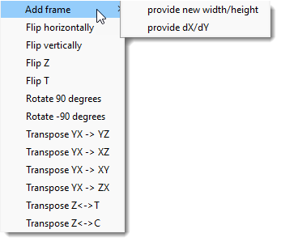
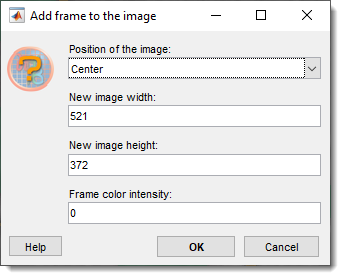
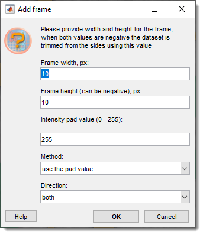

# Transform Dataset

*Back to [MIB](../../../index.md) | [User interface](../../index.md) | [Ribbon](../index.md) | [Dataset](index.md)*

---

{align=left}

Transform the image and corresponding Selection, Mask, and Model layers to modify their orientation, size, or structure.

Demonstration

- [:fontawesome-brands-youtube:{.red-color} Flip demonstration](https://youtu.be/lGjhB-NJZMk)
- [:fontawesome-brands-youtube:{.red-color} Rotate demonstration](https://youtu.be/WFbZn0rfb5I)
- [:fontawesome-brands-youtube:{.red-color} Transpose demonstration](https://youtu.be/PyEXX7j6pnc)

Select a transformation mode from 
[Ribbon → Dataset →Transform](index.md#transform) to apply operations such as flipping, 
rotating, transposing, or adding edges to the dataset. 

## Add Frame by Width and Height

{.on-glb align=left width="280"}

In this mode, you specify a new width and height to add a frame around the dataset:

- Position of the image specify location of the image
to generate the frame around it.
- New image width enter the new dataset width in pixels.
- New image height enter the new dataset height 
in pixels.
- Frame color intensity provide intensity of the frame
color (e.g. 0 for black, 255 for white).

This operation extends the dataset by adding a border, padding the extra space with  the 
provided intensity value (e.g., zero or background). 
It’s useful for preparing datasets for alignment, creating uniform 
sizes across multiple images, or adding space for annotations. 
All layers (Image, Selection, Mask, Model) are resized to the new dimensions.

## Add Frame by dX/dY

{.on-glb align=left width="280"}

This mode pads the dataset in the X and Y directions with a specified frame extension size 
and padding method:

- Frame Width set the padding size in pixels for the X-axis.
- Frame Height set the padding size in pixels for the Y-axis.
- Intensity Pad Value define the 
intensity for padding pixels  (e.g., 0 for black or 255 for white).
- Padding Method choose from the dropdown:
  - `use pad value` use the provided Intensity Pad Value
  for the frame color
  - `replicate` repeat border pixels outward.
  - `circular` wrap pixels circularly from the opposite side.
  - `symmetric` mirror pixels across the border.
- Direction select the padding direction
from the dropdown:
  - `both`: Pad before and after each dimension.
  - `pre`: Pad only before the first element.
  - `post`: Pad only after the last element.

This mode is ideal for expanding datasets without scaling content, 
such as adding borders for processing algorithms or aligning datasets. 
All layers are padded consistently to maintain alignment.

## Flip Horizontally

This mode flips the dataset left to right about a vertical axis:

- No additional parameters are required.

Each slice of the dataset, including the image and all layers, is mirrored horizontally. This transformation is useful for correcting dataset orientation (e.g., reversing a mirrored image) or preparing data for symmetric analysis. The operation is applied uniformly across X, preserving Y, Z, and other dimensions.

## Flip Vertically

This mode flips the dataset up to down about a horizontal axis:

- No additional parameters are required.

The dataset is mirrored vertically, affecting each slice’s Y-axis. It’s commonly used to correct upside-down images or adjust orientation for visualization. All layers are flipped to ensure consistency, maintaining the dataset’s Z and other dimensions.

## Flip Z

This mode flips the dataset along the Z dimension, reversing the order of slices:

- No additional parameters are required.

The stack is inverted about the middle slice, swapping the first and last slices, second and second-to-last, and so on. This is useful for correcting Z-order (e.g., if slices were acquired in reverse) or aligning with other datasets. The image and layers are updated to reflect the new Z-order.

## Flip T

This mode flips the dataset along the T (time) dimension, reversing the order of frames:

- No additional parameters are required.

Frames are reordered, swapping the first and last frames, second and second-to-last, 
etc., about the middle frame. 
This transformation helps correct temporal sequences (e.g., reversing a video) 
or prepare data for time-based analysis. 
All layers are flipped in sync with the image’s time dimension.

## Rotate 90 Degrees

This mode rotates the dataset 90 degrees clockwise in the XY plane:

- No additional parameters are required.

Each slice is rotated, shifting pixels from X to Y and Y to -X. 
This is useful for correcting dataset orientation (e.g., aligning with a standard view) 
or preparing images for display. The image and all layers are rotated, 
adjusting the dataset’s width and height accordingly 
while preserving Z and T dimensions.

## Rotate -90 Degrees

This mode rotates the dataset 90 degrees counterclockwise in the XY plane:

- No additional parameters are required.

Pixels shift from X to -Y and Y to X per slice, opposite to the clockwise rotation. 
It’s used for similar orientation corrections as the 90-degree rotation but in the 
reverse direction. All layers are updated, with width and height swapped to match
the new orientation.

## Transpose YX to YZ

This mode transposes the dataset to reorient the YX plane to YZ:

- No additional parameters are required.

The dataset’s axes are rearranged so the Y-axis aligns with the original Z-axis, 
and the X-axis becomes depth. Repeating this operation restores the original YX orientation. 
It’s useful for reorienting 3D datasets (e.g., viewing slices along a different axis) 
for analysis or visualization. All layers are transposed to maintain alignment.

## Transpose YX to XZ

This mode transposes the dataset to reorient the YX plane to XZ:

- No additional parameters are required.

The X-axis aligns with the original Z-axis, and the Y-axis becomes depth. 
Repeating twice returns to the original YX configuration. This transformation aids in 
analyzing datasets from alternative perspectives, such as orthogonal views. 
The image and layers are updated to reflect the new axis arrangement.

## Transpose YX to XY

This mode transposes the dataset to swap the YX plane to XY:

- No additional parameters are required.

The X and Y axes are swapped, flipping the dataset’s in-plane orientation. 
Repeating restores the original YX layout. It’s used to correct axis misalignments 
or match expected orientations in workflows. All layers are transposed, adjusting 
width and height to match.

## Transpose YX to ZX

This mode transposes the dataset to reorient the YX plane to ZX:

- No additional parameters are required.

The Z-axis becomes the new X-axis, and the original X-axis becomes depth. 
Repeating restores the YX orientation. This is helpful for reorienting stacks for 
specific analyses, such as depth-based studies. The image and layers are updated to 
align with the new axes.

## Transpose Z to T

This mode swaps the Z (depth) and T (time) dimensions of the dataset:

- No additional parameters are required.

Slices in Z become frames in T, and vice versa, effectively converting a 3D stack into 
a time series or a time series into a stack. This is useful for repurposing datasets 
(e.g., treating Z-slices as time points) or correcting dimension assignments. 
All layers are swapped to maintain consistency.

## Transpose Z to C

This mode swaps the Z (depth) and C (color) dimensions of the dataset:

- No additional parameters are required.

The Z-slices are reassigned as color channels, and color channels become depth. 
This transformation is valuable for datasets where depth was mistakenly encoded as 
color or vice versa (e.g., in multi-channel imaging). The image and layers are 
updated to reflect the new dimension mapping.

---

*Back to [MIB](../../../index.md) | [User interface](../../index.md) | [Ribbon](../index.md) | [Dataset](index.md)*
