# Dataset Ribbon Tab

*Back to [MIB](../../../index.md) | [User interface](../../index.md) | [Ribbon](../index.md)*

---

## Overview

Modify parameters such as voxel sizes and the bounding box for the dataset, start the Alignment tool,
or do other dataset-related actions.

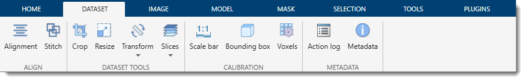

---

## Align Section

### Alignment

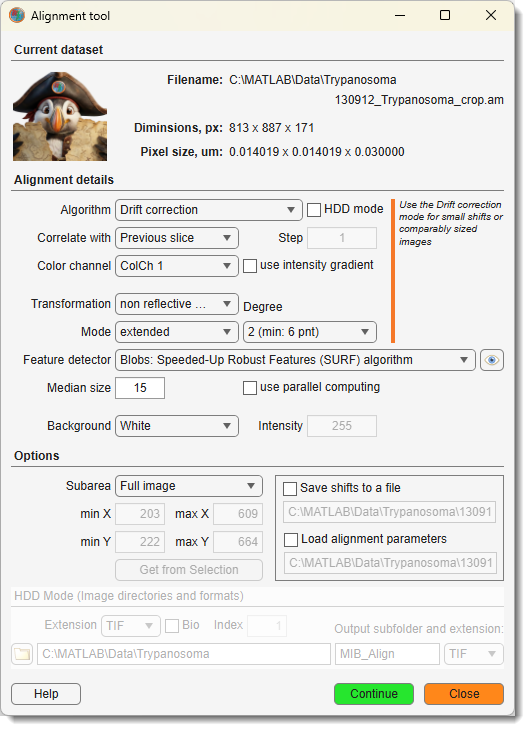{.on-glb align=left width="300"}

Can be used to align the slices of the opened dataset or to align two separate datasets.
See details [here](dataset-alignment.md).

Demonstration

- [:fontawesome-brands-youtube:{.red-color} Alignment demonstration](https://youtu.be/3E7hOBhFjhs)

---

### Stitch

Assemble a collection of 2D image tiles into a single large mosaic. Starting from a rough
initial placement (regular grid, position file, or filename pattern), the tool measures
the actual overlaps between neighboring tiles, optimizes all tile positions globally, and
fuses the tiles into a new dataset — in memory or streamed to OME-Zarr3 (BigData) for
mosaics that exceed available memory.

[See details](dataset-stitch.md)

---

## Dataset Tools Section

### Crop

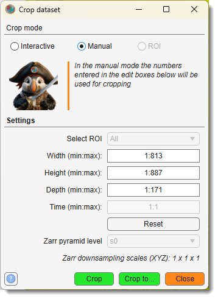{.on-glb align=left width="260"}

Crop the image and corresponding Selection, Mask, and Labels layers.
Cropping can be done in Interactive, Manual, or ROI mode.

Demonstration

- [:fontawesome-brands-youtube:{.red-color} Crop dataset demonstration](https://youtu.be/PQtpYUuJwG8)

[See details](dataset-crop.md)

---

### Resize

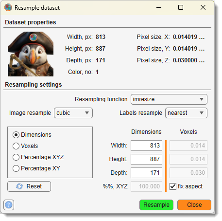{.on-glb align=left width="300"}

Resize (resample) the image in any direction.

Demonstration

- [:fontawesome-brands-youtube:{.red-color} Resample demonstration](https://youtu.be/26-HROwg_JM)

[See details](dataset-resample.md)

---

### Transform

{align=left}

Geometric transformations applied to the dataset and all layers.

The **Transform** dropdown contains the following sub-menus:

#### Add frame...

Extend the canvas size:

- **Update with new width/height**: add a frame by specifying the new total width and height.
- **Update with new dX/dY**: add a frame by specifying the offset values dX and dY.

#### Flip...

Mirror the dataset along an axis:

- **Flip horizontally**: mirror left–right (X axis).
- **Flip vertically**: mirror top–bottom (Y axis).
- **Flip Z**: mirror along the Z axis.
- **Flip T**: mirror along the time axis.

#### Rotate...

Rotate the dataset in-plane:

- **Rotate 90 degrees**: rotate clockwise by 90°.
- **Rotate -90 degrees**: rotate counter-clockwise by 90°.

#### Transpose...

Swap spatial or temporal dimensions:

- **Transpose YX → YZ**: reorient from XY to YZ view.
- **Transpose YX → XZ**: reorient from XY to XZ view.
- **Transpose YX → XY**: restore XY orientation.
- **Transpose Z ↔ T**: swap Z-stack and time dimensions.
- **Transpose Z ↔ C**: swap Z-stack and color channel dimensions.

Demonstrations

- [:fontawesome-brands-youtube:{.red-color} Flip demonstration](https://youtu.be/lGjhB-NJZMk)
- [:fontawesome-brands-youtube:{.red-color} Rotate demonstration](https://youtu.be/WFbZn0rfb5I)
- [:fontawesome-brands-youtube:{.red-color} Transpose demonstration](https://youtu.be/PyEXX7j6pnc)

[See details](dataset-transform.md)

---

### Slices

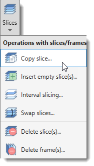{align=left}

Operations on individual slices and time frames. The **Slices** dropdown contains:

- **Copy slice...**: copy a slice to another position.
- **Insert empty slice(s)...**: insert one or more blank slices at a chosen position.
- **Interval slicing...**: keep every Nth slice, removing the rest.
- **Swap slices...**: exchange the positions of two slices.
- **Delete slice(s)...**: remove one or more slices from the Z stack.
- **Delete frame(s)...**: remove one or more frames from the time dimension.

[See details](dataset-slice.md)

---

## Calibration Section

### Scale Bar

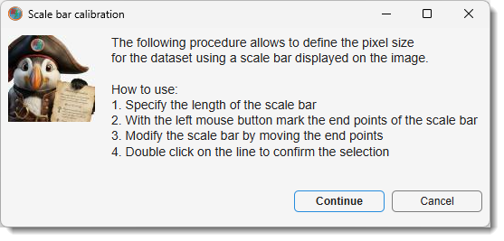{.on-glb align=left width="360"}

Calibrate physical pixel size (X and Y) using a scale bar printed on the image.

Demonstration

- [:fontawesome-brands-youtube:{.red-color} Scale bar demonstration](https://youtu.be/NZO0HG1d8ys)

---

### Bounding Box

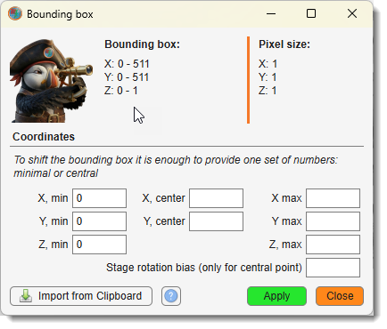{.on-glb align=left width="300"}

Defines the position of the dataset in 3D space, important for positioning in visualization
software like Amira. The bounding box can be shifted based on its minimal or central coordinates.

Demonstration

- [:fontawesome-brands-youtube:{.red-color} Bounding Box demonstration](https://youtu.be/lY0XjNy4Dr8)

[See details](dataset-bb.md)

---

### Voxels

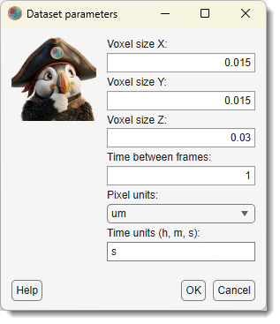{align=left}

Modify dataset calibration parameters: voxel sizes, frame rate for movies, and units.
Entering new voxel sizes recalculates the bounding box automatically.

---

## Metadata Section

### Action Log

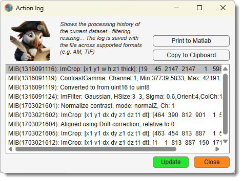{.on-glb width="400" align=left}

Opens a log of actions performed on the current dataset. The log is stored in the
`ImageDescription` field of TIF files with date/time stamps.

[:fontawesome-brands-youtube:{.red-color} MIB in brief: Log of performed actions](https://youtu.be/1ql4cRxZ334)

Available actions via the log window:

- **Print to MATLAB**: outputs the log to the MATLAB command window.
- **Copy to Clipboard**: copies the log contents for pasting (++ctrl+v++ on Windows).

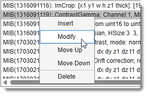{.off-glb align=left}
Additional set of optoins available via a context menu via <mouse class="right"></mouse>:

- **Insert after**: adds a new entry after the selected one.
- **Modify**: edits the selected entry.
- **Move up** / **Move down**: move selected entry up / down in the list.
- **Delete**: removes the selected entry.

Update: manually refreshes the log if not updated automatically.

---

### Metadata

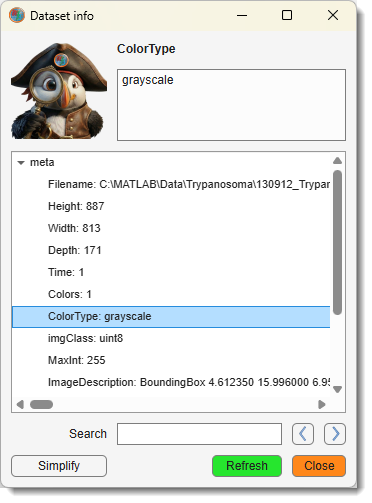{.on-glb width="320" align=left}

Opens a tree list of dataset parameters. XY resolution is reported in `XResolution`,
`YResolution`, and `BoundingBox` within `ImageDescription`. Includes a search field
for quickly locating specific metadata entries.

---

*Back to [MIB](../../../index.md) | [User interface](../../index.md) | [Ribbon](../index.md)*
