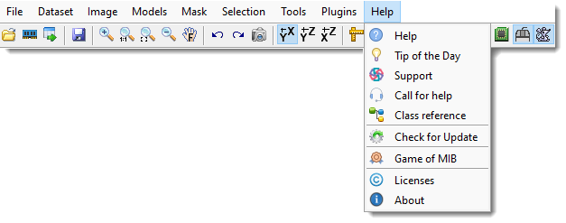
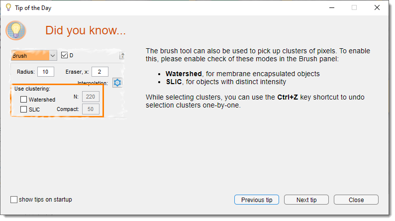
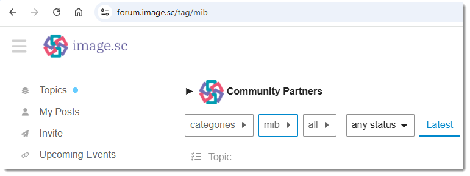
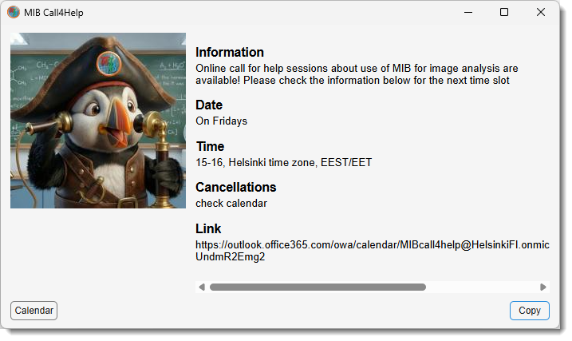
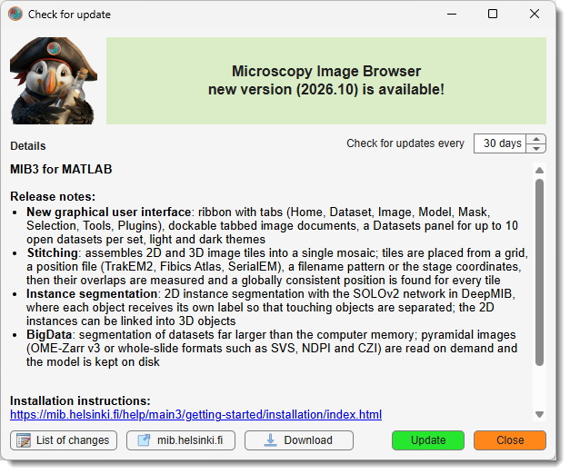
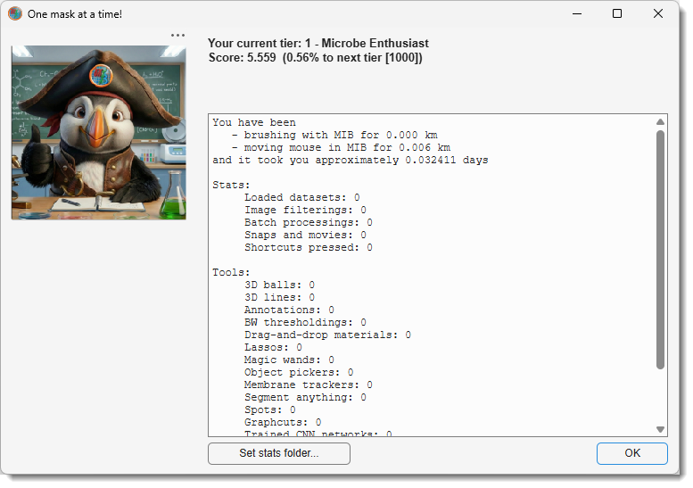

# Help

Access help files and resources in Microscopy Image Browser from **Ribbon → Home → Help**.

---

## Overview

The **Help** button on the **Home** ribbon tab provides links to documentation, support, and additional information about Microscopy Image Browser (MIB).

---

## Help

**Help:** these pages, containing general help about the MIB user interface and its functions

## Tip of the day

{.on-glb width="440" align=left}

**Tip of the day**: displays a window with the tip of the day covering on specific MIB topics. Normally, the tip of 
the day is shown during startup of MIB, but it can be disabled (uncheck <label class="widget widget-checkbox">Show tips on startup</label>).

## Support

{.on-glb width="440" align=left}

**Support**: directs to the [image.sc forum](https://forum.image.sc/tags/mib) for questions, suggestions, or bug reports.  

## Call for help

{.on-glb width="440" align=left}

**Call for help**: get support during personal zoom sessions.
 Copy the link to the reservation calendar to reserve a spot!   

## Class reference
**Class reference**: offers a reference to MIB’s classes and functions, this section is suitable for writing an own code and
connect into MIB via the Plugins system. 

There are few tutorials available [mib.helsinki.fi](https://mib.helsinki.fi/tutorials_programming.html)
 Examples of custom tools can also be found under the `MIB\Development` directory within MIB distribution

## Check for Update

{.on-glb width="440" align=left}

**Check for Update** checks for the latest available version of MIB

- You can press the Download button to get MIB distribution suitable for your system
- Press the Update button to update MIB automatically in case of MIB for MATLAB.

## Game of MIB

{.on-glb width="380" align=left}

**Tired of endless image segmentation?** 
We get it — brushing for hours and placing countless annotations can be exhausting. 
But have you ever stopped to think about just

- how much work you've really done? 
- how many kilometers have you "brushed"? 
- or how many annotations have you placed?
 

Introducing **The Game of MIB** - a fun and motivating way to track your progress as you work!
Level up through the MIB tier system, from a padawan to **MIB Guru** (at Level 10), by simply doing what you do best!
 
Use **Ribbon → Home → Help → The Game of MIB** to open your personalized stats dialog. 
See your current score, track your segmentation achievements, and make annotation just a little more fun.

??? info Tracking data 
    The tracking data stays on your computer and is not transferred anywhere away. 
    Each computer writes its own tracking file (`mib_user_COMPUTERNAME.mat`), and MIB adds up
    every file it finds in the folder. Keeping that folder somewhere all your computers can
    reach - your OneDrive or your network home directory - therefore makes your statistics
    follow you. Use Set stats folder... in the stats
    dialog to choose it, and see
    [Sharing your statistics between computers](../../../getting-started/configuration/index.md#sharing-your-statistics-between-computers).

## Licenses
**Licenses**: displays information about MIB and other licenses  

## About
**About**: shows brief information about Microscopy Image Browser  

---

*Back to [MIB](../../../index.md) | [User interface](../../index.md) | [Ribbon](../index.md)*
