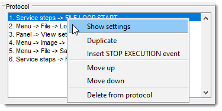
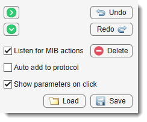
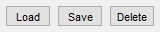
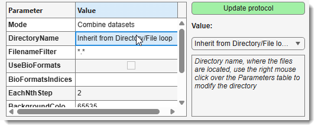

# Batch Processing

---

## Overview

The **Batch Processing** mode in Microscopy Image Browser (MIB) automates image processing steps, allowing you to create a protocol that can be applied to multiple images.

{.on-glb align=left width="300"}

This tool supports automation of workflows, from image loading to processing and saving, with options to manually define steps or automatically detect actions performed in MIB.

Demonstration

- [:fontawesome-brands-youtube:{.red-color} General Batch Processing Demo](https://youtu.be/P6Rivp713qM)
- [:fontawesome-brands-youtube:{.red-color} File and Directory Operations Demo](https://youtu.be/8VlfR_CZNT4)

---

## Introduction

Batch Processing offers two primary modes of operation: when actions are automatically recorded from users operations and
when user defines operations manually.

### Automatic Detection

When <label class="widget widget-checkbox">Listen for MIB actions</label> is checked, MIB records 
detectable operations (e.g., image adjustments) as protocol steps.  
If <label class="widget widget-checkbox">Auto add to protocol</label> is also checked, 
these steps are automatically added to the protocol. 

!!! info "Attention!"
    Some actions (e.g., loading/saving images) are not automatically recorded and thus must be added manually.

### Manual Selection

Use the Protocol steps->Section and 
Protocol steps->Action dropdowns to manually 
select and configure steps, which can then be added to the protocol.

### Service Steps
The Service steps section includes special actions like:

- **STOP EXECUTION**: Pauses the protocol for manual intervention.
- **Directory/File Loops**: Sequentially processes multiple images from directories or files.

### Start the protocol

Start the protocol with Run protocol or from a specific step 
using Start from selected.  
In addition, green arrow buttons can be used to

* :material-arrow-right-circle: to perform the selected action
* :material-arrow-down-circle: to perform the selected action and progress to the next one
 [see below](home-batchprocessing.md#controls)
---

## Protocol Panel

{align=left}

This panel displays and manages the protocol steps.

### Right-Click Menu

  * **Show settings**: Displays and edits parameters in the lower Protocol steps panel.
  * **Duplicate**: Copies the selected step below it.
  * **Insert STOP EXECUTION event**: Adds a pause step.
  * **Move up/down**: Reorders steps.
  * **Delete from protocol**: Removes the selected step.

### Controls

{align=left}

  - : executes the selected step.
  - : executes and moves to the next step.
  - <label class="widget widget-checkbox">Listen for MIB actions</label>: enables automatic detection.
  - <label class="widget widget-checkbox">Auto add to protocol</label>: auto-adds detected actions.
  - <label class="widget widget-checkbox">Show parameters on click</label>: displays parameters on selection (otherwise use the **Show settings** action from the popup menu).
  - : manages protocol files (supports Excel export).
  - Undo / Redo: reverts or reapplies changes.

---

## Protocol Steps Panel

{.on-glb align=left width="350"}

This panel configures individual protocol steps. 
This table displays settings of the selected protocol action. 

In order to modify parameters:

* Select parameter to change
* Modify it using controls on the right-hand side
* Press Update protocol to 
update the selected action with the updated settings

### Options

* Section: selects a group of actions; 
in general each group combines operations that can be found in the corresponding section of MIB GUI. 
    
!!! info "Loops"
    Loops require a *LOOP START* followed by *LOOP STOP*.

* Action: chooses a specific action within the section.
* **Parameters Table**: shows and edits action options using widgets (e.g., value, option).
* Update protocol: applies changes to the selected step.
* Add to protocol: appends the step to the protocol.
* Insert into protocol: inserts the step at the highlighted position.

---

## Usage Tips

??? info "Adding Loops"
    To process multiple images:

    1. Select Service steps → *LOOP START* (e.g., for directories).
    2. Add processing steps (e.g., image filters).
    3. End with *LOOP STOP*.
    See the [File and Directory Demo :fontawesome-brands-youtube:{.red-color}](https://youtu.be/8VlfR_CZNT4) for an example.

??? warning "Limitations"
    Not all MIB actions are automatically detectable. Manual addition is required for operations like file loading or saving.

---

*Back to [MIB](../../../index.md) | [User interface](../../index.md) | [Ribbon](../index.md) | [Home](index.md)*

