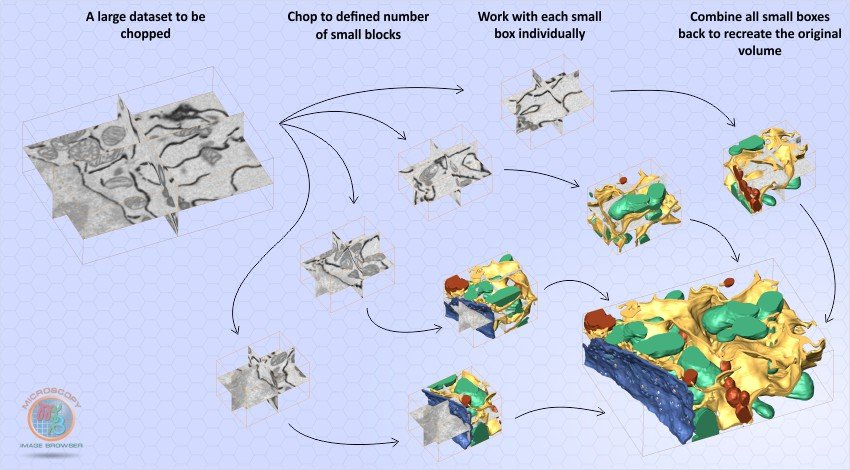
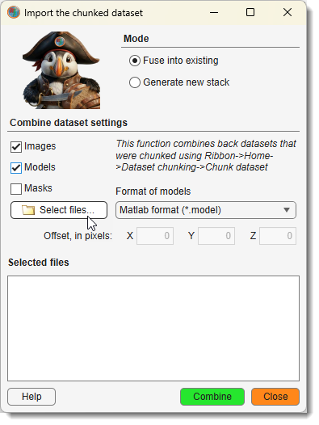

# Dataset Chunking

---

## Overview

The **Dataset Chunking** tool in MIB allows you to split a large dataset into smaller 
pieces and later restore them. This feature is useful for parallel segmentation of 
large datasets across multiple workstations.

{.on-glb align=left}

---

## Dataset Chunking -> Chunk dataset 

{.on-glb align=left width="300"}

The *Chunk dataset* command chops a large dataset into smaller pieces.

### Settings

- **Number of tiles in X/Y/Z**: 
    define the number of resulting datasets
??? example "Example"
    Setting *X: 2, Y: 1, Z: 1* splits the dataset into two parts: `[1:width/2]` and `[width/2:width]`, where `width` is the original dataset’s width.
 
- <label class="widget widget-checkbox">Chop model</label>: when checked, chops the model layer into corresponding blocks.
- <label class="widget widget-checkbox">Chop mask</label>: when checked, chops the Mask layer into corresponding blocks.
- ...Output directory: specify the directory for saving chopped datasets (via button or text input).
- Filename template: sets the naming pattern; MIB appends `_Znn_Xnn_Ynn` (e.g., `_Z01_X01_Y01`) to each block’s filename, where `nn` is the block index.
- Output format for images: choose from 

    - [x] Amira Mesh 
    - [x] NRRD 
    - [x] 3D-TIF
    - [x] HDF5 with XML header
  
- Output format for models: options include MATLAB, Amira Mesh, NRRD, TIF, or HDF5; saved with a `Labels_` prefix.

Masks are saved in MATLAB format with the template `Mask_[FN].mask`, where `[FN]` matches the corresponding image filename.

---

## Dataset Chunking -> Stitch dataset

{.on-glb align=left width="300"}

The *Stitch dataset* command restores a previously chopped dataset, while *Fuse into dataset* fuses cropped datasets into the currently open dataset. Both open the same dialog, preset to the *Generate new stack* or *Fuse into existing* mode respectively.

### Modes

| Mode                | Description                                                                                   |
|---------------------|-----------------------------------------------------------------------------------------------|
| **Generate new stack** | Combines images, models, or masks into a new stack. Requires filenames with `_Znn_Xnn_Ynn` tags for images and `Labels_` prefixes for models (default for chopped exports). |
| **Fuse into existing** | Merges selected datasets into the current one using BoundingBox data from the ImageDescription field. Useful for cropped datasets; includes X/Y/Z offset fields (in pixels). On a BigData dataset, a model saved at a lower resolution is fused into the matching pyramid level; the offsets remain in full-resolution pixels. |

### Steps

1. Choose a mode and select the types to combine (<label class="widget widget-checkbox">Images</label>, 
    <label class="widget widget-checkbox">Models</label>, <label class="widget widget-checkbox">Mask</label>).
2. Press Select files to pick files.

#### Filename Generation
- **Image**: `Huh7_CmVTag1_R2_Pos5_crop_chop_Z01-X01-Y01.am`
- **Model**: `Labels_Huh7_CmVTag1_R2_Pos5_crop_chop_Z01-X01-Y01.model`
- **Mask**: `Mask_Huh7_CmVTag1_R2_Pos5_crop_chop_Z01-X01-Y01.mask`

!!! warning "Important!"
    If <label class="widget widget-checkbox">Images</label> is checked, select only image files (not models or masks); filenames for models/masks are auto-generated. For importing models/masks into an open dataset (without <label class="widget widget-checkbox">Images</label>), select the actual model/mask files.

---

## Usage Tips

??? info "Parallel Segmentation"

    To segment a large dataset across workstations:

    1. Export with desired tiles (e.g., *X: 2, Y: 2, Z: 1*).
    2. Process each chunk independently.
    3. Import with *Generate new stack* to recombine.

??? tip "Offset Adjustment"
    Use *Fuse into existing* with X/Y/Z offsets to align cropped datasets that don’t match the default BoundingBox.

---

*Back to [MIB](../../../index.md) | [User interface](../../index.md) | [Ribbon](../index.md) | [Home](index.md)*

