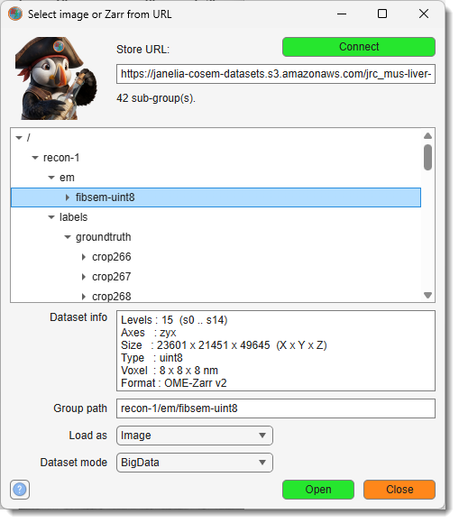
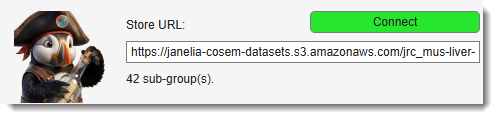
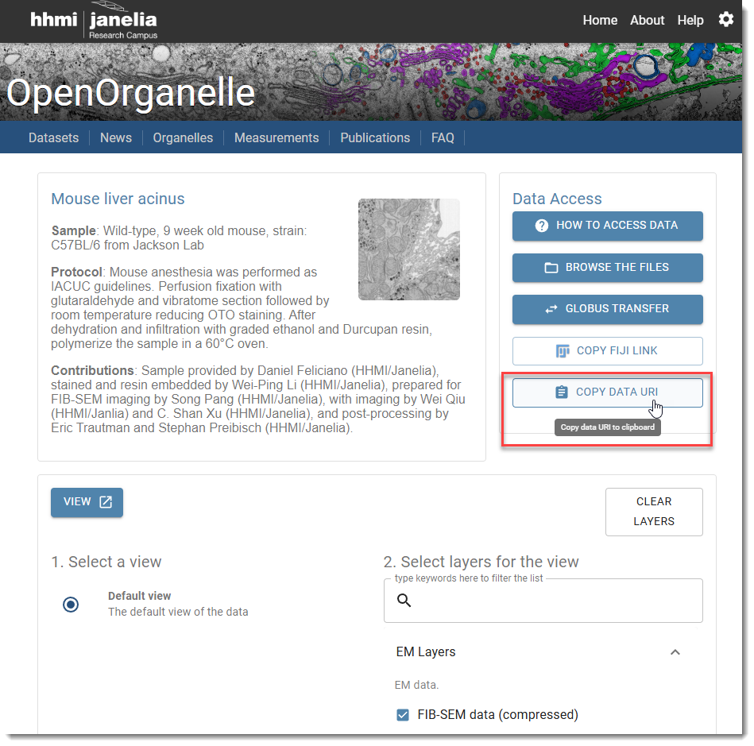

# Import from URL / Zarr

{.on-glb align=right width="300"}

<span class="widget widget-button">Import</span> -> <span class="widget widget-dropdown">URL / Zarr</span> opens a dataset
straight from the internet, without downloading it first.

Two very different sources share this dialog, and MIB decides which applies by inspecting the
URL rather than asking you:

- an **OME-Zarr container** in a cloud bucket, opened as a BigData, Virtual or Standard
  dataset. Nothing is copied to your disk: MIB reads only the parts of the volume you look at.
- **any ordinary image URL** (`.png`, `.tif`, `.jpg`), downloaded and opened as a Standard
  dataset. This is what this menu item always did, and it is unchanged.

---

## Accepted URL forms

| Form | Example |
|------|---------|
| Virtual-host S3 | `https://bucket.s3.amazonaws.com/path/store.zarr` |
| Virtual-host S3, with region | `https://bucket.s3.us-west-2.amazonaws.com/path/store.zarr` |
| Path-style S3 | `https://s3.us-west-2.amazonaws.com/bucket/path/store.zarr` |
| `s3://` shorthand | `s3://bucket/path/store.zarr` |
| Any S3-compatible host | `https://s3.your-institute.org/bucket/path/store.zarr` |
| Any other web host | `https://example.org/data/store.zarr` |

An `s3://` address is rewritten to its `https://` equivalent and shown back to you in the field,
so you can always see exactly what is being contacted. Only **public** buckets are supported:
everything is fetched anonymously, and no credentials are ever requested or stored.

### N5 addresses

MIB cannot read **N5** containers. It does not have to: repositories that publish N5 normally
publish an OME-Zarr copy of the same volume beside it, under the same name. Paste an `.n5` URL and
MIB looks for that copy, switches to it, and tells you so in the status line:

```
s3://janelia-cosem-datasets/jrc_hela-2/jrc_hela-2.n5
   -> https://janelia-cosem-datasets.s3.amazonaws.com/jrc_hela-2/jrc_hela-2.zarr
```

The swap is checked against the server, never assumed, and the rewritten address is shown in the
field. A group path inside the container is carried across, so
`.../jrc_hela-2.n5/recon-1/em/fibsem-uint8` lands on the matching group of the zarr copy. If no
copy exists, the status line says so rather than reporting a generic failure.

---

## Using the dialog

{.on-glb align=right width="400"}

The dialog opens with the <span class="widget widget-edit">Store URL</span> field focused; if the
clipboard holds a link it is already there and selected, so typing or pasting replaces it.

1. Paste the URL of the **container** - the folder usually named `*.zarr` - and press
   ++enter++ (or <span class="widget widget-button">Connect</span>).
2. Expand the tree to find the group you want. Each expand fetches one directory listing, so
   browsing a huge published dataset stays quick.
3. Select a group. When it holds an image pyramid, its details appear in the panel below and
   <span class="widget widget-button">Open</span> becomes available:

    ```
    Levels : 15  (s0 .. s14)
    Axes   : zyx
    Size   : 23601 x 21451 x 49645  (X x Y x Z)
    Type   : uint8
    Voxel  : 8 x 8 x 8 nm
    Format : OME-Zarr v2
    ```

4. Choose <span class="widget widget-dropdown">Load as</span> and
   <span class="widget widget-dropdown">Dataset mode</span>, then press
   <span class="widget widget-button">Open</span>.

<span class="widget widget-edit">Group path</span> shows the selection as a path relative to the
container, for example `recon-1/em/fibsem-uint8`. You can also type it directly, which is the
only option on servers that do not allow directory listing (see below).

### Ordinary image URLs

{.on-glb align=right width="400"}

Steps 2-4 apply to OME-Zarr containers only. If the URL turns out to be a plain image file
instead, there is nothing to browse and nothing to choose, so pressing ++enter++ downloads and
opens it right away as a Standard dataset and closes the dialog - paste, ++enter++, done.

<span class="widget widget-button">Connect</span> stops short of that: it reports what the file
is and waits for <span class="widget widget-button">Open</span>. Use it when you would rather
check the URL before anything is downloaded.

### Load as

- **Image** - open the group as the dataset.
- **Labels** - load it as a segmentation model. Two things can happen, and the dialog tells you
  which before you press Open:
    - the group covers exactly the same extent as the open image, and it is loaded straight on
      top of it;
    - the group is a **ground-truth crop** - a small annotated cube carved out of a much larger
      volume - in which case MIB opens the matching *image region* as well and puts the labels on
      that. See [Label crops](#label-crops).

### Dataset mode

- **BigData** *(default)* - browse and segment. The image stays remote; any model you create is
  written to a **local** folder of your choosing.
- **Virtual** - browse only. Reads the image exactly as BigData does.
- **Standard** - read one pyramid level fully into memory. Right for small groups, such as an
  annotated crop; not for a multi-terabyte volume.

---

## Worked example: Janelia OpenOrganelle

{.on-glb align=right width="300"}

[OpenOrganelle](https://openorganelle.janelia.org) publishes its FIB-SEM volumes in a public
bucket. For the dataset `jrc_mus-liver-zon-1`:

<div class="clear-float"></div>

```
https://janelia-cosem-datasets.s3.amazonaws.com/jrc_mus-liver-zon-1/jrc_mus-liver-zon-1.zarr
```

Press ++enter++, then expand `recon-1` -> `em` -> `fibsem-uint8`. That group is a 15-level
pyramid of a `23601 x 21451 x 49645` volume at 8 nm - about 25 teravoxels. Open it as
**BigData** and browse it like any other dataset.

Other datasets in the same bucket follow the same layout; a few store the image under
`recon-1/em/tem-uint8` instead. You do not need to know which, because the tree shows you.

!!! note "Both links on an OpenOrganelle dataset page give you N5"
    The <span class="widget widget-button">Fiji</span> link and the
    <span class="widget widget-button">Copy data url</span> button on a dataset page both hand out
    the `.n5` address, for example
    `s3://janelia-cosem-datasets/jrc_hela-2/jrc_hela-2.n5`. Paste it as it is - MIB switches to the
    `.zarr` copy published alongside it. See [N5 addresses](#n5-addresses).

!!! tip
    Leaving <span class="widget widget-edit">Group path</span> empty and pressing Open makes MIB
    search the container for the image group itself, which takes a few seconds. Picking the group
    in the tree is faster and unambiguous.

---

## Label crops

Published EM containers may include **ground-truth crops**: small cubes of the parent volume
annotated densely, class by class, and stored under a `labels` branch. In the OpenOrganelle
`jrc_hela-2` container they sit at `recon-1/labels/groundtruth/crop1`, `crop9`, and so on, with
each crop holding one group per class plus a merged `all`.

A crop cannot be loaded onto the open parent volume - it is a 500 x 500 x 100 island inside a
volume of 12000 x 1600 x 6368. So MIB does not try. Selecting a crop's class groups and pressing
Open **fetches the matching image region too**, cutting the EM volume down to exactly the crop's
extent, and puts the labels on that. Image and labels then have identical dimensions and sit on the
same voxel grid.

### Selecting classes

The tree takes a **multiple selection** - ++ctrl++ or ++shift++ click - because a useful model
usually blends several classes. **The order you click in matters:** where two classes cover the same
voxel, the one picked later wins. MIB counts the overlap exactly and reports it after loading, so
you never have to guess what a pick order did.

Each class becomes one material, named after the class the store declares (`mito_mem`,
`er_lum`, ...), in pick order.

### The merged `all` group

Every crop also holds an `all` group, which is different in kind from the per-class ones: instead of
a yes/no mask for one class, it holds **every class of the crop in a single array**, each keyed by
the publisher's own class id. Selecting it gives you the whole ground truth in one go - MIB splits
it into one material per id present.

Those materials are named by id - `all_3`, `all_4`, `all_28` - and **not** by class name. The ids
are the publisher's fixed table and do not follow the order of the crop's own `class_names` list, so
naming them from that list would label every material wrongly. If you want named materials, select
the per-class groups instead; they declare their own names.

!!! example
    `crop266` of `jrc_mus-liver-zon-1` has 17 classes in its `all` group, with ids running 3, 4, 5,
    8, ... 48. Selecting `all` gives a 17-material model over the matching `200 x 200 x 200` EM
    region.

### What MIB reports after loading

A summary appears whenever there is something the model itself cannot show you:

- **Overlap** - which class took how many voxels from which other. COSEM classes are deliberately
  not disjoint: `er` is `er_mem` plus `er_lum`, and `er_mem_all` contains `er_mem`.
- **Unannotated voxels** - the value `unknown` (255) means "nobody looked here", not "background".
  It lands in material 0 alongside real background, so the count is reported. Do not treat those
  voxels as negatives when training on the result.
- **Empty classes** - a class group can exist in a crop and contain nothing at all. It is kept as a
  material with no voxels, and named.
- **A single-material crop** - some crops genuinely are one class throughout (entirely
  extracellular space, entirely nucleus). Said explicitly, so a solid-colour model does not look
  like a failure.

### What cannot be blended

**Instance segmentations.** A handful of groups - `mito`, `nuc`, `ves`, `endo`, `lyso`, `ld`,
`perox`, `np`, `mt`, `cell` - store an object **id** per voxel rather than a class, so merging one
into a material index map would collapse every object into a single material. MIB refuses and says
so. Open such a group with **Load as: Image** instead.

### Worked example

Paste the container URL, expand `recon-1` -> `labels` -> `groundtruth` -> `crop1`, then
++ctrl++ click `mito_mem`, `mito_lum` and `er_mem`. The info panel confirms which image group the
region will come from and at what size. Press Open: a `500 x 500 x 100` dataset at 4 nm appears in
**Standard** mode with a three-material model on it, in about ten seconds.

!!! note "Which image, and at which resolution, is worked out from coordinates"
    The crops are annotated at 2 nm and the EM is 4 nm, so MIB pairs the crop's `s1` level with the
    image's `s0`. It finds the image group by asking which volume's physical extent *contains* the
    crop, not by its name, and it refuses to load rather than resample if the two pyramids share no
    common resolution. You can override the choice with `ImageGroupPath` in
    [batch mode](#batch-mode).

---

## Requirements

**None.** Both OME-Zarr formats - v2, which is what OpenOrganelle and most published OME-NGFF v0.4
data are, and v3 - are read by the bundled native engine using HTTP range requests. Nothing has to
be installed.

Python is involved only if you deliberately switch
[Preferences -> Input/output -> Zarr library](home-preferences.md#zarr-library) to `python`. That
engine reaches the network through fsspec and then needs two extra packages in the interpreter set
at [Preferences -> External directories -> Python installation path](home-preferences.md#external-directories):

```bash
"<path-to-python.exe>" -m pip install zarr
"<path-to-python.exe>" -m pip install aiohttp requests
```

MIB checks for them when you press Open and tells you the exact command if they are missing.

---

## Limitations

**Speed.** The first look at any region is fetched over the network and takes roughly a second or
two per screenful at full resolution. After that it is held in memory, so scrubbing through slices
and panning within what you have already seen are effectively instant.

This works because of how OME-Zarr stores data. A *chunk* is the smallest piece a server will send,
and published volumes are usually chunked for 3D access - the Janelia C. elegans store uses
64 x 128 x 128, so **every chunk carries 64 slices**. Fetching one screenful therefore also fetches
the next 63 slices of it, and MIB now keeps them instead of discarding them:

| | First view of a region | Next slice |
|---|---|---|
| Without the cache | ~2 s | ~2 s |
| With the cache | ~2 s | **~0.01 s** |

The memory budget is **Preferences -> Input/output -> Zarr library -> Chunk Cache**, 512 MB by
default. That holds roughly eight full-resolution screenfuls of the store above; when it is full the
least recently used chunks are dropped. Setting it to 0 turns the cache off.

The image pyramid does the rest: zoomed out, MIB reads a small downsampled level rather than the
full-resolution one, so a whole-volume overview costs far less than a full-resolution screenful.

**A crop is opened as its own dataset, not as an overlay.** Selecting a ground-truth crop replaces
what is open with the crop's image region plus its labels ([Label crops](#label-crops)); it does
not paint the annotation onto the parent volume you were browsing. Drawing a small, finely sampled
annotation over a multi-terabyte volume it is a tiny part of is a separate feature and does not
exist yet.

Crops are opened in **Standard** mode, fully in memory, whatever
<span class="widget widget-combobox">Dataset mode</span> says - MIB tells you when it overrides
your choice. That is deliberate: an existing remote label store is read-only in MIB, so a BigData
crop could be viewed but never corrected, which is the main reason to open one. Every crop in the
reference container fits comfortably - the largest is 64 MB.

**Browsing needs the S3 listing API - but not Amazon.** Any endpoint that answers
`ListObjectsV2` can be browsed, including institutional MinIO and Ceph servers hosted on their own
domain. MIB does not check the host name: it simply tries, and a server that does not
speak the API costs one request. When that happens the dialog says so and you type the
<span class="widget widget-edit">Group path</span> yourself; everything else works normally.

---

## Batch mode

The dialog is available in [Batch processing](home-batchprocessing.md) as
**Ribbon -> Home -> Import from URL / Zarr**, with `Url`, `GroupPath`, `LabelGroups`, `ImageGroupPath`,
`LoadAs`, `DatasetMode` and `showWaitbar`. A recorded protocol replays without browsing, so
`GroupPath` should be filled in.

Three parameters have no control in the dialog and exist only for protocols:

| Parameter | Purpose |
|---|---|
| `showWaitbar` | The dialog always shows progress; a protocol can suppress it. |
| `LabelGroups` | Semicolon-separated label groups to blend, relative to `Url`, **in pick order**. Empty means "just `GroupPath`". |
| `ImageGroupPath` | Overrides the image group a crop is loaded onto. Empty means "find it by coordinates". |

```
Url            = https://janelia-cosem-datasets.s3.amazonaws.com/jrc_hela-2/jrc_hela-2.zarr
LabelGroups    = recon-1/labels/groundtruth/crop1/mito_mem;recon-1/labels/groundtruth/crop1/mito_lum
LoadAs         = Labels
```

`MibModel.loadImages` gained two matching parameters that are useful on their own, for local stores
as much as remote ones:

- `Region` - open only a sub-volume, given as six numbers in **micrometres**,
  `xmin xmax ymin ymax zmin zmax`. These describe the outer extent (voxel faces, not voxel
  centres). A region that does not fall on the store's voxel grid is rounded **outward** and the
  overshoot is reported, never shifted.
- `ZarrLevel` - the 1-based pyramid level to read in Standard mode, instead of being asked.
