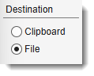
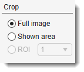
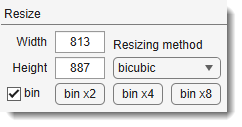
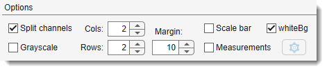
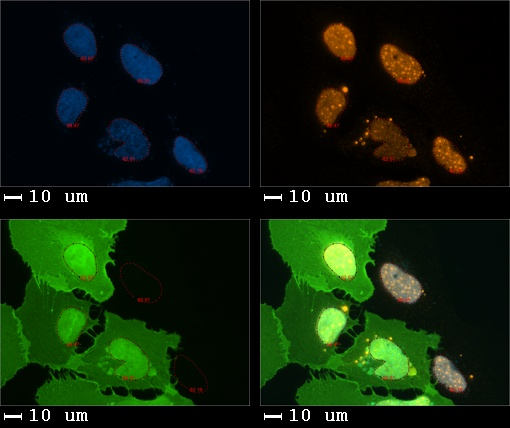
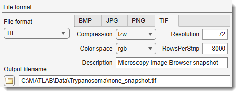

# Make Snapshot

*Back to [MIB](../../../index.md) | [User interface](../../index.md) | [Ribbon](../index.md) | [Home](index.md)*

---

## Overview

{.on-glb align=left width="400"}

This dialog provides access to different settings for making snapshots.

---

## Destination

{align=left}

Define the destination for the rendered snapshot:

- **File**: save the snapshot to a file.
- **Clipboard**: copy the snapshot to the system clipboard.

---

## Crop

{align=left}

- **Full image**: make snapshot of the whole image.
- **Shown area**: make snapshot of the displayed area in the [Image Document](../../image-document/index.md) only.
- **ROI**: use selected ROI (the ROI may be defined using [the ROI panel](../../panels/roi/index.md)) as area for the snapshot.

---

## Resize

{align=left}

- Width: modifies width of the snapshot, or the width of a single panel when <label class="widget widget-checkbox">Split channels</label> mode is enabled.
- Height: modifies height of the snapshot, or the height of a single panel when <label class="widget widget-checkbox">Split channels</label> mode is enabled.
- Resizing method: select one of the possible resizing methods.

!!! note
    Snapshots of the volume rendering are grabbed from the viewer window and therefore cannot be larger than the visible area of the screen. When the requested size does not fit, MIB reports the largest size that can be captured.

??? info "List of image resizing methods"
    - ***nearest***: nearest-neighbor interpolation; the output pixel is assigned the value of the pixel that the point falls within. No other pixels are considered; best for upsampling of the images.
    - ***bilinear***: bilinear interpolation; the output pixel value is a weighted average of pixels in the nearest 2-by-2 neighborhood.
    - ***bicubic***: bicubic interpolation; the output pixel value is a weighted average of pixels in the nearest 4-by-4 neighborhood; best for downsampling of the images.

- <label class="widget widget-checkbox">bin</label>: when checked, the buttons below reduce the image size by the specified factor and update the Width/Height fields accordingly.
  - bin x2: decrease image dimensions by a factor of 2.
  - bin x4: decrease image dimensions by a factor of 4.
  - bin x8: decrease image dimensions by a factor of 8.

---

## Options

- <label class="widget widget-checkbox">Split channels</label>: generate a montage image where each panel shows only one color channel.
- Cols: number of horizontal panels in the montage.
- Rows: number of vertical panels in the montage.
- <label class="widget widget-checkbox">Grayscale</label>: render individual color channels in grayscale mode.
- <label class="widget widget-checkbox">whiteBg</label>: render background in white color for the split channel mode and the scale bars.
- Margin:: gap in pixels between panels in the montage.

???+ example "Split channel example"
    {.on-glb align=left width="300"}
    

- <label class="widget widget-checkbox">Scale bar</label>: add a scale bar to the snapshot.

!!! warning "Scale bar"
    If the width of the snapshot is too small the scale bar is not generated.

- <label class="widget widget-checkbox">Measurements</label>: add the displayed measurements to the snapshot.
- Options (next to Measurements): define visualization options for the measurements.

---

## Format

Select the output format from the File format dropdown. Each format exposes additional settings:

### BMP

Windows Bitmap; 1-bit, 8-bit, and 24-bit uncompressed images. No additional settings.

### JPG

Joint Photographic Experts Group (JPEG).

- Quality: compression quality from 0–100; higher values give better quality and larger files.
- Mode: color mode (e.g. RGB, grayscale).
- Bitdepth: output bit depth.
- Comment: optional text comment embedded in the file metadata.

### PNG

Portable Network Graphics. No additional settings.

### TIF

Tagged Image File Format.

- Compression: compression type (e.g. none, LZW, Deflate).
- Color space: output color space.
- Resolution: pixel resolution written to the file metadata.
- RowsPerStrip: number of rows per TIFF strip; affects read performance for large files.
- Description: optional text description embedded in the file metadata.

---

## Output filename

- Output filename: name and location of the destination file. Use ... to browse.

---

*Back to [MIB](../../../index.md) | [User interface](../../index.md) | [Ribbon](../index.md) | [Home](index.md)*
