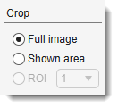
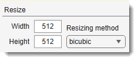
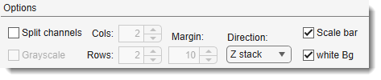
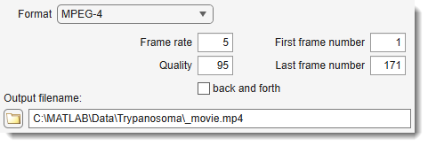

# Make Movie

*Back to [MIB](../../../index.md) | [User interface](../../index.md) | [Ribbon](../index.md) | [Home](index.md)*

---

## Overview

{.on-glb align=left width="400"}

This dialog provides access to different settings for making video files.

---

## Crop

{align=left}

- **Full image**: renders video of the whole dataset.
- **Shown area**: renders video of the shown area only.
- **ROI**: use selected ROI (the ROI may be defined using [the ROI panel](../../panels/roi/index.md)) as area for the video.

---

## Resize

{align=left}

- **Width**: modify width of the video file (the width depends on aspect ratio of the voxels).
- **Height**: modify height of the video file.
- **Resizing method**: select one of possible resizing methods.

??? info "List of image resizing methods"
    - **nearest**: nearest-neighbor interpolation; the output pixel is assigned the value of the pixel that the point falls within. No other pixels are considered.
    - **bilinear**: bilinear interpolation; the output pixel value is a weighted average of pixels in the nearest 2-by-2 neighborhood.
    - **bicubic**: bicubic interpolation; the output pixel value is a weighted average of pixels in the nearest 4-by-4 neighborhood.
    - **lanczos2**: lanczos-2 kernel.
    - **lanczos3**: lanczos-3 kernel.

---

## Options

- <label class="widget widget-checkbox">Scale bar</label>: add a scale bar to the video file.

!!! warning "Scale bar"
    If the width of the video is too small the scale bar is not rendered.

- Direction: (only for 5D datasets) select the direction for video generation: "Z-stack" or "Time" for a time series.
- <label class="widget widget-checkbox">Split channels</label>: generate a montage image where each panel shows only one color channel.
- Cols: number of horizontal panels in the montage.
- Rows: number of vertical panels in the montage.
- <label class="widget widget-checkbox">Grayscale</label>: render individual color channels in grayscale mode.
- <label class="widget widget-checkbox">white Bg</label>: render background in white color for the split channel mode and the scale bars.
- Margin:: gap in pixels between panels in the montage.

???+ example "Split channel example"
    {.on-glb align=left width="300"}
    

---

## Format

Select one of the possible formats:

- **Archival**: motion JPEG 2000 file with lossless compression.
- **Motion JPEG AVI**: compressed AVI file using Motion JPEG codec.
- **Motion JPEG 2000**: compressed Motion JPEG 2000 file.
- **MPEG-4**: compressed MPEG-4 file with H.264 encoding (Windows 7 systems only).
- **Uncompressed AVI**: uncompressed AVI file with RGB24 video.

---

## Settings

Select additional parameters for video rendering:

- Frame rate: rate of playback for the video in frames per second.
- Quality: number from 0 through 100. Higher quality numbers result in higher video quality and larger file sizes. Only available for MPEG-4 or Motion JPEG AVI formats.
- First frame number: the number of the first frame for the video.
- Last frame number: the number of the last frame for the video.
- <label class="widget widget-checkbox">back and forth</label>: complement the video with the same video rendered in the reverse direction.

---

## Output filename

- Output filename: name and location of the destination file. Use ... to browse.

---

*Back to [MIB](../../../index.md) | [User interface](../../index.md) | [Ribbon](../index.md) | [Home](index.md)*
