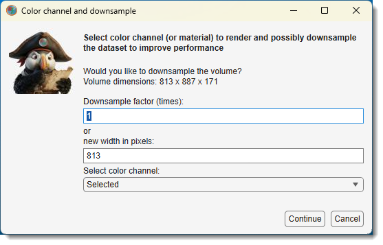
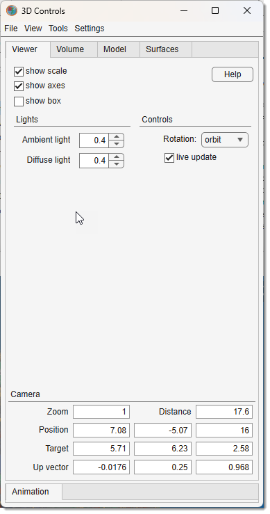
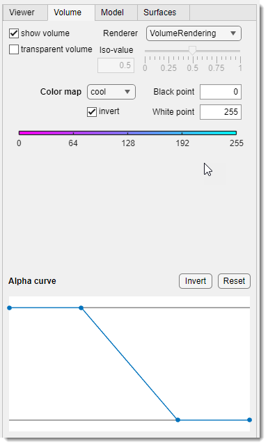
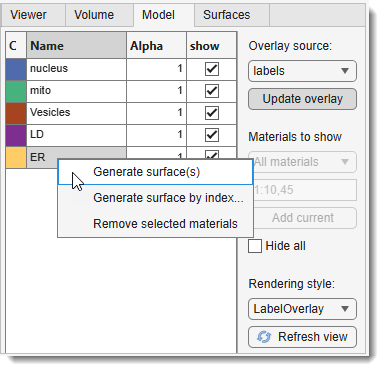
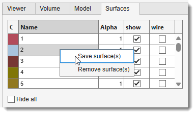
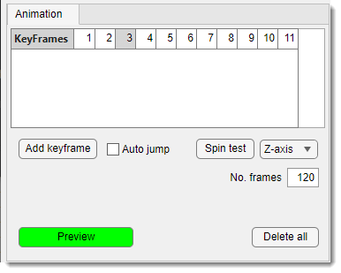

# MIB 3D Volume Rendering

---

## Overview

Starting from MIB version 2.84, a new 3D volume rendering engine is available. The 3D viewer in MIB is capable
to show volumes using volume rendering techniques, models as overlays and generate surfaces from the overlay models.

Demonstration

- [:fontawesome-brands-youtube:{.red-color} Introduction to an updated 3D viewer](https://youtu.be/840o6zni3KE)

---

## Downsampling of datasets

Whenever 3D volume rendering is selected, the current image volume is transferred into the 3D viewer. 
During the transfer, it is possible to select color channels or downsample the dataset to improve rendering performance:

{.on-glb align=left width="300"}

---

## Composition of the 3D viewer

The 3D viewer has two main windows:

- **3D Controls**: the main window for setting parameters, generating surfaces, and making snapshots and animations. Most controls are grouped under corresponding tabs.
- **3D Viewer**: the visualization window used to render volumes and models.

{.on-glb align=left}
/// caption 
User interface of the 3D viewer
///

---

## 3D Controls -> Menu

Menu gives access to the following operations:

| Section            | Operation                   | Description                                                                                             |
|--------------------|-----------------------------|---------------------------------------------------------------------------------------------------------|
| **File section**   |                             |                                                                                                         |
|                    | **Load animation path**     | animations created using the 3D viewer can be saved and loaded back using this operation.              |
|                    | **Save animation path**     | save the current animation path to the disk.                                                           |
|                    | **Make snapshot**           | starts the [MIB snapshot tool](home-makesnapshot.md) to create an image snapshot of the current view.      |
|                    | **Make spin movie**         | starts the [MIB movie maker tool](home-makevideo.md) to create a movie of a camera spin around the object. |
|                    | **Make animation movie**    | starts the [MIB movie maker tool](home-makevideo.md) to create an animation movie along a predefined path set in the *Animation tab*. |
| **View section**   |                             |                                                                                                         |
|                    | **Default view**            | reset the view to its default state (also via Home in the upper-right corner of the **3D Viewer**). |
|                    | **XY view**                 | set the view from above (also via Z in the axes, lower-left corner). |
|                    | **XZ view**                 | set the view from the Y-side (also via Y in the axes, lower-left corner). |
|                    | **YZ view**                 | set the view from the X-side (also via X in the axes, lower-left corner). |
| **Settings section** |                           |                                                                                                         |
|                    | **Background color**        | set the background color for the scene.                                                                |
|                    | **Background gradient color** | set the secondary background color for a gradient.                                                  |
|                    | **Background gradient**     | enable to render background as a gradient of two colors.                                               |

---

## 3D Controls -> Viewer

{.on-glb align=left width="300"}

The Viewer tab allows control over the following widgets and parameters:

- <label class="widget widget-checkbox">Show scale</label>: show or hide the scale bar in the 3D viewer window.
- <label class="widget widget-checkbox">Show axes</label>: show or hide 3D axes; clicking the axes changes orientation.
- <label class="widget widget-checkbox">Show box</label>: show or hide the bounding box around the volume.
- Help: open this help section of MIB.
- Ambient light: define strength of the ambient light in the scene.
- Diffuse light: define strength of the diffuse light in the scene.
- Rotation: define rotation center:
      - cursor rotate the scene around the current position of the mouse cursor.
      - orbit rotate the scene around the central point of the dataset.
- <label class="widget widget-checkbox">Live update</label>: when enabled, the model overlay in the 3D viewer is refreshed automatically as you segment in the main MIB window, so edits appear in 3D without pressing Refresh view. Updates are debounced and triggered by data changes only (drawing, add/subtract to model, etc.) — not by panning, zooming, or slice navigation — and work for the model, mask, and selection overlays. For BigData datasets the overlay is re-fetched at the currently rendered pyramid level.

### Camera

Use these widgets to specify camera position (updated interactively), it is possible to update any of these fields
to modify position of the camera.

- Zoom camera zoom level.
- Distance distance from camera to the scene center.
- Position camera position as a 3-element vector \[x y z\]. See [Camera Graphics Terminology](https://se.mathworks.com/help/matlab/creating_plots/defining-scenes-with-camera-graphics.html).
- Target camera target as a 3-element vector \[x y z\].
- Up vector upwards direction as a 3-element vector \[x y z\] (default: \[0 0 1\]).

---

## 3D Controls -> Volume

The Volume tab contains tools for interacting with the shown volume.

{.on-glb align=left width="300"}

List of widgets for tweaking visualization settings:

- <label class="widget widget-checkbox">Show volume</label>: toggle visibility of both volume and model (does not affect surfaces).
- <label class="widget widget-checkbox">Transparent volume</label>: toggle volume visualization (does not affect models or surfaces).
- Renderer:
  - **VolumeRendering**: render using color and transparency per voxel.
  - **GradientOpacity**: render with additional transparency based on intensity/luminance gradients; adjust with the **Opacity** slider.
  - **SlicePlanes**: use orthogonal slice planes, adjustable via **Slices** sliders or mouse.
  - **Isosurface**: show an isosurface at the **iso-value** slider value.
  - **MaximumIntensityProjection**: render the highest intensity voxel per ray (luminance for RGB).
  - **MinimumIntensityProjection**: render the lowest intensity voxel per ray (luminance for RGB).

  

- Opacity / iso-value: slider to tweak **GradientOpacity** and **Isosurface** settings.
- Color map: update the colormap; use <label class="widget widget-checkbox">Invert</label>, Black point, and White point for adjustments.
- Slices \[*only for SlicePlanes*\]: sliders to change orthogonal slice positions.
- **Alpha curve**: define transparency for the volume (1 = opaque, 0 = transparent).
  - <mouse class="right"></mouse>: select the point.
  - <mouse class="left"></mouse>: change position of the selected point.
  - ++shift++ + <mouse class="left"></mouse>: add a point at the clicked position.
  - ++ctrl++ + <mouse class="left"></mouse>: remove the closest point.
  - Invert: invert the alpha curve.
  - Reset: reset to default state.

---

## 3D Controls -> Model

The Model tab contains tools for visualizing the model loaded into MIB.

{.on-glb align=left width="300"}

List of widgets for tweaking visualization settings:

- Overlay source: specify the layer type for visualization as a model.
- Update overlay: grab the layer specified in Overlay source and visualize it in the 3D Viewer.
- Materials to show, material list and Add current: choose which materials to render, see [Models with many materials](#models-with-many-materials) below.
- <label class="widget widget-checkbox">Hide all</label>: toggle show/hide all selected materials in the table.
- Refresh view: pull the latest segmentation into the overlay on demand. The first use initialises the overlay (same as Update overlay); afterwards it performs a lightweight refresh that updates only the overlay data while preserving per-material visibility and display settings. This is also the action invoked automatically by <label class="widget widget-checkbox">Live update</label>.

- **Table with materials**: list of model materials; each can be shown/hidden and assigned a transparency value (**Alpha**, 0-1). Right-click for a menu with:
    - **Generate surface(s)**: create surfaces for the selected rows in the *Surfaces* tab. In the
      *All materials* mode the single row covers the whole model, so this builds one surface per
      object; it asks first, because that is one surface per object rather than one per row.
    - **Generate surface by index...**: create a surface for any material by typing its index.
      For an imported overlay this reads the object ids from the store, so it works even when the
      objects are shown fused together.
    - **Remove selected materials**: drop the selected rows from the rendered list (*Selected materials* mode only).

### Models with many materials

Instance segmentation produces models with thousands of materials (the 65535 and 4294967295 model types). The 3D viewer shows up to 255 materials at a time, so these models offer two modes in the Materials to show dropdown:

- **All materials**: everything is shown at once, using a repeating set of colors. Neighbouring objects always get different colors, so the segmentation is easy to judge as a whole. The material table has a single row that sets transparency and visibility for the whole overlay.
- **Selected materials**: only the materials you list are shown, each in the same color as in the 2D view and with its own transparency and show/hide switch. Type indices and ranges into the edit field, for example `1:10,45`, or press Add current to add the material selected in the main MIB window.

!!! tip
    Use Update overlay for these models. Showing the model as the volume itself gives a gradient rather than separate objects.

An [imported overlay](home-importfromurl.md#labels-published-only-at-coarse-resolution) shows its
objects fused into one material. **Generate surface(s)** on such a model builds a single surface
covering all of them, after asking; objects that touch end up as one connected surface. Use
**Generate surface by index...** for one object on its own.

---

## 3D Controls -> Surfaces

Surfaces generated from the *Model* tab’s material table (via right-click) are visualized using settings in this tab.

{.on-glb align=left width="300"}

List of widgets for tweaking visualization settings:

**Table**:

- **C**: click to set color for the selected surface.
- **Name**: double-click to change the surface name.
- **Alpha**: tweak transparency (0-1).
- <label class="widget widget-checkbox">Show</label>: toggle show/hide the selected surface.
- <label class="widget widget-checkbox">Wire</label>: toggle wireframe visualization.
- Additional settings via right mouse click:
  - **Save surface(s)**: export selected surface(s) to SLT format.
  - **Remove surface(s)**: remove the selected surface from the 3D viewer.

<label class="widget widget-checkbox">Hide all</label>: toggle show/hide all surfaces from the view

---

## 3D Controls -> Animation

{.on-glb align=left width="300"}

The *Animation* tab allows setting key frames for making movies with volume animations.
 Rendering is done via 
`Ribbon → Home → Make animation movie` 
Animations can be saved/loaded from 
`Ribbon → Home → Load/Save animation path`.

List of widgets for designing animations:

- **Keyframes table**: animations are based on key frames added with Add keyframe. Right-click for additional operations:
    - **Jump to the keyframe**: update the viewer to the selected keyframe.
    - **Insert a keyframe**: insert the current scene into the sequence.
    - **Replace keyframe**: replace the selected keyframe with the current view.
    - **Remove keyframe**: remove the selected keyframe.
- Add keyframe: add a keyframe to the sequence.
- <label class="widget widget-checkbox">Auto jump</label>: automatically update the scene to match a clicked keyframe.
- Spin test: test spinning around the specified axis (Z-axis).
- No. frames: define number of frames for the preview.
- Delete all: delete all keyframes.
- Preview: preview the animation.

---

*Back to [MIB](../../../index.md) | [User interface](../../index.md) | [Ribbon](../index.md) | [Home](index.md)*

