# Preferences

The Preferences dialog lets you customize Microscopy Image Browser to suit your workflow, 
from interface appearance to tool behavior and external integrations. 
Open it via [Ribbon → Home → Preferences](../index.md). 
 Settings are grouped into categories, accessible through a tree on the left, 
making it easy to tweak everything from fonts to undo history.

## Overview

The dialog organizes settings into seven categories, shown as nodes in the **Categories Tree** on the left side:

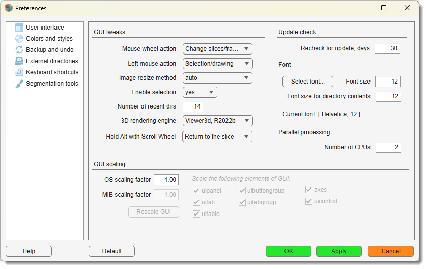{.on-glb align=left width="300"}

- **User interface**: controls fonts, GUI scaling, mouse actions, and update checks settings.
- **Colors and styles**: sets colors for models, masks, annotations, and contour styles.
- **Backup and undo**: configures undo history for 2D and 3D operations.
- **External directories**: specifies paths for external tools like Fiji or Python.
- **Keyboard shortcuts**: defines custom key bindings for MIB actions.
- **Segmentation tools**: adjusts settings and options for segmentation tools.
- **Input / output**: selects the OME-Zarr (zarr3) read/write engine and BigData label smoothing.

At the bottom, you’ll find buttons to manage changes:

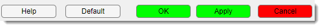{align=left}

- Help: opens help documentation for the Preferences dialog.
- Default: restores all settings to their original values.
- OK: saves changes and closes the dialog.
- Apply: saves changes without closing.
- Cancel: discards changes and closes.

Use the **Categories Tree** to switch between panels. Click a node (e.g., **User interface**) 
to show its settings. Changes are saved only when you click **OK** or **Apply**.

## User Interface

{.on-glb align=left width="300"}

This category customizes how MIB’s interface looks and behaves, covering fonts, 
scaling, mouse interactions, and update frequency.

### GUI Tweaks

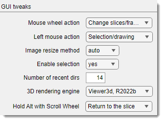{align=right}

Fine-tune how the mouse and rendering work:

Mouse wheel action: a dropdown to set the mouse wheel’s function:

- `Zoom In/Out`: zooms the image.
- `Change slices/frames`: switches between slices or time frames (*default*).
 

Left mouse action: a dropdown to assign the left mouse button’s role:

- `Pan image`: Moves the image.
- `Selection/drawing`: Enables drawing and segmentation (*default*).
!!! info 
    selecting any of these options swaps the mouse button so that <mouse class="right"></mouse> takes the other role.

Image resize method: a dropdown to choose how images are 
interpolated for visualization in the [Image View Panel](../../panels/selection_imview/imview.md):

- `auto`: uses `nearest` for >100% zoom, `bicubic` for <100% (default).
- `nearest`: fastest, lower quality.
- `bicubic`: slowest, highest quality.
 

Enable selection: a dropdown to toggle existence of the Selection layer:

  - `yes`: Enables segmentation tools (default).
  - `no`: Saves memory but disables segmentation.
 

Number of recent dirs: a numeric field to set how many recently accessed 
directories MIB remembers.
??? info "Where to find recently used directories"
    the previously accessed directories available via a dedicated dropdown in the [Path](../../panels/path/index.md#list-of-recently-used-directories) panel.

3D rendering engine: a dropdown to select the engine for 3D visualization:

- `Viewer3d, R2022b`: Modern engine, available in R2022b or newer version of MATLAB (default).
- `Volshow, R2018b`: Legacy engine, available in R2018b or newer :material-information-outline:{.red-color title="Not implemented for MIB3" }. 
 

Hold Alt with Scroll Wheel: a dropdown to define behavior 
when holding ++alt++ while scrolling :material-information-outline:{.red-color title="May not work yet in MIB3 due to a limitations of a new AppContainers framework" }:

- `Return to the slice`: returns to the current slice upon release of ++alt++ (default)
- `Scroll time points`: ++alt++ + :material-mouse-scroll-wheel:{.orange-color} **mouse wheel** scrolls through time points.

### Update Check

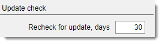{align=right}

Set how often MIB looks for a new version:

Recheck for update, days: a numeric field (minimum 1) 
to define the interval between update checks (default: 30 days).

### Font

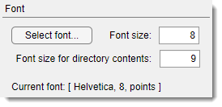{align=right}

Adjust the font used across MIB interface:

- Select font...: a button that opens a font selection dialog. 
  The chosen font is displayed in the **Current Font** label field below.
- Font size: a numeric field (minimum 1) 
  to set the font size for GUI widgets, like buttons and labels.
- Font size for directory contents: a numeric field (minimum 1) 
  to set the font size for the file list in the [Directory Contents Panel](../../panels/dircontents/index.md).

### Parallel Processing

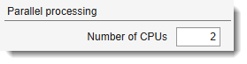{align=left}

Number of CPUs: a numeric field to set the maximum number of CPU cores
used for parallel processing operations. Reducing this value frees CPU resources for other applications running
on the same workstation.

!!! warning "Compiled (standalone) version"
    In the compiled version of MIB the upper limit is fixed by the number of CPU cores available on the
    workstation that was used to compile MIB. It cannot exceed that value even if your machine has more cores.

### GUI Scaling

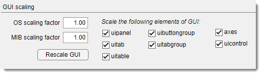{align=left}

Scale MIB’s interface, useful for high-DPI screens or accessibility:

OS Scaling Factor: a numeric field to input the 
operating system’s scaling factor (as ratio vs 100%), ensuring accurate mouse coordinates.
??? info "How to find scaling factor on Windows"

    Do <mouse class="right"></mouse> on Windows Desktop and select **Display settings**  
    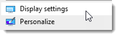 
    Find the scaling factor and type it as value in %% divided by 100 (*i.e.* `1` for the snapshot below):
    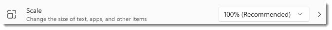
     
MIB Scaling Factor: a numeric field to scale selected GUI elements, 
such as panels or tables specified as a ratio relative to default size.
!!! warning 
    The scaling is done relative to initial size of MIB widgets rendered at MIB startup

Checkboxes to choose which elements to scale

It is possible to configure each element specifically as on some MacOS versions the scaling needs to be done
excluding some widgets.

  - uipanel: scales panel containers.
  - uitab: scales tab elements.
  - uitable`: scales tables.
  - uibuttongroup: scales button groups.
  - uitabgroup: scales tab groups.
  - axes: scales axis displays.
  - uicontrol: scales other control elements like buttons.

Rescale GUI: press the button to instantly apply scaling changes to MIB’s main window.
!!! warning

    Press of the button is always rescales MIB interface relative to the current state. If after the initial resizing step, you 
    feel that additional scaling is needed, try to estimate how much the scaling factor needs to be relative to the initial size of MIB 
    interface. Set this value and restart MIB!

---    

## Colors and Styles

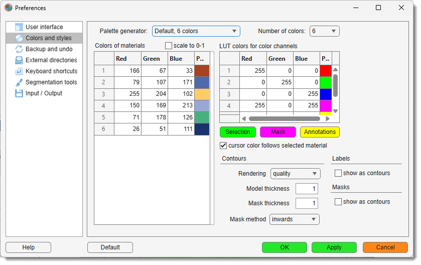{.on-glb align=left width="300"}

This category lets you customize colors for materials of the model, color channels, layers, and contours, as well as rendering styles.

### Palette generator
Generate color palettes from several predefined presets for visualization of materials 
within the [Segmentation table](../../panels/segm/index.md#segmentation-table).

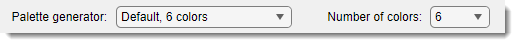

- Palette generator: a dropdown to pick predefined color palettes for the tables.
- Number of colors: a dropdown to set the number of colors in the generated palette, 
  depending on the selected preset. 

### Colors of the materials table

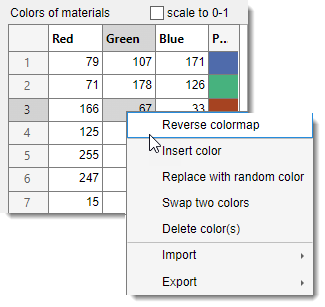{align=left}

The table shows the colors of materials that define visualization of the model. The colors can be changed by typing intensity
value for each Red, Green, Blue channels in range from 0-1 or 0-255 (depending on scale to 0-1)
or by <mouse class="left"></mouse> the colored cells. 

Manage color palettes for visualization via a context menu <mouse class="right"></mouse>:

- **Reverse colormap**: press to reverse the order of colors in the palette
- **Insert color**: insert a new random color at the following row in the table
- **Replace with random color**: replace the selected color with a random color
- **Swap two colors**: swap the selected color with another one
- **Delete color(s)**: delete selected color from the palette
- **Import (from MATLAB or file)**: import a palette from the main MATLAB workspace or from a file 
- **Export (to MATLAB or file)**: export the current palette to the main MATLAB workspace or to a file

scale to 0-1: a checkbox to normalize colors between 0 and 1, otherwise the colors are 
scaled between 0 and 255.

??? tip "Update material colors directly from the Segmentation table"
    The colors can be changed via a context ment of the [Segmentation table -> Color scheme...](../../panels/segm/index.md#segmentation-table)
       
    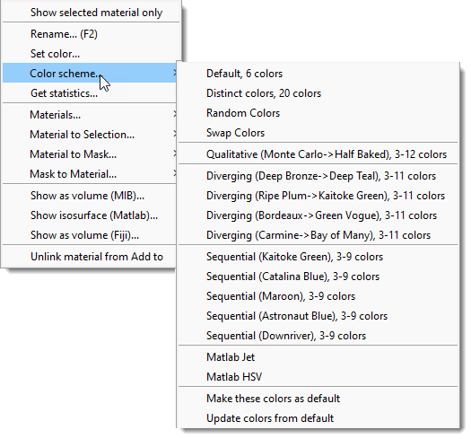{.on-glb align=left}
 
### Colors for LUT and image layers

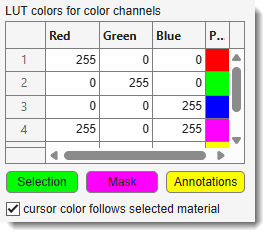{align=left}

**LUT Colors for Color Channels** - is a table with columns for Red, Green, Blue, and a Preview, used for 
definition of LUT (**L**ook **U**p **T**able) colors to visualize individual color channels of the dataset.
  
The LUT color channel is also available from the View Settings panel. Whenever LUT is checked in the [View Settings->LUT table](../../panels/selection_imview/viewsettings.md#colors-table-and-lut-checkbox)
these colors are used.

Selection: a button to specify color to be used for rendering of the [Selection](../../image-layers.md) layer
 
Mask: a button to specify color to be used for rendering of the [Mask](../../image-layers.md) layer
 
Annotations a button to specify color to be used for rendering of [annotations](../../panels/segm/segm-annotations.md)

### Contours

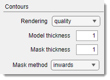{align=left}

Adjust how contours are drawn for models and masks:

Rendering: a dropdown for contour rendering method:

  - `quality`: high-quality rendering (default).
  - `performance`: faster, but touching objects use the earlier material’s color.

Model thickness: a numeric field for line thickness in Contour mode for models (default: 1).
 
Mask thickness: a numeric field for line thickness in Contour mode for masks (default: 1).
    
Mask method: a dropdown for Mask contour direction:

  - `inwards`: Shrinks the mask object (default).
  - `outwards`: Grows the mask object.

### Labels

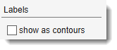{align=left}

Control Labels layer appearance: 
show as contours: show the Labels layer as filled shapes (*default*) 
show as contours: show the Labels layer as contours instead of filled shapes

??? tip "Quick toggle from the Segmentation panel"
    The contour/filled rendering for Labels can also be switched directly via the eye button in the [Segmentation panel](../../panels/segm/index.md).

### Masks

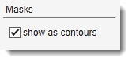{align=left}

Control Mask layer appearance: 
show as contours: show the Mask layer as contours instead of filled shapes (*default*) 
show as contours show the mask as filled shape

??? tip "Quick toggle from the Segmentation panel"
    The contour/filled rendering for Masks can also be switched directly via the eye button in the [Segmentation panel](../../panels/segm/index.md).

???+ info "Examples of different mask visualization styles"
    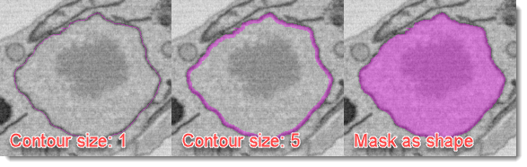
      
---

## Backup and Undo

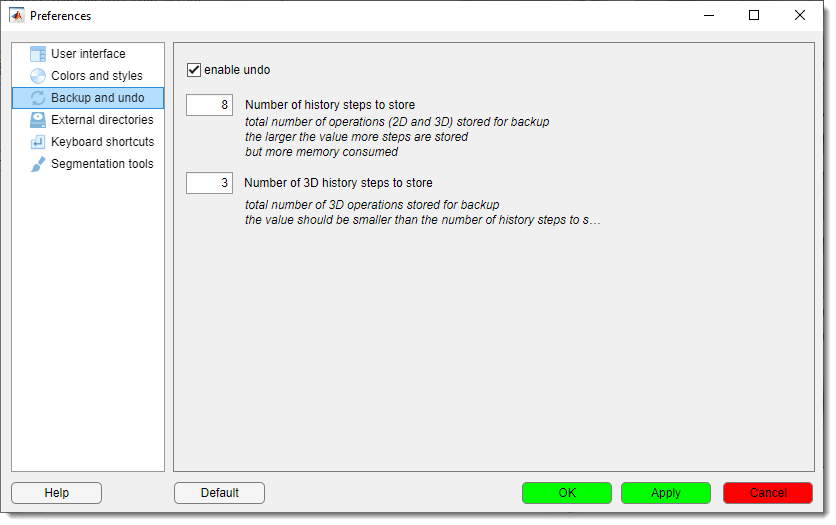{.on-glb align=left width="300"}

Configure undo functionality for editing operations:

enable undo: a checkbox to turn on undo support. 

Number of history steps to store: a numeric field (minimum 0) for the total number of 2D and 3D operations to store. 
Higher values save more steps but use more memory.
Number of 3D history steps to store: a numeric field (minimum 0) for 3D operations only. 
Must be smaller than the total history steps.

!!! tip
    The backup and undo system requires additional allocation of memory and slows down performance. 
    Balance memory usage and undo needs by setting reasonable history limits, especially for large datasets.

---

## External Directories

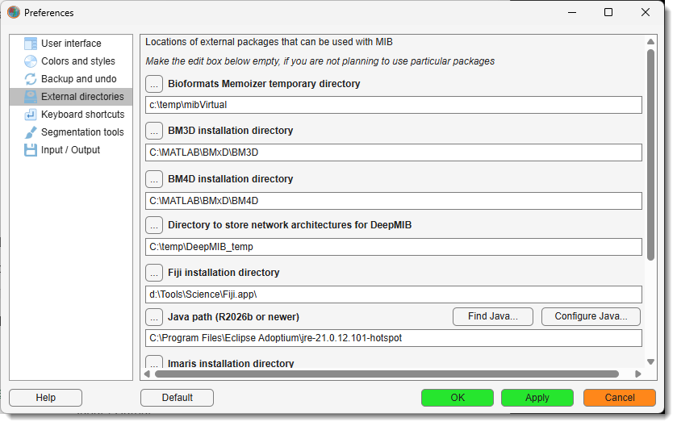{.on-glb align=left width="300"}

Specify paths for external tools and packages that integrate with MIB. Leave fields empty if you don’t use a particular package.

Fiji installation directory: a text field and ... to set the path 
to [Fiji](https://imagej.net/software/fiji/), see more in the [System requirements](https://mib.helsinki.fi/downloads_systemreq.html#fiji) section.
  
OMERO installation directory: a text field and ... to set 
the path to [OMERO](https://omero.readthedocs.io/en/stable/developers/Matlab.html), see more in the [System requirements](https://mib.helsinki.fi/downloads_systemreq.html#omero) section.
  
Imaris installation directory: a text field and ... 
to set the path to [Imaris](https://imaris.oxinst.com/), see more in the [System requirements](https://mib.helsinki.fi/downloads_systemreq.html#imaris) section.
  
BM3D installation directory: a text field and ... 
to set the path to [BM3D](https://webpages.tuni.fi/foi/GCF-BM3D/index.html), see more in the [System requirements](https://mib.helsinki.fi/downloads_systemreq.html#BMxD) section.
  
BM4D installation directory: a text field and ... 
to set the path to [BM4D](https://webpages.tuni.fi/foi/GCF-BM3D/index.html), see more in the [System requirements](https://mib.helsinki.fi/downloads_systemreq.html#BMxD) section.
  
Bioformats Memoizer temporary directory: a text field and ... to set the temporary directory for Bioformats Memoizer. 
Use any temporary directory available on your system. The created files can be removed any moment.
  
Directory to store network architectures for DeepMIB: a text field and 
... to set the [DeepMIB](../../deepmib/index.md) and [SAM](../../panels/segm/segm-sam.md) network storage paths.
  
Python installation path: a text field and ... 
button to set the path to Python, required for [SAM](../../panels/segm/segm-sam.md), see more in the [System requirements](https://mib.helsinki.fi/downloads_systemreq_sam2.html) section.

---

## Keyboard Shortcuts

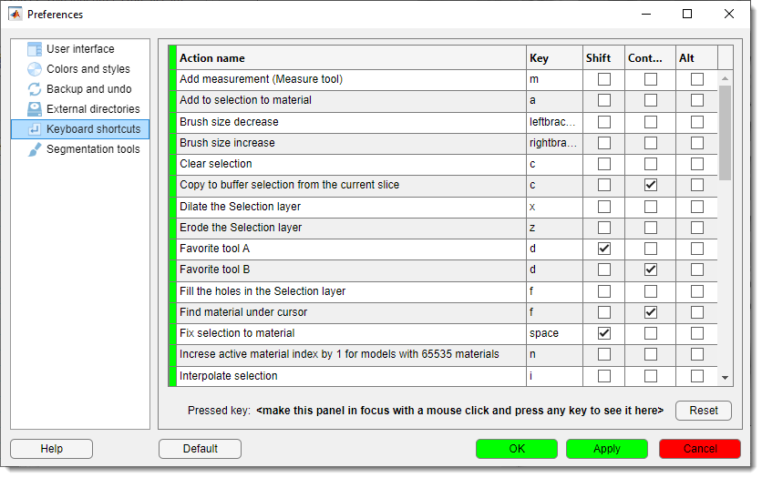{.on-glb align=left width="300"}

Customize key bindings for quick access to MIB actions:

- **Shortcuts Table**: A table to edit key bindings. Click a cell to assign a key combination.
- **Pressed Key**: A label showing the last key pressed (e.g., ++ctrl++ + ++s++) when the panel is active. Click the panel and press a key to test.
- **Reset**: A button to restore default key shortcuts.

!!! warning
    Ensure the Keyboard Shortcuts panel is selected to capture key presses for testing.

---

## Segmentation Tools

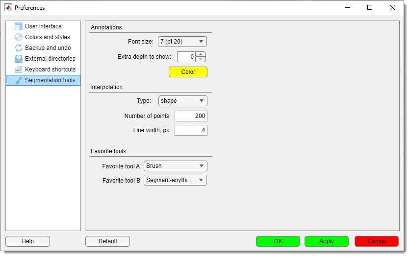{.on-glb align=left width="300"}

Adjust settings for segmentation tools, including interpolation, annotations, and favorites.

### Annotations

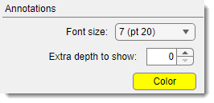{align=left}

Customize how annotations appear:

Font size:: a dropdown for annotation font size:
  - Options: 1 (pt 8), 2 (pt 10), 3 (pt 12), 4 (pt 14), 5 (pt 16), 6 (pt 18), 7 (pt 20) (default: 1).

Extra depth to show:: a spinner (minimum 0) to extend annotation visibility 
across slices (*e.g.*, 3 shows annotations 3 slices before and after).
  
Color: a button to pick the annotation color (same as in Colors and Styles).

!!! tip
    Style for the annotations can also be specified in the [Annotation list -> Settings](../../panels/segm/segm-annotations.md#tools-panel) window

### Interpolation

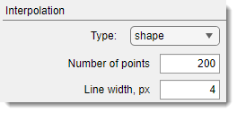{align=left}

Configure how MIB interpolates between points:

Type: a dropdown to choose the interpolant:

  - `shape`: Best for blobs (default).
  - `line`: Suited for non-closed linear objects.

Number of points: a numeric field for points used in interpolation. 
Higher values improve quality but slow performance.
  
Line width, px: a numeric field for the thickness of lines in `line` interpolation.

### Favorite Tools

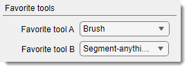{align=left}

Set quick-access segmentation tools:

Favorite tool A: a dropdown to select a tool accessed via ++shift+d++:

  - Options: 3D ball, 3D lines, Annotations, Brush, BW Thresholding, 
  Drag & Drop materials, Lasso, MagicWand-RegionGrowing, Membrane ClickTracker, Object Picker, 
  Segment-anything model, Spot (default: Brush).
  
  - 
Favorite tool B: a dropdown to select a tool accessed via ++ctrl+d++:
  - Same options as Favorite tool A (default: Segment-anything model).

---

## Input / Output

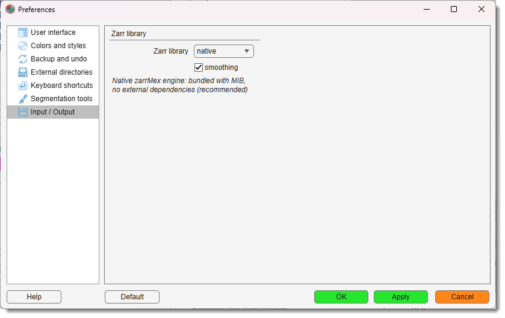{.on-glb align=left width="300"}

This category configures reading and writing of **OME-Zarr v3** (`.zarr3`) datasets, used by the
BigData and virtual dataset modes.

### Zarr library

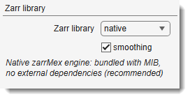{align=left}

Zarr library: a dropdown to select the engine used for
reading and writing zarr3 data:

- `native`: the bundled **zarrMex** engine — no external dependencies (*default, recommended*).
- `python`: the **zarr-python** (v3) library, called through the Python interpreter set in
  [External directories → Python installation path](#external-directories). Requires the `zarr` and
  `numpy` packages installed in that environment.

A short description of the selected library is shown in the label beneath the dropdown. The setting
takes effect immediately on OK / Apply — no restart needed.

!!! info
    Metadata (array/group creation, attributes, resizing) is always handled by the native engine for
    an identical on-disk structure; only the bulk pixel read/write honours this selection. Remote
    (HTTP/HTTPS) zarr datasets always use the native engine.

### Smoothing

Smoothing: a checkbox controlling how a segmentation edit
made at a low-magnification (zoomed-out) level of a **BigData** model is propagated into the
higher-resolution pyramid levels (*default: enabled*).

- When **enabled**, coarse edits are reconstructed with a signed-distance transform so boundaries
  appear as smooth curves instead of blocky steps when you zoom in.
- When **disabled**, a faster nearest-neighbour upsampling is used, leaving blockier boundaries.

!!! note
    Smoothing rounds the staircase pattern of a coarse edit but cannot add detail finer than the
    level you drew at — draw at a higher magnification for crisp boundaries.

---

*Back to [MIB](../../../index.md) | [User Interface](../../index.md) | [Ribbon](../index.md) | [Home](index.md)*
