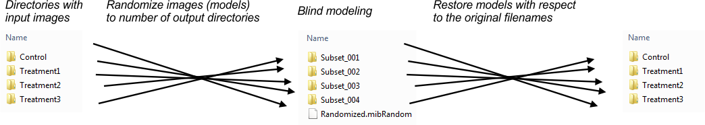
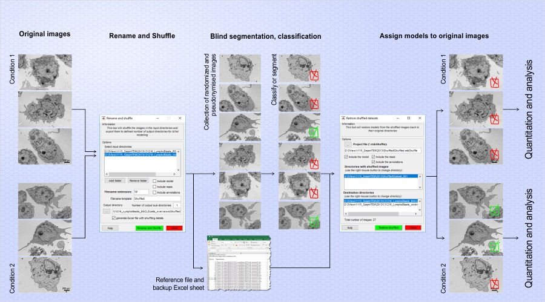
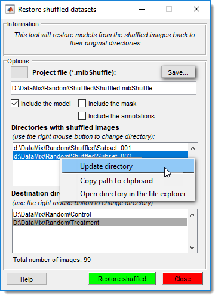
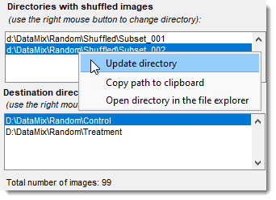

# Rename and Shuffle

*Back to [MIB](../../../index.md) | [User interface](../../index.md) | [Ribbon](../index.md) | [Home](index.md)*

---

## Overview

The **Rename and Shuffle** tool in Microscopy Image Browser (MIB) shuffles files for blind modeling or classification,
ensuring users don’t know which file corresponds to which condition. 
Models from shuffled files can later be restored to their original filenames for analysis.

{.on-glb}
{.on-glb}

Demonstration

- [:fontawesome-brands-youtube:{.red-color} Rename and Shuffle Demo](https://youtu.be/be3p7FZc-X8)

---

## Rename and Shuffle -> Rename and Shuffle

{.on-glb align=left width="300"}

This mode renames and shuffles files from input directories into multiple output subdirectories.

???+ warning "Prerequisites"
    - Files for each condition must be in separate folders.
    - Images in each folder must have the same width and height.
    - Recommended: Each file contains a single image (no stacking).
    - For models, masks, or annotations: Only one file per type per directory (e.g., one `*.model`, `*.mask`, or `*.ann` file).
    - For models: All model files must contain the same materials.

### Setup

Copy images from different conditions into separate directories 
(e.g., `Control` for control images, another folder for treatment images). 
There are may be multiple conditions processed at the same time. 
The only requirement is to have separate conditions in its own directory.

### Settings

- Add folder...: populate the list of input directories with images from different conditions.
- Remove folder...: remove a selected directory from the list.
- <label class="widget widget-checkbox">Include model</label>: shuffle existing models (one `*.model` file per folder).
- <label class="widget widget-checkbox">Include mask</label>: shuffle existing masks (one `*.mask` file per folder).
- <label class="widget widget-checkbox">Include annotations</label>: shuffle existing annotations (one `*.ann` file per folder).
- <label class="widget widget-checkbox">Include measurements</label>: shuffle existing measurements (one `*.measure` file per folder).
- Random seed: a positive number setting the random number generator seed; same value ensures consistent shuffling.
- Filename extension: specify the extension for image filenames (e.g., `TIF`).
- Filename template: define the naming pattern for shuffled images.
- Output directory: set the destination directory for shuffled files.
- Number of output sub-directories: number of subdirectories (e.g., `Subset_001`, `Subset_002`) to create under the output directory.
- <label class="widget widget-checkbox">Generate Excel file with shuffling details</label>: in addition to 
automatically generated `.mibShuffle` MATLAB-compatible file with shuffling
details, generate an Excel sheet where the shuffling order is stored in human-readable format.
- Rename and shuffle: start the shuffling process. During the 
shuffling an automatically generated `.mibShuffle' MATLAB-compatible file with sorting details is generated

---

## Rename and Shuffle -> Restore

{.on-glb align=left width="300"}

This mode restores shuffled models and masks to match their original image filenames.

???+ warning "Prerequisites"
    - Images in each folder must have the same width and height.
    - For models, masks, or annotations: only one file per type per directory.

### Steps

* Press ... to select the project file (`.mibShuffle`), saved in the original shuffle output directory.
* The **Directory with shuffled images** and **Destination directories** lists populate automatically.

{.on-glb align=right width="300"}

* Right-click for a popup menu to edit directories, copy names to the clipboard, or open in File Explorer.
   

* Optionally, save updated directory settings with Save.
* If masks or annotations are present, check <label class="widget widget-checkbox">Mask</label> or <label class="widget widget-checkbox">Annotations</label> to restore them.
* Press Restore shuffled to start.

#### Output
- Restored models: `Labels_RestoreRand_YYMMDD.model` (e.g., `Labels_RestoreRand_250405.model` for April 5, 2025).
- Restored masks: `Mask_RestoreRand_YYMMDD.mask`.
- `YYMMDD` reflects the restoration date.

---

## Usage Tips

??? info "Shuffling for Blind Analysis"
    To anonymize files:

    1. Organize conditions into separate folders (e.g., `Control`, `Treatment`).
    2. Set Number of output sub-directories (e.g., 3 for `Subset_001` to `Subset_003`).
    3. Shuffle with a consistent Random seed.

---

*Back to [MIB](../../../index.md) | [User interface](../../index.md) | [Ribbon](../index.md) | [Home](index.md)*

