# Home Ribbon Tab

The **Home** ribbon tab in Microscopy Image Browser (MIB) provides tools for handling image datasets, 
including importing, exporting, saving, and rendering options. This page details each section, 
with demonstrations and references where available.

---

## Overview

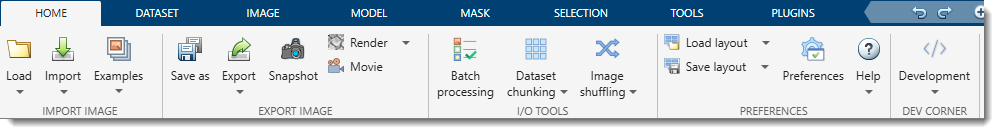

The image above shows the **Home** tab of the ribbon at the top of the MIB interface. 
This tab organizes essential file-related actions for working with multidimensional microscopy datasets.

---

## Import Image Section

### Load

- Click the <span class="widget widget-button">Load</span> button to select the current working directory with images.
After selection, the image files will be shown in the [Directory Contents](../../panels/dircontents/index.md) panel and
the current directory in the [Status bar](../../statusbar/index.md) will be updated to the selected folder.

- Additionally, a dropdown menu under the button shows the list of recent directories from which images
were loaded previously. Selecting a directory from that list updates the current working directory
to the selected folder.

??? tip "Number of recent directories"

    The number of directories to keep can be specified from the **[Preferences](home-preferences.md) dialog ->
    User interface**: <span class="widget widget-edit">Number of recent dirs</span>


### Import

- **MATLAB**: Import an image from the main MATLAB workspace into MIB  
  Optionally include a `dictionary` with dataset parameters that were generated by 
  the **Export image to** command [:fontawesome-brands-youtube:{.red-color} Brief demo](https://youtu.be/zUJ1RUuTLVs)
- **System Clipboard**: Paste an image from the system clipboard  
  Uses the [IMCLIPBOARD](http://www.mathworks.com/matlabcentral/fileexchange/28708-imclipboard) function by Jiro Doke, MathWorks, 2010 [:fontawesome-brands-youtube:{.red-color} Brief demo](https://youtu.be/kcN0Na_YC_U)
- **Imaris**: Import a dataset from Imaris :material-information-outline:{.red-color title="Converted from MIB2, but not tested" }  
  Requires [Imaris and ImarisXT](http://www.bitplane.com/) and uses [IceImarisConnector](http://www.scs2.net/next/index.php?id=110) by Aaron C. Ponti, ETH Zurich  
  [:fontawesome-brands-youtube:{.red-color} Demo](https://youtu.be/MbK2JcTrZFw?list=PLGkFvW985wz8cj8CWmXOFkXpvoX_HwXzj)

- **OMERO**: connect to an OMERO server and load images.  
??? failure "Not implemented"

    Requires [OMERO server](http://www.openmicroscopy.org/site) files; see [System Requirements](https://mib.helsinki.fi/downloads_systemreq.html#omero) for installation details.  
    [:fontawesome-brands-youtube:{.red-color} Demo](https://youtu.be/iR7OL0eJGuw)

    1. Select a server (do not copy/paste the password):  
    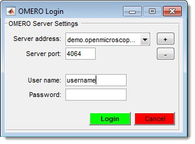
    2. Choose a dataset and range:  
    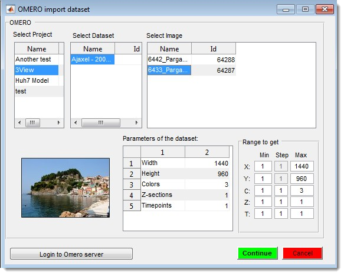{.on-glb align=left width="400"}

    <div class="clear-float"></div>

- **URL**: Open an image from a URL address  
  The link must include the protocol (e.g., `http://`)  [:fontawesome-brands-youtube:{.red-color} Brief demo](https://youtu.be/FNEVgKzbGqQ)

### Example datasets

Quickly access demo datasets and full DeepMIB projects for image segmentation, grouped by data collection techniques.

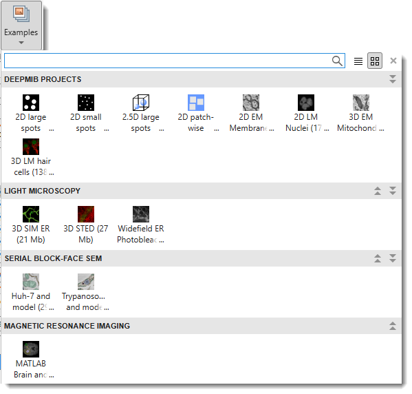{.on-glb align=left width="400"}
<div class="clear-float"></div>

??? abstract "DeepMIB projects → Synthetic 2D Large Spots"
    A complete DeepMIB project with a synthetic dataset for testing semantic segmentation  
    Includes a trained DeepLabV3-Resnet18 network for detecting large spots on a black background  
    Load the network via `2D_LargeSpots_2cl_DeepLabV3.mibCfg` using:  
    **Ribbon → Tools → Deep learning segmentation → Options tab → Config files → Load**  

    | Directory Tree | Segmentation Example |
    |----------------|----------------------|
    | 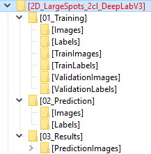{.on-glb} | 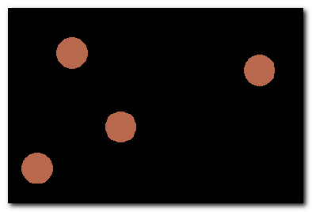{.on-glb} |

    **Reference**: [DOI: 10.5281/zenodo.10203188](https://doi.org/10.5281/zenodo.10203188)

??? abstract "DeepMIB projects → Synthetic 2D Small Spots"
    A complete DeepMIB project with a synthetic dataset for testing semantic segmentation  
    Includes a trained U-net network for detecting small random spots of two colors on a black background  
    Load the network via `2D_SmallSpots_3cl_Unet.mibCfg` using:  
    **Ribbon → Tools → Deep learning segmentation → Options tab → Config files → Load**  

    | Directory Tree | Segmentation Example |
    |----------------|----------------------|
    | 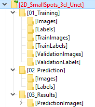{.on-glb} | 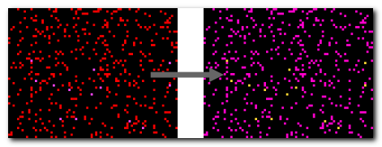{.on-glb} |

    **Reference**: [DOI: 10.5281/zenodo.10203764](https://doi.org/10.5281/zenodo.10203764)

??? abstract "DeepMIB projects → Synthetic 2.5D Large Spots"
    A complete DeepMIB project with a synthetic dataset for testing 2.5D depth-to-color semantic segmentation  
    Includes trained 2.5D DeepLabV3-Resnet18 and U-net networks for segmenting large 3D spots (ignoring 2D spots) using 5-slice subvolumes  
    Load the networks via:  
    - `Spots_25D_DLv3RN18_Z2C_xy200z5` (DeepLabV3-based)  
    - `Spots_25D_Unet_Z2C_xy200z5` (U-net-based)  
    Using **Ribbon → Tools → Deep learning segmentation → Options tab → Config files → Load** or drag-and-drop the config file into DeepMIB  

    | Directory Tree | Segmentation Example |
    |----------------|----------------------|
    | 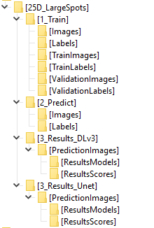{.on-glb} | 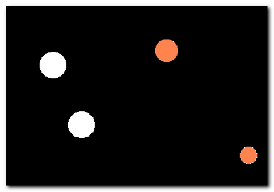{.on-glb} |

    **Reference**: [DOI: 10.5281/zenodo.10212417](https://doi.org/10.5281/zenodo.10212417)

??? abstract "DeepMIB projects → Synthetic 2D Patch-wise"
    A complete DeepMIB project with a synthetic dataset for testing patch-wise segmentation  
    Includes a trained Resnet18 network for detecting patches of large white spots on a black background  
    Load the network via `2D_LargeSpots_Patchwise_Resnet18.mibCfg` using:  
    **Ribbon → Tools → Deep learning segmentation → Options tab → Config files → Load**  

    | Directory Tree | Segmentation Example |
    |----------------|----------------------|
    | 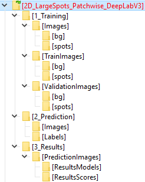{.on-glb} | 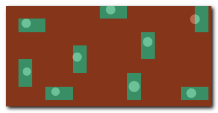{.on-glb} |

    **Reference**: [DOI: 10.5281/zenodo.10203861](https://doi.org/10.5281/zenodo.10203861)

??? abstract "DeepMIB projects → 2D EM Membranes"
    A complete DeepMIB project for segmenting membranes from serial-section TEM images  
    Includes trained U-net and DeepLabV3-Resnet18 networks  
    Updated project from [DeepMIB paper](https://journals.plos.org/ploscompbiol/article?id=10.1371/journal.pcbi.1008374) (Figure 1a)  
    Load via `2D_EM_membranes_Unet.mibCfg` or `2D_EM_membranes_DLabRN18.mibCfg` using:  
    **Ribbon → Tools → Deep learning segmentation → Options tab → Config files → Load**  
    See `readme.txt` for details  

    | Directory Tree | Segmentation Example |
    |----------------|----------------------|
    | 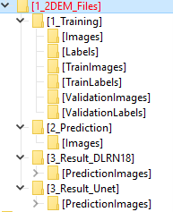{.on-glb} | 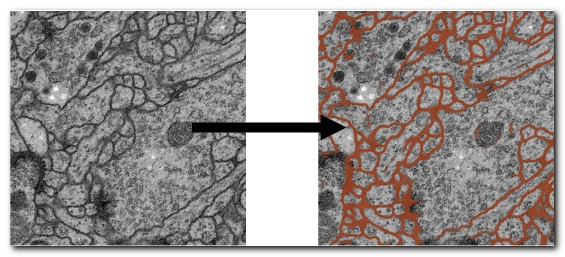{.on-glb} |

??? abstract "DeepMIB projects → 2D LM Nuclei"
    A complete DeepMIB project for segmenting nuclei, boundaries, and touching edges  
    Includes a trained U-net network  
    Updated project from [DeepMIB paper](https://journals.plos.org/ploscompbiol/article?id=10.1371/journal.pcbi.1008374) (Figure 1b)  
    Load via `valid_252px_32patches_50ep.mibCfg` using:  
    **Ribbon → Tools → Deep learning segmentation → Options tab → Config files → Load**  
    See `readme.txt` for details  

    | Directory Tree | Segmentation Example |
    |----------------|----------------------|
    | 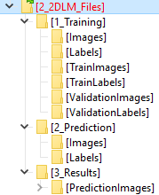{.on-glb} | 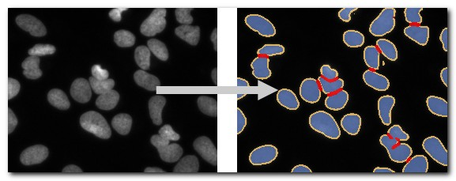{.on-glb} |

??? abstract "DeepMIB projects → 3D EM Mitochondria"
    A complete DeepMIB project for segmenting mitochondria  
    Includes a trained 3D U-net network  
    Updated project from [DeepMIB paper](https://journals.plos.org/ploscompbiol/article?id=10.1371/journal.pcbi.1008374) (Figure 1c)  
    Load via `NoValidation_valid_Aug_128px_256pat.mibCfg` using:  
    **Ribbon → Tools → Deep learning segmentation → Options tab → Config files → Load**  
    See `readme.txt` for details  

    | Directory Tree | Segmentation Example |
    |----------------|----------------------|
    | 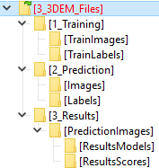{.on-glb} | 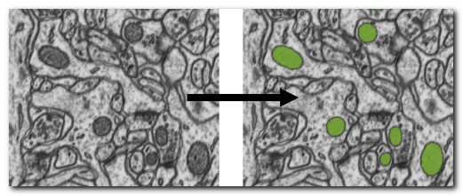{.on-glb} |

??? abstract "DeepMIB projects → 3D LM Inner Hair Cells"
    A complete DeepMIB project for segmenting inner hair cells, nuclei, and synapses  
    Includes a trained 3D anisotropic U-net network  
    Updated project from [DeepMIB paper](https://journals.plos.org/ploscompbiol/article?id=10.1371/journal.pcbi.1008374) (Figure 1d)  
    Load via `InnerEar3D_Hybrid_Same_136x64px_120ep.mibCfg` using:  
    **Ribbon → Tools → Deep learning segmentation → Options tab → Config files → Load**  
    See `readme.txt` for details  

    | Directory Tree | Segmentation Example |
    |----------------|----------------------|
    | 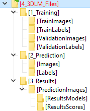{.on-glb} | 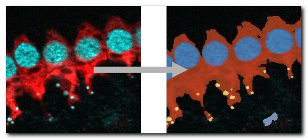{.on-glb} |

??? abstract "LM → 3D SIM ER"
    A 3D super-resolution structured illumination light microscopy dataset of endoplasmic reticulum  
    <br>
    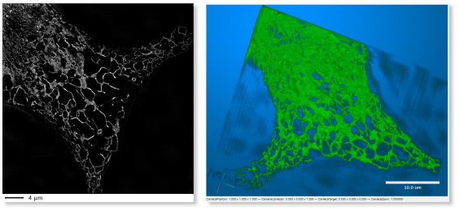{.on-glb}

??? abstract "LM → 3D STED"
    A 3D super-resolution Stimulated Emission Depletion (STED) microscopy dataset  
    <br>
    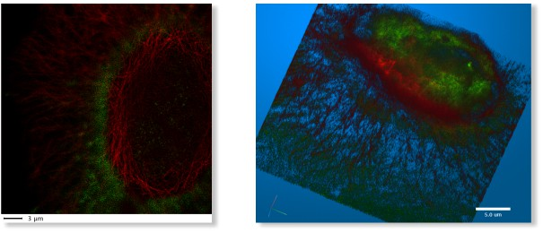{.on-glb}

??? abstract "LM → WF ER Photobleaching"
    A wide-field time-lapse imaging dataset of endoplasmic reticulum with visible photobleaching effect  
    <br>
    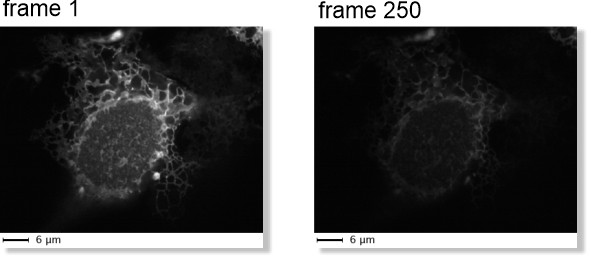{.on-glb}

??? abstract "SBEM → Huh-7 and Model"
    A small fragment of serial block face scanning electron microscopy dataset featuring a Huh-7 cell and a model of nuclei, endoplasmic reticulum, mitochondria, and lipid droplets  
    <br>
    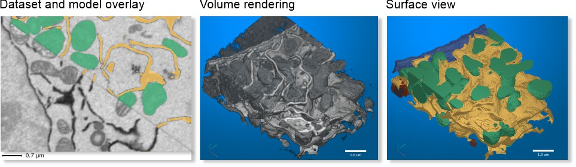{.on-glb}

??? abstract "SBEM → Trypanosoma and Model"
    A fragment of serial block face scanning electron microscopy dataset featuring a Trypanosoma brucei cell and a model of nuclei, endoplasmic reticulum, mitochondria, vesicles, lipid droplets, and cytoplasm  
    <br>     
    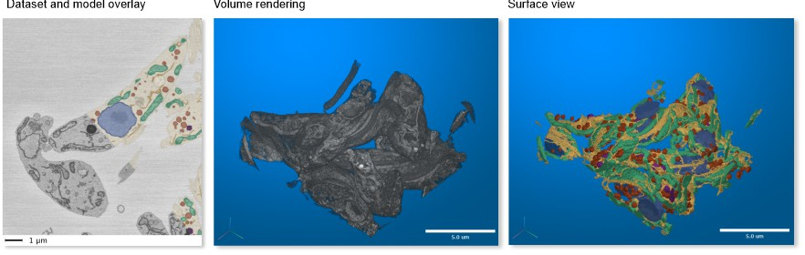{.on-glb}

??? abstract "MRI → MATLAB Brain and Model"
    A test brain dataset from MATLAB, captured with magnetic resonance imaging (MRI), including a tumor model  
    Available only in MIB for MATLAB <br><br> 
    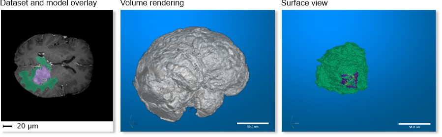{.on-glb}

---

## Export Image Section

### Save Image As

Save the open dataset to disk in various formats:

??? info "Supported Image Formats"
    - **AM, Amira Mesh**: Binary format for Amira Mesh
    - **JPEG, Joint Photographic Experts Group**: Lossy compressed RGB format
    - **HDF5, Hierarchical Data Format**: Version 5 format
    - **MRC, MRC format for IMOD**: Compatible with IMOD
    - **NRRD, Nearly Raw Raster Data**: Compatible with [3D Slicer](https://www.slicer.org)
    - **OME-TIFF 5D (*.ome.tiff)**: 5D stack using BioFormats library
    - **OME-Zarr v3 (*.zarr3)**: Chunked, pyramidal OME-Zarr v3 store — reopenable in MIB as a [BigData](../../panels/datasets/index.md) dataset and by external OME-Zarr tools. Choosing this format opens an export-settings dialog (pyramid levels, chunk size, sharding, compression)
    - **PNG, Portable Network Graphics (*.png)**: Lossless format
    - **TIF format, LZW compressed**: Multilayered or sequence of 2D files (max 2GB due to 32-bit offsets)
    - **TIF format, non-compressed**: Same as above, uncompressed

!!! tip "Exporting a pyramid level (Virtual / BigData datasets)"

    When the open dataset is pyramidal (a **Virtual** or **BigData** OME-Zarr dataset), the *Save Image As* dialog adds a <span class="widget widget-dropdown">Pyramid level</span> selector listing each resolution level with its dimensions (`s0` = full resolution … `sN` = coarsest). Pick the level you want to write out.

    The selected level is **streamed to disk one slice at a time**, so the full volume is never loaded into memory — useful for very large slides. The saved file carries the chosen level's voxel size (derived from the dataset bounding box). True per-slice streaming is available for **TIFF, PNG, JPEG, HDF5** and **OME-Zarr v3**; other formats write the selected level as a whole.

??? info "BigData datasets — format compatibility & memory use"

    **All** image formats above can save a **BigData** (or pyramidal **Virtual**) dataset at the chosen pyramid level. They differ only in how much memory the write needs:

    | Format | BigData | Memory-optimized (streamed slice-by-slice) |
    |--------|:-------:|:------------------------------------------:|
    | TIF (uncompressed / LZW) | ✅ | ✅ |
    | PNG | ✅ | ✅ |
    | JPEG | ✅ | ✅ |
    | HDF5 (`*.h5` / `*.xml`) | ✅ | ✅ |
    | OME-Zarr v3 (`*.zarr3`) | ✅ | ✅ |
    | Amira Mesh, Big Data Viewer HDF5, OME-TIFF, MRC, NRRD | ✅ | ❌ selected level is gathered whole before writing |

    Use the <span class="widget widget-dropdown">Pyramid level</span> dropdown to bound memory — a coarse level is small. The **memory-optimized** formats never hold even one full level in memory, so prefer them when exporting the full-resolution level (`s0`) of a very large slide.

### Export Image To

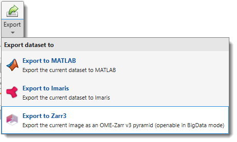{.on-glb align=left width="350"}

Export the current dataset to external applications:

- **MATLAB**: Export includes a `dictionary` with dataset parameters for re-import into MIB [:fontawesome-brands-youtube:{.red-color} Demo](https://youtu.be/zUJ1RUuTLVs)
- **Imaris**: Export to Imaris (requires Imaris installation) :material-information-outline:{.red-color title="Converted from MIB2, but not tested" }
- **Zarr3**: Export the dataset as a chunked, pyramidal OME-Zarr v3 store (`.zarr3`) — readable by MIB as a [BigData](../../panels/datasets/index.md) dataset and by external OME-Zarr–compatible tools

### Make Snapshot

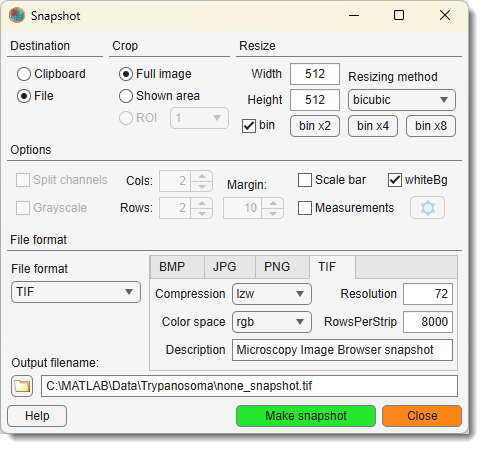{.on-glb align=left width="350"}

Capture a snapshot of the current slice, including all visible objects.  
See [Make Snapshot](home-makesnapshot.md) for details.

<div class="clear-float"></div>

### Render Volume

Visualize volumes in 3D using three methods:

#### MIB Rendering (recommended)

Hardware-accelerated volume rendering in MIB (since version 2.5, MATLAB R2018b).  
Supports downsampling, snapshots, and animations. Updated in MIB 2.84+ (MATLAB R2022b) to render 1-3 color channels with models (MATLAB-only as of 2.84).  
See [3D Viewer](home-mib3Dviewer.md) for details, [:fontawesome-brands-youtube:{.red-color} Demo](https://youtu.be/4CrfdOiZebk).

??? info "Volume Rendering Engines of MIB"
    - [x] MIB3 has only the new rendering engine available  

    | MIB 2.84+, R2022b or newer<br>(Volumes 1-3 colors + models) | MIB 2.5, R2018b or newer<br>(1-channel volumes or single material models) |
    |---------------------------------------------------------|---------------------------------------------------------|
    | 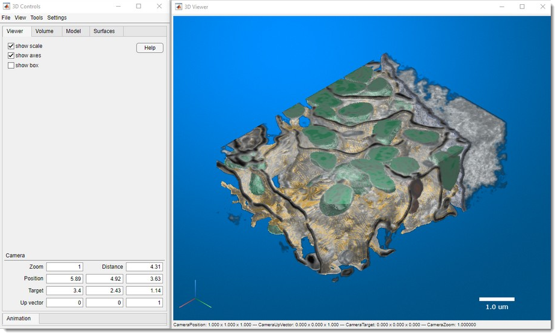{.on-glb}     | 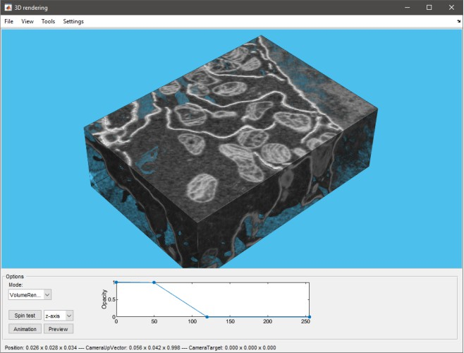{.on-glb}       |
    | **Limitations**:<br>- Available only for MIB for MATLAB (as of 2.84)<br>- One volume at a time | **Limitations**:<br>- One volume at a time (image or model material)<br>- Grayscale only (single channel)<br>- No scale bar |


#### MATLAB Volume Viewer

Export to MATLAB's Volume Viewer app<br>
:warning: *not available in compiled MIB*  
[:fontawesome-brands-youtube:{.red-color} Demo](https://youtu.be/J70V33f7bas)<br>
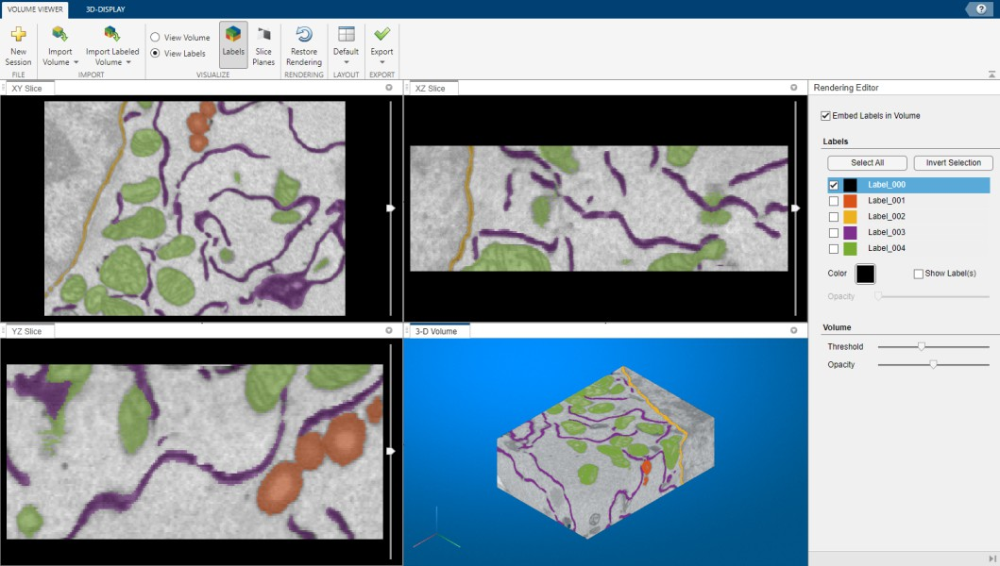{.on-glb width=500}

#### 3D viewer in Fiji

Render via Fiji (requires installation; see [System Requirements](https://mib.helsinki.fi/downloads_systemreq.html#fiji)). 
<br>[:fontawesome-brands-youtube:{.red-color} Demo](https://youtu.be/DZ1Tj3Fh2HM)

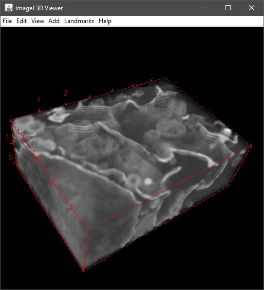{.on-glb align=left width="300"}

Additional parameters:  
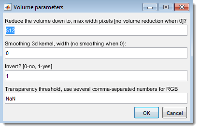{.on-glb align=left width="300" data-desc="The Home ribbon tab dropdown in MIB"} 

<div class="clear-float"></div>

- <span class="widget widget-edit">Reduce the volume down to, max width pixels</span>: Resize dataset (0 for no resizing)  
- <span class="widget widget-edit">Smoothing 3D kernel, width</span>: Apply Gaussian blur (0 for no smoothing)  
- <span class="widget widget-edit">Invert? \[0-no, 1-yes\]</span>: Invert for electron microscopy  
- <span class="widget widget-edit">Transparency threshold</span>: Set transparency (comma-separated for each channel), adjustable in Fiji's 3D Viewer (**Edit → Attributes → Adjust threshold**)

<div class="clear-float"></div>

### Make Movie

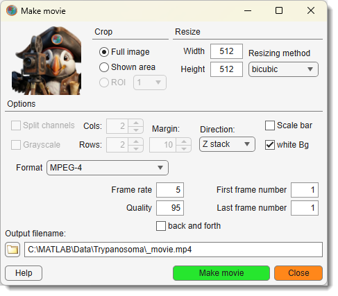{.on-glb align=left width="300"}

Save the dataset as a movie file, capturing all visible objects in the image view window.  

!!! info Note on scale bar
    Scale bar may not render if the image width is too small. 

See [Make Movie](home-makevideo.md) for details.  

<div class="clear-float"></div>

---

## I/O Tools Section

### Batch Processing

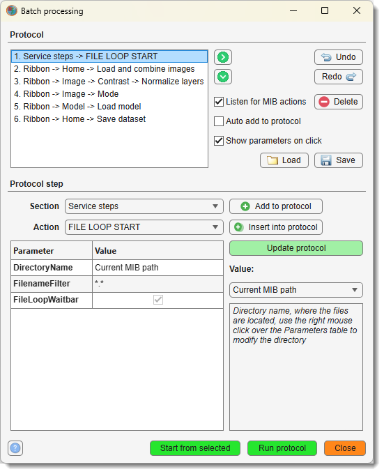{.on-glb align=left width="300"}

Design and apply image processing workflows to multiple images automatically.  
See [Batch Processing](home-batchprocessing.md) for details.

<div class="clear-float"></div>

### Dataset Chunking

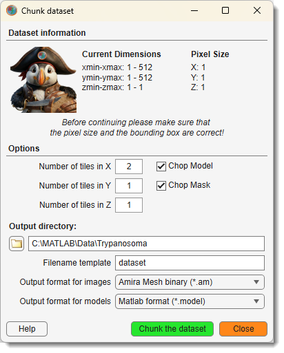{.on-glb align=left width="300"}

Split a large dataset into smaller subvolumes and reassemble them later, or fuse previously cropped datasets.
Use the **Dataset chunking** dropdown to access:

- **Chunk dataset**: Split the image into smaller chunks for block-based or parallel processing
- **Stitch dataset**: Reassemble previously chunked subvolumes back into the full image

See [Dataset Chunking](home-choppedimages.md) for details.

<div class="clear-float"></div>

### Image Shuffling

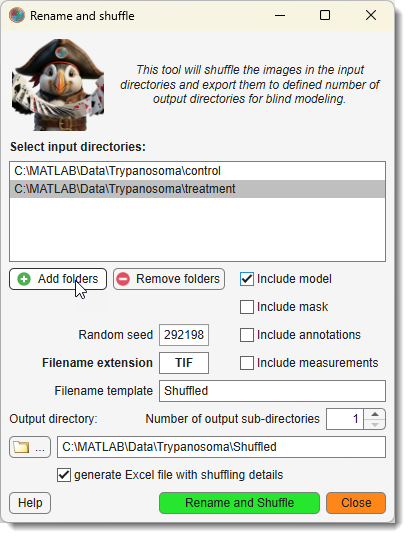{.on-glb align=left width="300"}

Shuffle files for blind modelling and revert models to original filenames for analysis.
Use the **Image shuffling** dropdown to access:

- **Shuffle images**: Randomly reorder and rename images to reduce processing bias
- **Restore order**: Revert images to their original order and filenames

See [Image Shuffling](home-renameandshuffle.md) for details.

<div class="clear-float"></div>

---

## Preferences Section

### Layout Management

Save and restore the arrangement of MIB panels using the **Load layout** and **Save layout** buttons.

**Load layout** options:

- **Load local default layout**: Restore the layout saved as your personal default (`mibDefaultLayout.json` located in the MIB preferences folder)
- **Load custom layout**: Load a layout from a custom file
- **Load MIB default layout**: Restore the factory default MIB layout

**Save layout** options:

- **Save the current layout as default**: Save the current panel arrangement as your personal default  
  Stored as `mibDefaultLayout.json` in the MIB preferences folder (shown at startup as `MIB parameters file: ...`)
- **Save the current layout in a custom file**: Save to a custom file for sharing or backup
- **Save the current layout as MIB default**: Override the factory default layout (affects all users of this MIB installation)

### Preferences

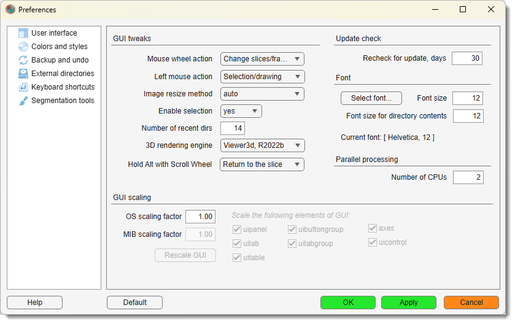{.on-glb align=left width="350"}

Edit MIB preferences, including colors for **Selection**, **Model**, and **Mask** layers, mouse wheel behavior, key settings, and Undo options.  
See [Preferences](home-preferences.md) for details.

<div class="clear-float"></div>

MIB saves configuration in a file generated upon closing:

??? info "Configuration File Location"
    - **Windows**: `C:\Users\Username\MATLAB\mib3.mat` or TEMP directory (`C:\Users\Username\AppData\Local\Temp\`)  
      Access TEMP via **Windows → Start → %TEMP%**  
    - **Linux**: `/home/username/Matlab` or local TEMP directory  
    - **MacOS**: `/Users/username/Matlab` or local TEMP directory
    
    Location of the configuration file is shown upon MIB startup as:<br>
    `MIB parameters file: C:\Users\username\Matlab\mib3.mat`

### Help

Access help and application information via the **Help** dropdown:

- **Open MIB help**: Open the MIB documentation website
- **Tip of the day**: Display a random usage tip
- **Support on image.sc**: Open the [image.sc](https://forum.image.sc) community forum for MIB questions and support
- **Personal support session**: Request a one-on-one remote support session with the MIB team
- **Check for update**: Check for a newer version of MIB and download it if available
- **Your personal stats**: View your cumulative MIB usage statistics
- **Licenses**: View licenses for MIB and all included third-party tools
- **About MIB**: Show MIB version information and credits

---

## Dev Corner Section

### Developer mode

When enabled, widget tooltips display the internal handle name of each ribbon control - useful for identifying widgets when customizing or scripting MIB.

### API class reference

Opens the MIB API class reference documentation.

### Development

Calls `controllers.MibRibbon.homeDevTest_Callback()` — a reserved entry point for internal debugging. Can also be invoked directly from the MATLAB command line:

```matlab
mib.cRibbon.homeDevTest_Callback();
```

---

*Back to [MIB](../../../index.md) | [User interface](../../index.md) | [Ribbon](../index.md)*
