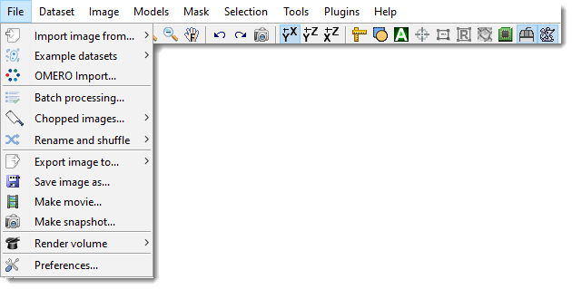

# Home Ribbon Tab

The **Home** ribbon tab in Microscopy Image Browser (MIB) provides tools for handling image datasets, including importing, exporting, saving, and rendering options. This page details each section, with demonstrations and references where available.

*Back to [MIB](../../../index.md) | [User interface](../../index.md) | [Ribbon](../index.md)*

---

## Home Ribbon Tab Overview

The image above shows the **Home** tab of the ribbon at the top of the MIB interface. This tab organizes essential file-related actions for working with multidimensional microscopy datasets.

---

## Import Image From

Load images into MIB from various sources:

- **MATLAB**: Import an image from the main MATLAB workspace into MIB  
  Optionally include a `containers.Map` with dataset parameters that were generated by the **Export image to** command [:fontawesome-brands-youtube:{.red-color} Brief demo](https://youtu.be/zUJ1RUuTLVs)
- **Clipboard**: Paste an image from the system clipboard  
  Uses the [IMCLIPBOARD](http://www.mathworks.com/matlabcentral/fileexchange/28708-imclipboard) function by Jiro Doke, MathWorks, 2010 [:fontawesome-brands-youtube:{.red-color} Brief demo](https://youtu.be/kcN0Na_YC_U)
- **Imaris**: Import a dataset from Imaris  
  Requires [Imaris and ImarisXT](http://www.bitplane.com/) and uses [IceImarisConnector](http://www.scs2.net/next/index.php?id=110) by Aaron C. Ponti, ETH Zurich  
  [:fontawesome-brands-youtube:{.red-color} Demo](https://youtu.be/MbK2JcTrZFw?list=PLGkFvW985wz8cj8CWmXOFkXpvoX_HwXzj)
- **URL**: Open an image from a URL address  
  The link must include the protocol (e.g., `http://`)  [:fontawesome-brands-youtube:{.red-color} Brief demo](https://youtu.be/FNEVgKzbGqQ)

---

## Example Datasets

Quickly access demo datasets and full DeepMIB projects for image segmentation, grouped by data collection techniques.

??? abstract "DeepMIB projects → Synthetic 2D Large Spots"
    A complete DeepMIB project with a synthetic dataset for testing semantic segmentation  
    Includes a trained DeepLabV3-Resnet18 network for detecting large spots on a black background  
    Load the network via `2D_LargeSpots_2cl_DeepLabV3.mibCfg` using:  
    **Ribbon → Tools → Deep learning segmentation → Options tab → Config files → Load**  

    | Directory Tree | Segmentation Example |
    |----------------|----------------------|
    | {.on-glb} | {.on-glb} |

    **Reference**: [DOI: 10.5281/zenodo.10203188](https://doi.org/10.5281/zenodo.10203188)

??? abstract "DeepMIB projects → Synthetic 2D Small Spots"
    A complete DeepMIB project with a synthetic dataset for testing semantic segmentation  
    Includes a trained U-net network for detecting small random spots of two colors on a black background  
    Load the network via `2D_SmallSpots_3cl_Unet.mibCfg` using:  
    **Ribbon → Tools → Deep learning segmentation → Options tab → Config files → Load**  

    | Directory Tree | Segmentation Example |
    |----------------|----------------------|
    | {.on-glb} | {.on-glb} |

    **Reference**: [DOI: 10.5281/zenodo.10203764](https://doi.org/10.5281/zenodo.10203764)

??? abstract "DeepMIB projects → Synthetic 2.5D Large Spots"
    A complete DeepMIB project with a synthetic dataset for testing 2.5D depth-to-color semantic segmentation  
    Includes trained 2.5D DeepLabV3-Resnet18 and U-net networks for segmenting large 3D spots (ignoring 2D spots) using 5-slice subvolumes  
    Load the networks via:  
    - `Spots_25D_DLv3RN18_Z2C_xy200z5` (DeepLabV3-based)  
    - `Spots_25D_Unet_Z2C_xy200z5` (U-net-based)  
    Using **Ribbon → Tools → Deep learning segmentation → Options tab → Config files → Load** or drag-and-drop the config file into DeepMIB  

    | Directory Tree | Segmentation Example |
    |----------------|----------------------|
    | {.on-glb} | {.on-glb} |

    **Reference**: [DOI: 10.5281/zenodo.10212417](https://doi.org/10.5281/zenodo.10212417)

??? abstract "DeepMIB projects → Synthetic 2D Patch-wise"
    A complete DeepMIB project with a synthetic dataset for testing patch-wise segmentation  
    Includes a trained Resnet18 network for detecting patches of large white spots on a black background  
    Load the network via `2D_LargeSpots_Patchwise_Resnet18.mibCfg` using:  
    **Ribbon → Tools → Deep learning segmentation → Options tab → Config files → Load**  

    | Directory Tree | Segmentation Example |
    |----------------|----------------------|
    | {.on-glb} | {.on-glb} |

    **Reference**: [DOI: 10.5281/zenodo.10203861](https://doi.org/10.5281/zenodo.10203861)

??? abstract "DeepMIB projects → 2D EM Membranes"
    A complete DeepMIB project for segmenting membranes from serial-section TEM images  
    Includes trained U-net and DeepLabV3-Resnet18 networks  
    Updated project from [DeepMIB paper](https://journals.plos.org/ploscompbiol/article?id=10.1371/journal.pcbi.1008374) (Figure 1a)  
    Load via `2D_EM_membranes_Unet.mibCfg` or `2D_EM_membranes_DLabRN18.mibCfg` using:  
    **Ribbon → Tools → Deep learning segmentation → Options tab → Config files → Load**  
    See `readme.txt` for details  

    | Directory Tree | Segmentation Example |
    |----------------|----------------------|
    | {.on-glb} | {.on-glb} |

??? abstract "DeepMIB projects → 2D LM Nuclei"
    A complete DeepMIB project for segmenting nuclei, boundaries, and touching edges  
    Includes a trained U-net network  
    Updated project from [DeepMIB paper](https://journals.plos.org/ploscompbiol/article?id=10.1371/journal.pcbi.1008374) (Figure 1b)  
    Load via `valid_252px_32patches_50ep.mibCfg` using:  
    **Ribbon → Tools → Deep learning segmentation → Options tab → Config files → Load**  
    See `readme.txt` for details  

    | Directory Tree | Segmentation Example |
    |----------------|----------------------|
    | {.on-glb} | {.on-glb} |

??? abstract "DeepMIB projects → 3D EM Mitochondria"
    A complete DeepMIB project for segmenting mitochondria  
    Includes a trained 3D U-net network  
    Updated project from [DeepMIB paper](https://journals.plos.org/ploscompbiol/article?id=10.1371/journal.pcbi.1008374) (Figure 1c)  
    Load via `NoValidation_valid_Aug_128px_256pat.mibCfg` using:  
    **Ribbon → Tools → Deep learning segmentation → Options tab → Config files → Load**  
    See `readme.txt` for details  

    | Directory Tree | Segmentation Example |
    |----------------|----------------------|
    | {.on-glb} | {.on-glb} |

??? abstract "DeepMIB projects → 3D LM Inner Hair Cells"
    A complete DeepMIB project for segmenting inner hair cells, nuclei, and synapses  
    Includes a trained 3D anisotropic U-net network  
    Updated project from [DeepMIB paper](https://journals.plos.org/ploscompbiol/article?id=10.1371/journal.pcbi.1008374) (Figure 1d)  
    Load via `InnerEar3D_Hybrid_Same_136x64px_120ep.mibCfg` using:  
    **Ribbon → Tools → Deep learning segmentation → Options tab → Config files → Load**  
    See `readme.txt` for details  

    | Directory Tree | Segmentation Example |
    |----------------|----------------------|
    | {.on-glb} | {.on-glb} |

??? abstract "LM → 3D SIM ER"
    A 3D super-resolution structured illumination light microscopy dataset of endoplasmic reticulum  
     
    {.on-glb}

??? abstract "LM → 3D STED"
    A 3D super-resolution Stimulated Emission Depletion (STED) microscopy dataset  
     
    {.on-glb}

??? abstract "LM → WF ER Photobleaching"
    A wide-field time-lapse imaging dataset of endoplasmic reticulum with visible photobleaching effect  
     
    {.on-glb}

??? abstract "SBEM → Huh-7 and Model"
    A small fragment of serial block face scanning electron microscopy dataset featuring a Huh-7 cell and a model of nuclei, endoplasmic reticulum, mitochondria, and lipid droplets  
     
    {.on-glb}

??? abstract "SBEM → Trypanosoma and Model"
    A fragment of serial block face scanning electron microscopy dataset featuring a Trypanosoma brucei cell and a model of nuclei, endoplasmic reticulum, mitochondria, vesicles, lipid droplets, and cytoplasm  
          
    {.on-glb}

??? abstract "MRI → MATLAB Brain and Model"
    A test brain dataset from MATLAB, captured with magnetic resonance imaging (MRI), including a tumor model  
    Available only in MIB for MATLAB    
    {.on-glb}

---

## OMERO Import

Connect to an OMERO server and load images. Requires [OMERO server](http://www.openmicroscopy.org/site) 
files; see [System Requirements](https://mib.helsinki.fi/downloads_systemreq.html#omero) for installation details.

[:fontawesome-brands-youtube:{.red-color} Demo](https://youtu.be/iR7OL0eJGuw)

1. Select a server (do not copy/paste the password):  
   
2. Choose a dataset and range:  
   {.on-glb align=left width="400"}

---

## Batch Processing

{.on-glb align=left width="300"}

Batch processing dialog.

Design and apply image processing workflows to multiple images automatically.  
See [Batch Processing](home-batchprocessing.md) for details.

---

## Chopped Images

{.on-glb align=left width="300"}

Split a large dataset into smaller parts and recombine them later, or fuse previously cropped datasets.  
See [Chopped Images](home-choppedimages.md) for details.

---

## Rename and Shuffle

{.on-glb align=left width="300"}

Shuffle files for blind modeling and revert models to original filenames for analysis.  
See [Rename and Shuffle](home-renameandshuffle.md) for details.

---

## Export Image To

Export images to external applications:

- **MATLAB**: Export includes a `containers.Map` with dataset parameters for re-import into MIB [:fontawesome-brands-youtube:{.red-color} Demo](https://youtu.be/zUJ1RUuTLVs)
- **Imaris**: Export to Imaris (requires Imaris installation)

---

## Save Image As

Save the open dataset to disk in various formats:

??? info "Supported Image Formats"
    - **AM, Amira Mesh**: Binary format for Amira Mesh
    - **JPEG, Joint Photographic Experts Group**: Lossy compressed RGB format
    - **HDF5, Hierarchical Data Format**: Version 5 format
    - **MRC, MRC format for IMOD**: Compatible with IMOD
    - **NRRD, Nearly Raw Raster Data**: Compatible with [3D Slicer](https://www.slicer.org)
    - **OME-TIFF 5D (*.ome.tiff)**: 5D stack using BioFormats library
    - **PNG, Portable Network Graphics (*.png)**: Lossless format
    - **TIF format, LZW compressed**: Multilayered or sequence of 2D files (max 2GB due to 32-bit offsets)
    - **TIF format, non-compressed**: Same as above, uncompressed

---

## Make Movie

{.on-glb align=left width="300"}

Save the dataset as a movie file, capturing all visible objects in the image view window.  

!!! info Note on scale bar
    Scale bar may not render if the image width is too small. 

See [Make Movie](home-makevideo.md) for details.  

---

## Make Snapshot

{.on-glb align=left width="350"}

Capture a snapshot of the current slice, including all visible objects.  
See [Make Snapshot](home-makesnapshot.md) for details.

---

## Render Volume

Visualize volumes in 3D using three methods:

### MIB Rendering (recommended)

Hardware-accelerated volume rendering in MIB (since version 2.5, MATLAB R2018b).  
Supports downsampling, snapshots, and animations. Updated in MIB 2.84 (MATLAB R2022b) to render 1-3 color channels with models (MATLAB-only as of 2.84).  
See [3D Viewer](home-mib3Dviewer.md) for details.

??? info "Volume Rendering Engines of MIB"
    | MIB 2.84, R2022b or newer (Volumes 1-3 colors + models) | MIB 2.5, R2018b or newer (1-channel volumes or single material models) |
    |---------------------------------------------------------|---------------------------------------------------------|
    | {.on-glb}     | {.on-glb}       |
    | **Limitations**: - Available only for MIB for MATLAB (as of 2.84) - One volume at a time | **Limitations**: - One volume at a time (image or model material) - Grayscale only (single channel) - No scale bar |

Select the engine in:  
**MIB → Ribbon → Home → Preferences → User interface → 3D rendering engine**  
[:fontawesome-brands-youtube:{.red-color} Demo](https://youtu.be/4CrfdOiZebk)

### MATLAB Volume Viewer

Export to MATLAB’s Volume Viewer app (R2017a or newer, not available in compiled MIB).  
{.on-glb width=500}   
[:fontawesome-brands-youtube:{.red-color} Demo](https://youtu.be/J70V33f7bas)

### Fiji 3D Viewer

Render via Fiji (requires installation; see [System Requirements](https://mib.helsinki.fi/downloads_systemreq.html#fiji)). [:fontawesome-brands-youtube:{.red-color} Demo](https://youtu.be/DZ1Tj3Fh2HM)

{.on-glb align=left width="300"}

Additional parameters:  
{.on-glb align=left width="300" data-desc="The Home ribbon tab dropdown in MIB"} 

- **Reduce the volume down to, max width pixels**: Resize dataset (0 for no resizing)  
- **Smoothing 3D kernel, width**: Apply Gaussian blur (0 for no smoothing)  
- **Invert? [0-no, 1-yes]**: Invert for electron microscopy  
- **Transparency threshold**: Set transparency (comma-separated for each channel), adjustable in Fiji’s 3D Viewer (**Edit → Attributes → Adjust threshold**)

---

## Preferences

{.on-glb align=left width="350"}

Edit MIB preferences, including colors for **Selection**, **Model**, and **Mask** layers, mouse wheel behavior, key settings, and Undo options.  
See [Preferences](home-preferences.md) for details.

MIB saves configuration in a file generated upon closing:

??? info "Configuration File Location"
    - **Windows**: `C:\Users\Username\MATLAB\mib.mat` or TEMP directory (`C:\Users\Username\AppData\Local\Temp\`)  
      Access TEMP via **Windows → Start → %TEMP%**  
    - **Linux**: `/home/username/Matlab` or local TEMP directory  
    - **MacOS**: `/Users/username/Matlab` or local TEMP directory
    
    Location of the configuration file is shown upon MIB startup as: 
    `MIB parameters file: C:\Users\username\Matlab\mib.mat`
---

*Back to [MIB](../../../index.md) | [User interface](../../index.md) | [Ribbon](../index.md)*
