# Image Filters Dialog

*Back to [MIB](../../../index.md) | [User interface](../../index.md) | [Ribbon](../index.md) | [Image](index.md)*

---

## Overview

{.on-glb align=left width="400"} 

Collection of image filters arranged into four categories:

- Basic image filtering in the spatial domain
- Edge-preserving filtering
- Contrast adjustment
- Image binarization

Demonstration

- [:fontawesome-brands-youtube:{.red-color} Image filters demo](https://youtu.be/QZU3jSoEXJM)
 

---

## Options

Prior to filtering images, the following options may be tweaked:

- Dataset type: specify whether filtering applies to the shown slice, current 3D stack, or the whole dataset.
- Source layer: select the layer to be filtered (e.g., Image, Selection, Mask, Model).
- Color channel: choose a specific color channel, all shown channels, or all channels in the image.
- Material index: index of material to filter (available when *Source layer* is *Model*).
- <label class="widget widget-checkbox">3D</label>: apply a 3D filter.

The filtered image can be post-processed using a dropdown at the bottom of the dialog:

- **Filter image**: filter and display the result.
- **Filter and subtract**: filter and subtract the result from the unfiltered image.
- **Filter and add**: filter and add the result to the unfiltered image.

---

## Basic image filtering in the spatial domain

**Average filter**   
  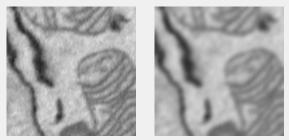{.on-glb align=left width="300"}  
  Averages image signal using a rectangular filter. Uses MATLAB’s [imfilter](https://www.mathworks.com/help/images/ref/imfilter.html) with the `average` filter from [fspecial](https://www.mathworks.com/help/images/ref/fspecial.html).  
  *Supports*: 2D/3D  
  

**Circular averaging filter (pillbox)**   
  {.on-glb align=left width="300"}  
  Averages image signal using a disk-shaped filter. Uses [imfilter](https://www.mathworks.com/help/images/ref/imfilter.html) with the `disk` filter from [fspecial](https://www.mathworks.com/help/images/ref/fspecial.html).  
  *Supports*: 2D  
  

**Distance map filter**  
  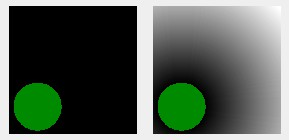{.on-glb align=left width="300"}  

  Calculates a distance map from seeds in the *Source Layer* (Selection, Mask, or Material). 
  2D uses [bwdist](https://www.mathworks.com/help/images/ref/bwdist.html) with four options for distance calculations; 
  3D uses [bwdistsc](https://se.mathworks.com/matlabcentral/fileexchange/15455-3d-euclidean-distance-transform-for-variable-data-aspect-ratio) "euclidean" only, by Yuriy Mishchenko.
   *Supports*: 2D/3D 
  

**Elastic distortion filter**  
  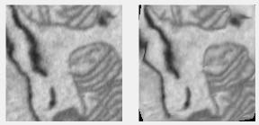{.on-glb align=left width="300"}  
  Applies elastic distortion based on Simard et al., "Best Practices for Convolutional Neural Networks Applied to Visual Document Analysis" ([link](http://citeseerx.ist.psu.edu/viewdoc/download?doi=10.1.1.160.8494&rep=rep1&type=pdf)). See also [StackOverflow](https://stackoverflow.com/questions/39308301/expand-mnist-elastic-deformations-matlab) and [Elastic Distortion Transformation](https://se.mathworks.com/matlabcentral/fileexchange/66663-elastic-distortion-transformation-on-an-image) by David Franco.  
  *Supports*: 2D  
  

**Entropy filter**  
  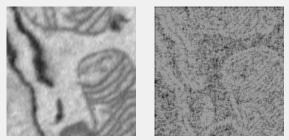{.on-glb align=left width="300"}  
  Local entropy filter; each pixel shows entropy (`-sum(p.*log2(p))`, where `p` is normalized histogram counts) of its neighborhood. See [entropyfilt](https://www.mathworks.com/help/images/ref/entropyfilt.html).  
  *Supports*: 2D  
  

**Frangi filter**  
  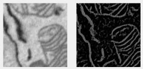{.on-glb align=left width="300"}  
  Enhances elongated or tubular structures using Hessian-based multiscale filtering. Uses [fibermetric](https://www.mathworks.com/help/images/ref/fibermetric.html).  
  *Supports*: 2D/3D  
  

**Gaussian smoothing filter**  
  {.on-glb align=left width="300"}  
  Rotationally symmetric Gaussian lowpass filter with size (*Hsize*) and standard deviation (*Sigma*). 2D uses [imgaussfilt](https://www.mathworks.com/help/images/ref/imgaussfilt.html); 3D uses [imgaussfilt3](https://www.mathworks.com/help/images/ref/imgaussfilt3.html).  
  *Supports*: 2D/3D  
  

**Gradient filter**  
  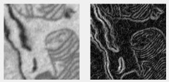{.on-glb align=left width="300"}  
  Calculates image gradient using [gradient](https://www.mathworks.com/help/images/ref/gradient.html). Result combines X, Y, Z components as `sqrt(X^2 + Y^2 + Z^2)`.  
  *Supports*: 2D/3D  
  

**Laplacian of Gaussian filter**  
  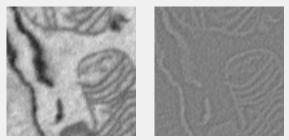{.on-glb align=left width="300"}  
  Highlights edges using the Laplacian of Gaussian filter. Converted to unsigned integers with a *NormalizationFactor*. Uses [imfilter](https://www.mathworks.com/help/images/ref/imfilter.html) with the `log` filter from [fspecial](https://www.mathworks.com/help/images/ref/fspecial.html).  
  *Supports*: 2D/3D  
  

**Mathematical operations**  
  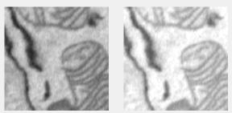{.on-glb align=left width="300"}  
  Applies standard operations (add, subtract, multiply, divide) to the image, with optional class conversion.  
  *Supports*: 2D  
  

**Mode filter (R2020a or newer)**  
  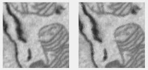{.on-glb align=left width="300"}  
  Each pixel shows the mode (most frequent value) in its neighborhood. Uses [modefilt](https://se.mathworks.com/help/releases/R2020a/images/ref/modefilt.html).  
  *Supports*: 2D/3D  
  

**Motion filter**  
  {.on-glb align=left width="300"}  
  Applies motion blur. Uses [imfilter](https://www.mathworks.com/help/images/ref/imfilter.html) with the `motion` filter from [fspecial](https://www.mathworks.com/help/images/ref/fspecial.html).  
  *Supports*: 2D  
  

**Prewitt filter**  
  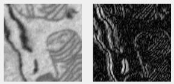{.on-glb align=left width="300"}  
  Enhances edges using the Prewitt method. Uses [imfilter](https://www.mathworks.com/help/images/ref/imfilter.html) with the `prewitt` filter from [fspecial](https://www.mathworks.com/help/images/ref/fspecial.html).  
  *Supports*: 2D/3D  
  

**Range filter**  
  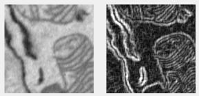{.on-glb align=left width="300"}  
  Local range filter; each pixel shows the range (max - min) of its neighborhood. See [rangefilt](https://www.mathworks.com/help/images/ref/rangefilt.html).  
  *Supports*: 2D/3D  
  

**Salt and pepper filter**  
  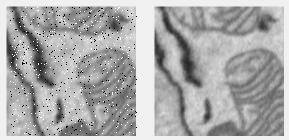{.on-glb align=left width="300"}  
  Removes salt & pepper noise using a median filter, then removes pixels above an *IntensityThreshold* based on the difference.  
  *Supports*: 2D  
  

**Sobel filter**  
  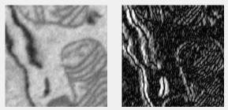{.on-glb align=left width="300"}  
  Enhances edges using the Sobel method. Uses [imfilter](https://www.mathworks.com/help/images/ref/imfilter.html) with the `sobel` filter from [fspecial](https://www.mathworks.com/help/images/ref/fspecial.html).  
  *Supports*: 2D  
  

**Std filter**  
  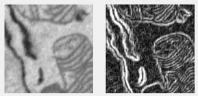{.on-glb align=left width="300"}  
  Local standard deviation filter; each pixel shows the standard deviation of its neighborhood with symmetric padding. See [stdfilt](https://www.mathworks.com/help/images/ref/stdfilt.html).  
  *Supports*: 2D  
  

---

## Edge-preserving filtering

Remove noise while preserving object edges using one of the following filters.

**Anisotropic diffusion filter**  
  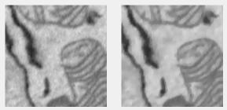{.on-glb align=left width="300"}  
  Edge-preserving anisotropic diffusion with the Perona-Malik algorithm. Uses [imdiffusefilt](https://www.mathworks.com/help/images/ref/imdiffusefilt.html).  
  *Supports*: 2D  
  

**Bilateral filter**  
  {.on-glb align=left width="300"}  
  Edge-preserving bilateral filtering with Gaussian kernels. Uses [imbilatfilt](https://www.mathworks.com/help/images/ref/imbilatfilt.html).  
  *Supports*: 2D  
  

**DNNdenoise filter**  
  {.on-glb align=left width="300"}  
  Denoises using a deep neural network. Uses [denoiseImage](https://www.mathworks.com/help/images/ref/denoiseimage.html).  
  *Supports*: 2D  
  

**Median filter**  
  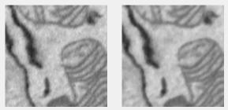{.on-glb align=left width="300"}  
  Median filtering; each pixel shows the median value in its neighborhood. 2D uses [medfilt2](https://www.mathworks.com/help/images/ref/medfilt2.html); 3D uses [medfilt3](https://www.mathworks.com/help/images/ref/medfilt3.html).  
  *Supports*: 2D  
  

**Non-local means filter**  
  {.on-glb align=left width="300"}  
  Uses [imnlmfilt](https://www.mathworks.com/help/images/ref/imnlmfilt.html) for non-local means filtering.  
  *Supports*: 2D  
  

**BMxD filter**  
  {.on-glb align=left width="300"}  
  Uses block-matching (BM3D v2.01) and 3D collaborative ((BM4D v3.2)) filtering. Licensed for non-profit use only. 
  See installation details in [System requirements](https://mib.helsinki.fi/downloads_systemreq.html#BMxD).  
  *Supports*: 2D  
  

!!! info "BM3D and BM4D References"

    * [**BM3D**] K. Dabov, A. Foi, V. Katkovnik, and K. Egiazarian, Image Denoising by Sparse 3D Transform-Domain Collaborative Filtering, 
      [IEEE Transactions on Image Processing](https://ieeexplore.ieee.org/document/4271520), vol. 16, no. 8, August, 2007.
      preprint at [http://www.cs.tut.fi/~foi/GCF-BM3D](http://www.cs.tut.fi/~foi/GCF-BM3D).
    * [**BM4D**] M. Maggioni, V. Katkovnik, K. Egiazarian, A. Foi, "A Nonlocal Transform-Domain Filter for Volumetric Data Denoising and
      Reconstruction", IEEE Trans. Image Process., vol. 22, no. 1, pp. 119-133, January 2013.  [doi:10.1109/TIP.2012.2210725](https://ieeexplore.ieee.org/document/6253256)
    * [**BM4D**] M. Maggioni, A. Foi, "Nonlocal Transform-Domain Denoising ofVolumetric Data With Groupwise Adaptive Variance Estimation", 
      [Proc. SPIE Electronic Imaging](https://www.spiedigitallibrary.org/conference-proceedings-of-spie/8296/1/Nonlocal-transform-domain-denoising-of-volumetric-data-with-groupwise-adaptive/10.1117/12.912109.short) 2012, San Francisco, CA, USA, Jan. 2012.

---

## Contrast adjustment

Filters intended to adjust image contrast.

**Add noise filter**  
  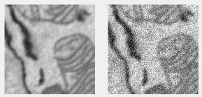{.on-glb align=left width="300"}  
  Adds noise using [imnoise](https://www.mathworks.com/help/images/ref/imnoise.html). Options:  
  - *Gaussian*: Gaussian white noise  
  - *Poisson*: Poisson noise from the data  
  - *Salt & pepper*: Adds salt and pepper noise  
  - *Speckle*: Multiplicative noise (`J = I + n*I`, `n` is uniform random noise, mean 0, variance 0.05)  
  *Supports*: 2D  
  

**Fast Local Laplacian filter**  
  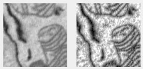{.on-glb align=left width="300"}  
  Enhances contrast, removes noise, or smooths details. Uses [locallapfilt](https://www.mathworks.com/help/images/ref/locallapfilt.html).  
  *Supports*: 2D  
  

**Flat-field correction**  
  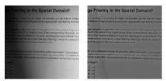{.on-glb align=left width="300"}  
  Corrects grayscale or RGB images using Gaussian smoothing (*sigma*) to approximate shading. Uses [imflatfield](https://www.mathworks.com/help/images/ref/imflatfield.html).  
  *Supports*: 2D  
  

**Local Brighten filter**  
  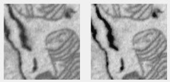{.on-glb align=left width="300"}  
  Brightens low-light images. Uses [imlocalbrighten](https://www.mathworks.com/help/images/ref/imlocalbrighten.html).  
  *Supports*: 2D  
  

**Local Contrast filter**  
  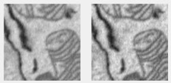{.on-glb align=left width="300"}  
  Edge-aware local contrast manipulation. Uses [localcontrast](https://www.mathworks.com/help/images/ref/localcontrast.html).  
  *Supports*: 2D  
  

**Reduce Haze filter**  
  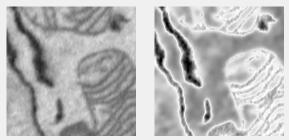{.on-glb align=left width="300"}  
  Reduces atmospheric haze. Uses [imreducehaze](https://www.mathworks.com/help/images/ref/imreducehaze.html).  
  *Supports*: 2D  
  

**Unsharp mask filter**  
  {.on-glb align=left width="300"}  
  Sharpens by subtracting a blurred version from the original. Uses [imsharpen](https://www.mathworks.com/help/images/ref/imsharpen.html).  
  *Supports*: 2D  
  

---

## Image binarization

Filters that process the image and generate a bitmap mask, assignable to the Selection or Mask layers via the DestinationLayer.

**Edge filter**  
  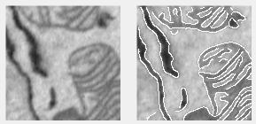{.on-glb align=left width="300"}  
  Finds edges in intensity images using [edge](https://www.mathworks.com/help/images/ref/edge.html). 
  *Supports*: 2D  

Options:
  
  - *Approxcanny*: Faster, less precise Canny approximation  
  - *Canny*: Uses two thresholds for strong/weak edges, less noise-sensitive  
  - *Log*: Finds zero-crossings with Laplacian of Gaussian  
  - *Prewitt*: Uses Prewitt derivative approximation  
  - *Roberts*: Uses Roberts derivative approximation  
  - *Sobel*: Uses Sobel derivative approximation

**SLIC clustering filter**  
  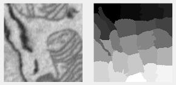{.on-glb align=left width="300"}  
  Clusters pixels by intensity using the [SLIC algorithm](https://www.epfl.ch/labs/ivrl/research/slic-superpixels).  
  *Supports*: 2D 

  

Options:
  
  - Cluster size: approximate size of each cluster in pixels  
  - Compactness: 100 (square) to 0 (flexible)  
  - ChopX: number of horizontal blocks for memory efficiency  
  - ChopY: number of vertical blocks

!!! info "SLIC References"

    * Radhakrishna Achanta, Appu Shaji, Kevin Smith, Aurelien Lucchi, Pascal Fua, and Sabine Süsstrunk, SLIC Superpixels Compared to State-of-the-art Superpixel Methods, [IEEE Transactions on Pattern Analysis and Machine Intelligence](https://infoscience.epfl.ch/record/177415), vol. 34, num. 11, p. 2274 – 2282, May 2012.
    * Radhakrishna Achanta, Appu Shaji, Kevin Smith, Aurelien Lucchi, Pascal Fua, and Sabine Süsstrunk, SLIC Superpixels, [EPFL Technical Report](https://infoscience.epfl.ch/record/149300) no. 149300, June 2010.

**Watershed clustering filter**  
  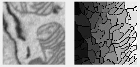{.on-glb align=left width="300"}  
  Clusters pixels based on ridges using the [watershed algorithm](https://se.mathworks.com/help/images/ref/watershed.html).  
  *Supports:* 2D
  

  

Options:
 
  - DestinationLayer: assign results to MIB layers  
  - ClusterSize: larger values yield bigger clusters  
  - TypeOfSignal: "black-on-white" (electron microscopy) or "white-on-black" (light microscopy)  
  - GapPolicy: preserve or fill ridge gaps  
  - ResultingShape: "clusters" or "ridges"  
  

---

*Back to [MIB](../../../index.md) | [User interface](../../index.md) | [Ribbon](../index.md) | [Image](index.md)*
