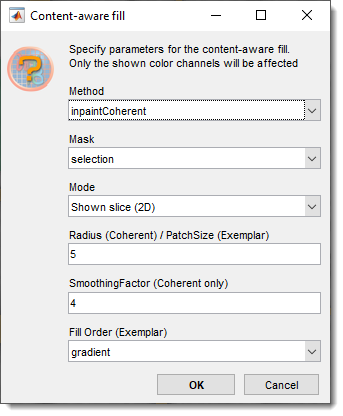
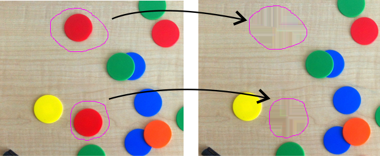
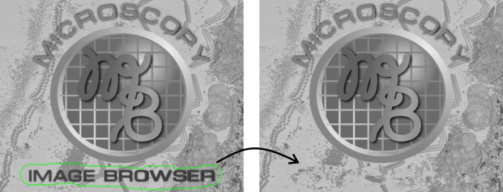

# Content-aware Fill

*Back to [MIB](../../../index.md) | [User interface](../../index.md) | [Ribbon](../index.md) | [Image](index.md)*

---

## Description

{.on-glb align=left width="260"}

Reconstruct selected areas of the dataset using information from neighboring regions, 
modifying the image and corresponding Selection, Mask, and Model layers.

Demonstration

- [:fontawesome-brands-youtube:{.red-color} Content-aware fill demonstration](https://youtu.be/H_TVvgA_br4)

## inpaintCoherent

{.on-glb align=left width="400"}

Restores specific regions of the dataset using coherence transport-based inpainting, 
leveraging patterns from surrounding areas to fill gaps seamlessly. This method is 
available for MATLAB R2019a and newer.

Select regions to inpaint using the Mask or Selection layers in 
the [Segmentation panel](../../panels/segm/index.md). 

Configure the following parameters:

- Method use the dropdown to select `inpaintCoherent` 
- Mask select the layer that has marked areas that should be content aware filled
- Mode specify whether the content aware fill should be applied for the current slice or
the whole dataset
- Radius set the radius of the circular 
neighborhood (in pixels) centered on each pixel to be inpainted, controlling the scope of surrounding data used.
- Smoothing Factor define the Gaussian 
filter scale for estimating coherence direction, adjusting the smoothness of the inpainting result.

Click the Apply button to reconstruct 
the selected areas across the dataset or specific slices, preserving continuity 
with neighboring regions.

!!! info "Reference"

    * F. Bornemann and T. März, "Fast Image Inpainting Based on Coherence Transport," [Journal of Mathematical Imaging and Vision](https://link.springer.com/article/10.1007/s10851-007-0017-6), Vol. 28, 2007, pp. 259–278.
    * [inpaintCoherent](https://se.mathworks.com/help/images/ref/inpaintcoherent.html) at Mathworks.com

## inpaintExemplar

{.on-glb align=left width="400"}

Fills regions in the dataset using exemplar-based inpainting, copying patches from nearby areas to reconstruct missing or selected parts. This method is available for MATLAB R2019b and newer.

Specify regions to inpaint using the Mask or Selection layers in the [Segmentation panel](../../panels/segm/index.md).

Configure the following parameters:

- Method use the dropdown to select `inpaintCoherent` 
- Mask select the layer that has marked areas that should be content aware filled
- Mode specify whether the content aware fill should be applied for the current slice or
the whole dataset
- PatchSize enter the size of image patches 
(e.g., `9` for a 9x9 patch or `9,9` for custom dimensions) used for matching and filling.
- FillOrder select the priority function 
for the order in which patches are filled, such as structure-driven or edge-first approaches.

Click the Apply button to fill the selected areas, 
blending patches to maintain visual consistency across the dataset.

!!! info "Reference"

    * A. Criminisi, P. Perez, and K. Toyama, "Region Filling and Object Removal by Exemplar-Based Image Inpainting," [IEEE Trans. on Image Processing](https://ieeexplore.ieee.org/document/1323101), Vol. 13, No. 9, 2004, pp. 1200–1212.
    * [inpaintExemplar](https://se.mathworks.com/help/images/ref/inpaintexemplar.html) at Mathworks.com

---

*Back to [MIB](../../../index.md) | [User interface](../../index.md) | [Ribbon](../index.md) | [Image](index.md)*
