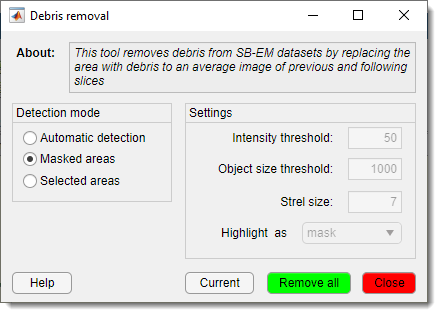

# Debris Removal

*Back to [MIB](../../../index.md) | [User interface](../../index.md) | [Ribbon](../index.md) | [Image](index.md)*

---

{.on-glb align=left width="360"}

Automatically or manually restore areas of volumetric datasets corrupted by 
debris, updating the image and corresponding Selection, Mask, and Model layers.

Demonstration

- [:fontawesome-brands-youtube:{.red-color} Debris removal demo](https://youtu.be/iM2nHBxTjRw)

Select a debris removal mode from the Detection Mode 
dropdown to process the dataset. Areas can be detected automatically or specified using 
the Mask or Selection layers in the [Segmentation panel](../../panels/segm/index.md). 
Configure parameters as needed, then click the Current
button to restore the affected areas on the current slice or
Remove all across the dataset.

Use the Close button to close the 
dialog without changes.

## Automatic Detection

This mode automatically identifies and removes debris by analyzing differences
between adjacent slices:

- Intensity threshold set the threshold for 
detecting debris, applied to the summed difference between the current, previous, and 
following slices. The smaller values increase the area size that will be detected.
- Object size threshold specify the minimum 
size (in pixels) of debris areas to remove, filtering out smaller regions.
- Strel size define the size of the 
structuring element (in pixels) for erosion and dilation, refining the detected areas.
- Highlight as pick the destination layer to see
the detected areas.

The process computes differences between slices, thresholds the result, 
removes small objects, and applies morphological operations 
(erosion followed by dilation). 

Detected debris areas are replaced with an average of the previous 
and following slices, ensuring smooth restoration. 

This mode is ideal for datasets with scattered debris, such as dust or artifacts, 
without requiring manual selection.

---

## Masked Areas

This mode performs debris removal on areas defined in the Mask layer:

- No additional parameters are required beyond the Mask layer content.

Use the [Segmentation panel](../../panels/segm/index.md) to create or refine the 
Mask layer, marking areas corrupted by debris. 

The selected regions are restored by interpolating data from surrounding slices, 
typically averaging the previous and following slices. 

This mode is useful when debris locations are known and manually segmented, 

---

## Selected Areas

This mode performs debris removal on areas defined in the Selection layer:

- No additional parameters are required beyond the Selection layer content.

Define debris areas in the Selection layer using tools in 
the [Segmentation panel](../../panels/segm/index.md). The marked regions are 
inpainted using data from adjacent slices, similar to the Masked areas mode. 
This mode is suited for quick, interactive corrections where debris is identified 
during visual inspection, allowing flexible restoration without a permanent mask.

## Example

Application of Debris removal

This example shows the debris removal dialog with automatic detection 
settings applied to a volumetric dataset, highlighting the restoration of 
corrupted areas.

!!! tip
    Test debris removal on the current slice before processing the entire dataset.

---

*Back to [MIB](../../../index.md) | [User interface](../../index.md) | [Ribbon](../index.md) | [Image](index.md)*
