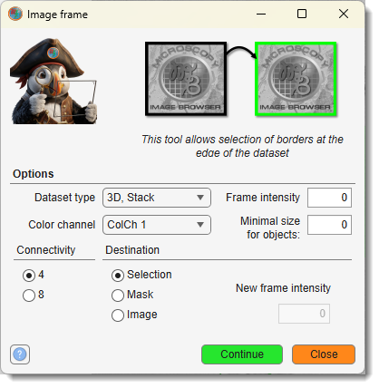

# Select Image Frame

---

## Description

{.on-glb align=left width="300"}

Detects a frame (an area of uniform intensity touching the image edge) in a 4D dataset. 
The detected frame can be assigned to the **Selection** or **Mask** layers as a binary 
mask or replaced with a new intensity in the **Image** layer.

Demonstration

- [:fontawesome-brands-youtube:{.red-color} Select image frame demonstration](https://youtu.be/sWjipmeU5eA)

Select the dataset type and color channel for frame detection using 
the Dataset type and 
Color channel dropdowns. 

Specify the intensity of the frame to detect in the 
Frame intensity field. 

Optionally, threshold detected regions by discarding those below a size specified in the 
Minimal size for objects field. 
Choose the target layer with the Destination radio 
buttons. When the **Image** layer is selected, set a new intensity value in 
the New frame intensity field. 

Click the Continue button to execute the operation, 
or use the Cancel button to close the dialog
without changes.

!!! tip
    It is possible to threshold the detected regions and discard regions below the value specified in the Minimal size for objects edit box.

!!! info
    When Destination layer is Image, it is possible to provide a new frame intensity value using New frame intensity.

---

*Back to [MIB](../../../index.md) | [User interface](../../index.md) | [Ribbon](../index.md) | [Image](index.md)*
