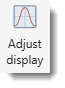
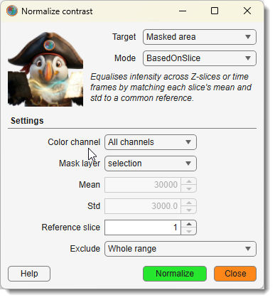
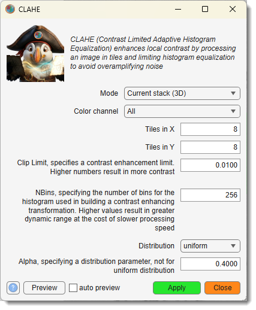
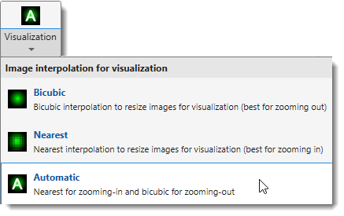
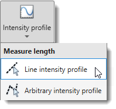

# Image Ribbon Tab

*Back to [MIB](../../../index.md) | [User interface](../../index.md) | [Ribbon](../index.md)*

---

## Overview

Image processing functions.

---

## Convert Section

### Mode

{align=left}

Change the mode or color depth of the dataset.

Image mode

- **Grayscale**: convert to grayscale by removing color information.
- **Multi-channel**: convert to a multi-channel (RGB) color space.
- **HSV color**: convert to the HSV (hue, saturation, value) color space.
- **Indexed**: convert to indexed colors (not implemented for True Color images).

Bit depth

- **8 bit**: convert to 8-bit; intensities are scaled to preserve adjustments from the [Display dialog](../../panels/selection_imview/viewsettings.md#contrast-panel).
- **16 bit**: convert to 16-bit; intensities are scaled to preserve original contrast.
- **32 bit**: convert to 32-bit; intensities are scaled to preserve original contrast.

---

## Image adjustments Section

### Adjust display

{align=left}

Starts a dialog to adjust display settings or resample image intensities.
See more in the [Adjust display window section](../../panels/selection_imview/viewsettings-adjustments.md).

---

### Color channels

{align=left}

Perform actions with color channels of the image.

Demonstrations

- [:fontawesome-brands-youtube:{.red-color} General demonstration](https://youtu.be/gT-c8TiLcuY)
- [:fontawesome-brands-youtube:{.red-color} Correction of color shifts between images](https://youtu.be/-J2P8a_z7pE)

The **Color channels** dropdown contains:

- **Insert empty channel...**: insert an empty channel (all pixels intensity 0) at a specified position.
- **Copy channel...**: copy one channel to another position.
- **Invert channel...**: invert intensities of a specified color channel.
- **Rotate channel...**: rotate a specified color channel.
- **Shift channel...**: shift a channel by X and Y pixels.
- **Swap channel...**: swap two color channels.
- **Delete channel...**: delete a specified color channel from the dataset.

Color channel operations are also available from the *Colors* table in the [View settings panel](../../panels/selection_imview/viewsettings.md).

---

### Contrast

{align=left}

Adjust or normalize image contrast. For linear contrast stretching, use the Image Adjustment dialog via the Display button in the [View Settings panel](../../panels/selection_imview/viewsettings.md).

The **Contrast** dropdown contains:

#### Normalize layers

{.on-glb align=left width="320"}

Normalizes image intensities slice-by-slice across Z or time to reduce illumination variation.

Demonstration

- [:fontawesome-brands-youtube:{.red-color} Image normalization tutorial](https://youtu.be/MmBmdGtuUdM)

Target: what to normalize:

- **Z stack**: normalize each Z-slice to a common mean and standard deviation.
- **Time series**: normalize each time frame; controlled by Time series normalization — either *Based on current 2D slice* or *Based on complete 3D stack*.
- **Masked area**: compute normalization coefficients only from the masked region (see Mask layer).
- **Background**: shift each slice so that the mean intensity of the masked background area matches the dataset mean.

Mode:

- **Automatic**: coefficients (mean and std) are computed from the data.
- **Manual**: use the fixed target Mean and Std values.
- **BasedOnSlice**: use the slice specified by Reference slice No as the normalization reference.

Color channel: channels to normalize (`All channels`, `Shown channels`, or a specific channel).

Exclude: pixels to exclude from mean/std calculations — `Whole range`, `Exclude blacks`, or `Exclude whites`.

Mask layer *(Masked area / Background only)*: `selection` or `mask` layer used to define the region.

??? info "Normalization algorithm"

    1. Calculate mean intensity and standard deviation (std) for the whole dataset.
    2. Calculate mean and std for each slice.
    3. Shift each slice by the difference between its mean and the dataset mean; stretch by the ratio of dataset std to slice std.

    For 4D datasets, normalization can be done across time. 
    For Z-stacks, black or white pixels can be excluded from the statistics.

---

#### Contrast-limited adaptive histogram equalization

{.on-glb align=left width="320"}

CLAHE enhances contrast locally in small rectangular tiles rather than globally. 
Each tile's histogram is redistributed to match the chosen *Distribution*, then neighboring tiles are 
blended with bilinear interpolation to avoid sharp boundaries. 
A clip limit caps contrast amplification in uniform areas to suppress noise. 

See MATLAB's [adapthisteq](https://se.mathworks.com/help/images/ref/adapthisteq.html) for details.

Dataset type: scope of the operation — `Shown slice (2D)`, `Current stack (3D)`, or `Complete volume (4D)`.

Color channel: `All`, `Displayed`, or a specific channel.

Number of tiles Y / Number of tiles X: tile grid size (1–256 in each direction); more tiles = finer local adaptation.

Clip limit: contrast enhancement limit (0–1); higher values give stronger contrast but more noise amplification.

Number of bins: histogram bins used for the contrast transform (2–65536); more bins = greater dynamic range.

Distribution: target histogram shape — `uniform`, `rayleigh`, or `exponential`.

Alpha: distribution shape parameter for `rayleigh` and `exponential` (disabled for `uniform`).

Use Preview to check the result on the current slice before applying to the full dataset.

---

### Invert

{align=left}

Invert image intensities.

Key shortcut: ++ctrl+i++

Demonstration

- [:fontawesome-brands-youtube:{.red-color} Invert image demonstration](https://youtu.be/1DG2w5XYA18)

The **Invert** dropdown contains:

- **Shown slice (2D)**: invert only the currently shown slice.
- **Current stack (3D)**: invert the current Z-stack.
- **Complete volume (4D)**: invert the complete dataset.

---

### Visualization

{.on-glb align=left width="320"}

Select the interpolation method used when rendering the image for display.

The **Visualization** dropdown contains:

- **Bicubic**: bicubic interpolation (best quality when zooming out).
- **Nearest**: nearest-neighbour interpolation (best for zooming in, preserves pixel boundaries).
- **Automatic**: nearest when zooming in, bicubic when zooming out.

---

## Image tools Section

### Image filters

{.on-glb align=left width="300"}

Opens a dialog with image filters in four categories:

- Basic image filtering in the spatial domain
- Edge-preserving filtering
- Contrast adjustment
- Image binarization

See the [Image Filters](image-filters.md) for details.

---

### Image tools

{align=left}

A collection of specialised image processing tools.

The **Image tools** dropdown contains:

#### Content-aware fill

{.on-glb align=left width="400"}

Reconstruct selected areas using information from neighboring regions.

Demonstration

- [:fontawesome-brands-youtube:{.red-color} Content-aware fill demonstration](https://youtu.be/H_TVvgA_br4)

- See more on content-aware fill using [inpaintCoherent](image-tools-awarefill.md#inpaintcoherent)
- See more on content-aware fill using [inpaintExemplar](image-tools-awarefill.md#inpaintexemplar)

---

#### Debris removal

Automatically or manually restore areas of volumetric datasets corrupted with debris.
Areas can be detected automatically or selected into the Mask or Selection layers.

Demonstration

- [:fontawesome-brands-youtube:{.red-color} Debris removal demo](https://youtu.be/iM2nHBxTjRw)

See more on [Debris removal](image-tools-debris.md)

---

#### Image arithmetics

{.on-glb align=left width="360"}

Use MATLAB syntax to apply custom arithmetic expressions to Image, Model, Mask, or Selection layers.

Demonstrations

- [:fontawesome-brands-youtube:{.red-color} MIB 2.60 and newer](https://youtu.be/sDwvnJGLi8Q)
- [:fontawesome-brands-youtube:{.red-color} MIB 2.52 and older](https://youtu.be/-puVxiNYGsI)

!!! warning "Limitations"

    Only in MIB for MATLAB

See more on [Image arithmetics](image-tools-arithmetic.md)

---

#### Intensity projection

{.on-glb align=left width="340"}

Generate intensity projection across any dimension of the loaded dataset.

Demonstration

- [:fontawesome-brands-youtube:{.red-color} Intensity projection demonstration](https://youtu.be/hwFpS_3eP9U)

See more on [Intensity projections](image-tools-projections.md)

---

#### Select image frame

{.off-glb align=left width="300"}

Detects the frame (an area of uniform intensity touching the image edge).
The detected area can be assigned to the *Selection* or *Mask* layers or replaced
with another color in the *Image* layer.

Demonstration

- [:fontawesome-brands-youtube:{.red-color} Select image frame demonstration](https://youtu.be/sWjipmeU5eA)

See more on [Select image frame](image-tools-selectframe.md)

---

#### White balance correction

{.on-glb align=left width="380"}

Corrects white balance of the dataset. Select an area that should be white or gray and assign it to the *Mask* or *Selection* layers, or use *Manual* mode to provide an RGB value directly.

Demonstration

- [:fontawesome-brands-youtube:{.red-color} White balance correction demo](https://youtu.be/Fdm-W4e6kHA)

See more on [White balance correction](image-tools-whitebalance.md)

---

### MorphOps

{.on-glb align=left width="400"}

Applies morphological operations to images. The processed image can be added to or subtracted from the existing image (see *Additional action to the result* panel).

Demonstration

- [:fontawesome-brands-youtube:{.red-color} Morphological operations demonstration](https://youtu.be/itbVLFm0FKQ)

The **MorphOps** dropdown contains: Bottom-hat filtering, Clear border, Morphological closing, Dilate image, Erode image, Fill regions, H-maxima transform, H-minima transform, Morphological opening, Top-hat filtering.

See more on [Morphological operations](image-morphops.md)

---

### Intensity profile

{.on-glb align=left width="320"}

Generates an intensity profile of the image data.

{align=left}

The **Intensity profile** dropdown contains:

- **Line intensity profile**: profile along a straight line.
- **Arbitrary intensity profile**: profile along a user-drawn path.

For intensity profiles, use the [Measure length tool](../tools/index.md#measure-length).

---

*Back to [MIB](../../../index.md) | [User interface](../../index.md) | [Ribbon](../index.md)*
