# Image Ribbon Tab

---

## Overview

Image processing functions.

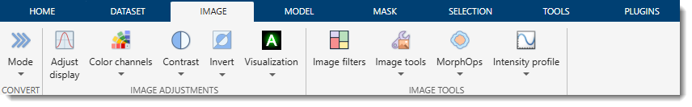

---

## Mode

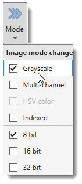{align=left}

Allows changing the mode and color depth of the shown dataset.

Available options
 

- **Grayscale**: converts image to grayscale by removing color information.
- **RGB Color**: converts image to the RGB color space.
- **HSV Color**: converts image to the HSV (hue, saturation, value) color space.
- **Indexed**: converts image to indexed colors (not implemented for True Color images).
- **8 bit**: converts dataset to 8-bit format; intensities are scaled to preserve adjustments from the [Display dialog](../../panels/selection_imview/viewsettings.md#contrast-panel).
- **16 bit**: converts dataset to 16-bit format; intensities are scaled to preserve original contrast.
- **32 bit**: converts dataset to 32-bit format; intensities are scaled to preserve original contrast.

---

## Adjust Display/Image

Starts a dialog to adjust display settings or resample image intensities.
 See more in the [Adjust display window section](../../panels/selection_imview/viewsettings-adjustments.md).

---

## Color Channels

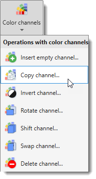{align=left}

Perform actions with color channels of the image.

Demonstrations

- [:fontawesome-brands-youtube:{.red-color} General demonstration](https://youtu.be/gT-c8TiLcuY)
- [:fontawesome-brands-youtube:{.red-color} Correction of color shifts between images](https://youtu.be/-J2P8a_z7pE)

List of operations with color channels

- **Insert empty channel...**: insert an empty channel (all pixels intensity 0) to a specified position.
- **Copy channel...**: copy one channel to another position.
- **Invert channel...**: invert intensities of a specified color channel.
- **Rotate channel...**: rotate a specified color channel.
- **Shift channel...**: shift a channel by X and Y pixels.
- **Swap channels...**: swap two color channels.
- **Delete channel...**: delete a specified color channel from the dataset.

It is also possible to perform color channel operations from the *Colors* table in the [View settings panel](../../panels/selection_imview/viewsettings.md).

---

## Contrast

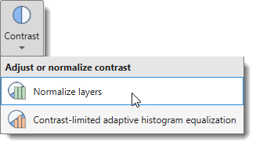{align=left}

Adjust contrast of the dataset. For linear contrast stretching, use the Image Adjustment dialog via the Display button in the [View Settings panel](../../panels/selection_imview/viewsettings.md).

Demonstration

- [:fontawesome-brands-youtube:{.red-color} Image normalization tutorial](https://youtu.be/MmBmdGtuUdM)

List of contrast adjustment operations

- **Linear contrast**: no longer available in MIB; use the Display button in the [View Settings panel](../../panels/selection_imview/viewsettings.md).
- **Contrast-limited adaptive histogram equalization**: CLAHE enhances contrast in small regions (tiles) rather than the entire image. Each tile’s contrast is adjusted to match a specified histogram (*Distribution* parameter), with neighboring tiles combined using bilinear interpolation to smooth boundaries. Contrast in homogeneous areas can be limited to avoid noise amplification. See MATLAB’s [adapthisteq](https://se.mathworks.com/help/images/ref/adapthisteq.html) for details.
  - **Normalize layers**: normalizes intensities between slices:  
      1. calculates mean intensity and standard deviation (std) for the whole dataset;  
      2. calculates mean and std for each image;  
      3. shifts each image based on the difference between its mean and the dataset mean, then stretches based on the ratio of dataset std to image std.
    
!!! info "Normalize layers"

    For 4D datasets, normalization can be done across time. 
    For Z-stacks, black or white pixels can be excluded.
  
- **Normalize layers based on masked areas**: similar to *Normalize layers*, but calculated only from masked areas (Selection or Mask layers).
- **Normalize based on masked background**: normalizes intensities using masked background areas:  
    1. calculates mean intensity of the masked area for the whole dataset;  
    2. calculates mean intensities of the masked area for each image;  
    3. shifts each image based on the difference between its mean and the dataset mean.

---

## Invert image

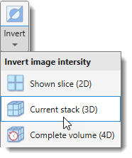{align=left}

Invert image intensities.

Key shortcut: ++ctrl+i++ .

Demonstration

- [:fontawesome-brands-youtube:{.red-color} Invert image demonstration](https://youtu.be/1DG2w5XYA18)

Invert operations available for

- **Shown slice (2D)**: invert only the currently shown slice.
- **Current stack (3D)**: invert the current stack.
- **Complete volume (4D)**: invert the complete dataset.

---

## Image filters

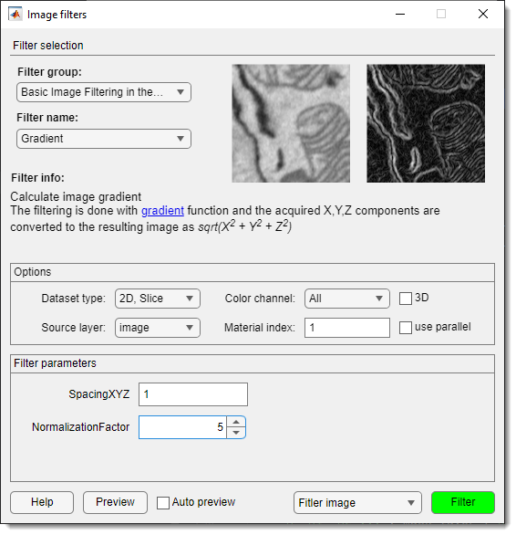{.on-glb align=left width="300"} 

Opens a dialog with image filters in four categories:

- Basic image filtering in the spatial domain
- Edge-preserving filtering
- Contrast adjustment
- Image binarization

See the [Image Filters](image-filters.md) for details.

---

## Tools for images

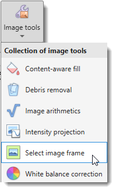{align=left}

Tools for images contains collection of tools for image processing.

### Content-aware fill

{.on-glb align=left width="400"}

Reconstruct selected areas using information from neighboring regions.

Demonstration

- [:fontawesome-brands-youtube:{.red-color} Content-aware fill demonstration](https://youtu.be/H_TVvgA_br4)

- See more on content-aware fill using [inpaintCoherent](image-tools-awarefill.md#inpaintcoherent)
- See more on content-aware fill using [inpaintExemplar](image-tools-awarefill.md#inpaintexemplar)

---

### Debris removal

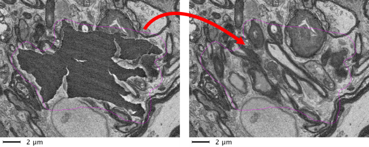

Automatically or manually restore areas of volumetric datasets corrupted with debris.  
Areas can be detected automatically or selected into the Mask or Selection layers.

Demonstration

- [:fontawesome-brands-youtube:{.red-color} Debris removal demo](https://youtu.be/iM2nHBxTjRw)
- See more on [Debris removal](image-tools-debris.md)

---

### Image arithmetics

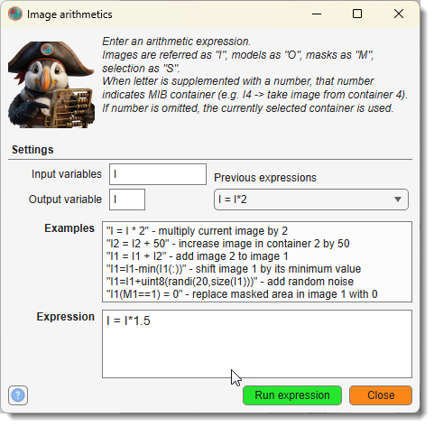{.on-glb align=left width="360"}

Use MATLAB syntax to apply custom arithmetic expressions to Image, Model, Mask, or Selection layers.

Demonstrations

- [:fontawesome-brands-youtube:{.red-color} MIB 2.60 and newer](https://youtu.be/sDwvnJGLi8Q)
- [:fontawesome-brands-youtube:{.red-color} MIB 2.52 and older](https://youtu.be/-puVxiNYGsI)

!!! warning "Limitations"

    Only in MIB for MATLAB

See more on [Image arithmetics](image-tools-arithmetic.md)

---

### Intensity projection

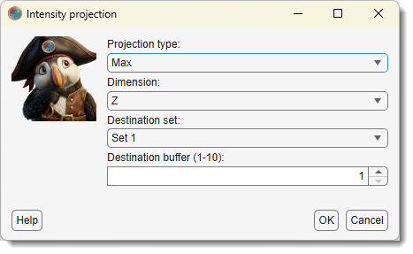{.on-glb align=left width="340"}

Generate intensity projection across any dimension of the loaded dataset.

Demonstration

- [:fontawesome-brands-youtube:{.red-color} Intensity projection demonstration](https://youtu.be/hwFpS_3eP9U)

See more on [Intensity projections](image-tools-projections.md)

---

### Select image frame

{.on-glb align=left width="300"}

Detects the frame (an area of uniform intensity touching the image edge). 
The detected area can be assigned to the *Selection* or *Mask* layers or replaced
with another color in the *Image* layer.

Demonstration

- [:fontawesome-brands-youtube:{.red-color} Select image frame demonstration](https://youtu.be/sWjipmeU5eA)

See more on [Select image frame](image-tools-selectframe.md)

---

### White balance correction

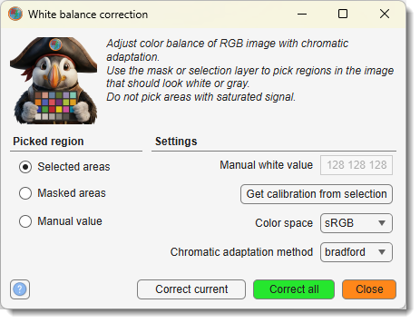{.on-glb align=left width="380"}

Corrects white balance of the dataset. Start by selecting an area that should be white or gray, assigning it to the *Mask* or *Selection* layers, or use *Manual* mode to provide an RGB value to correct.

Demonstration

- [:fontawesome-brands-youtube:{.red-color} White balance correction demo](https://youtu.be/Fdm-W4e6kHA)

See more on [Select image frame](image-tools-whitebalance.md)

---

## Morphological operations

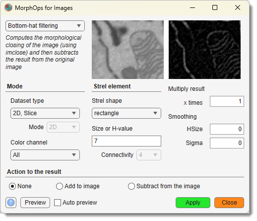{.on-glb align=left width="400"}

Applies morphological operations to images. The processed image can be added to or subtracted from the existing image (see *Additional action to the result* panel).

Demonstration

- [:fontawesome-brands-youtube:{.red-color} Morphological operations demonstration](https://youtu.be/itbVLFm0FKQ)

See more on [Morphological operations](image-morphops.md)

---

## Intensity profile

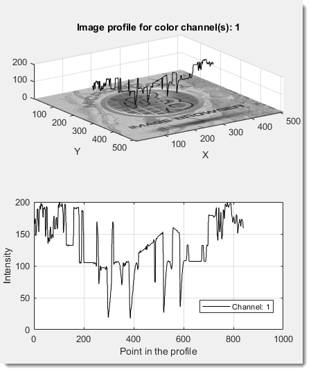{.on-glb align=left width="320"}

Generates an intensity profile of the image data in two modes:

- **Line**
- **Arbitrary**

For intensity profiles, use the [Measure length tool](../tools/index.md#measure-length).

---

*Back to [MIB](../../../index.md) | [User interface](../../index.md) | [Ribbon](../index.md) *
