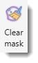
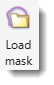
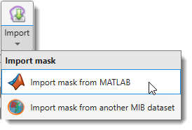
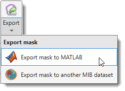
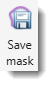
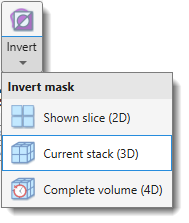

# Mask Ribbon Tab

---

## Overview

Actions that can be applied to the *Mask* layer. The *Mask* layer is one of three main segmentation 
layers (*Model*, *Selection*, *Mask*) which can be used in combination with other layers. See more about 
segmentation layers in the [Data layers section](../../../getting-started/image-layers.md). 

{align=left}

---

## Convert Section

### Mask→Selection

{align=left}

Transfers the *Mask* layer into the *Selection* layer. The main button opens a dropdown to choose
the dataset extent and the transfer mode.

| Scope | Add | Remove | Replace |
|-------|-----|--------|---------|
| **Shown slice (2D)** | Add, 2D | Remove, 2D | Replace, 2D |
| **Current stack (3D)** | Add, 3D | Remove, 3D | Replace, 3D |
| **Complete volume (4D)** | Add, 4D | Remove, 4D | Replace, 4D |

- **Add** — adds masked pixels/voxels to the existing Selection.
- **Remove** — removes masked pixels/voxels from the existing Selection.
- **Replace** — replaces the Selection with the Mask.

---

## Import Section

### Clear mask

{align=left}

Clears the *Mask* layer, removing it from memory across the entire dataset.

---

### Load mask

{align=left}

Loads a mask from disk. By default, masks are stored in MATLAB format with the `*.mask` extension.

Supported file formats:

- [x] **mask** — MATLAB format (default)
- [x] **am** — Amira Mesh labels
- [x] **h5** — Hierarchical Data Format (HDF5)
- [x] **tif** — TIF format
- [x] **xml** — Hierarchical Data Format with XML header (HDF5)
- [x] **All files** — standard image formats can also be imported as masks

!!! warning "Mask limitations"
    
    Masks can only contain a single material.

---

### Import

{align=left}

Imports a mask from an external source. The dropdown provides:

#### Import mask from MATLAB

Imports a mask from the main MATLAB workspace.  
The mask must be a `uint8` matrix matching the dataset dimensions `[height, width, depth]`.

#### Import mask from another MIB dataset

Copies the mask from another dataset currently open in MIB.

---

## Export Section

### Export

{align=left}

Exports the mask to an external destination. The dropdown provides:

#### Export mask to MATLAB

Exports the mask as a `uint8` matrix to the main MATLAB workspace.  
The exported variable can be re-imported via *Import mask from MATLAB*.

#### Export mask to another MIB dataset

Copies the mask to another dataset currently open in MIB.

---

### Save mask

{align=left}

Saves the mask to disk. A save-file dialog always appears to let you choose the filename and format.
By default, the filename uses a `Mask_` prefix and `*.mask` extension.

**Available save formats:**

- [x] **MATLAB format (.mask)**: default format for saving masks.
- [x] **Amira mesh binary (.am)**: Amira Mesh binary format.
- [x] **Amira mesh binary RLE compression SLOW (.am)**: compressed Amira Mesh format.  
  
!!! warning
      Not recommended due to slow performance. Export as *Amira mesh binary* and resave with RLE compression in Amira instead.

- [x] **Hierarchical Data Format (.h5)**: chunked format suitable for Ilastik.
- [x] **PNG format (.png)**: saves mask as 2D slices in Portable Network Graphic format.
- [x] **TIF format (.tif)**: saves mask as 2D slices or a 3D volume in Tag Image File format.
- [x] **Hierarchical Data Format with XML header (.xml)**: generates an HDF5 file and an XML file with image parameters.

---

## Tools Section

### Invert

{align=left}

Inverts the mask — masked areas become background and background becomes mask.  
**The dropdown selects the scope:**

- **Shown slice (2D)**, inverts the mask on the currently displayed slice only.
- **Current stack (3D)**, шnverts the mask across all slices in the current Z-stack.
- **Complete volume (4D)**, inverts the mask across the entire dataset including all time points.

---

### Replace masked areas

{.on-glb align=left width="340"}

Replaces image intensity in masked areas with new values.  
A dialog prompts for the replacement intensity, the slice range, and the color channels to affect.

[:fontawesome-brands-youtube:{.red-color} Demonstration](https://youtu.be/fNz1vGq7Hb0)

---

### Smooth mask

{.on-glb align=left width="340"}

Smooths the *Mask* layer in 2D or 3D space.

!!! info "Mask smoothing"
    
    Use [Image Filters](../image/image-filters.md) for interactive evaluation of smoothing results before committing.

---

## Quantify Section

### Quantify

{align=left}

Opens the [Mask and Model Quantification](mask-stats.md) dialog for quantifying shape and intensity
properties of mask objects.

Also accessible via  
`Segmentation Panel → Materials List → Right-click → Quantify material...`

---

*Back to [MIB](../../../index.md) | [User interface](../../index.md) | [Ribbon](../index.md)*
