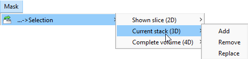
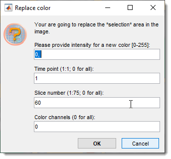
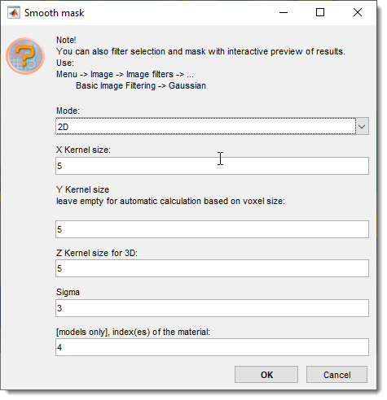
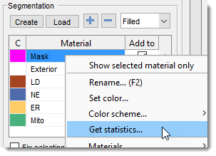

# Mask Ribbon Tab

*Back to [MIB](../../../index.md) | [User interface](../../index.md) | [Ribbon](../index.md)*

---

## Overview

Actions that can be applied to the *Mask* layer. The *Mask layer* is one of three main segmentation 
layers (*Model*, *Selection*, *Mask*) which can be used in combination with other layers. See more about 
segmentation layers in the [Data layers section](../../image-layers.md).

{align=left}

---

## ..→Selection

{align=left}

Allows modification of the *Selection* layer using the *Mask* layer. 

Options include 

- replacing the Selection with the Mask
- adding the Mask to the Selection
- removing the Mask from the Selection. 

!!! info 
    
    These actions can apply to the currently shown slice or the entire volume.

---

## Clear mask

Clears the *Mask* layer, deleting it from computer memory.

---

## Load mask

Loads a mask from disk. By default, masks are saved in MATLAB format with the `*.mask` extension.

It is possible to load masks from variety of image formats:

- **.mask** - MATLAB format
- **.am** - Amira Mesh labels
- **.h5** - Hierarchical Data Format (hdf5)
- **.tif** - TIF format
- **.xml** -  Hierarchical Data Format with XML header (hdf5)
- **All files** - it should be possible to load standard image formats as masks

!!! warning "Masks" 
    
    Masks can only contain a single material

---

## Import Mask from

Imports a mask from the main MATLAB workspace or another dataset opened in MIB. 
The mask must be a matrix matching the dataset dimensions `[1:height, 1:width, 1:no-slices]` of `uint8` class.

---

## Export Mask to

Exports the mask to the main MATLAB workspace or another dataset opened in MIB. 
The exported mask can be re-imported using *Import Mask from MATLAB*.

---

## Save mask as...

Saves the mask to disk. 
 By default, it uses MATLAB format with a `*.mask` extension and `Mask_` prefix.

List of available formats to save masks

- **MATLAB format (.mask)**: Default format for saving masks.
- **Amira mesh binary (.am)**: Amira Mesh binary format.
- **Amira mesh binary RLE compression SLOW (.am)**: Compressed Amira Mesh format.  
  !!! warning
      Not recommended due to slow performance. Use *Amira mesh binary* and resave with RLE compression in Amira instead.
- **Hierarchical Data Format (.h5)**: Chunked format suitable for Ilastik.
- **PNG format (.png)**: Saves mask as 2D slices in Portable Network Graphic format.
- **TIF format (.tif)**: Saves mask as 2D slices or 3D volumes in Tag Image File format.
- **Hierarchical Data Format with XML header (.xml)**: Generates an HDF5 file and an XML file with image parameters.

---

## Invert mask

Inverts the mask, turning masked areas into background and background into a mask.

---

## Replace masked area in the image

{.on-glb align=left}

Replaces image intensity in masked areas with new values.
 A dialog prompts for new intensities, slices, and color channels.

[:fontawesome-brands-youtube:{.red-color} Demonstration](https://youtu.be/fNz1vGq7Hb0)

---

## Smooth mask

{.on-glb align=left width="320"}

Smooths the *Mask* layer in 2D or 3D space.

!!! info "Mask smoothing"
    
    It is recommended to use [Image Filters](../image/image-filters.md) for interactive evaluation of smoothing results

---

## Mask Statistics

Gets statistics for the mask layer material, usable to filter the mask by object properties. 

{ align=left}

Accessible also via 
`Segmentation Panel → Materials List → Right-click → Get statistics...`
 See [Mask and Model Statistics](mask-stats.md) for details.

---

*Back to [MIB](../../../index.md) | [User interface](../../index.md) | [Ribbon](../index.md)*
