# Quantification for Mask or Model Objects

---

## Overview

This dialog provides access to quantify properties for shapes and intensities of model and mask 2D or 3D objects.

---

## Workflow in a nutshell

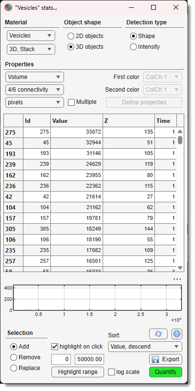{.on-glb align=left width="300"}

- Select material or mask in the **Material** section
- Define 2D or 3D shape of the objects to detect in the **Object shape** section
- Choose to detect object shapes or intensities in the **Detection type** section
- Select the property to quantify (Area)
!!! info

    For multiple properties to quantify check <label class="widget widget-checkbox">Multiple</label> 

- Hit the Run button to start quantification

---

## Material

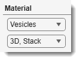{align=left}

Use the combo boxes to select the object source and the dataset extent:

- **Object source** (Material): choose *Mask*, *Exterior*, or any model material. For models with more than 255 materials a *Model* option is also listed, quantifying all materials at once.
- **Dataset extent** (DatasetType): *2D, Slice* (current slice), *3D, Stack* (current Z-stack), or *4D, Dataset* (whole volume).

---

## Object shape

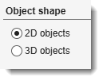{align=left}

Select the dimensionality of the objects to detect:

- **Shape2D** — detects 2D objects on each slice independently.
- **Shape3D** — detects 3D connected objects across the stack.

---

## Detection type

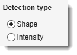{align=left}

Choose what to measure:

- **Object** — statistics based on shape properties of the objects (see [3D properties](#quantification-properties-of-3d-objects) and [2D properties](#quantification-properties-of-2d-objects) below).
- **Intensity** — statistics based on image intensities inside the objects (see [intensity properties](#quantification-properties-of-intensities-of-2d3d-objects) below).

---

## Properties

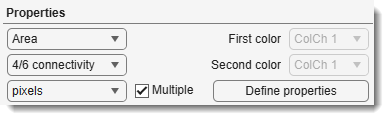{align=left}

- Property: select the property to measure (see sections below for the full list).

!!! warning
    **EndpointsLength** requires 1-pixel-wide lines with 8/26 connectivity.

- Connectivity: defines how pixels/voxels are grouped into objects:
    - **4/6 connectivity** — combines pixels touching at North, West, South, East sides (2D) and also Top, Bottom (3D).
    - **8/26 connectivity** — same as 4/6, plus diagonal (45°) neighbours.
- ColorChannel1: color channel for intensity analysis.
- ColorChannel2: second color channel for correlation analysis.
- Units: *pixels* or physical units.

!!! warning
    Some properties are pixel-only. **MeridionalEccentricity**, **EquatorialEccentricity**,
    **MajorAxisLength**, **SecondAxisLength**, **ThirdAxisLength**, **EquivDiameter**,
    and **SurfaceArea** for 3D objects in physical units require isotropic voxels.

- <label class="widget widget-checkbox">Multiple</label>: enables measuring several properties in one run; click Define properties to choose the set.

Available properties for selection

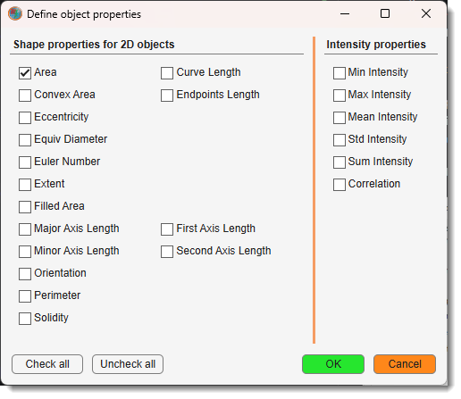{.on-glb align=left width="300"}
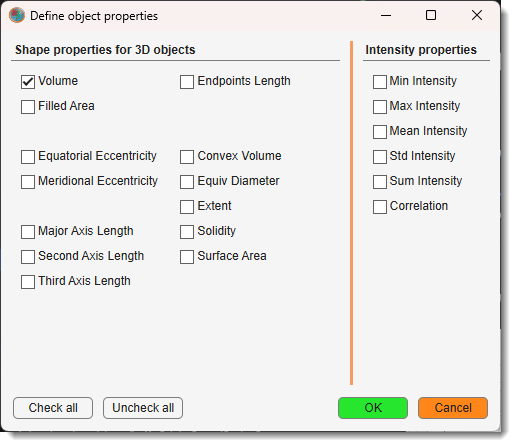{.on-glb align=left width="300"}

- See below for details of quantification properties ([2D shapes](mask-stats.md#quantification-properties-of-2d-objects), 
[3D shapes](mask-stats.md#quantification-properties-of-3d-objects), [intensities](mask-stats.md#quantification-properties-of-intensities-of-2d3d-objects))
- Quantify: starts quantification and populates the table.

---

## Quantification table

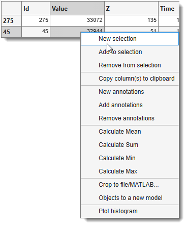{.on-glb align=left width="260"}

**The Quantification table** displays the calculated values. Sort results with Sorting, or <mouse class="right"></mouse> a row for the context menu.

Context menu

- **New selection** / **Add to selection** / **Remove from selection**: create or modify the Selection layer from the highlighted rows.
- **Copy column(s) to clipboard**: copies the selected column(s) to the system clipboard.

- **New annotations**: places MIB annotations at the centroids of selected objects. A settings dialog lets you compose the label from a custom text string, the material name, and/or the object ID. Accessible afterwards via [Ribbon → Model → Annotations → List of annotations](../model/index.md#list-of-annotations) or [Segmentation panel → Segmentation tools → Annotations](../../panels/segm/segm-annotations.md).
- **Add to annotations**: appends selected objects to the existing annotation list (same settings dialog).
- **Remove from annotations**: removes annotations at the selected object centroids.
- **Calculate Mean** / **Sum** / **Min** / **Max**: computes the statistic for column 2 of the highlighted rows and copies the result to the clipboard.
- **Crop to a file/MATLAB**: opens the **Crop Objects** dialog to export image patches cut around each detected object.

??? info "Details on Crop to a file/MATLAB"

    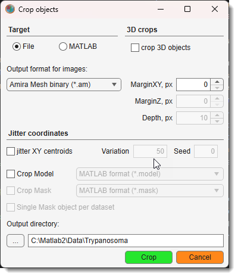{.on-glb align=left width="300"}
    
Parameters

    - Target: output format — *Crop to MATLAB*, *Amira Mesh binary (\*.am)*, *MRC format for IMOD (\*.mrc)*, *NRRD Data Format (\*.nrrd)*, *TIF format LZW compression (\*.tif)*, or *TIF format uncompressed (\*.tif)*.
    - <label class="widget widget-checkbox">3D</label>: crop using the full 3D bounding box of each object (rather than centroid-based patches).
    - MarginXY: extend the bounding box in XY by this many pixels.
    - MarginZ: extend the bounding box in Z by this many pixels.
    - <label class="widget widget-checkbox">Generate 3D patches</label>: crop fixed-depth 3D patches centred on each object centroid instead of using bounding boxes.
    - Depth: Z depth in slices for 3D patches (active when *Generate 3D patches* is checked).
    - <label class="widget widget-checkbox">Jitter XY centroids</label>: randomly offsets the crop window. Controlled by Variation (max shift in pixels) and Seed (0 = random seed).
    - Include Model: also export the model layer — *Do not include*, *Crop to MATLAB*, or a file format. Use Material index to specify a single material (*NaN* for all).
    - Include Mask: also export the mask layer — *Do not include*, *Crop to MATLAB*, or a file format.
    - <label class="widget widget-checkbox">Single Mask object per dataset</label>: keep only the main object within the clipping box when exporting mask-derived objects.
    

    **Exported MATLAB structure** (variable name: `OutputName_ObjectId`):
    - `.img`: cropped image `[height, width, colors, depth]`.
    - `.pixSize`: pixel size struct (`.x .y .z .t .units .tunits`).
    - `.logText`: crop coordinates string `[y1:y2, x1:x2, :, z1:z2, t]`.
    - `.Model.model`: cropped model/labels array.
    - `.Model.materials`: cell array of material names.
    - `.Model.colors`: material color matrix.
    - `.Mask`: cropped mask array `[height, width, depth]`.

    **Import back using**:
    - `Ribbon → Home → Import image from... → MATLAB` (fields: `varname.img`, `varname.pixSize`).
    - `Ribbon → Model → Import model from MATLAB` (field: `varname.Model`).

- **Objects to a new model**: generates a new model assigning each selected object a unique material index. [:fontawesome-brands-youtube:{.red-color} Demo](https://youtu.be/xZhuv659JrY)
- **Plot histogram**: opens a MATLAB figure with a bar histogram of the selected values (prompts for number of bins).

- Export: exports the full results table.

??? info "Export formats"

    - [x] **Export to MATLAB** — saves the STATS struct to the MATLAB workspace under a user-defined variable name.
    - [x] **Excel format (*.xls)** — Microsoft Excel format.
    - [x] **Comma-separated values (*.csv)** — comma-separated text.
    - [x] **MATLAB format (*.mat)** — standard MATLAB format, **including** `.PixelIdxList` and `.BoundingBox` fields.
    - [x] **MATLAB format minimalistic (*.mat)** — standard MATLAB format, **excluding** `.PixelIdxList` and `.BoundingBox` fields.

---

## Histogram and object selection

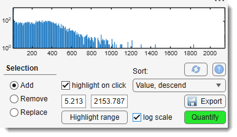{.on-glb align=left width="260"}

**The Histogram** shows the distribution of values in the table, with linear or logarithmic Y-axis (via <label class="widget widget-checkbox">Log scale</label>).

Use <mouse class="left"></mouse> / <mouse class="right"></mouse> on the histogram to set the minimum / maximum of the Highlight range.

- <label class="widget widget-checkbox">Auto highlight on a click</label>: instantly highlights the clicked objects in the Image View panel. ++ctrl++ + <mouse class="left"></mouse> deselects an object.
- Sorting: changes table sort order.
- Highlight range + Do: select all objects whose value falls within the specified min–max range.
- **The Details panel**: defines the selection action — add, remove, or replace the *Selection* layer.

---

## Quantification properties of 3D objects

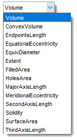{align=left}

- **Volume**: total voxels (~volume) within 3D objects.
- **ConvexVolume**: total voxels of the smallest convex hull enclosing the 3D object.
- **EndpointsLength**: distance between endpoints of 1-pixel-wide lines (use [Membrane ClickTracker](../../panels/segm/segm-membrtracker.md) with *Straight line*, Width=1). Calculated in image units.
- **EquatorialEccentricity**: eccentricity of the cross-section through the second-longest and shortest axes (0 = sphere, 1 = line).
- **EquivDiameter**: diameter of a sphere with the same volume as the object.
- **Extent**: ratio of object voxels to bounding-box voxels.
- **FilledArea**: total voxels within the filled (hole-free) 3D object.
- **HolesArea**: total voxels of internal cavities within 3D objects.
- **MajorAxisLength**: length of the major principal axis in pixels.
- **MeridionalEccentricity**: eccentricity of the cross-section through the longest and shortest axes.
- **SecondAxisLength**: length of the second principal axis in pixels.
- **Solidity**: proportion of convex-hull voxels occupied by the object (Volume / ConvexVolume).
- **SurfaceArea**: surface area of the 3D object (requires isotropic voxels for physical units).
- **ThirdAxisLength**: length of the minor (third) principal axis in pixels.

---

## Quantification properties of 2D objects

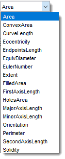{align=left}

- **Area**: total pixels within 2D objects.
- **ConvexArea**: total pixels of the smallest convex polygon containing the object.
- **CurveLength**: length of thinned curves (closed or open) in image units. Requires thinning (*Ribbon → Selection → Morphological 2D/3D operations*) and branch-point removal.
- **Eccentricity**: ratio of foci distance to major-axis length of the equivalent ellipse (0 = circle, 1 = line).
- **EndpointsLength**: distance between endpoints of 1-pixel-wide lines (use [Membrane ClickTracker](../../panels/segm/segm-membrtracker.md) with *Straight line*, Width=1; thin with *Brush* size 1 or *Ribbon → Selection → Morphological 2D/3D operations → Thin*). Calculated in image units.
- **EquivDiameter**: diameter of a circle with the same area as the object (`sqrt(4*Area/pi)`).
- **EulerNumber**: number of objects minus number of holes (e.g., 1 hole → 0, 2 holes → -1).
- **Extent**: ratio of object pixels to bounding-box pixels (Area / bounding-box area).
- **FilledArea**: total pixels of the filled (hole-free) object.
- **FirstAxisLength**: actual length of the major 2D axis (cf. *MajorAxisLength* which fits an ellipse).
- **HolesArea**: total pixels within holes.
- **MajorAxisLength**: length of the major axis of the equivalent-second-moment ellipse (pixels).
- **MinorAxisLength**: length of the minor axis of the equivalent-second-moment ellipse (pixels).
- **Orientation**: angle (−90° to +90°) between the x-axis and the major axis of the equivalent ellipse.
- **Perimeter**: boundary length (sum of distances between adjacent border pixels).
- **SecondAxisLength**: actual length of the minor 2D axis (cf. *MinorAxisLength* which fits an ellipse).
- **Solidity**: proportion of convex-hull pixels occupied by the object (Area / ConvexArea).

---

## Quantification properties of intensities of 2D/3D objects

Calculated when *Intensity* is selected in the **Detection type** section.

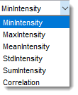{align=left}

- **MinIntensity**: minimal image intensity within 2D/3D objects.
- **MaxIntensity**: maximal image intensity within 2D/3D objects.
- **MeanIntensity**: mean image intensity within 2D/3D objects.
- **StdIntensity**: standard deviation of image intensity within 2D/3D objects.
- **SumIntensity**: sum of image intensities within 2D/3D objects.
- **Correlation**: correlation between intensities of two selected color channels (see MATLAB's `corr2`).

---

*Back to [MIB](../../../index.md) | [User interface](../../index.md) | [Ribbon](../index.md) | [Mask](index.md) [(Model)](../model/index.md)*
