# Model Ribbon Tab

*Back to [MIB](../../../index.md) | [User interface](../../index.md) | [Ribbon](../index.md)*

---

## Overview

Actions that can be applied to the *Labels* layer. The *Labels layer* is one of three main segmentation layers
(*Labels*, *Selection*, *Mask*) which can be used in combination with other layers.
See more about segmentation layers in the [Data layers section](../../../getting-started/image-layers.md).

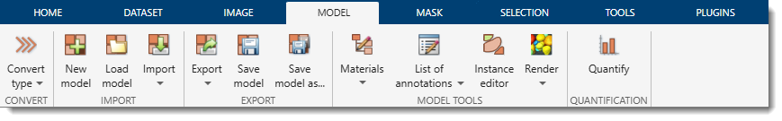{.on-glb align=left}

<div class="clear-float"></div>

---

## Convert Section

### Convert type

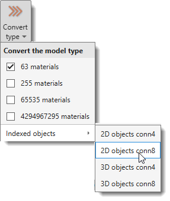{align=left}

Convert the model to a different type; the current type is indicated in the ribbon.
The Labels, Selection and Mask layers are backed up before the conversion, so it can be undone with
++ctrl+z++, which brings back the previous model type together with its materials and colors.

<div class="h4-like">Types of models in MIB</div>

- **63 materials** (*default*): Stores Labels, Selection, and Mask layers in a single memory container, 
reducing memory requirements with some performance costs and limiting materials to 63.
- **255 materials**: Allows up to 255 materials, requiring additional memory for Selection and Mask layers (doubles memory usage).
- **65535 materials**: Allows up to 65535 materials, requiring ~1.25× more memory than 255 materials. The [Segmentation panel](../../panels/segm/index.md) appearance changes in this mode.  
  [:fontawesome-brands-youtube:{.red-color} Short demonstration](https://youtu.be/r3lpmWyvrJU)
- **4294967295 materials**: Allows up to 4294967295 materials, requiring twice the memory of 65535 materials.

<div class="h4-like">Indexed objects</div>

Detects objects in all materials and generates a new model where each object has a unique index:

- **2D objects conn4**: 2D connected objects, 4-connectivity.
- **2D objects conn8**: 2D connected objects, 8-connectivity.
- **3D objects conn4**: 3D connected objects, 4-connectivity.
- **3D objects conn8**: 3D connected objects, 8-connectivity.

??? example "Example: standard model converted to indexed objects"

    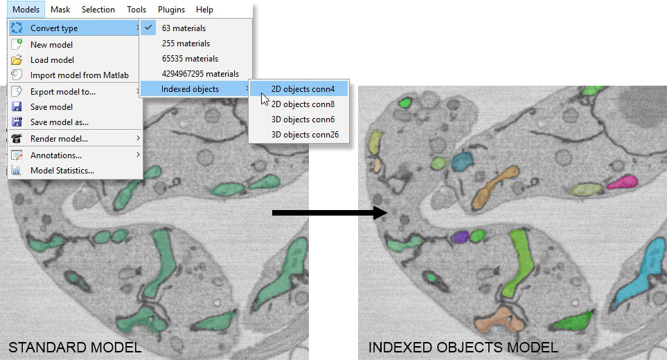{.on-glb align=left}

??? info "How to work with models having more than 255 materials"

    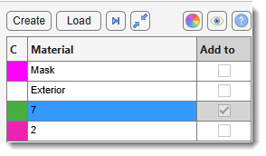{.on-glb align=left width="300"}
    Materials should be named with numbers representing the current working material index
    (e.g., 11555 means that when selection is added to the model, it will be assigned to index 11555).

    Select materials by:

    - Right-clicking the segmentation table and choosing *Rename...* or by pressing ++f2++
    - Hovering over an object in the Image View panel and pressing ++ctrl+f++.

    The <span class="widget widget-button">+</span> (*Add a new material to the model*) button
    of the [Segmentation panel](../../panels/segm/index.md) scans the model for the highest index
    currently in use and switches the working material to the next free one. It does not
    create anything until you paint, so pressing it twice in a row offers the same index.

<div class="h4-like">Stitch 2D instances to 3D</div>

Links a stack of **independently segmented 2D instances** into consistent 3D objects. Unlike the
*Indexed objects* options above - which turn a *semantic* model into indexed objects by
connected-component analysis - this expects a model whose slices are **already** per-slice 2D
instances, typically the raw output of a 2D instance-segmentation prediction where the *same* object
carries a *different* index on each slice.

Objects that overlap between neighbouring slices are merged into a single 3D instance with one index
through the whole stack. The current model is backed up first, so the operation can be undone with
++ctrl+z++. The result is stored as a 65535- (or 4294967295-) material indexed model, one index per
3D object.

Stitching a large stack takes a while. It can be stopped at any point with
<span class="widget widget-button">Cancel</span>, which leaves the model as it was.

A settings dialog collects the parameters, in three groups. The defaults are a sensible starting
point - in most cases only the cleanup settings need adjusting.

**Linking** - which 2D objects are recognised as the same 3D object:

| Setting | Description |
|---------|-------------|
| **Method** | `graph` (*default*) links every overlapping pair of objects on neighbouring slices and groups them together, which copes with objects that split into pieces or merge between slices. `hungarian` matches strictly one-to-one per slice pair (empanada / MitoNet style). Leave on `graph` unless you are reproducing the published method. |
| **Split disconnected 2D objects** | Checkbox, on by *default*. A 2D predictor sometimes gives one index to several separate blobs on a slice. Taken at face value, those blobs act as a bridge that welds their 3D objects together, and the effect cascades until much of the stack is one giant object. Uncheck only if you trust the per-slice indices and need a genuinely disconnected 2D mask to stay one object. |
| **IoU threshold** (0-1) | How much two cross-sections must overlap to be joined, measured as *overlap ÷ combined area*. Higher = stricter, giving more but smaller 3D objects. |
| **Merge split objects (IoA)** | Checkbox, on by *default*. Also join when a smaller object lies mostly inside its neighbour, which reconnects an object that briefly breaks into pieces on one slice. Uncheck to link on IoU alone. |
| **Min overlap** (pixels) | The smallest overlap that may count as a link, so a one- or two-pixel touch between unrelated objects cannot fuse them. |
| **Absolute overlap to link** (pixels) | Join two objects sharing at least this many pixels, whatever the two settings above say. `0` = off. Both of those are divided by object area, so a wide cross-section meeting a much narrower one can score low even when the shared area is large. The useful value depends on how big objects are in your data, so look at a few genuine links before setting it. |
| **Z lookback** (slices) | How far apart slices are compared. `1` = neighbouring slices only; `2` or more also bridges an object that disappears for a slice or two. |

**Cleanup** - what happens to the leftovers once the objects are built:

| Setting | Description |
|---------|-------------|
| **Min object size** (voxels) | Delete 3D objects smaller than this many voxels. `0` = keep all. The first thing to try against noise; values around `50-200` suit dense EM data. |
| **Min object depth** (slices) | Delete 3D objects present on this many slices or fewer. `0` = keep all, `1` = drop single-slice objects. This catches what a size threshold cannot: a false detection can be large in the plane yet not exist on the next slice, so no voxel count separates it from a genuine small object. |
| **Absorb fragments** (voxels) | Give 3D objects this small to the object around them, instead of leaving them as separate specks. On by *default* (`5`); `0` = off. Such specks are usually a few stray pixels the 2D predictor placed inside a neighbouring object - too small ever to be linked, but part of a real object, so deleting them would leave a hole in it. Specks with no neighbour to join are left to the two settings above. |

**Thick sections and gaps** - only needed for anisotropic or patchy data:

| Setting | Description |
|---------|-------------|
| **Anisotropic Z (use pixel size)** | Checkbox. When Z sections are thick, an object shifts further between slices, so its overlap drops even though it is the same object. Enabling this lowers the IoU threshold by the dataset's Z/XY voxel ratio. Best used together with **Max centroid shift**. |
| **Max centroid shift** (pixels) | Refuse a link when the two objects' centres are farther apart than this. `0` = off. Its job is to stop a relaxed IoU threshold from joining distant objects. |
| **Centroid link radius** (pixels) | Join an object that has *no* overlapping neighbour at all to the nearest object of comparable size within this distance. `0` = off. Leave it off unless the data is strongly anisotropic or has frequent gaps. |

!!! note
    This entry is intended as the 3D post-processing step for the **2D Instance** DeepMIB workflow:
    run 2D instance prediction slice-by-slice, then stitch the per-slice result into 3D objects here.

!!! tip "Cleaning up noise objects"
    Most spurious objects come from the 2D prediction rather than from the stitching, so try the
    cleanup settings before adjusting the linking parameters.

    Start by asking what a speck actually is. If it belongs to the object beside it,
    **Absorb fragments** hands it back - which is why that one is on by default. If it belongs to
    nothing, delete it: **Min object size** for small fragments, and **Min object depth** for false
    detections that are large in the plane but appear on only one or two slices.

!!! info "The settings are remembered, and echoed to the console"
    The dialog reopens on the values used last, for as long as MIB is running - trialling a
    threshold does not mean re-entering the other twelve fields each time. The values are per
    session and are not written to preferences, so restarting MIB returns to the defaults.

    DeepMIB's <span class="widget widget-button">Merge 2D to 3D</span> shares them, so a threshold
    tried there is offered here and the other way round.

    Each accepted run also prints one line to the MATLAB console listing exactly what was used, for
    example:

    ```
    Stitch 2D instances to 3D: method=graph, splitDisconnected2D=1, iouThreshold=0.25, ioaThreshold=0.5, minOverlapPixels=5, absOverlapPixels=500, zLookback=1, minObjectVoxels=0, minObjectSlices=1, useAnisotropy=0
    ```

    A parameter left at its "off" value is absent from the line rather than shown as zero, matching
    what is actually passed to the algorithm. Copy the line into your notes to record which trial
    produced which model.

!!! question "Two objects stayed apart although they clearly overlap in Z"
    Check the two cross-sections' **areas**, not just the overlap. IoU and IoA are ratios against
    area, so a wide profile meeting a much narrower one is penalised twice over and can fail both
    tests on a substantial shared area. Measure the pair before changing anything:

    ```matlab
    labels = mib.mibModel.I{1}.labels.data;
    maskA = labels(:,:,27) == 15;   % the two 2D objects you are looking at
    maskB = labels(:,:,28) == 13;
    inter = nnz(maskA & maskB);
    fprintf('inter %d, IoU %.3f, IoA %.3f\n', inter, ...
        inter/(nnz(maskA)+nnz(maskB)-inter), inter/min(nnz(maskA), nnz(maskB)));
    ```

    If the ratios are low but `inter` is large, set **Absolute overlap to link** a little below that
    `inter`. Prefer it to lowering the IoU or IoA thresholds, which relaxes *every* pair in the
    stack; the absolute rule only fires where a genuinely large area is shared. Before committing,
    confirm the two objects really are one: if they coexist as separate objects over many slices,
    each with its own sizeable cross-section, they are more likely two neighbours that touch once.

!!! warning "Most objects came out as one giant object"
    That is the signature of per-slice indices shared by several unconnected blobs, and no
    threshold will fix it — each shared index welds its blobs' 3D objects together, and the welds
    chain from slice to slice until most of the stack is a single instance. Keep
    **Split disconnected 2D objects** enabled. To confirm the input is affected, compare the number
    of indices on a slice against the number of separate blobs:

    ```matlab
    slice = mib.mibModel.I{1}.labels.data(:,:,13);
    ids = unique(slice(slice > 0));
    blobs = sum(arrayfun(@(k) bwconncomp(slice == k, 8).NumObjects, ids));
    fprintf('%d indices, %d blobs\n', numel(ids), blobs);
    ```

    More blobs than indices means the 2D prediction reuses indices, and the split is doing real
    work. It is worth improving the 2D step as well (raise the prediction threshold, retrain), since
    each shared index is a wrong 2D instance.

<div class="clear-float"></div>

---

## Import Section

### New model

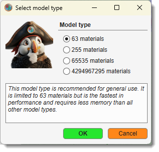{align=left}

Allocates space for a new model. Use this to start a new model or delete the existing one.<br>
Alternatively, use the <span class="widget widget-button">Create</span> button in the [Segmentation Panel](../../panels/segm/index.md).<br>
<br>
For model types see [Convert type](#convert-type) above.

<div class="clear-float"></div>

---

### Load model

Loads a model from disk. By default, MIB reads models in MATLAB format (`.model`), but other formats are supported.

<div class="h4-like">Compatible model formats</div>

- [x] **AM, Amira Mesh**: Amira Mesh label field for models from [Amira](http://www.vsg3d.com/amira/overview).
- [x] **NRRD, Nearly Raw Raster Data**: Compatible with [3D Slicer](https://www.slicer.org).
- [x] **MRC, Medical Research Council format**: Compatible with [IMOD](http://bio3d.colorado.edu/imod). Can load multiple MRC files, each encoding an object, and merge them into a single model.
- [x] **PNG, PNG format**: Saves models as 2D slices in Portable Network Graphic format.
- [x] **TIF, TIF format**: Saves models as 2D slices or 3D volumes in Tag Image File format.

!!! tip
    Almost any standard image format can be loaded as a model using the *All files (*.*)* filter in the Open model dialog.

Alternatively, use the <span class="widget widget-button">Load</span> button in the [Segmentation Panel](../../panels/segm/index.md).

!!! note
    Models can also be opened by drag-and-dropping model files into the [Image Document](../../image-document/index.md).

!!! note
    When a loaded model carries no material names of its own (format-dependent - some formats, like
    Zarr, may or may not embed names), materials are auto-named `mat1`, `mat2`, … For models with more
    than 255 materials, plain numeric names are used instead, since the number *is* the material index
    - see the note on working with such models in [Convert type](#convert-type) above.

---

### Import

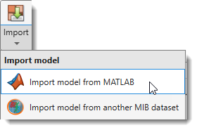{align=left}

Imports a model from an external source. 

The **Import** dropdown contains:

<div class="clear-float"></div>

#### Import model from MATLAB

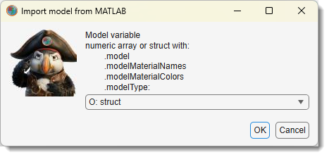{.on-glb align=left width="300"}

Imports a model from the main MATLAB workspace.
Provide a variable name with a matrix matching the dataset dimensions `[height, width, depth]` of `uint8` class, or a structure with the fields below.

<div class="clear-float"></div>

<div class="h4-like">Fields of the MIB model structure</div>

- **.model**: Matrix `[height, width, depth, time]` of `uint8` class.
- **.modelMaterialNames** *(optional)*: Cell array with material names.
- **.modelMaterialColors** *(optional)*: Matrix with colors (0-1) `[materialIndex, R G B]`.
- **.labelText** *(optional)*: Cell array with annotation labels.
- **.labelPosition** *(optional)*: Matrix with annotation positions `[annotationIndex, x y z]`.

---

#### Import model from another MIB dataset

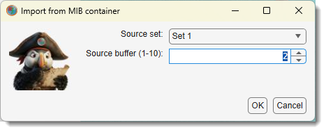{.on-glb align=left width="300"}

Copies the model from another currently open MIB dataset into the active dataset.

<div class="clear-float"></div>

---

#### Import model from Zarr2/3

Imports a segmentation model from an OME-Zarr v2 or v3 store. A Zarr store is a **folder**
(not a single file), so this option opens a folder browser instead of the file dialog used
by [Load model](#load-model) and the other [Import](#import) options above.

Both **Zarr v3** (`.zarr3`) and **Zarr v2** (`.zarr2`) are read by the native `zarr-matlab`
library, with no Python required. See
[Preferences → Zarr library](../home/home-preferences.md#zarr-library) if you want to read them
through `zarr-python` instead.

<div class="h4-like">Material names and colours</div>

Material names/colours are resolved from the store's metadata, in this order:

1. MIB's own `mibMaterials` attribute (the same one written by [Export model to Zarr3](#export)).
2. The OME-NGFF `image-label` convention (`colors` / `properties`).
3. If neither is present, materials are auto-named `mat1`, `mat2`, … with random colours.

!!! note
    For a **BigData** dataset, importing a Zarr model attaches the store **by reference** instead
    of loading it into memory (see [BigData datasets](../../panels/datasets/index.md)).

    Whether it is editable depends on **who wrote the store**, not on its zarr format. A store MIB
    created itself - in either format - is a fully editable, disk-backed model, because it holds
    MIB's packed bytes and is stamped with a marker attribute that says so.

    A store written by **another tool** is attached **read-only**: its values are that tool's own
    label indices, laid out in its own axis order, and writing MIB's packed bytes back into it would
    corrupt them. You can view and browse such a model at any zoom level. To segment on the same
    dataset, create a new model instead - MIB writes its own store and leaves the imported one
    untouched.

---

## Export Section

Save or export the model to files and external programs.

### Export

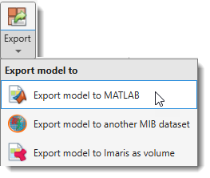{.on-glb align=left width="350"}

Exports the model to an external destination. The **Export** dropdown contains:

<div class="clear-float"></div> 

- **Export model to MATLAB**: Exports to the main MATLAB workspace as a structure (see [Import model from MATLAB](#import-model-from-matlab) for structure fields). Can be re-imported using *Import model from MATLAB*.
- **Export model to another MIB dataset**: Copies the model into another currently open MIB dataset.
- **Export model to Imaris as volume**: Exports to Imaris if available. See [System Requirements](https://mib.helsinki.fi/downloads_systemreq.html#imaris) for details.
- **Export model to Zarr3**: Export the model as a chunked, pyramidal OME-Zarr v3 store (`.zarr3`) - material names and colours are preserved; reopenable in MIB as a [BigData](../../panels/datasets/index.md) model and by external OME-Zarr-compatible tools

    ??? info "Export to Zarr3 - dialog settings (model)"

        A settings dialog appears after choosing the output path. Defaults are adapted to the
        open dataset dimensions (WSI vs. 3-D volumetric).

        | Setting | Description |
        |---------|-------------|
        | **Pyramid levels** (0 = auto) | `0` = auto: starts at full resolution, adds levels while min(Y, X) / 2 ≥ 256 px, up to 8 levels. Enter 1-12 to force a fixed count. |
        | **Chunk size \[Y, X, Z\]** | Zarr chunk dimensions in pixels. |
        | **Shard X-factors \[Y, X, Z\]** | Chunks to bundle per axis into one shard file (0 on any axis = no sharding). |
        | **Compression** | `zstd` (default), `gzip`, `none`. |
        | **Downsampling method** | See table below. The downsampling **strategy** is always *XY only* for models - Z is never averaged, since that would mix material indices across boundaries. |

        **Downsampling method**

        | Method | Speed | When to use |
        |--------|-------|-------------|
        | **nearest** *(default)* | fast | Most models - picks the nearest source pixel; exact label integers are preserved. |
        | **mode** | slow | Fine structures, thin boundaries - picks the **dominant label** in each output block (majority vote). More semantically accurate; ~4-8× slower than nearest. |

        **Smart defaults (computed from the open dataset)**

        | Dataset type | Chunk \[Y, X, Z\] | Shard X-factors |
        |---|---|---|
        | WSI (Z ≤ 2 slices **or** max(Y, X) ≥ 8 000 px) | 512 × 512 × 1 | 4 × 4 × 1 |
        | 3-D, near-isotropic (vxZ < 2 × vxXY) | 128 × 128 × 64 | 4 × 4 × 1 |
        | 3-D, anisotropic (vxZ ≥ 2 × vxXY) | 256 × 256 × 16 | 4 × 4 × 1 |

---

### Save model

Saves the model to a file in MATLAB format without prompting for a filename.

<div class="h4-like">Filename resolution</div>

- Default template: `Labels_NAME_OF_THE_DATASET.model`.
- Otherwise, the filename from the last *Save model as...* operation.
- Otherwise, the filename assigned when the model was loaded.


!!! info
    Can also be saved using the *Save model* button in the [Quick Access Bar](../../quick-access-bar/index.md).

---

### Save model as...

Prompts for a filename and format to save the model.

<div class="h4-like">Available formats</div>

- [x] **AM (Amira Mesh)**: RAW, RAW-ASCII, or RLE compressed formats (RLE is slow).
- [x] **MAT (MATLAB format)**: Native format for MIB version 1.
- [x] **MODEL (MATLAB format)** (*default*): Native format for MIB version 2.
- [x] **MOD (IMOD format)**: Contours for IMOD.
- [x] **MRC (IMOD format)**: Volume for IMOD.
- [x] **NRRD (Nearly Raw Raster Data)**: Compatible with [3D Slicer](https://www.slicer.org).
- [x] **OME-Zarr v3 (*.zarr3)**: Chunked, pyramidal OME-Zarr v3 store. Material names and colours are preserved; labels are downsampled with **nearest** (fast) or **mode** (majority-vote, more accurate for fine structures); reopenable as a [BigData](../../panels/datasets/index.md) model and by external OME-Zarr tools. Choosing this format opens an export-settings dialog - see [Export model to Zarr3](#export) for all options.
- [x] **PNG**: 2D slices in Portable Network Graphic format.
- [x] **STL (STL format)**: Triangulated mesh for visualization programs like Blender.
- [x] **TIF (TIF format)**: 2D slices or 3D volumes.

!!! tip "Exporting a pyramid level (BigData models)"

    For a disk-backed **BigData** model, the *Save model as...* dialog adds a <span class="widget widget-dropdown">Pyramid level</span> selector (`s0` = full resolution … `sN` = coarsest). The chosen level is **streamed to disk one slice at a time**, so the full model is never loaded into memory. Per-slice streaming is available for **TIFF**, the native **MODEL** (`*.model`), **HDF5** and **OME-Zarr v3**; other formats write the selected level as a whole.

??? info "BigData models - format compatibility & memory use"

    **All** formats above can save a **BigData** model at the chosen pyramid level. They differ only in how much memory the write needs:

    | Format | BigData | Memory-optimized (streamed slice-by-slice) |
    |--------|:-------:|:------------------------------------------:|
    | MODEL (`*.model`) - *native* | ✅ | ✅ disk-backed matfile |
    | TIF | ✅ | ✅ |
    | HDF5 (`*.h5`) | ✅ | ✅ |
    | OME-Zarr v3 (`*.zarr3`) | ✅ | ✅ |
    | AM, MAT, MOD, MRC, NRRD, PNG, STL, mibCat | ✅ | ❌ selected level is gathered whole before writing |

    Use the <span class="widget widget-dropdown">Pyramid level</span> dropdown to bound memory - a coarse level is small. The **memory-optimized** formats never hold even one full level in memory, so prefer them when exporting the full-resolution level (`s0`) of a large model.

---

## Model tools Section

### Materials

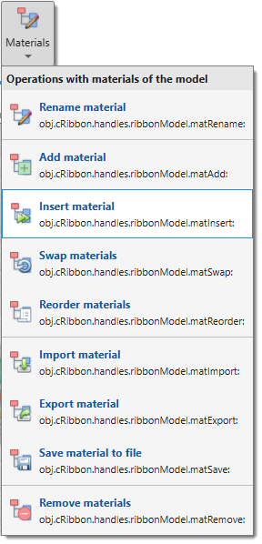{.on-glb align=left width="190"}

Operations for model materials, also available by right-clicking the [Segmentation table](../../panels/segm/index.md#segmentation-table).

[:fontawesome-brands-youtube:{.red-color} Materials menu demo](https://youtu.be/l1RkVkq59To)

The **Materials** dropdown contains:

- **Rename material**: Rename the selected material.
- **Add material**: Add a new material to the bottom of the list.
- **Insert material**: Insert a material at a specified position, shifting others down.
- **Swap materials**: Swap positions of two materials.
- **Reorder materials**: Reorder materials with a new sequence.
- **Import material**: Import selected materials (names, colours, and voxels) from a saved model file into the current model. You choose which materials to import; they are appended as new materials and their voxels overwrite the current ones where they overlap. For disk-backed [BigData](../../panels/datasets/index.md) models the source is matched to the closest pyramid level and resized to fit.
- **Export material**: Export the selected material to MATLAB or Imaris.
- **Save material to file**: Save the selected material to a file.
- **Remove materials**: Remove selected material(s) from the model.

<div class="clear-float"></div>

---

### List of annotations

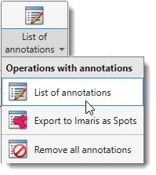{.on-glb align=left width="190"}

Operations for the *Annotations* layer.

[:fontawesome-brands-youtube:{.red-color} Demonstration](https://youtu.be/3lARjx9dPi0)

The **List of annotations** dropdown contains:

- **List of annotations**: opens the annotations window (see [Segmentation Tools](../../panels/segm/segm-annotations.md)).
- **Export to Imaris as Spots**: exports annotations as Spots in Imaris (export the dataset first).
- **Remove all annotations**: deletes all annotations in the model.

<div class="clear-float"></div>

---

### Render

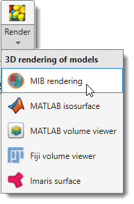{.on-glb align=left width="190"}

Renders segmented models using various methods. The **Render** dropdown contains:

<div class="clear-float"></div>

#### MIB rendering

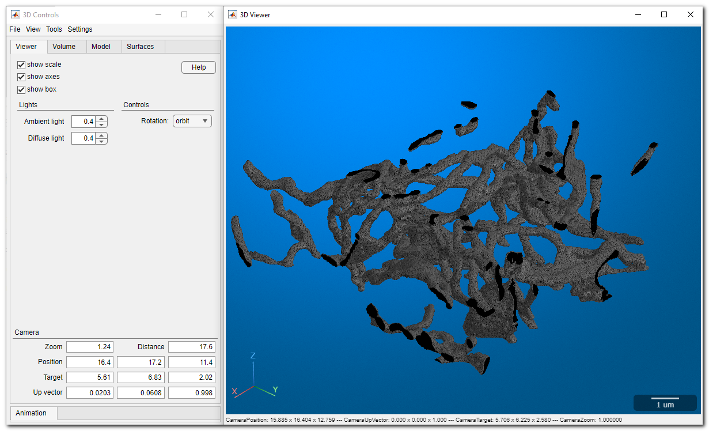{.on-glb align=left width="300"}

Materials can be visualized in MIB with hardware-accelerated volume rendering (MIB 2.5+, MATLAB R2018b+). Datasets can be downsampled. Snapshots and animations are supported.<br>
See more: [MIB 3D Viewer](../home/home-mib3Dviewer.md)

[:fontawesome-brands-youtube:{.red-color} Introduction to updated 3D viewer](https://youtu.be/840o6zni3KE)<br>
[:fontawesome-brands-youtube:{.red-color} Original version of 3D viewer](https://youtu.be/4arfdOiZebk)

<div class="clear-float"></div>

---

#### MATLAB isosurface

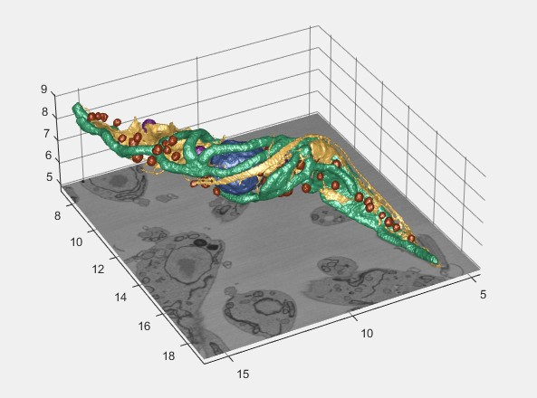{.on-glb align=left width="300"}

Uses MATLAB to generate and visualize isosurfaces with a modified [view3d](http://www.mathworks.com/matlabcentral/fileexchange/334-view3d-m) function by Torsten Vogel.

<div class="h4-like">Demonstrations</div>

- [:fontawesome-brands-youtube:{.red-color} Basic demo](https://youtu.be/svAFGBRfeoI)
- [:fontawesome-brands-youtube:{.red-color} Advanced demo](https://youtu.be/dMeoIZPaDS4?t=16m56s)

<div class="clear-float"></div>

<div class="h4-like">Controls</div>

- Double <mouse class="left"></mouse> to restore the original view.
- other controls available from a toolbar menu in the upper-right corner and via <mouse class="right"></mouse>

---

#### MATLAB volume viewer

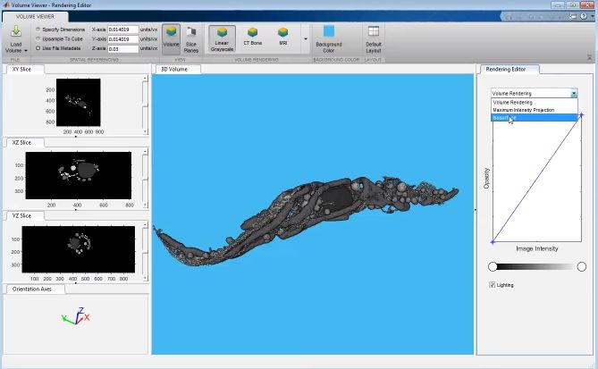{.on-glb align=left width="300"}

Renders the model using MATLAB's Volume Viewer (R2017b+). In R2019b+, materials can be displayed 
alongside the volume.

:warning: only for the MATLAB version of MIB

<div class="h4-like">Demonstrations</div>

- [:fontawesome-brands-youtube:{.red-color} Volume demo](https://www.youtube.com/watch?v=J70V33f7bas)
- [:fontawesome-brands-youtube:{.red-color} Materials with dataset](https://youtu.be/GM9V1IxNkTI)

<div class="clear-float"></div>

---

#### Fiji volume viewer

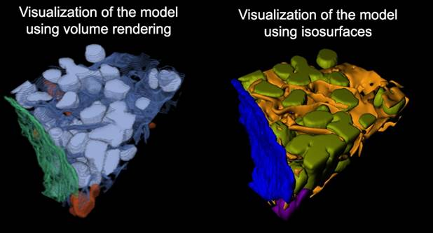{.on-glb align=left width="400"}

Uses [Fiji 3D Viewer](http://mib.helsinki.fi/tutorials/VisualizationOverview.html) for volume visualization.<br>
Requires Fiji installation (see [System Requirements](https://mib.helsinki.fi/downloads_systemreq.html#fiji)).

[:fontawesome-brands-youtube:{.red-color} Demonstration](https://youtu.be/DZ1Tj3Fh2HM)

<div class="clear-float"></div>

---

#### Imaris surface

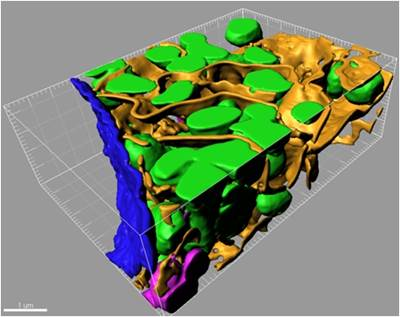{.on-glb align=left width="300"}

Renders the model in Imaris. Requires Imaris and ImarisXT (see [System Requirements](https://mib.helsinki.fi/downloads_systemreq.html#imaris)).

<div class="h4-like">Demonstrations</div>

- [:fontawesome-brands-youtube:{.red-color} Without ImarisXT](https://youtu.be/MbK2JcTrZFw)
- [:fontawesome-brands-youtube:{.red-color} With ImarisXT](https://youtu.be/yODGYJUzTr0)

The rendered material is specified in the Materials list of the [Segmentation Panel](../../panels/segm/index.md).

<div class="clear-float"></div>

---

## Quantification Section

### Quantify

Gets quantification statistics for the selected material, usable to filter the model by object properties.

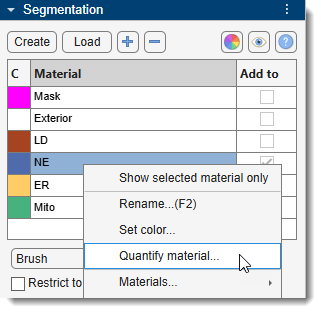{.on-glb align=left width="230"}

Accessible also via `Segmentation Panel → Materials List → Right-click → Quantify material...`

<div class="clear-float"></div>

See [Mask and Model Quantification](../mask/mask-stats.md) for details.

---

*Back to [MIB](../../../index.md) | [User interface](../../index.md) | [Ribbon](../index.md)*
