# Stitch 2D Instances to 3D

*Back to [MIB](../../../index.md) | [User interface](../../index.md) | [Ribbon](../index.md) | [Model](index.md)*

---

## Overview

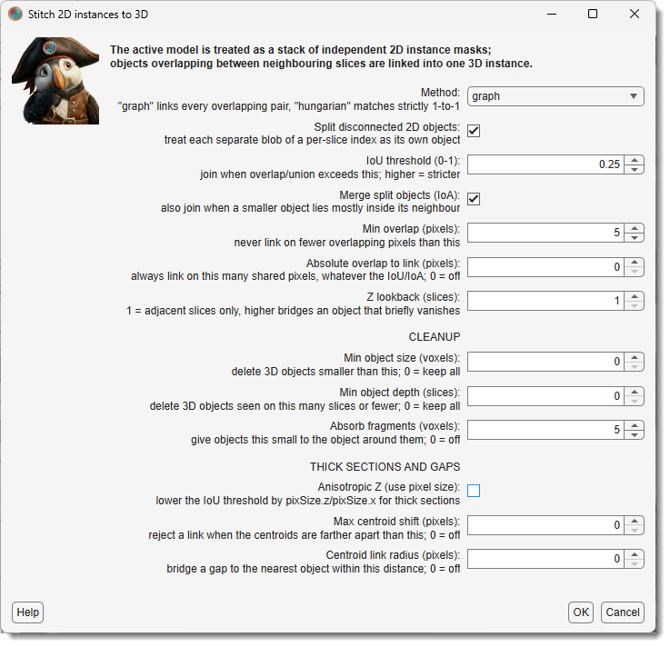{.on-glb align=right width="320"}

Turns a model that was segmented **slice by slice** into one made of 3D objects. It expects a model
whose slices are already 2D instances - typically the raw output of a 2D instance prediction, where
the same object carries a different index on every slice - and links those slices together, so each
3D object ends up with a single index through the whole stack.

Objects that overlap between neighbouring slices are taken to be the same object. Everything on this
page is about deciding what counts as an overlap, and what to do with the leftovers afterwards.

<div class="clear-float"></div>

---

## Where the dialog is opened from

The same settings dialog is used in two places.

<div class="h3-like">Model ribbon</div>

<span class="widget widget-dropdown">Convert type</span> >
<span class="widget widget-dropdown">Stitch 2D instances to 3D</span> stitches the model that is
currently open and replaces it with the result. The model is backed up first, so it can be undone
with ++ctrl+z++, and the result is stored as an indexed model (65535 or 4294967295 materials) with
one index per 3D object.

<div class="h3-like">DeepMIB</div>

<span class="widget widget-button">Merge 2D to 3D</span> on the
[Predict tab](../../../deepmib/deepmib-predict.md) stitches predicted `*.model` files that are still
on disk and writes the merged models back to disk. The open dataset is left untouched. This is the
3D step of the **2D Instance** DeepMIB workflow: predict slice by slice, then merge the per-slice
result into 3D objects. See
[Merging 2D predictions into a 3D model](../../../deepmib/deepmib-instance.md#merging-2d-predictions-into-a-3d-model).

??? info "What differs between the two"

    The settings are the same, with one exception: **Anisotropic Z**. On the ribbon it is a checkbox,
    because the Z/XY voxel ratio is already known from the dataset's pixel size. In DeepMIB it is a
    number to type in, because raw prediction images carry no pixel size.

    Stitching a large stack takes a while and can be stopped at any point with
    <span class="widget widget-button">Cancel</span>. On the ribbon this leaves the model as it was; in
    DeepMIB the models finished before the stop are kept and the rest are not written.

---

## Settings

The dialog collects thirteen settings in three groups. The defaults are a sensible starting point -
in most runs only the cleanup settings need adjusting.

Every setting has an example in a collapsed box. They share one layout:

- the **top row** is the 2D input, in grey, with the per-slice index written on each object and a
  black outline marking where the previous slice's object was, so the overlap is visible;
- the **rows below** are the result, one row per setting value. Colour means identity: the same
  colour on two slices means the stitcher treated them as one object.

---

## Linking

Which 2D objects are recognised as the same 3D object.

<div class="h3-like">Method</div>

`graph` (*default*) links every overlapping pair and groups them together, which copes with objects
that split or merge between slices. `hungarian` matches strictly one-to-one per slice pair. 

??? example "Example: Method"
    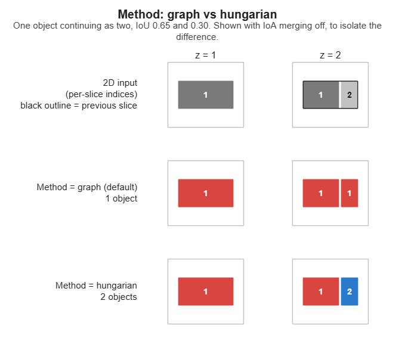{.on-glb}

<div class="h3-like">Split disconnected 2D objects</div>

On by *default*. A 2D predictor sometimes gives one index to several separate blobs on a slice;
taken at face value, those blobs weld their 3D objects together. Uncheck only if you trust the
per-slice indices.

??? example "Example: Split disconnected 2D objects"
    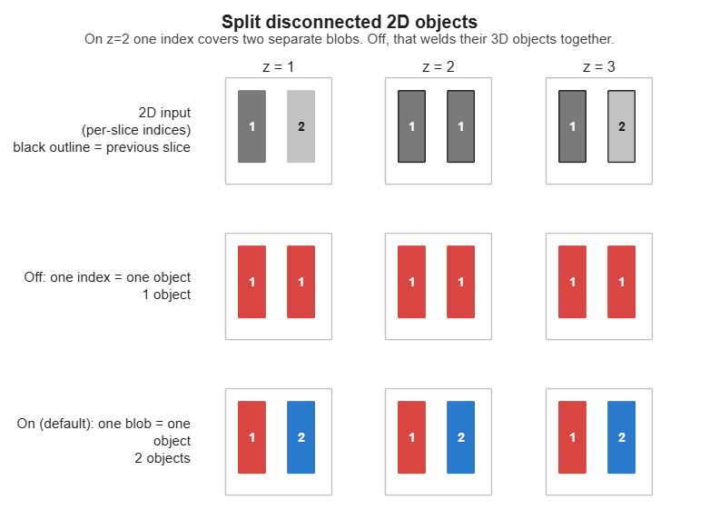{.on-glb}

<div class="h3-like">IoU threshold (0-1)</div>

How much two cross-sections must overlap to be joined, measured as *overlap ÷ combined area*.
Higher = stricter, giving more but smaller 3D objects.

??? example "Example: IoU threshold"
    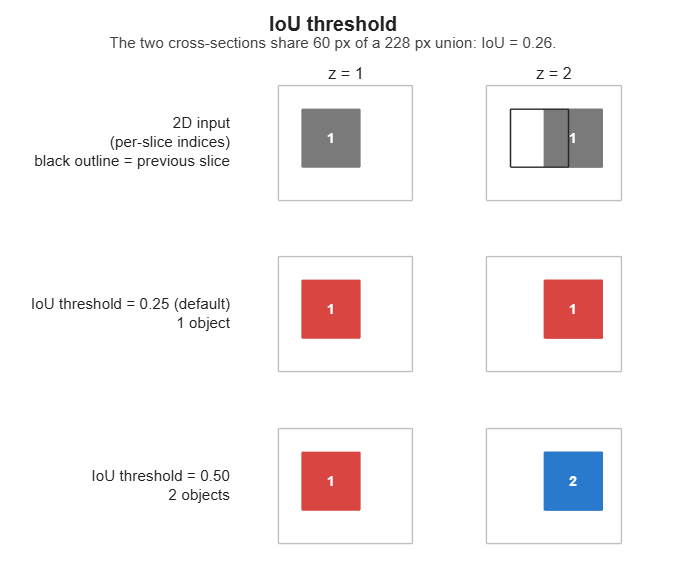{.on-glb}

<div class="h3-like">Merge split objects (IoA)</div>

On by *default*. Also join when a smaller object lies mostly inside its neighbour, which reconnects
an object that briefly breaks into pieces.

??? example "Example: Merge split objects (IoA)"
    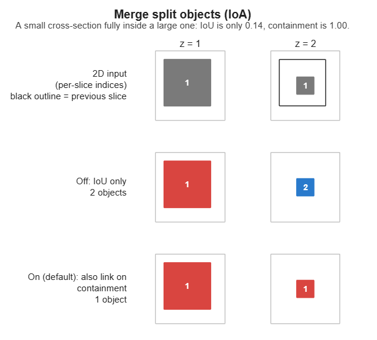{.on-glb}

<div class="h3-like">Min overlap (pixels)</div>

The smallest overlap that may count as a link, so a one- or two-pixel touch between unrelated
objects cannot fuse them.

??? example "Example: Min overlap"
    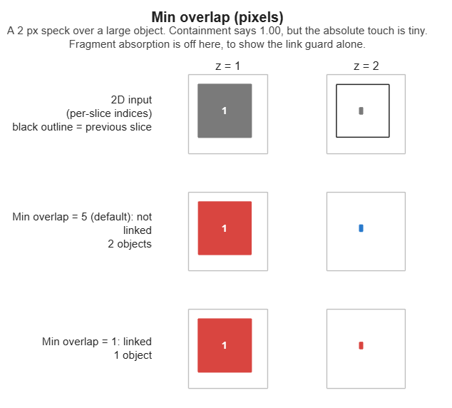{.on-glb}

<div class="h3-like">Absolute overlap to link (pixels)</div>

Join two objects sharing at least this many pixels, whatever the two settings above say. `0` = off.
Useful when a wide cross-section meets a much narrower one, which scores low on both ratios even
when the shared area is large.

??? example "Example: Absolute overlap to link"
    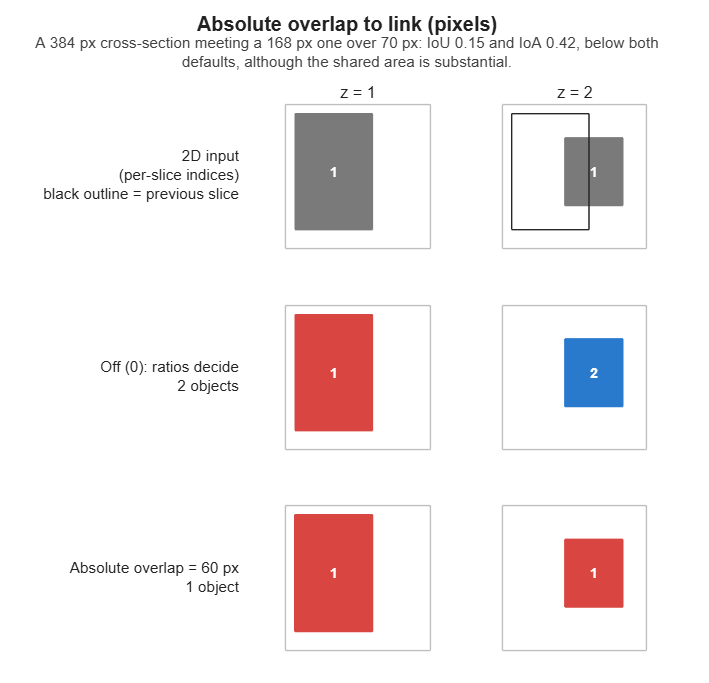{.on-glb}

<div class="h3-like">Z lookback (slices)</div>

How far apart slices are compared. `1` = neighbouring slices only; `2` or more also bridges an
object that disappears for a slice or two.

??? example "Example: Z lookback"
    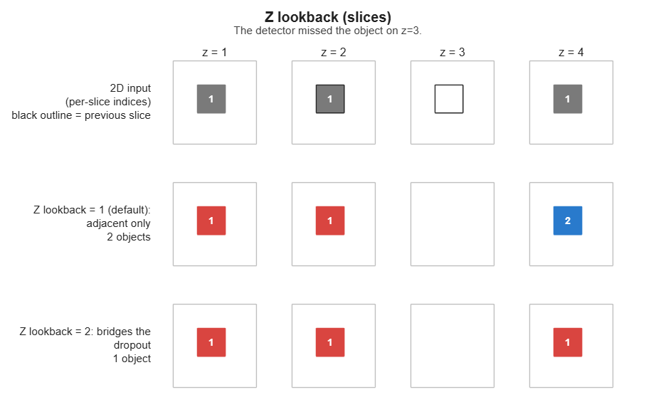{.on-glb}

---

## Cleanup

What happens to the leftovers once the objects are built.

<div class="h3-like">Min object size (voxels)</div>

Delete 3D objects smaller than this. `0` = keep all. The first thing to try against noise; values
around `50-200` suit dense EM data.

??? example "Example: Min object size"
    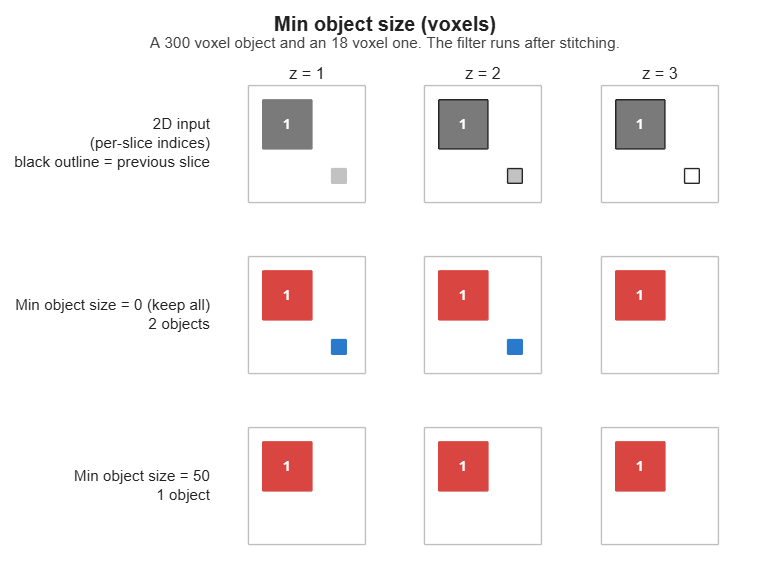{.on-glb}

<div class="h3-like">Min object depth (slices)</div>

Delete 3D objects present on this many slices or fewer. `0` = keep all, `1` = drop single-slice
objects. Catches what a size threshold cannot: a false detection can be large in the plane yet
absent from the next slice.

??? example "Example: Min object depth"
    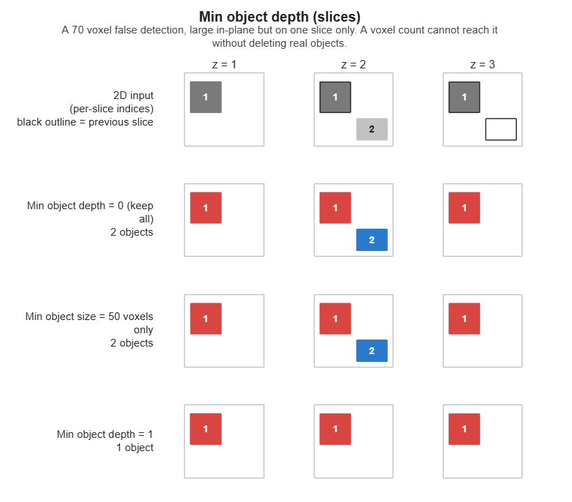{.on-glb}

<div class="h3-like">Absorb fragments (voxels)</div>

Give objects this small to the object around them instead of leaving them as separate specks. On by
*default* (`5`); `0` = off. Such specks are usually a few stray pixels of a real object, so deleting
them would leave a hole in it. Specks with no neighbour to join are left to the two settings above.

??? example "Example: Absorb fragments"
    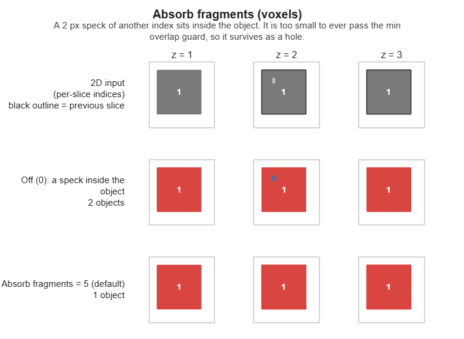{.on-glb}

---

## Thick sections and gaps

Only needed for anisotropic or patchy data.

<div class="h3-like">Anisotropic Z</div>

When Z sections are thick, an object shifts further between slices, so its overlap drops even though
it is the same object. This lowers the IoU threshold by the Z/XY voxel ratio. Best used together
with **Max centroid shift**.

On the ribbon it appears as the checkbox
<span class="widget widget-checkbox">Anisotropic Z (use pixel size)</span> and the ratio comes from
the dataset. In DeepMIB it appears as
<span class="widget widget-edit">Z anisotropy ratio</span>, to be typed in; `1` = isotropic, off.

??? example "Example: Anisotropic Z"
    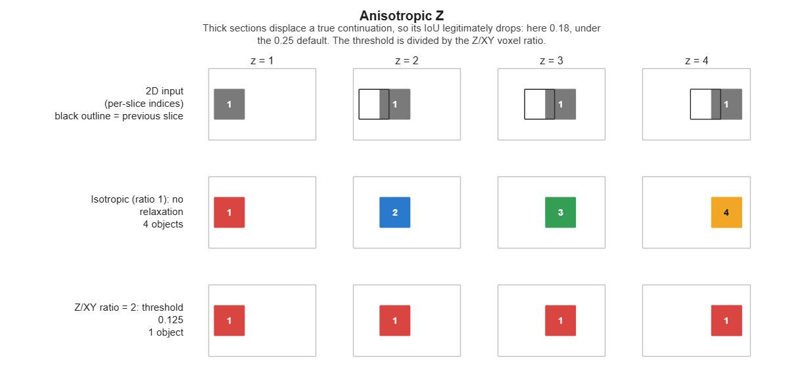{.on-glb}

<div class="h3-like">Max centroid shift (pixels)</div>

Refuse a link when the two objects' centres are farther apart than this. `0` = off. Its job is to
stop a relaxed IoU threshold from joining distant objects.

??? example "Example: Max centroid shift"
    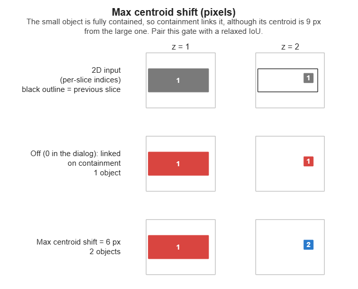{.on-glb}

<div class="h3-like">Centroid link radius (pixels)</div>

Join an object that has *no* overlapping neighbour at all to the nearest object of comparable size
within this distance. `0` = off. Leave it off unless the data is strongly anisotropic or has
frequent gaps.

??? example "Example: Centroid link radius"
    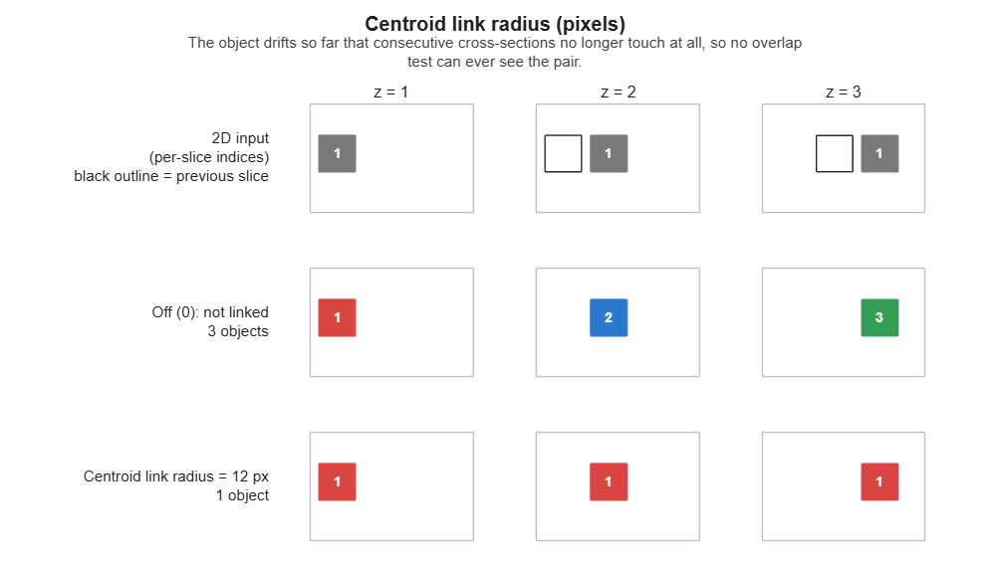{.on-glb}

---

## Tips

!!! tip "Cleaning up noise objects"
    Most spurious objects come from the 2D prediction rather than from the stitching, so try the
    cleanup settings before adjusting the linking parameters.

    Start by asking what a speck actually is. If it belongs to the object beside it,
    **Absorb fragments** hands it back - which is why that one is on by default. If it belongs to
    nothing, delete it: **Min object size** for small fragments, and **Min object depth** for false
    detections that are large in the plane but appear on only one or two slices.

!!! info "The settings are remembered, and echoed to the console"
    The dialog reopens on the values used last, for as long as MIB is running, and DeepMIB's
    <span class="widget widget-button">Merge 2D to 3D</span> shares them. The values are per session
    and are not written to preferences, so restarting MIB returns to the defaults.

    Each accepted run also prints one line to the MATLAB console listing exactly what was used, which
    is worth copying into your notes to record which trial produced which model.

---

## Troubleshooting

??? question "Two objects stayed apart although they clearly overlap in Z"
    Check the two cross-sections' **areas**, not just the overlap. IoU and IoA are ratios against
    area, so a wide profile meeting a much narrower one is penalised twice over and can fail both
    tests on a substantial shared area. Measure the pair before changing anything:

    ```matlab
    labels = mib.mibModel.I{1}.labels.data;
    maskA = labels(:,:,27) == 15;   % the two 2D objects you are looking at
    maskB = labels(:,:,28) == 13;
    inter = nnz(maskA & maskB);
    fprintf('inter %d, IoU %.3f, IoA %.3f\n', inter, ...
        inter/(nnz(maskA)+nnz(maskB)-inter), inter/min(nnz(maskA), nnz(maskB)));
    ```

    If the ratios are low but `inter` is large, set **Absolute overlap to link** a little below that
    `inter`. Prefer it to lowering the IoU or IoA thresholds, which relaxes *every* pair in the
    stack. Before committing, confirm the two objects really are one: if they coexist as separate
    objects over many slices, each with its own sizeable cross-section, they are more likely two
    neighbours that touch once.

??? warning "Most objects came out as one giant object"
    That is the signature of per-slice indices shared by several unconnected blobs, and no threshold
    will fix it - each shared index welds its blobs' 3D objects together, and the welds chain from
    slice to slice until most of the stack is a single instance. Keep
    **Split disconnected 2D objects** enabled. To confirm the input is affected, compare the number
    of indices on a slice against the number of separate blobs:

    ```matlab
    slice = mib.mibModel.I{1}.labels.data(:,:,13);
    ids = unique(slice(slice > 0));
    blobs = sum(arrayfun(@(k) bwconncomp(slice == k, 8).NumObjects, ids));
    fprintf('%d indices, %d blobs\n', numel(ids), blobs);
    ```

    More blobs than indices means the 2D prediction reuses indices. It is worth improving the 2D step
    as well (raise the prediction threshold, retrain), since each shared index is a wrong 2D
    instance.

---

## See also

- [Instance editor](model-instance-editor.md) - repairs the objects that no threshold can fix
- [DeepMIB instance segmentation](../../../deepmib/deepmib-instance.md) - producing the 2D instances
