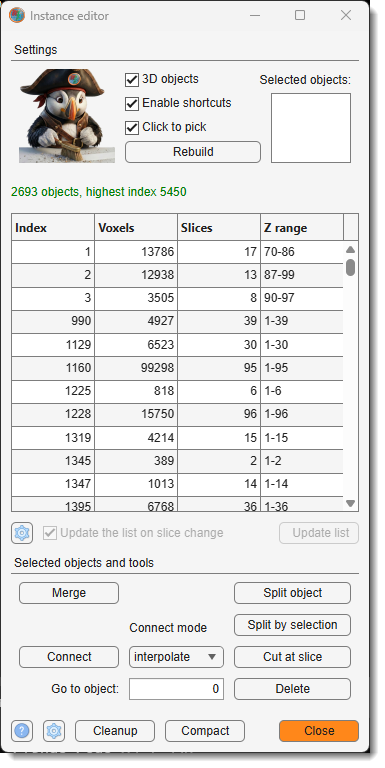
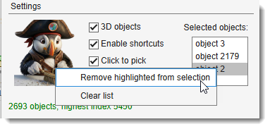

# Instance Editor

*Back to [MIB](../../../index.md) | [User interface](../../index.md) | [Ribbon](../index.md) | [Model](index.md)*

---

## Overview

{.on-glb align=right width="220"}

Corrects individual objects of an instance model by hand: splitting one object into two, merging
several into one, bridging a gap between two halves of the same object, and deleting false
detections.

It is the proofreading step after [Stitch 2D instances to 3D](instance-stitching.md). Automatic
stitching leaves errors that no threshold can remove - two objects that genuinely overlap across many
slices are fused, and one object that breaks in two far apart in Z stays two - and those are repaired
here.

Requires an instance model (65535 or 4294967295 materials), where every object has its own index.

---

## 2D and 3D

3D objects decides what an operation reaches. With it off, everything is 
confined to the shown slice, and the list follows: it names the objects on that slice and gives their area on it. 
**Cut at slice** and **Connect** are unavailable there, both being operations along Z. The editor opens matching
the [3D checkbox of the Segmentation panel](../../panels/segm/index.md),
which records whether the objects of the model are 2D or 3D.

This is the mode for a model that has not been stitched into 3D yet. There the numbering starts again from 1 on every slice, so the same number is a different object on each one - which is why the list cannot describe the whole stack at once, and why objects picked on one slice are dropped when the list moves to another.

Moving to another slice re-reads the list. On a large stack, turn Update the list on slice change off and press Update list when you need it; until then the status line says which slice the list is describing.

---

## Choosing the objects to work on

Objects can be picked from the list, or with
Pick objects by clicking, which lets you click them
directly in the Image View panel. 

While clicking, 

- a plain <mouse class="left"></mouse> starts a new selection
- ++shift++ adds an object to it 
- ++ctrl++ takes one out. 

Panning with <mouse class="right"></mouse> keeps working as usual. Whatever is picked is shown in the Selection
layer, so you can see what you are about to change before you change it; anything you have drawn
there yourself is kept, and comes back as soon as you start drawing again.

**Merge** and **Split by selection** need no picking at all: draw a shape in the Selection layer and
they act on whatever it covers - one object, several, or none, which is how **Merge** grows and
creates objects as well as joining them. Picking objects first restricts them to those objects, and
then the drawing is left alone rather than used.

{.on-glb align=right width="250"}

To take an object back out of the list of selected objects, highlight it there and right-click for
Remove highlighted from selection;
Clear list in the same menu empties it altogether. The list
is emptied by itself after an operation, ready for the next one.

Clicking a single object - in either list - also moves the view to it, so an object can be found from
its number alone; in 2D the view stays on the current slice. Use
Go to object: to reach an object that the list does not
currently show.

The Settings button under the object table (:octicons-gear-16:) decides what it contains: 

- the number of rows in the table to render 
- the maximal size of objects to show in the table
- the slice count - above which an object is left out, which is how small false detections are found
- the connectivity parameter to define a way how the objects are split

Anything picked stays listed whatever the filters say. The same dialog carries the
connectivity the split operations use to decide what counts as one piece.

---

## Working from the keyboard

Enable shortcuts puts the two operations on the keys the hand is
already resting on, so that proofreading needs one hand for the mouse and nothing else:

| Key | Does |
|-----|------|
| ++a++ | Commit the drawing: merge, grow or create - the drawn area joins the object either way |
| ++s++ | Subtract the drawing: split what it cuts through, remove what it covers entirely |
| ++c++ | Empty the list of picked objects and clear the Selection layer |
| ++ctrl+f++ | Add the object under the cursor to the selection |

++a++ and ++s++ are MIB's usual *add to* and *subtract from* material keys, aimed at a single object
instead of the whole material: what you draw is added to the object under it, or cut out of it. So an
object can be joined, extended or split without ever putting the brush down.

++c++ keeps its usual meaning and empties the list of picked objects as well, so one key starts the
next object from nothing.

Every other key works as it always does, ++i++ and ++ctrl+z++ included. Untick the checkbox or close
the editor and ++a++, ++s++ and ++c++ go back to writing to the material.

---

## Operations

| Operation | Description |
|-----------|-------------|
| **Merge** | Joins objects into one, which keeps the **smallest** of their indices. What it joins depends on what you give it:<ul><li>**Objects picked** - those objects, in full. Anything drawn is left alone.</li><li>**Nothing picked, shape over several objects** - all of them, plus the empty space the shape crossed, so the result is one connected object.</li><li>**Nothing picked, shape over one object** - that object grows by the shape.</li><li>**Nothing picked, shape over empty space** - the shape becomes a new object.</li><li>**In 3D the shape also reaches the slice above and below itself**, so it can grow an object it only touches there. Whichever object the shape covers the most of takes it, and every other object keeps every voxel it had - including one the shape merely clips.</li></ul>

Also on the keyboard

With Enable shortcuts ticked, ++a++ does the same as this button, so an object can be joined or grown without leaving the brush.

 |
| **Split components** | Breaks each picked object into its separate pieces: the largest keeps the index, the others get new ones. Use it where one number covers two things that do not touch. |
| **Split by selection** | Cuts the drawn shape out of the objects under it, then splits what is left. The one to use after brushing a break.<ul><li>**Nothing picked** - everything the shape covers is split.</li><li>**Objects picked** - only those are cut, for a break that also crosses a neighbour you want left alone.</li><li>**Shape over a whole object** - nothing is left of it, so the object goes. In 2D it goes from the shown slice only.</li><li>**Objects picked, nothing drawn** - the picked objects go, for the same reason: they are what is in the Selection layer.</li></ul>

Also on the keyboard

With Enable shortcuts ticked, ++s++ does the same as this button, so a break can be brushed and cut without putting the brush down.

 |
| **Cut at slice** | Splits the picked object along Z: everything from the shown slice onwards becomes a new object. Use it where an object is correct for a while and then continues into its neighbour. Needs 3D. |
| **Connect** | Joins two objects that belong together but do not touch, filling the space between them. Only empty space is filled, so an object in the way is never overwritten. Needs 3D.<ul><li>**Two objects picked** - interpolate shapes the bridge from their two facing ends, so nothing needs to be drawn, but it needs a gap in Z to work from; selection uses the shape you drew instead, and also joins two objects lying side by side.</li><li>**Nothing picked** - the same as **Merge**: the shape you drew goes to the object it covers the most of, and Connect Mode is not used. Joining two objects is what picking both is for.</li></ul> |
| **Delete** | Removes the picked objects. |
| **Cleanup** | Applies the same noise filters as the stitching dialog to the whole model, without re-stitching it. Asks for the three filters and then applies them; object numbers are left alone. :octicons-gear-16: next to it sets the same filters without cleaning anything, and either way they are kept for the rest of the session.<ul><li>**Min object size** - deletes objects below a voxel count.</li><li>**Min object depth** - deletes objects spanning too few slices. Catches the wide false detection that never continues through the stack.</li><li>**Absorb fragments** - gives tiny objects to the object around them instead of deleting them, which fills the holes punched into otherwise solid objects.</li></ul> |
| **Compact** | Renumbers every object to a continuous 1, 2, 3... after deletes and splits have left gaps. **All object numbers change.**<ul><li>**3D** - one numbering across the whole model.</li><li>**2D** - each slice is renumbered on its own, which is where the gaps are on a model that has not been stitched: a slice holding 1, 3, 5 becomes 1, 2, 3.</li></ul> |

Every operation can be undone with ++ctrl+z++.

!!! tip "Splitting an object with the brush"
    The most direct way to split an object is to draw the break yourself:

    1. Brush the break into the Selection layer where the object should be cut. In 3D, brush it on a
       few slices and press ++i++ to interpolate between them.
    2. Press Split by selection.

    There is no need to pick the object: whatever the drawing lies on is what gets cut. The brushed
    area is cleared out of the object and the two halves become separate objects, in a single
    undoable step, and the drawing is used up.

    Pick the object first only when the break also crosses a neighbour you want left alone - then
    the cut is kept to what you picked. Do the picking after the drawing: picking covers the object
    in the Selection layer, and drawing on top of that clears the highlight out of the way but does
    not keep the stroke that cleared it.

!!! tip "Painting a missing piece with the brush"
    The same gesture the other way round, for an object the prediction lost part of:

    1. Brush the missing piece into the Selection layer.
    2. Press Merge, or ++a++ with
       Enable shortcuts ticked.

    Nothing needs to be picked. In 2D the piece joins the object the stroke is laid across. In 3D it
    can also join an object it only touches on the slice above or below, which is what fills in a
    slice an object is missing from.

    **The shape goes to one object: the one it covers the most of.** Everything else keeps every
    voxel it had. That is what makes painting into a crowded place safe - the neighbour the stroke
    clips by a few pixels, on this slice or the next, is not what you meant and does not take it.
    Draw the shape squarely over a neighbour instead and the neighbour takes it, which is how an
    object is grown sideways.

    Two objects are never joined to each other this way, even where the shape reaches one above it
    and a different one below. Once the piece is painted in, the two are touching; joining them is
    then Connect, or picking both and pressing
    Merge.

!!! note "Rebuilding the list"
    The object list is built once and then kept up to date as you edit, which is what keeps the tool
    responsive on models with thousands of objects. Changing the model with another tool - a brush
    stroke, an undo - leaves it out of date, and the status line says so. The next operation rebuilds
    it before doing anything, so nothing can be applied to stale information; press
    Rebuild to refresh the list without waiting for that.

---

*Back to [MIB](../../../index.md) | [User interface](../../index.md) | [Ribbon](../index.md) | [Model](index.md)*
