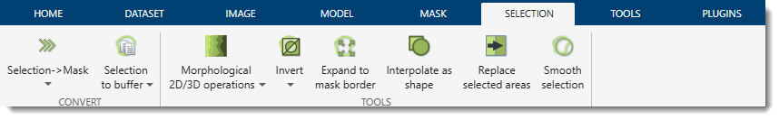
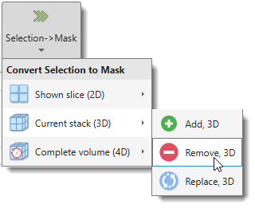
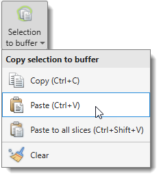
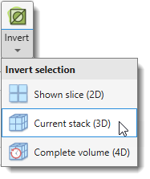
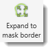
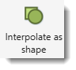
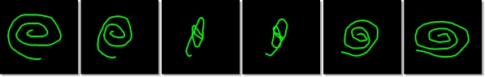

# Selection Ribbon Tab

---

## Overview

Actions that can be applied to the *Selection* layer. The *Selection* is one of three main segmentation layers 
(*Model*, *Selection*, *Mask*) which can be used in combination with other layers. 
See more about segmentation layers in the [Data layers section](../../image-layers.md).

---

## Convert Section

### Selection→Mask

{.on-glb align=left width="250"}

Transfers the *Selection* layer into the *Mask* layer. The main button opens a dropdown to choose
the dataset extent and the transfer mode.

| Scope | Add | Remove | Replace |
|-------|-----|--------|---------|
| **Shown slice (2D)** | Add, 2D | Remove, 2D | Replace, 2D |
| **Current stack (3D)** | Add, 3D | Remove, 3D | Replace, 3D |
| **Complete volume (4D)** | Add, 4D | Remove, 4D | Replace, 4D |

- **Add** — adds selected pixels/voxels to the existing Mask.
- **Remove** — removes selected pixels/voxels from the existing Mask.
- **Replace** — replaces the Mask with the Selection.

---

### Selection to buffer

{align=left}

Copies the *Selection* of the currently displayed slice to a temporary buffer for later pasting.

| Action | Shortcut | Description |
|--------|----------|-------------|
| **Copy** | ++ctrl+c++ | Copy the current slice Selection to the buffer. |
| **Paste** | ++ctrl+v++ | Paste the buffer onto the current slice. |
| **Paste to all slices** | ++ctrl+shift+v++ | Paste the buffer onto every slice in the dataset. |
| **Clear** | — | Clear the buffer (does not affect the Selection, Mask, or Model). |

---

## Tools Section

### Morphological 2D/3D operations

{.on-glb align=left width="300"}

Opens the [Morphological Operations](selection-morphops.md) dialog pre-set to the chosen operation.
All operations work on the *Selection* layer.

See MATLAB's [bwmorph](https://se.mathworks.com/help/images/ref/bwmorph.html),
[bwmorph3](https://se.mathworks.com/help/images/ref/bwmorph3.html), and
[bwskel](https://se.mathworks.com/help/images/ref/bwskel.html) for full details.

[:fontawesome-brands-youtube:{.red-color} Demonstration](https://youtu.be/L-w8eGDfUkU)  
[:fontawesome-brands-youtube:{.red-color} Skeleton for 3D objects](https://youtu.be/Au4vb7max9Q)

| Item | Operation | Description |
|------|-----------|-------------|
| **Branch points** | `branchpoints` | Detects branch points of skeleton lines. |
| **Diagonal fill** | `diag` | Fills diagonal connections to remove 8-connectivity artifacts. |
| **Endpoints** | `endpoints` | Detects endpoints of skeleton lines. |
| **Skeleton** | `skel` | Reduces objects to 1-pixel-wide skeletons. |
| **Spur** | `spur` | Removes small spurs (short branches) from skeletons. |
| **Thin** | `thin` | Iteratively thins objects without removing endpoints. |
| **Ultimate erosion** | `bwulterode` | Erodes objects to their ultimate eroded points (local maxima of the distance transform). |

---

### Invert

{align=left}

Inverts the *Selection* layer — selected pixels become background and background becomes selected.
Clicking the main button inverts the complete volume (4D). The dropdown selects the scope:

- **Shown slice (2D)** — inverts the selection on the currently displayed slice only.
- **Current stack (3D)** — inverts the selection across all slices in the current Z-stack.
- **Complete volume (4D)** — inverts the selection across the entire dataset including all time points.

---

### Expand to mask border

{align=left}

Expands each selected area to fill the containing mask region — selected pixels grow outward until
they reach the boundary of the *Mask* layer.

---

### Interpolate as shape

{align=left}

Reconstructs the *Selection* layer on empty slices between two annotated slices (shortcut ++i++).
The button label and icon reflect the active interpolation type set in
[Preferences](../../ribbon/home/home-preferences.md):

- **Interpolate as shape** — ideal for blobs and filled structures. [:fontawesome-brands-youtube:{.red-color} Demo](https://youtu.be/ZcJQb59YzUA?t=4m3s)
- **Interpolate as line** — suited for unclosed lines such as membranes. [:fontawesome-brands-youtube:{.red-color} Demo](https://youtu.be/ZcJQb59YzUA?t=2m22s)

!!! warning
    Only one object should be present in the *Selection* layer on both the starting and ending slices.

??? example "Shape interpolation example"
    {.on-glb align=left}

??? example "Line interpolation example"
    {.on-glb align=left}

---

### Replace selected areas

{.on-glb align=left width="220"}

Replaces image intensities in selected areas with new values.
A dialog prompts for the replacement intensity, the slice range, and the color channels to affect.

[:fontawesome-brands-youtube:{.red-color} Demonstration](https://youtu.be/fNz1vGq7Hb0)

---

### Smooth selection

{.on-glb align=left width="300"}

Smooths the *Selection* layer in 2D or 3D space.

!!! info "Selection smoothing"
    
    Use [Image Filters](../image/image-filters.md) for interactive evaluation of smoothing results before committing.

---

*Back to [MIB](../../../index.md) | [User interface](../../index.md) | [Ribbon](../index.md)*
