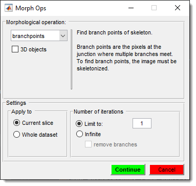

# Morphological 2D/3D Operations

*Back to [MIB](../../../index.md) | [User interface](../../index.md) | [Ribbon](../index.md) | [Selection](index.md)*

---

## Description

{.on-glb align=left width="300"}

Performs morphological operations on 2D and 3D objects in the **Selection** layer of the dataset, modifying the layer based on the chosen operation. See MATLAB’s [bwmorph](https://se.mathworks.com/help/releases/R2024b/images/ref/bwmorph.html), [bwmorph3](https://se.mathworks.com/help/releases/R2024b/images/ref/bwmorph3.html), and [bwskel](https://se.mathworks.com/help/releases/R2024b/images/ref/bwskel.html) functions for details.

[:fontawesome-brands-youtube:{.red-color} Demonstration](https://youtu.be/L-w8eGDfUkU)  
[:fontawesome-brands-youtube:{.red-color} Skeleton for 3D objects](https://youtu.be/Au4vb7max9Q)

Select the morphological operation from the 
Morphological operation dropdown. 

For applicable operations (e.g., Thin, Skeleton), optionally specify the number 
of iterations in the Limit to field and
choose the processing dimension with the 
Apply to radio buttons, 
selecting **Current slice** or **Whole dataset**. 

Use the 3D objects checkbox 
to do morphological operations in 3D. 

For applicable operations (e.g., Thin, Skeleton), optionally specify 
the number of iterations in the Limit to field.

Click the Continue button to modify the
Selection layer, or use the Cancel button
to close the dialog without changes.

## List of available morphological operations

### Branch Points

branchpoints: finds branch points of the skeleton in 2D or 3D Selection layer objects:

- Supports both 2D and 3D processing.
- Reference: [bwmorph](https://se.mathworks.com/help/releases/R2024b/images/ref/bwmorph.html), [bwmorph3](https://se.mathworks.com/help/releases/R2024b/images/ref/bwmorph3.html)

Useful for identifying junctions in skeletal structures, such as in vascular or neuronal networks.

### Clean

clean: removes isolated voxels from the 3D Selection layer:

- 3D processing only.
- Reference: [bwmorph3](https://se.mathworks.com/help/releases/R2024b/images/ref/bwmorph3.html)

Effective for eliminating single-pixel noise in 3D datasets, improving object clarity.

### Diagonal Fill

diag: eliminates 8-connectivity of the background using diagonal fill in the Selection layer:

- 2D processing only (Diag).
- Reference: [bwmorph](https://se.mathworks.com/help/releases/R2024b/images/ref/bwmorph.html)

Helps refine object boundaries by adjusting connectivity, useful for segmentation tasks.

### End Points

endpoints: finds end points of the skeleton in 2D or 3D Selection layer objects:

- Supports both 2D and 3D processing.
- Reference: [bwmorph](https://se.mathworks.com/help/releases/R2024b/images/ref/bwmorph.html), [bwmorph3](https://se.mathworks.com/help/releases/R2024b/images/ref/bwmorph3.html)

Ideal for pinpointing termini in skeletal structures, such as tips of branches or fibers.

### Fill

fill: fills isolated interior voxels (0s surrounded by 1s in 6-connectivity) in the 3D Selection layer, setting them to 1:

- 3D processing only.
- Reference: [bwmorph3](https://se.mathworks.com/help/releases/R2024b/images/ref/bwmorph3.html)

Corrects small gaps within 3D objects, enhancing structural continuity.

### Majority

majority: keeps a voxel at 1 in the 3D Selection layer if 14 or more voxels in its 3x3x3, 26-connected neighborhood are 1; otherwise sets it to 0:

- 3D processing only.
- Reference: [bwmorph3](https://se.mathworks.com/help/releases/R2024b/images/ref/bwmorph3.html)

Smooths 3D objects by reinforcing dominant regions, reducing minor protrusions.

### Remove

remove: removes interior voxels (1s surrounded by 1s in 6-connectivity) in the 3D Selection layer, setting them to 0:

- 3D processing only.
- Reference: [bwmorph3](https://se.mathworks.com/help/releases/R2024b/images/ref/bwmorph3.html)

Hollows out 3D objects, useful for creating shells or isolating boundaries.

### Skeleton

skel: removes boundary pixels from the Selection layer without breaking objects, preserving the Euler number to form the image skeleton:

- Supports 2D and 3D processing (Skel).
- Reference: [bwskel](https://se.mathworks.com/help/releases/R2024b/images/ref/bwskel.html)
- [:fontawesome-brands-youtube:{.red-color} Skeleton for 3D objects](https://youtu.be/Au4vb7max9Q)

Creates a minimal representation of objects, ideal for analyzing topology or connectivity.

### Spur

spur: removes spur pixels (those with one 8-connected neighbor) from the Selection layer, such as line endpoints:

- 2D processing only.
- Reference: [bwmorph](https://se.mathworks.com/help/releases/R2024b/images/ref/bwmorph.html)

Cleans up small protrusions or endpoints, refining object shapes.

### Thin

thin: thins objects in the Selection layer to lines, shrinking objects without holes to minimally connected strokes and objects with holes to rings halfway between holes and outer boundaries, preserving the Euler number:

- Supports 2D and 3D processing.
- Reference: [bwmorph](https://se.mathworks.com/help/releases/R2024b/images/ref/bwmorph.html), [bwmorph3](https://se.mathworks.com/help/releases/R2024b/images/ref/bwmorph3.html)
- [:fontawesome-brands-youtube:{.red-color} Demo](https://youtu.be/rqZbH3Jpru8)

Optionally trim small branches with the **Remove branches** checkbox, useful for simplifying complex structures like networks.

### Ultimate Erosion

bwulterode: reduces objects in the Selection 
layer to points via ultimate erosion:

- Supports 2D and 3D processing.
- Reference: [bwmorph](https://se.mathworks.com/help/releases/R2024b/images/ref/bwmorph.html), [bwmorph3](https://se.mathworks.com/help/releases/R2024b/images/ref/bwmorph3.html)

Produces a minimal set of representative points, ideal for summarizing object locations 
or centroids.

---

*Back to [MIB](../../../index.md) | [User interface](../../index.md) | [Ribbon](../index.md) | [Selection](index.md)*

