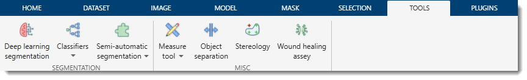
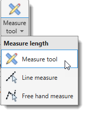
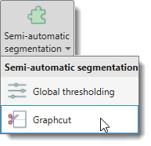
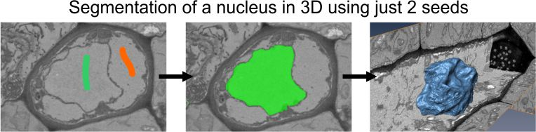
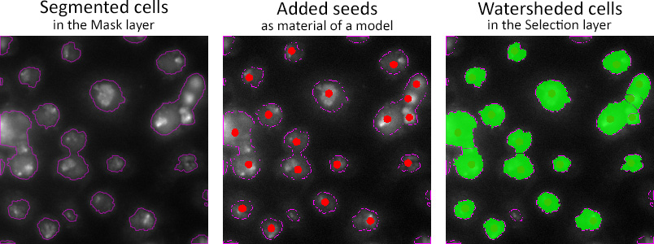

# Tools Ribbon Tab

---

## Overview

Additional tools available in MIB.

{align=left}

---

## Measure length

Allows measuring the length on the image.

{align=left}

### Measure Tool

Based on the [Image Measurement Utility](http://www.mathworks.com/matlabcentral/fileexchange/25964-image-measurement-utility)
by Jan Neggers, Eindhoven University of Technology.
Enables various length measurements and generates corresponding intensity profiles.  
See [Measure Tool details](tools-measuretool.md).

### Line measure

Measures the linear distance between two points.  
Press and hold <mouse class="left"></mouse> to draw a line between objects.  
Results will appear in a pop-up, printed to MATLAB’s main window, and copied to the clipboard 
(paste with ++ctrl+v++).  
Also accessible from the [Quick Access Bar](../../quick-access-bar/index.md).

!!! note
    Pixel sizes are set in [Dataset parameters](../dataset/index.md#parameters).

### Free hand measure

Similar to line measure, but allows arbitrary drawing of the measured distance.

---

## Deep learning segmentation

Provides training of deep convolutional networks on user data and their use for image segmentation. 
See [Deep Learning details](../../deepmib/index.md).

---

## Classifiers

Two classifiers are available in MIB.

- **Membrane detection**: Uses a Random Forest classifier for automatic segmentation, 
  based on [Random Forest for Membrane Detection](http://www.kaynig.de/demos.html) by Verena Kaynig 
  and [randomforest-matlab](https://code.google.com/p/randomforest-matlab/) by Abhishek Jaiantilal. 
  Works for membranes and other objects. See [Random Forest help](tools-randforest.md).
- **Superpixels classification**: Ideal for objects with distinct intensity properties. 
Calculates SLIC superpixels (2D) or supervoxels (3D) and classifies them using provided 
labels for objects and background. 
See [Superpixels example](tools-randforest-slic.md).

---

## Semi-automatic segmentation

{align=left}

Methods for automated image segmentation and object separation.

- [Global thresholding](tools-globalthres.md)
- [Graphcut segmentation](tools-graphcut.md) (*recommended*)
- [Watershed segmentation](tools-watershed.md)

!!! example "Graphcut and watershed example"

    {.on-glb align=left}

---

## Object separation

Tools for separating objects in the current model, mask, or selection layers. 
[See more on object separation](tools-objectsep.md)

!!! example "Example of seeded watersheding of cells"

    {.on-glb align=left}

---

## Stereology
Generate a grid and counts model materials at grid line intersections.  
Results can be exported to MATLAB or Excel. 
[See more on about Stereology](tools-stereology.md)

??? example "Application of stereology to quantify surface fractions" 
    {.on-glb align=left}

---

## Wound healing assay

The wound healing assay is a microscopy-based technique used to study cell migration. 
The Wound healing assay tool of MIB can be used to identify the wound area and measure its width. 
[See more about wound healing assay](tools-wound.md)

---

*Back to [MIB](../../../index.md) | [User interface](../../index.md) | [Ribbon](../index.md)*

