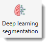
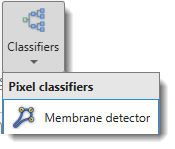
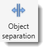

# Tools Ribbon Tab

---

## Overview

Additional tools available in MIB.

{align=left}

---

## Segmentation Section

### Deep learning segmentation

{align=left}

Provides training of deep convolutional networks on user data and their use for image segmentation.

See [Deep Learning details](../../deepmib/index.md).

---

### Classifiers

{align=left}

Pixel classification methods for automated segmentation.

#### Membrane detector

Uses a Random Forest classifier for automatic segmentation based on membrane or other object appearance.

Based on [Random Forest for Membrane Detection](http://www.kaynig.de/demos.html) by Verena Kaynig
and [randomforest-matlab](https://code.google.com/p/randomforest-matlab/) by Abhishek Jaiantilal.

See [Random Forest help](tools-randforest.md).

---

### Semi-automatic segmentation

Methods for automated image segmentation.

{align=left}

#### Global thresholding

Segments objects by intensity threshold applied across the whole dataset.

See [Global thresholding details](tools-globalthres.md).

#### Graphcut

Graph-cut based segmentation — robust for objects with overlapping intensity distributions.

See [Graphcut segmentation details](tools-graphcut.md).

!!! example "Graphcut and watershed example"

    {.on-glb align=left}

---

## Misc Section

### Measure tool

{align=left}

Interactive measurement tools for distances and intensity profiles.

#### Measure tool

{align=left}

Based on the [Image Measurement Utility](http://www.mathworks.com/matlabcentral/fileexchange/25964-image-measurement-utility)
by Jan Neggers, Eindhoven University of Technology.
Enables various length measurements and generates corresponding intensity profiles.

See [Measure Tool details](tools-measuretool.md).

#### Line measure

{align=left}

Measures the linear distance between two points.
Press and hold <mouse class="left"></mouse> to draw a line between objects.
Results appear in a pop-up, printed to MATLAB's main window, and copied to the clipboard
(paste with ++ctrl+v++).

Also accessible from the [Quick Access Bar](../../quick-access-bar/index.md).

!!! note
    Pixel sizes are set in [Dataset parameters](../dataset/index.md#voxels).

#### Free hand measure

{align=left}

Similar to line measure, but allows drawing an arbitrary path for the measured distance.

---

### Object separation

{align=left}

Tools for separating touching or overlapping objects in the current model, mask, or selection layers.

See [Object separation details](tools-objectsep.md).

!!! example "Example of seeded watersheding of cells"

    {.on-glb align=left}

---

### Stereology

{align=left}

Generates a grid and counts model materials at grid-line intersections.
Results can be exported to MATLAB or Excel.

See [Stereology details](tools-stereology.md).

??? example "Application of stereology to quantify surface fractions"
    {.on-glb align=left}

---

### Wound healing assay

{align=left}

The wound healing assay is a microscopy-based technique used to study cell migration.
This tool identifies the wound area and measures its width.

See [Wound healing assay details](tools-wound.md).

---

*Back to [MIB](../../../index.md) | [User interface](../../index.md) | [Ribbon](../index.md)*
