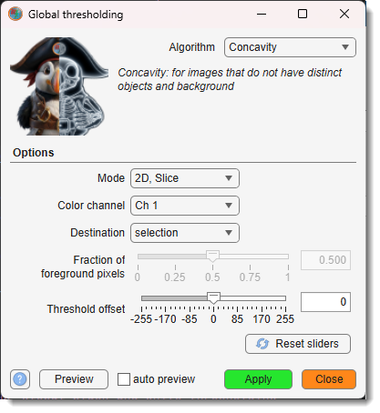

# Global Black-and-White Thresholding

Applies a histogram-based thresholding algorithm to convert a grayscale image into a binary
(black-and-white) result and writes it to the Selection or Mask layer.

---

## Overview

{.on-glb align=left width="300"}

Accessible via `Ribbon → Tools → Semi-automatic segmentation → Global thresholding`.

Twelve algorithms are available, each suited to different image characteristics.
The result is written to the **Selection** or **Mask** layer depending on the
<span class="widget widget-dropdown">Destination</span> setting.

[:fontawesome-brands-youtube:{.red-color} Global black and white thresholding in MIB](https://youtu.be/mzfgxLvkGTI)

!!! note
    Most algorithms are optimised for 8-bit images. For 16-bit data the image is
    normalised to 8-bit per slice before thresholding (Otsu uses the full bit depth via MATLAB's
    `graythresh`).

---

## Controls

- <span class="widget widget-dropdown">Algorithm</span>: thresholding method to use
  (see [Algorithms](#algorithms) below for descriptions of each).

**Options panel**

- <span class="widget widget-dropdown">Mode</span>: dataset extent to process —
  *2D, Slice* (current slice only), *3D, Stack* (all slices in the current Z-stack),
  or *4D, Dataset* (all slices and time points).
- <span class="widget widget-dropdown">Color channel</span>: color channel used for thresholding.
- <span class="widget widget-dropdown">Destination</span>: layer that receives the binary result —
  *selection* or *mask*.
- <span class="widget widget-edit">Fraction of foreground pixels</span> + slider:
  fraction of pixels assumed to belong to the foreground (0–1). Active only for the **Percentile** algorithm.
- <span class="widget widget-edit">Threshold offset</span> + slider:
  integer offset added to the computed threshold — positive raises it (fewer foreground pixels),
  negative lowers it (more foreground pixels).
- <span class="widget widget-button">Reset sliders</span>: resets *Fraction of foreground pixels*
  to 0.5 and *Threshold offset* to 0.

- <label class="widget widget-checkbox">auto preview</label>: updates the Selection layer
  automatically after each widget change (current slice only).
- <span class="widget widget-button">Preview</span>: applies thresholding to the current slice
  and shows the result in the Selection layer without committing to the chosen scope.
- <span class="widget widget-button">Apply</span>: applies thresholding to the full selected scope.
- <span class="widget widget-button">Close</span>: closes the dialog.

---

## Algorithms

### Concavity

Suitable when images lack distinct objects and background, making MINIMUM and INTERMODES algorithms ineffective:

- Constructs the convex hull *H* of the histogram *y*
- Finds local maxima of *|H − y|*
- Sets threshold *t* to the value of *j* maximising the balance measure *bj = Aj(An − Aj)*

!!! abstract "References"
    - A. Rosenfeld and P. De La Torre, "Histogram concavity analysis as an aid in threshold selection," *IEEE Trans. Systems Man Cybernet.*, vol. 13, pp. 231–235, 1983
    - Based on the [HistThresh Toolbox](https://github.com/carandraug/histthresh) by Antti Niemistö, Tampere University of Technology

---

### Entropy

A maximum entropy method that splits the histogram into two probability distributions (objects / background):

- Sets threshold *t* to maximise the sum of entropies of those distributions:  
  *(Ej / Aj) − log(Aj) + ((En − Ej) / (An − Aj)) − log(An − Aj)*

!!! abstract "References"
    - J. N. Kapur, P. K. Sahoo, and A. K. C. Wong, "A new method for gray-level picture thresholding using the entropy of the histogram," *Comput. Vision Graphics Image Process.*, vol. 29, pp. 273–285, 1985
    - Based on the [HistThresh Toolbox](https://github.com/carandraug/histthresh) by Antti Niemistö, Tampere University of Technology

---

### InterMeans iter

An iterative algorithm (similar to Otsu but less computationally intensive):

- Starts with an initial threshold *t*; iteratively updates *t = ⌊(μt + νt) / 2⌋* until convergence
- Results may depend on the initial *t* value
- Use **Mean** for comparable object and background areas; **InterModes** for small objects

!!! abstract "References"
    - T. Ridler and S. Calvard, "Picture thresholding using an iterative selection method," *IEEE Trans. Systems Man Cybernet.*, vol. 8, pp. 630–632, 1978
    - H. J. Trussell, *IEEE Trans. Systems Man Cybernet.*, vol. 9, p. 311, 1979
    - Based on the [HistThresh Toolbox](https://github.com/carandraug/histthresh) by Antti Niemistö, Tampere University of Technology

---

### InterModes

Assumes a bimodal histogram — an alternative to **Minimum**:

- Identifies two peaks *yj* and *yk* and sets *t = (j + k) / 2*
- Unsuitable for histograms with extremely unequal peaks

!!! abstract "References"
    - J. M. S. Prewitt and M. L. Mendelsohn, "The analysis of cell images," *Ann. New York Acad. Sci.*, vol. 128, pp. 1035–1053, 1966
    - Based on the [HistThresh Toolbox](https://github.com/carandraug/histthresh) by Antti Niemistö, Tampere University of Technology

---

### Mean

Sets *t* to the integer part of the mean of all pixel values: *t = Bn / An*.

Does not take histogram shape into account — often yields suboptimal results.

!!! abstract "References"
    - Based on the [HistThresh Toolbox](https://github.com/carandraug/histthresh) by Antti Niemistö, Tampere University of Technology

---

### Median

Sets *t* to the median of all pixel values (equivalent to **Percentile** with *Fraction = 0.5*).

Does not take histogram shape into account.

!!! abstract "References"
    - W. Doyle, "Operation useful for similarity-invariant pattern recognition," *J. Assoc. Comput. Mach.*, vol. 9, pp. 259–267, 1962
    - Based on the [HistThresh Toolbox](https://github.com/carandraug/histthresh) by Antti Niemistö, Tampere University of Technology

---

### MinError

Assumes a Gaussian mixture model and minimises classification error:

- Allows different means and variances for objects and background
- Sets *t* to minimise *pj log(σj / pj) + qj log(τj / qj)*

!!! abstract "References"
    - J. Kittler and J. Illingworth, "Minimum error thresholding," *Pattern Recognition*, vol. 19, pp. 41–47, 1986
    - Based on the [HistThresh Toolbox](https://github.com/carandraug/histthresh) by Antti Niemistö, Tampere University of Technology

---

### MinError iter

Iterative version of **MinError** — less computationally intensive:

- Initialises *t* using **Mean** and iterates until convergence
- Fails if the resulting quadratic equation has no real solution

!!! abstract "References"
    - J. Kittler and J. Illingworth, "Minimum error thresholding," *Pattern Recognition*, vol. 19, pp. 41–47, 1986
    - Based on the [HistThresh Toolbox](https://github.com/carandraug/histthresh) by Antti Niemistö, Tampere University of Technology

---

### Minimum

Assumes a bimodal histogram:

- Smooths the histogram with a three-point mean filter until only two local maxima remain
- Chooses *t* at the valley between them (*yt−1 > yt < yt+1*)
- Unsuitable for histograms with unequal peaks or a broad, flat valley

!!! abstract "References"
    - J. M. S. Prewitt and M. L. Mendelsohn, "The analysis of cell images," *Ann. New York Acad. Sci.*, vol. 128, pp. 1035–1053, 1966
    - Based on the [HistThresh Toolbox](https://github.com/carandraug/histthresh) by Antti Niemistö, Tampere University of Technology

---

### Moments

Moment-preserving thresholding — sets *t* such that the first three moments of the gray-level
image are preserved in the thresholded binary result.

!!! abstract "References"
    - W. Tsai, "Moment-preserving thresholding: a new approach," *Comput. Vision Graphics Image Process.*, vol. 29, pp. 377–393, 1985
    - Based on the [HistThresh Toolbox](https://github.com/carandraug/histthresh) by Antti Niemistö, Tampere University of Technology

---

### Otsu

Implemented via MATLAB's
[graythresh](https://se.mathworks.com/help/images/ref/graythresh.html).
Calculates an optimal threshold to minimise intra-class intensity variance.
Works with the full bit depth of the image.

!!! abstract "References"
    - N. Otsu, "A Threshold Selection Method from Gray-Level Histograms," *IEEE Trans. Systems Man Cybernet.*, vol. 9, no. 1, pp. 62–66, 1979

---

### Percentile

Assumes that the fraction of foreground pixels is known:

- Sets *t* to the highest gray-level such that at least *(1 − Fraction)* of pixels map to background
- Configure via <span class="widget widget-edit">Fraction of foreground pixels</span> (default 0.5 = Median)

!!! abstract "References"
    - W. Doyle, "Operation useful for similarity-invariant pattern recognition," *J. Assoc. Comput. Mach.*, vol. 9, pp. 259–267, 1962
    - Based on the [HistThresh Toolbox](https://github.com/carandraug/histthresh) by Antti Niemistö, Tampere University of Technology

---

## Batch scripting

This tool supports batch scripting for automation.

??? abstract "Example"

    ```matlab
    BatchOpt.Algorithm    = {'Otsu'};        % thresholding algorithm
    BatchOpt.Mode         = {'3D, Stack'};   % '2D, Slice' | '3D, Stack' | '4D, Dataset'
    BatchOpt.ColorChannel = {'Ch 1'};        % color channel
    BatchOpt.Destination  = {'selection'};   % 'selection' | 'mask'
    % Optional range limiters:
    BatchOpt.t = [1 1];      % time points [t1, t2]
    BatchOpt.z = [10 20];    % slices [z1, z2]
    BatchOpt.x = [10 120];   % x crop [x1, x2]
    % Percentile-specific:
    BatchOpt.ForegroundFraction = {0.3, [0 1], 'off'};
    % Threshold fine-tuning:
    BatchOpt.ThresholdOffset = {5, [-Inf Inf], 'on'};

    obj.mibController.startController('controllers.GlobalThresholding', [], BatchOpt);
    ```

---

*Back to [MIB](../../../index.md) | [User interface](../../index.md) | [Ribbon](../index.md) | [Tools](index.md)*
