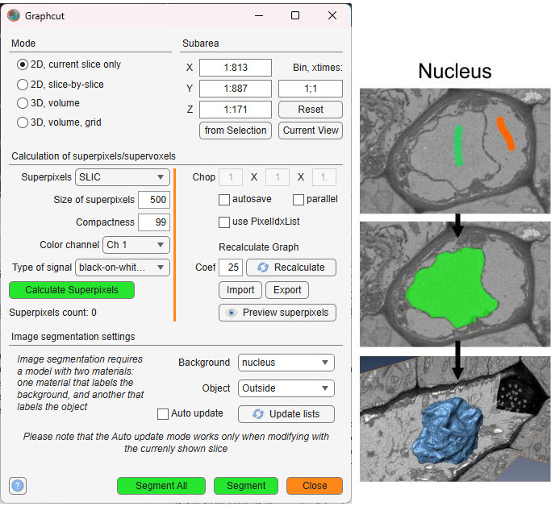
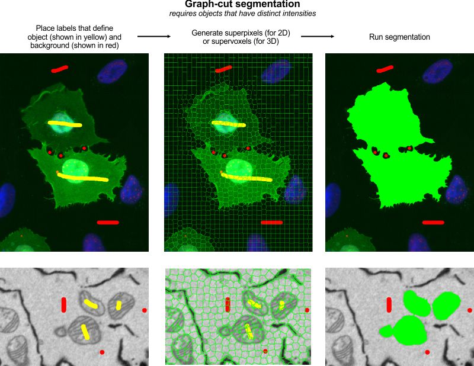
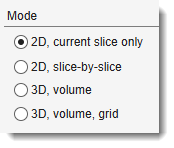
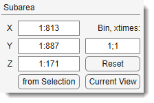
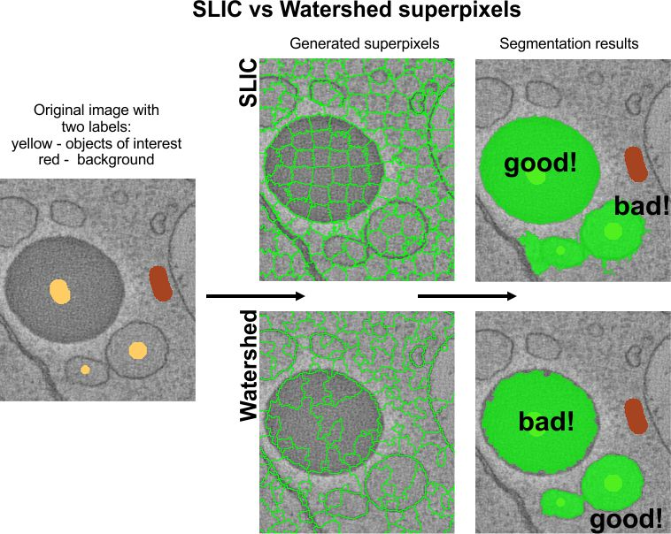
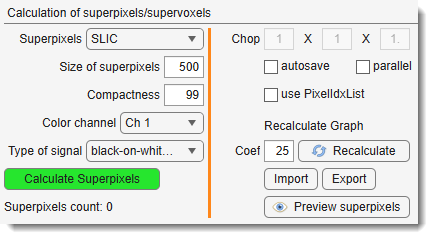
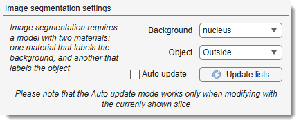

# Graphcut Segmentation

Semi-automated image segmentation using the max-flow/min-cut graphcut method.

---

## Overview

The **Graphcut segmentation** tool provides semi-automated segmentation using the max-flow/min-cut
algorithm. It is based on the [Max-flow/min-cut algorithm](http://vision.csd.uwo.ca/code/) by Yuri Boykov and
Vladimir Kolmogorov, with a MATLAB implementation
by [Michael Rubinstein](http://www.mathworks.com/matlabcentral/fileexchange/21310-maxflow).

Instead of segmenting individual pixels, it operates on superpixels (2D) or supervoxels (3D),
generated via the [SLIC algorithm](http://ivrl.epfl.ch/research/superpixels) by
Radhakrishna Achanta et al. or the Watershed algorithm. SLIC superpixels excel for
objects with intensity contrast, while Watershed superpixels are better for objects with
distinct boundaries.  
Precomputing superpixels requires initial processing time but accelerates subsequent segmentation.

---

## General example

[:fontawesome-brands-youtube:{.red-color} Watch on YouTube](https://youtu.be/dMeoIZPaDS4)

??? abstract "How to use"
    {.on-glb}

    Steps to perform graphcut segmentation:

    1. Use two model materials to mark background and object areas of interest
    2. Launch the tool via `Ribbon → Tools → Semi-automatic segmentation → Graphcut`
    3. Choose a mode: *2D* or *3D*
    4. Select superpixel/supervoxel type: *SLIC* or *Watershed*
    5. Generate superpixels/supervoxels by clicking Calculate Superpixels
    6. Verify and adjust superpixel size if necessary
    7. Click Segment to start segmentation

    ??? note
        Some functions may require compilation; see the [System Requirements](https://mib.helsinki.fi/downloads_systemreq.html#superpixels) page for details

---

## Mode panel

The *Mode panel* lets you select the segmentation scope.

{align=left}

- 2D, current slice only — segments only the current slice in the [Image View panel](../../image-document/index.md)
- 2D, slice-by-slice — applies 2D segmentation to each slice individually
- 3D, volume — performs 3D segmentation on the entire dataset or a subarea (see *Subarea panel* below)
- 3D, volume, grid — segments a large dataset by dividing it
  into subvolumes (defined by *Chop* fields); the subvolume centred in
  the [Image View panel](../../image-document/index.md) is processed
  (enable the centre marker via
   on the Quick Access Bar).  
  Use Segment All to process all subvolumes.

---

## Subarea panel

The *Subarea panel* defines a dataset subset for processing, useful for large datasets or binning.

{align=left}

- X sets the width range (e.g., `1:512`)
- Y sets the height range
- Z sets the z-slice range
- from Selection fills *X*, *Y*, and *Z* with coordinates from the *Selection* layer's bounding box
- Current View limits *X* and *Y* to the visible area in the [Image View panel](../../image-document/index.md)
- Reset restores full dataset dimensions
- Bin, xtimes: binning factor `XY; Z` to reduce resolution for faster processing (e.g., `2; 1` halves XY)

!!! warning
    Auto update mode (<label class="widget widget-checkbox">Auto update</label>) is unavailable with binned datasets.

---

## Calculation of superpixels/supervoxels

Superpixels (2D) or supervoxels (3D) are precomputed using SLIC or Watershed algorithms.
SLIC suits intensity-contrast objects (e.g., lipid droplets);
Watershed excels for boundary-defined objects.

??? abstract "SLIC vs. Watershed example"
    {.on-glb}

{.on-glb align=left width="340"}

- Superpixels: superpixel type — *SLIC* or *Watershed*
- Size of superpixels: approximate size of each superpixel (2D) or
  supervoxel (3D) in pixels. Smaller values give finer segmentation but increase computation time.
- Compactness: controls SLIC superpixel squareness
  (higher values yield squarer shapes). Not applicable to Watershed.
- Color channel: color channel for superpixel calculation.
- Type of signal: signal polarity —
  *black-on-white* (electron microscopy) or *light-on-black* (light microscopy, fluorescence).
- Calculate Superpixels: computes superpixels/supervoxels
  and builds the boundary graph. The button turns green on completion.

- Chop X/Y/Z: number of grid tiles in each dimension for
  *3D, volume, grid* mode. Also controls SLIC supervoxel grid tiling.
- <label class="widget widget-checkbox">autosave</label>: automatically prompts to save the graphcut
  structure to disk (`*.graph`) after superpixels are computed.
- <label class="widget widget-checkbox">parallel</label>: enables parallel processing (parfor)
  for Watershed clustering in *3D, volume, grid* mode. Starts a parallel pool if not already running.
- <label class="widget widget-checkbox">use PixelIdxList</label>: pre-computes pixel index lists
  per superpixel. Speeds up mask updates at the cost of extra memory.
- Preview superpixels: overlays the computed superpixel
  boundaries on the current image.
- Import: loads a previously saved graphcut structure
  from disk (`*.graph`) or the MATLAB workspace.
- Export: saves superpixels and the graph. Options:
    - *Export to Matlab* — exports the `Graphcut` struct to the MATLAB workspace.
    - *Save to a file* — saves to a `*.graph` file (excluding the sparse `Graph` field).
    - *Export to a model* — writes the superpixel labels into the model layer as materials.
    - *Export to 3DLines* — converts the adjacency graph to a Lines3D object
      (not recommended for large numbers of supervoxels;
      see [this video](https://youtu.be/xrsTVqD7kOQ)).

**Recalculate Graph panel**

- Coef: edge weight scaling factor (default 25).
  Graph edge weights are computed as *exp(−normalised\_intensity\_difference × Coef)*.
  Increase to sharpen boundary cuts; decrease to allow softer cuts.
- Recalculate: rebuilds the sparse boundary graph
  from the existing edge list without recomputing superpixels.
  Use this after changing Coef.

---

## Image segmentation settings

The *Graphcut* workflow uses labeled areas (Background and Object) for segmentation.
It handles objects with both boundaries and intensity contrast, making it versatile.

{.on-glb align=left width="340"}

- Background: model material that labels background areas.
- Object: model material that labels objects of interest.
- Update lists: refreshes the material dropdowns from the current model.
- <label class="widget widget-checkbox">Auto update</label>: re-runs segmentation automatically
  after each paint stroke on the currently shown slice.
  Best for small datasets (~400×400×400 px).

!!! warning
    In *Auto update* mode, use only the A
    shortcut (not ++shift+a++).  
    Recalculate final segmentation with Segment.  
    Unavailable with binned datasets.

---

## Image segmentation example

Steps for segmenting mitochondria using Graphcut:

* Load a sample dataset: `Ribbon → Home → Import image from → URL`, enter *http://mib.helsinki.fi/tutorials/WatershedDemo/watershed_demo1.tif*
* Add a material named *Background* in the [Segmentation panel](../../panels/segm/index.md) with + (right-click to rename)
* Use the Brush tool to label cytoplasm, then press A to add it to *Background*

??? abstract "Snapshot"
    {.on-glb}

* Add another material named *Seeds* with +
* Label mitochondria interiors, then press A to add to *Seeds*

??? abstract "Snapshot"
    {.on-glb}

* Start Graphcut via `Ribbon → Tools → Semi-automatic segmentation → Graphcut`
* Select *Watershed* in Superpixels
* Ensure *Background* and *Seeds* are set in the *Image segmentation settings* panel
* Click Segment to segment mitochondria
* Add more seeds to refine, then re-segment with Segment or enable <label class="widget widget-checkbox">Auto update</label>
* Results appear in the *Mask* layer
* Optionally smooth the mask: `Ribbon → Mask → Smooth Mask`

??? abstract "Snapshot"
    {.on-glb}

---

## References

- [Max-flow/min-cut algorithm](http://vision.csd.uwo.ca/code/) by Yuri Boykov and Vladimir Kolmogorov (research license only)
- [MATLAB wrapper for maxflow](http://www.mathworks.com/matlabcentral/fileexchange/21310-maxflow) by Michael Rubinstein
- [SLIC superpixels and supervoxels](http://ivrl.epfl.ch/research/superpixels) by Radhakrishna Achanta et al.
- [Region Adjacency Graph (RAG)](http://www.mathworks.com/matlabcentral/fileexchange/16938-region-adjacency-graph--rag-) by David Legland, INRA, France (modified for Watershed)

---

*Back to [MIB](../../../index.md) | [User interface](../../index.md) | [Ribbon](../index.md) | [Tools](index.md)*
