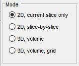
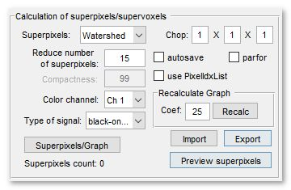
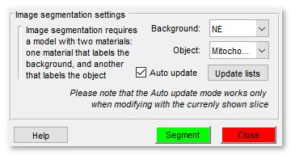

# Graphcut Segmentation

*Back to [MIB](../../../index.md) | [User interface](../../index.md) | [Ribbon](../index.md) | [Tools](index.md)*

Semi-automated image segmentation using the max-flow/min-cut graphcut method in Microscopy Image Browser (MIB).

---

## Overview

The **Graphcut segmentation** tool in MIB provides semi-automated segmentation using the max-flow/min-cut 
algorithm. It is based on the [Max-flow/min-cut algorithm](http://vision.csd.uwo.ca/code/) by Yuri Boykov and 
Vladimir Kolmogorov, with a MATLAB implementation 
by [Michael Rubinstein](http://www.mathworks.com/matlabcentral/fileexchange/21310-maxflow). 

Instead of segmenting individual pixels, it operates on superpixels (2D) or supervoxels (3D), 
generated via the [SLIC algorithm](http://ivrl.epfl.ch/research/superpixels) by 
Radhakrishna Achanta et al. or the Watershed algorithm. SLIC superpixels excel for 
objects with intensity contrast, while Watershed superpixels are better for objects with 
distinct boundaries. 
 Precomputing superpixels requires initial processing time but accelerates subsequent segmentation.

---

## General example

A demonstration is available in this video:  
[:fontawesome-brands-youtube:{.red-color} Watch on YouTube](https://youtu.be/dMeoIZPaDS4)

??? abstract "How to use"
    {.on-glb}

    Steps to perform graphcut segmentation:

    1. Use two labels to mark background and object areas of interest
    2. Launch the tool via `Ribbon → Tools → Semi-automatic segmentation → Graphcut`
    3. Choose a mode: *2D* or *3D*
    4. Select superpixel/supervoxel type: *SLIC* or *Watershed*
    5. Generate superpixels/supervoxels by clicking Superpixels/Graph
    6. Verify and adjust superpixel size if necessary
    7. Click Segment to start segmentation

    ??? note
        Some functions may require compilation; see the [System Requirements](https://mib.helsinki.fi/downloads_systemreq.html#superpixels) page for details

---

## Mode panel

The *Mode panel* lets you select the segmentation scope.

{align=left}

- <label class="widget widget-checkbox">2D, current slice only</label> segments only the current slice in the [Image View panel](../../panels/imview/index.md)
- <label class="widget widget-checkbox">2D, slice-by-slice</label> applies 2D segmentation to each slice individually
- <label class="widget widget-checkbox">3D, volume</label> performs 3D segmentation on the entire dataset or a subarea (see *Subarea panel* below)
- <label class="widget widget-checkbox">3D, volume, grid</label> segments a large dataset by dividing it 
into subvolumes (defined by *Chop* fields). the subvolume centered in 
the [Image View panel](../../panels/imview/index.md) is processed 
(enable the center marker via 
 on the Quick Access Bar).  Use Segment All to process all subvolumes

---

## Subarea panel

The *Subarea panel* defines a dataset subset for processing, useful for large datasets or binning.

{align=left}

- X:... sets the width range (e.g., `1:512`)
- Y:... sets the height range
- Z:... sets the z-slice range
- from Selection fills *X*, *Y*, and *Z* with coordinates from the *Selection* layer’s bounding box
- Current View limits *X* and *Y* to the visible area in the [Image View panel](../../panels/imview/index.md)
- Reset restores full dataset dimensions
- Bin x times... applies a binning factor to reduce detail for faster processing

!!! warning
    Auto update mode (<label class="widget widget-checkbox">auto update</label>) is unavailable with binned datasets

---

## Calculation of superpixels/supervoxels

Superpixels (2D) or supervoxels (3D) are precomputed using SLIC or Watershed algorithms. SLIC suits intensity-contrast objects (e.g., lipid droplets), while Watershed excels for boundary-defined objects.

??? abstract "Image example of clusters"
    {.on-glb}

{.on-glb align=left width="340"}

- Superpixels selects the type: *SLIC* or *Watershed*
- Size of superpixels sets approximate superpixel size (SLIC only)
- Reduce number of superpixels scaling factor defining size of superpixels (Watershed only)
- Compactness (1-99) controls superpixel squareness; higher values yield squarer shapes (SLIC only)

- Color channel chooses the color channel for superpixel calculation
- Type of signal selects *black-on-white* (electron microscopy) or *light-on-black* (light microscopy)
- Chop... defines subvolume sizes for *3D volume grid* mode or SLIC supervoxels
- <label class="widget widget-checkbox">autosave</label> saves the graphcut structure and supervoxels to disk automatically
- <label class="widget widget-checkbox">parfor</label> enables parallel processing for Watershed clustering in *3D volume grid* mode, boosting performance
- <label class="widget widget-checkbox">use PixelIdsList</label> uses supervoxel indices for final models, improving performance but requiring more memory
- Superpixels/Graph generates superpixels and organizes them into a graph
- Import loads superpixels and graphs from disk or MATLAB
- Export saves superpixels and graphs to a file, MATLAB, a new model, or as a Lines3D graph object (not recommended for many superpixels; see [this video](https://youtu.be/xrsTVqD7kOQ))
- Preview superpixels displays the generated superpixels

---

## Image segmentation settings

The *Graphcut* workflow uses labeled areas (Background and Object) for segmentation, offering faster interaction than the [Watershed workflow](tools-watershed.md). It handles objects with both boundaries and intensity contrast, making it versatile.

{.on-glb align=left width="340"}

- Background selects the model material labeling background areas
- Object selects the model material labeling objects
- Update lists refreshes material lists
- <label class="widget widget-checkbox">Auto update</label> updates segmentation automatically when materials change (best for small datasets, ~400x400x400 pixels)

!!! warning
    In *Auto update* mode, use only the A 
    shortcut (not Shift+A). 
    Recalculate final segmentation with 
    Segment. 
    This mode is unavailable with binned datasets

---

## Image segmentation example

Follow these steps to segment mitochondria using Graphcut:

* Load a sample dataset: `Ribbon → Home → Import image from → URL`, enter *http://mib.helsinki.fi/tutorials/WatershedDemo/watershed_demo1.tif*
* Add a material named *Background* in the [Segmentation panel](../../panels/segm/index.md) with + (right-click to rename)
* Use the Brush tool to label cytoplasm, then press A to add it to *Background*

??? abstract "Snapshot"
    {.on-glb}

* Add another material named *Seeds* with +
* Label mitochondria interiors, then press A to add to *Seeds*

??? abstract "Snapshot"
    {.on-glb}

* Start Graphcut via **Ribbon → Tools → Semi-automatic segmentation → Graphcut**
* Select *Watershed* in Superpixels
* Ensure *Background* and *Seeds* are set in *Image segmentation settings*
* Click Segment to segment mitochondria
* Add more seeds to refine, then re-segment with Segment or enable <label class="widget widget-checkbox">Auto update</label>
* Results appear in the *Mask* layer
* Optionally smooth the mask: **Ribbon → Mask → Smooth Mask**

??? abstract "Snapshot"
    {.on-glb}

---

## References

- [Max-flow/min-cut algorithm](http://vision.csd.uwo.ca/code/) by Yuri Boykov and Vladimir Kolmogorov (research license only)
- [MATLAB wrapper for maxflow](http://www.mathworks.com/matlabcentral/fileexchange/21310-maxflow) by Michael Rubinstein
- [SLIC superpixels and supervoxels](http://ivrl.epfl.ch/research/superpixels) by Radhakrishna Achanta et al.
- [Region Adjacency Graph (RAG)](http://www.mathworks.com/matlabcentral/fileexchange/16938-region-adjacency-graph--rag-) by David Legland, INRA, France (modified for Watershed)

---

*Back to [MIB](../../../index.md) | [User interface](../../index.md) | [Ribbon](../index.md) | [Tools](index.md)*
