# Measure Tool

---

## Overview

Based on the [Image Measurement Utility](http://www.mathworks.com/matlabcentral/fileexchange/25964-image-measurement-utility) by Jan Neggers, Eindhoven University of Technology. This tool enables various length measurements and generates corresponding intensity profiles.

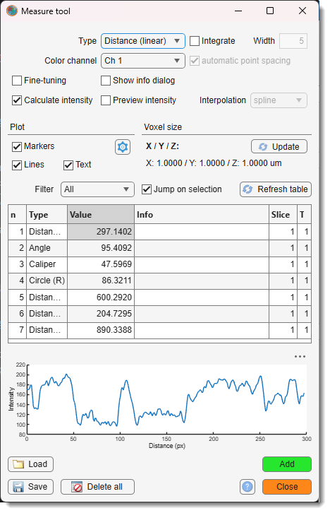{.on-glb align=left width="300"}

!!! note
    Visualization of measurements can be switched on/off using 
    the <label class="widget widget-checkbox">Ann/Measure</label> checkbox in 
    the [View Settings panel](../../panels/selection_imview/viewsettings.md).

---

## Measure panel

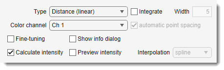{ align=left}

Defines the measurement type, started with the Add button. 
 Select the color channel for intensity profiles via the Color channel combo box.

### Examples of tools for manual measurement

* **Angle**: measures the angle between two lines.  
  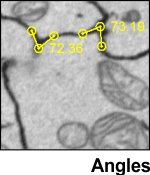{.on-glb align=left}  
  a) place the intersection point;  
  b) place the second point to form the first line with the intersection;  
  c) place the third point to form the second line with the intersection;  
  d) adjust if needed; double-click above the line to accept.

* **Caliper**: measures the perpendicular distance from a line to a point.  
  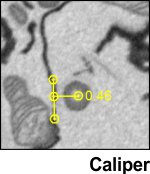{.on-glb align=left}  
  a) place two points to define the line;  
  b) adjust if needed; double-click above the line to accept;  
  c) place the point;  
  d) adjust if needed; double-click above the point to accept.

* **Circle**: measures the radius of a circle.  
  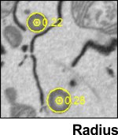{.on-glb align=left}  
  a) place a point at the circle’s center;  
  b) place a point at the edge;  
  c) adjust if needed; double-click above the circle to accept.

* **Distance (freehand)**: measures the length of a path.  
  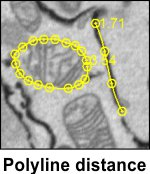{.on-glb align=left}  
  a) select interpolation type with the Interpolation combo box;  
  b) press Add;  
  c) draw the path;  
  d) convert to polyline, providing a factor to reduce vertices;  
  e) adjust if needed; double-click above the path to accept.

* **Distance (linear)**: measures the distance between two points.  
  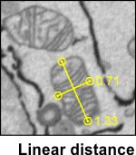{.on-glb align=left}  
  a) place the first point;  
  b) place the second point;  
  c) adjust if needed; double-click above the line to accept.

* **Distance (polyline)**: measures a path with a set number of vertices.  
  {.on-glb align=left}  
  a) set vertex count with the Number of points edit box;  
  b) select interpolation type with the Interpolation combo box;  
  c) press Add;  
  d) place the defined number of points;  
  e) adjust if needed; press ++a++ and use the left mouse button to add a vertex, then double-click above the path to accept.

- **Point**: places a single point.  
  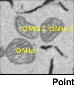{.on-glb align=left}  
  a) place a point;  
  b) adjust if needed; double-click above the point to accept.

- <label class="widget widget-checkbox">Fine-tuning</label>: allows position adjustments during placement.
- <label class="widget widget-checkbox">Calculate intensities</label>: generates an intensity profile for each measurement.
- Edit info: automatically show a dialog to provide additional information related to an added measurement
- Preview intensity (Distance, linear only): shows an intensity profile during placement.
- Integrate (Distance, linear only): integrates multiple points for intensity profiles, with point count set via the Width edit box.
- <label class="widget widget-checkbox">fixed number of points</label> (freehand mode only): skips the vertex reduction dialog.
- Number of points (freehand and polyline modes): sets the number of points to place.

---

## Plot panel

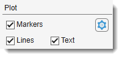{.on-glb align=left}  

Controls which measurement parts display in the [Image View panel](../../panels/selection_imview/imview.md). 
 Customize line and marker appearance with the Options button.

---

## Voxel sizes panel

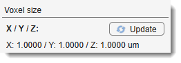{.on-glb align=left}

Shows voxel dimensions of the dataset. Update them with 
the Update button.

---

## Results panel

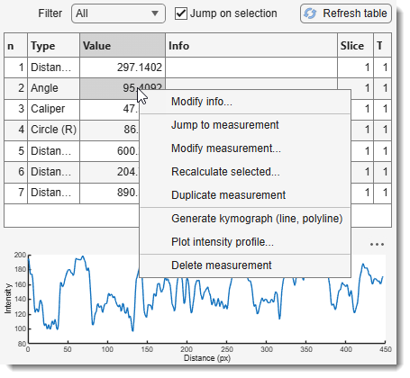{.on-glb align=left width="400"}

Displays measurement results.  Filter types with 
the Filter combo box. 
 Intensity profiles for selected measurements appear in a plot below the table. 
 With <label class="widget widget-checkbox">Jump on selection</label> checked, 
the [Image View panel](../../panels/selection_imview/imview.md) centers on the selected measurement.

Right-click a selected item for a context menu:

- **Jump to measurement**: centers the selected measurement in the [Image View panel](../../panels/selection_imview/imview.md).
- **Modify measurement**: enters edit mode to adjust shape and size.
- **Recalculate selected measurements...**: updates distances and intensity profiles if pixel size or color channels change.
- **Duplicate measurement**: duplicates the measurement.
- **Generate kymograph**: creates a depth projection image under the profile (linear, polyline, freehand only), previewable or savable in TIF, MATLAB, or CSV formats. [:fontawesome-brands-youtube:{.red-color} Tutorial](https://youtu.be/ifr6bWtcnUg)
- **Plot intensity profile**: plots intensity profile in a new figure.
- **Delete measurement**: removes the measurement from the list.

---

## Buttons at the bottom of the window

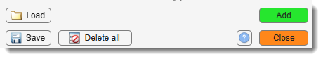{.on-glb align=left}

- Load: loads a measurement structure from a file or MATLAB workspace.
- Save: saves measurements and intensity profiles to a file (MATLAB or Excel) or MATLAB workspace.
- Refresh table: refreshes the measurement table.
- Delete all: removes all measurements.
- ?: opens this help page.
- Add: adds a new measurement of the type selected in the *Measure panel*.
!!! note
    you can use ++m++ key shortcut to start selected measurement

- Close: closes the tool.

---

## Reference

- [Image Measurement Utility by Jan Neggers](http://www.mathworks.com/matlabcentral/fileexchange/25964-image-measurement-utility/)

---

*Back to [MIB](../../../index.md) | [User interface](../../index.md) | [Ribbon](../index.md) | [Tools](index.md)*

