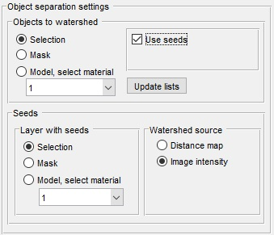

# Object Separation with Watershed

Tools for separating objects that can be stored as materials in the current model, the mask layer, or the selection layer.

*Back to [MIB](../../../index.md) | [User interface](../../index.md) | [Menu](../index.md) | [Tools](../tools/index.md)*

---

## Overview

{.on-glb}

The **Object separation** tool in Microscopy Image Browser (MIB) utilizes watershed and graphcut segmentation techniques to divide connected objects into smaller, distinct entities. These objects can originate from the *Selection*, *Mask*, or *Model* layers, making this tool versatile for refining segmentation results.

---

## Mode panel

The *Mode panel* allows you to choose the segmentation scope, determining whether the operation applies to a single slice, multiple slices, or the entire volume.

{align=left}

- <label class="widget widget-checkbox">2D, current slice only</label> performs segmentation only on the currently displayed slice in the [Image View panel](../../panels/imview/index.md)
- <label class="widget widget-checkbox">2D, slice-by-slice</label> applies 2D segmentation individually to each slice in the dataset
- <label class="widget widget-checkbox">3D, volume</label> executes 3D segmentation across the entire dataset or a selected subvolume (see *Subarea panel* below)
- Aspect ratio for 3D... displays the dataset's aspect ratio, calculated from voxel sizes found in [Ribbon → Dataset → Parameters](../dataset/index.md#parameters). this ratio is used when watershed segmentation relies on a distance map (see *Object separation settings* below)

---

## Subarea panel

The *Subarea panel* enables you to define a specific portion of the dataset for processing. this is particularly useful for large datasets that need to be segmented in parts or reduced in resolution.

{align=left}

- X:...: specifies the width range of the dataset to process, using two numbers separated by a colon (e.g., `1:512`)
- Y:...: defines the height range of the dataset to process
- Z:...: sets the z-slice range of the dataset to process
- from Selection: populates the *X*, *Y*, and *Z* fields with coordinates from a bounding box around the *Selection* layer
- Current View: restricts the *X* and *Y* ranges to the currently visible area in the [Image View panel](../../panels/imview/index.md)
- Reset: restores the subarea fields to the full dimensions of the dataset
- Bin x times...: applies a binning factor to downsample the data before segmentation, speeding up the process at the cost of detail.

!!! warning 
    binning in *Object separation* mode may lead to unpredictable results

---

## Object separation settings

{.on-glb align=left width="340"}

The *Object separation* mode employs watershed transformation to split segmented objects into smaller units. below are the specific settings for this mode.

- **Object to watershed**: selects the source layer containing the object to be separated, choosing from *Selection*, *Mask*, or *Model*
- <label class="widget widget-checkbox">Use seeds</label> activates the seeded watershed transformation, requiring additional settings in the *Seeds panel* below
- **Reduce oversegmentation**: (available only for unseeded watershed) reduces the number of resulting objects, helping to prevent excessive fragmentation
- **Seeds panel**: (active only when <label class="widget widget-checkbox">Use seeds</label> is checked)
  - **Layer with seeds**: specifies the layer containing seed points, selectable from *Selection*, *Mask*, or *Model*
  - **Watershed source**: determines the data used for watershed labeling
    - **Image intensity**: uses the actual image intensities instead of distance maps. for more details, see [Steve Eddins's blog on cell segmentation](http://blogs.mathworks.com/steve/2006/06/02/cell-segmentation/)

---

## Object separation example

The *Object separation* mode with watershed can split large, fused objects into smaller, individual components. for instance, in a segmentation example featuring mitochondria, some appear merged. this tool can separate them effectively.

1. Navigate to **Ribbon → Tools → Object separation**
2. Select *Mask* in the *Object to watershed* dropdown
3. Click the Segment button

??? Abstract "Snapshot"
    {.on-glb}

This separates the mitochondria, but unseeded watershed often oversegments, breaking long mitochondria into multiple small pieces. to address this, use the seeded watershed approach:

1. Check Use seeds
2. In the *Seeds panel*, set *Layer with seeds* to *Model* and select the 'Seeds' material
3. Click the Segment button
4. If each mitochondrion has a single seed label, individual mitochondria will be extracted (highlighted in green)

??? Abstract "Snapshot"
    {.on-glb}

---

## Algorithm for object separation with watershed

{.on-glb}

The diagram above illustrates the step-by-step process of the watershed-based object separation algorithm, showing how it transforms input data into separated objects.

---

## References

For further reading on watershed segmentation in both image segmentation and object separation modes:

- [Watershed transform question from tech support](http://blogs.mathworks.com/steve/2013/11/19/watershed-transform-question-from-tech-support/) by Steve Eddins
- [Cell segmentation](http://blogs.mathworks.com/steve/2006/06/02/cell-segmentation/) by Steve Eddins

---

*Back to [MIB](../../../index.md) | [User interface](../../index.md) | [Menu](../index.md) | [Tools](../tools/index.md)*