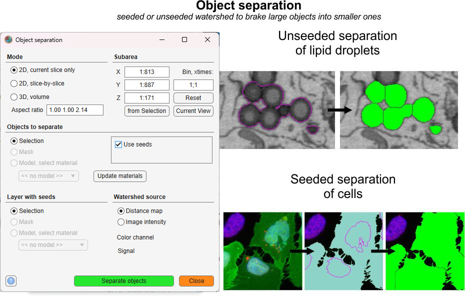
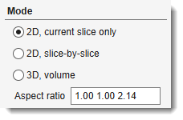
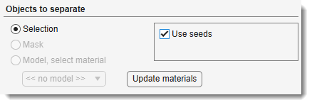
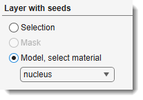
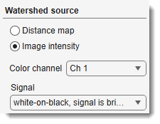
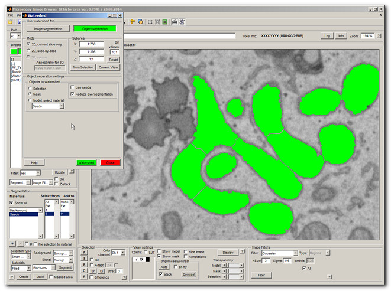
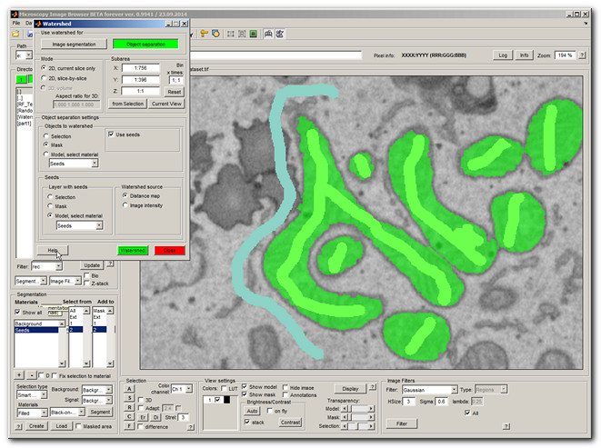
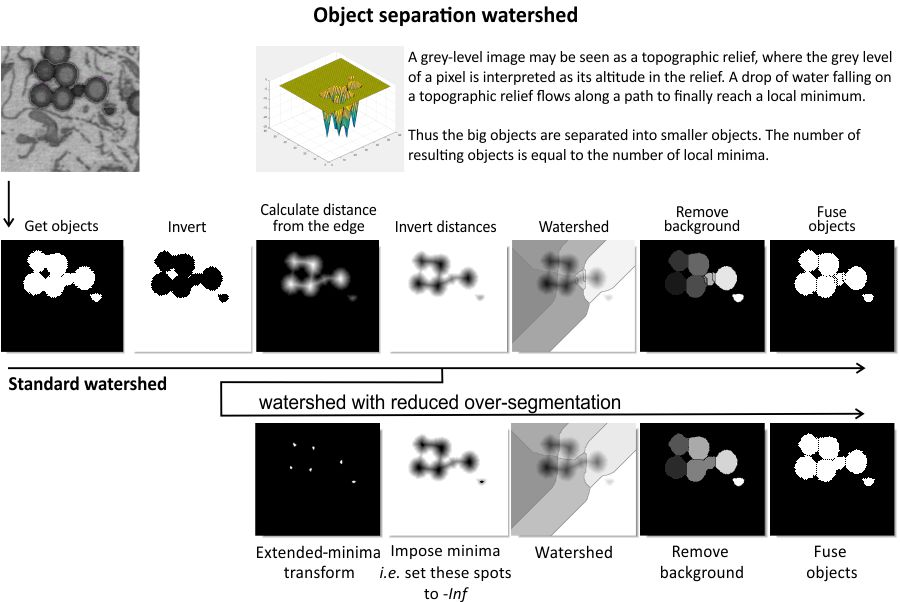

# Object Separation with Watershed

Tools for separating touching or overlapping objects stored in the Selection, Mask, or Model layer.

## Overview

{.on-glb}

The **Object separation** tool uses watershed transformation to divide connected objects into
smaller, distinct units. Objects can originate from the *Selection*, *Mask*, or *Model* layer,
making the tool useful for refining segmentation results where objects are fused or
touching.

Launch via `Ribbon → Tools → Object separation`.

---

## Mode panel

The *Mode panel* controls the segmentation scope.

{align=left}

- <span class="widget widget-radio">2D, current slice only</span> — applies watershed only to the currently displayed slice in the [Image View panel](../../panels/selection_imview/imview.md)
- <span class="widget widget-radio">2D, slice-by-slice</span> — applies 2D watershed to each slice individually
- <span class="widget widget-radio">3D, volume</span> — performs 3D watershed across the entire dataset or a selected subvolume (see *Subarea panel* below)
- <span class="widget widget-edit">Aspect ratio</span> — voxel aspect ratio used for 3D distance-transform watershed, expressed as three space-separated values (e.g., `1.00 1.00 3.50`). Computed automatically from the pixel sizes in [Dataset → Parameters](../dataset/index.md#voxels).

<div class="clear-float"></div>

---

## Subarea panel

The *Subarea panel* limits processing to a portion of the dataset.

{align=left}

- <span class="widget widget-edit">X</span> — pixel width range, e.g. `1:512`
- <span class="widget widget-edit">Y</span> — pixel height range
- <span class="widget widget-edit">Z</span> — slice range
- <span class="widget widget-button">from Selection</span> — fills *X*, *Y*, and *Z* from the bounding box of the *Selection* layer
- <span class="widget widget-button">Current View</span> — limits *X* and *Y* to the visible area in the [Image View panel](../../panels/selection_imview/imview.md)
- <span class="widget widget-edit">Bin, xtimes:</span> — binning factor `XY; Z` to downsample before processing (e.g., `2; 1` halves XY resolution)
- <span class="widget widget-button">Reset</span> — restores all fields to the full dataset dimensions

!!! warning
    Binning in Object separation mode may produce unpredictable results.

<div class="clear-float"></div>

---

## Objects to separate panel

Defines the source layer and separation options.

{align=left}

<div class="clear-float"></div>

**Source layer** (radio buttons):

- <span class="widget widget-radio">Selection</span> — use the *Selection* layer as the object source
- <span class="widget widget-radio">Mask</span> — use the *Mask* layer
- <span class="widget widget-radio">Model, select material</span> — use a specific material from the *Model* layer; choose the material from the dropdown that appears below the radio buttons

**Options**:

- <label class="widget widget-checkbox">Use seeds</label> — enables seeded watershed; when checked, the *Layer with seeds* and *Watershed source* panels appear and *Reduce oversegmentation* is hidden
- <label class="widget widget-checkbox">Reduce oversegmentation</label> — *(standard watershed only, hidden when Use seeds is checked)* applies extended minima suppression to reduce excessive fragmentation
- <span class="widget widget-button">Update materials</span> — refreshes the material dropdown lists from the current model

---

## Layer with seeds panel

{align=left}

*(Visible only when <label class="widget widget-checkbox">Use seeds</label> is checked)*

Specifies the layer that contains the seed markers used to guide the seeded watershed.

- <span class="widget widget-radio">Selection</span> — use the *Selection* layer as seeds
- <span class="widget widget-radio">Mask</span> — use the *Mask* layer as seeds
- <span class="widget widget-radio">Model, select material</span> — use a specific material from the *Model* layer; choose the material from the dropdown below

---

## Watershed source panel

{align=left}

*(Visible only when <label class="widget widget-checkbox">Use seeds</label> is checked)*

Controls which data the watershed algorithm uses to define catchment basins.

<div class="clear-float"></div>

- <span class="widget widget-radio">Distance map</span> — watershed runs on the Euclidean distance transform of the object mask (default; shape-based separation)
- <span class="widget widget-radio">Image intensity</span> — watershed runs on the raw image grey values (intensity-based separation; requires seeds).
  See [Steve Eddins's blog on cell segmentation](http://blogs.mathworks.com/steve/2006/06/02/cell-segmentation/).
  When *Image intensity* is selected, two additional controls appear:
    - <span class="widget widget-dropdown">Color channel</span> — color channel used for intensity-based watershed
    - <span class="widget widget-dropdown">Signal</span> — polarity of the image signal:
      *white-on-black, signal is bright* (fluorescence, light microscopy) or
      *black-on-white, signal is dark* (transmitted light, electron microscopy)

---

## Object separation example

The following example separates fused mitochondria using unseeded watershed:

1. Open `Ribbon → Tools → Object separation`
2. Select <span class="widget widget-radio">Mask</span> in the *Objects to separate* panel
3. Click <span class="widget widget-button">Separate objects</span>

??? abstract "Snapshot"
    {.on-glb}

Unseeded watershed can over-segment long objects. To address this, switch to seeded watershed:

1. Check <label class="widget widget-checkbox">Use seeds</label>
2. In the *Layer with seeds* panel, select <span class="widget widget-radio">Model, select material</span> and choose the *Seeds* material
3. Click <span class="widget widget-button">Separate objects</span>

Each object with a single seed label is extracted individually (highlighted in green).

??? abstract "Snapshot"
    {.on-glb}

---

## Algorithm

{.on-glb}

The diagram above illustrates the step-by-step process of the watershed-based object
separation algorithm.

---

## Batch scripting

This tool supports batch scripting for automation.

??? abstract "Example"

    ```matlab
    BatchOpt.Mode          = {'mode3dRadio', {'mode2dCurrentRadio','mode2dRadio','mode3dRadio'}};
    BatchOpt.ObjectSource  = {'Mask', {'Selection','Mask','Model'}};
    BatchOpt.UseSeeds      = false;
    BatchOpt.ReduceOversegmentation = false;
    BatchOpt.XSubarea      = '1:512';
    BatchOpt.YSubarea      = '1:512';
    BatchOpt.ZSubarea      = '1:100';
    BatchOpt.Binning       = '1; 1';

    obj.mibController.startController('controllers.ObjectSeparator', [], BatchOpt);
    ```

---

## References

- [Watershed transform Q&A from tech support](http://blogs.mathworks.com/steve/2013/11/19/watershed-transform-question-from-tech-support/) by Steve Eddins
- [Cell segmentation with seeded watershed](http://blogs.mathworks.com/steve/2006/06/02/cell-segmentation/) by Steve Eddins

---

*Back to [MIB](../../../index.md) | [User interface](../../index.md) | [Ribbon](../index.md) | [Tools](index.md)*
